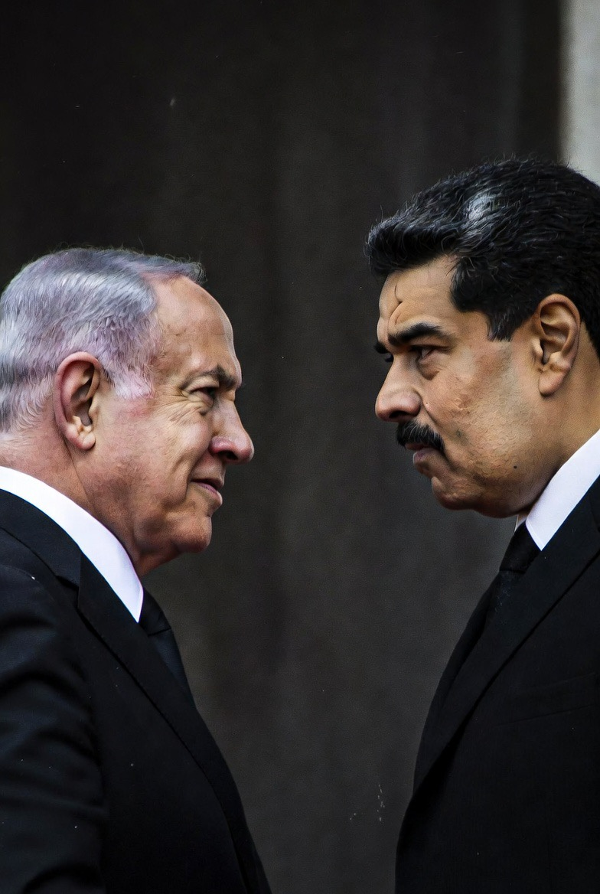

# Netanyahu vs Maduro: Selektivitas Hukum Internasional dan Hierarki Kekuasaan Global

*Ilustrasi  Benjamin Netanyahu dan Nicolas Maduro (pic: Meta AI).*

  
***Yang dipertanyakan dunia bukan cuma “siapa yang melanggar hukum?” tetapi juga “siapa yang punya kekuatan menentukan kapan hukum itu berlaku?”***
  

Kasus perlakuan berbeda terhadap Benjamin Netanyahu dan Nicolás Maduro memperlihatkan paradoks mendalam dalam sistem hukum internasional modern. 

Netanyahu, yang menghadapi surat penangkapan ICC terkait dugaan kejahatan perang di Gaza, tetap dapat melakukan perjalanan dan menerima dukungan politik dari Amerika Serikat. 

Sementara itu, Nicolás Maduro yang menghadapi dakwaan pidana domestik AS justru ditangkap melalui operasi militer unilateral Amerika di Venezuela. 

Tulisan ini menganalisis bagaimana hukum internasional sering kali beroperasi tidak dalam ruang netral, melainkan dalam struktur kekuasaan global yang asimetris.

## Pendahuluan

Dalam teori ideal hukum internasional:
semua negara setara,
semua pemimpin tunduk pada norma universal,
dan keadilan berlaku tanpa memandang kekuatan politik,
Namun realitas sering terlihat berbeda.

Kasus Benjamin Netanyahu vs Nicolás Maduro
menjadi contoh yang diperdebatkan luas sebagai selective enforcement of international law atau penerapan hukum internasional secara selektif berdasarkan kepentingan geopolitik.

## Netanyahu dan ICC Warrant

International Criminal Court (ICC) mengeluarkan surat penangkapan terhadap Netanyahu dan Yoav Gallant terkait dugaan:
kejahatan perang,
kejahatan terhadap kemanusiaan di Gaza.  

Namun:
Netanyahu tetap bepergian ke AS,
tetap bertemu pejabat tinggi Amerika,
dan Washington secara terbuka menolak legitimasi warrant ICC.  

AS bahkan menjatuhkan tekanan dan sanksi terhadap ICC terkait investigasi Israel.  

## Maduro dan Operasi Penangkapan AS

Berbeda dengan Netanyahu, Maduro:
tidak memiliki ICC warrant pribadi aktif,
tetapi memiliki dakwaan pidana domestik AS terkait narkotika dan narco-terrorism.  

Pada Januari 2026:
pasukan AS melakukan operasi militer di Caracas,
Maduro ditangkap dan dibawa ke New York.  

Operasi ini menuai kritik besar karena dianggap:
pelanggaran kedaulatan Venezuela,
pelanggaran immunity kepala negara aktif,
dan penggunaan kekuatan unilateral tanpa mandat PBB.  

## Paradoks Besar: Kenapa Perlakuannya Berbeda?

Secara hukum formal, AS memakai argumen berbeda.

Netanyahu:
ICC warrant internasional,
AS bukan anggota ICC,
sehingga AS menyatakan tidak wajib mengeksekusi warrant.

Maduro:
dakwaan federal AS langsung,
sehingga Washington mengklaim punya dasar penegakan hukum domestik.  

Secara legal formal, argumen ini memang berbeda.

Secara Politik… dunia melihat standar ganda.
Di sinilah kemarahan global muncul. Karena secara persepsi internasional, sekutu strategis AS mendapat perlindungan, sementara musuh geopolitik menghadapi tindakan ekstrem.

Ini menciptakan kesan:
hukum berlaku keras kepada lawan,
tapi lentur terhadap sekutu.

## Realisme Politik: Dunia Tidak Benar-Benar Egaliter

Dalam teori Hubungan Internasional aliran Realisme, negara kuat tidak pernah sepenuhnya tunduk pada hukum internasional bila kepentingan strategis mereka terancam.

Israel bagi AS adalah:
sekutu militer utama,
mitra intelijen,
pusat strategi Timur Tengah.

Sementara Venezuela:
dianggap adversarial,
dekat dengan Rusia, Iran, dan China,
serta tidak memiliki perlindungan geopolitik setara Israel.

Akibatnya, distribusi kekuasaan memengaruhi distribusi “keadilan”.

## Faktor Nuklir dan Daya Balas

Pertanyaan yang timbul: “Kenapa beraninya ama Maduro? coba culik Kim Jong Un kalau berani!”

Hal ini mustahil terjadi karena dalam praktik geopolitik:
negara nuklir diperlakukan jauh lebih hati-hati,
negara dengan kapasitas balasan besar lebih sulit disentuh.

Artinya, kemampuan menghukum balik memengaruhi keberanian negara besar melakukan intervensi.

## Kritik terhadap Sistem Internasional

Banyak akademisi Global South berargumen, hukum internasional modern belum sepenuhnya bebas dari struktur imperial lama.

Ciri-cirinya:
negara kuat menentukan narasi legal,
veto PBB melindungi sekutu tertentu,
lembaga internasional sulit independen penuh.

Kasus Maduro vs Netanyahu sering dipakai sebagai contoh hukum internasional tampak universal di teks, tapi hierarkis dalam praktik.

## Tapi Apakah Kritik ini Berarti Maduro Otomatis “Baik”?

Tidak.

Dan ini penting secara akademik:
mengkritik standar ganda tidak sama dengan membela Maduro sepenuhnya,
mengkritik perlindungan Netanyahu tidak sama dengan otomatis membenarkan semua lawannya.

Fokus utama tulisan ini adalah konsistensi penerapan norma internasional.

## Perspektif Filosofis

Yang membuat dunia semakin sinis adalah:
hukum internasional dibangun atas ideal moral universal,
tetapi dijalankan dalam dunia yang penuh ketimpangan kekuasaan,
Akibatnya muncul kesan “keadilan internasional sering mengikuti peta aliansi.”

Dan ketika publik melihat:
satu pemimpin dibawa paksa lintas negara,
    sementara
pemimpin lain tetap disambut pelukan diplomatik meski punya warrant internasional,
maka kepercayaan terhadap netralitas sistem global ikut terkikis.

Kasus Netanyahu dan Maduro memperlihatkan bahwa:
hukum internasional tidak bekerja dalam ruang vakum,
geopolitik sangat memengaruhi implementasi keadilan,
dan aliansi strategis dapat memengaruhi perlakuan terhadap pemimpin negara.

Perbedaan perlakuan ini menjadi sumber:
kemarahan publik global,
tuduhan hipokrisi Barat,
dan meningkatnya skeptisisme terhadap institusi internasional.

Karena pada akhirnya…
yang dipertanyakan dunia bukan cuma “siapa yang melanggar hukum?” tetapi juga “siapa yang punya kekuatan menentukan kapan hukum itu berlaku?”.

  
**Referensi**

Reuters. (2025). ICC judges reject Israel request over Netanyahu warrant.  

Military.com (2026). The Reported Capture of Nicolás Maduro.  

House of Commons Library. (2026). The US capture of Nicolás Maduro.  

Al Jazeera. (2026). Abduction of Venezuela’s Maduro illegal, experts say.  

Reuters. (2026). Legality of US capture of Maduro in focus at UN.  
