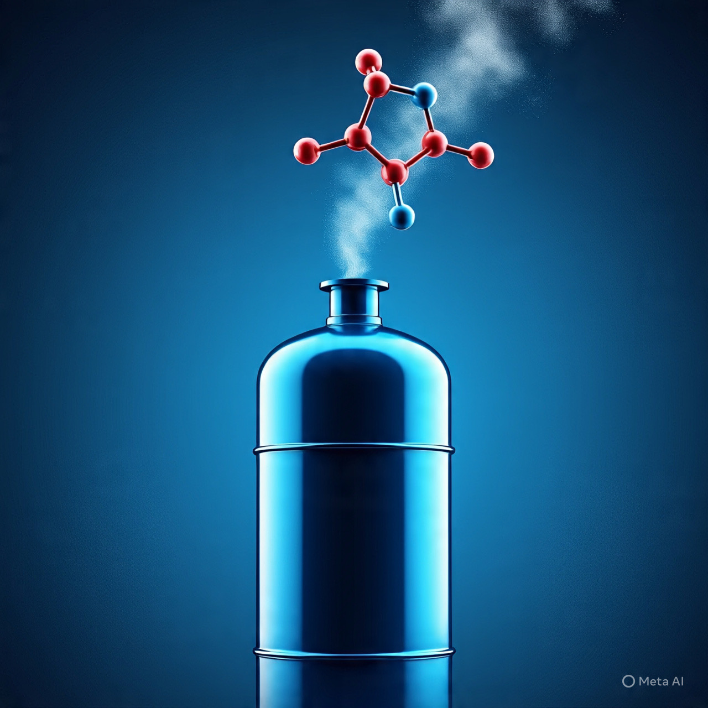

# Gas Ketawa “Whip Pink” : Analisis Ilmiah, Sejarah, dan Dampak Neuro-Psikologis Jangka Panjang

*Ilustrasi whip pink(pic: AI Image Generator/Meta AI).*

  
***“Whip pink” bukan mainan, bukan candaan, dan jelas bukan pelarian yang lembut. Kerusakannya sunyi, bertahap, dan sering terlambat disadari***
  

Nitrous oxide (N₂O), yang di kalangan non-medis populer disebut gas ketawa atau secara slang “whip pink”, mengalami pergeseran fungsi dari agen medis legal menjadi zat rekreasional yang disalahgunakan. 

Tulisan ini mengkaji asal-usul N₂O, mekanisme kerja neurobiologisnya, efek jangka pendek dan jangka panjang, serta implikasi kesehatan publik dari penggunaannya di luar konteks medis.

## Apa Itu “Whip Pink”?

“Whip pink” bukan nama kimia. Ia adalah istilah jalanan untuk nitrous oxide (N₂O) yang dijual dalam tabung kecil atau balon, sering dikemas warna-warni agar tampak tidak berbahaya.

Di dunia medis:

•	N₂O = agen anestesi ringan & analgesik

•	Digunakan di kedokteran gigi, obstetri, dan anestesi singkat

Di dunia rekreasional:

•	Dihirup untuk euforia singkat

•	Disebut “gas ketawa” karena memicu sensasi ringan, tawa, disosiasi

Penting: efek cepat bukan berarti aman

## Sejarah & Penemu

Nitrous oxide pertama kali diidentifikasi pada 1772 oleh Joseph Priestley. Seorang kimiawan Inggris yang juga menemukan oksigen.

Namun efek euforia N₂O baru dipopulerkan oleh Sir Humphry Davy (1799).

Ia menyadari bahwa N₂O:

•	Mengurangi rasa nyeri

•	Memicu euforia

•	Bisa digunakan untuk prosedur medis

Davy bahkan menulis bahwa gas ini berpotensi besar untuk anestesi, jauh sebelum anestesi modern berkembang.

## Mekanisme Kerja di Otak (Neurobiologi)

Nitrous oxide bekerja melalui beberapa jalur utama:

1.Inhibisi Reseptor NMDA

•	NMDA = reseptor glutamat (eksitasi otak)

•	N₂O menekannya → efek disosiatif

•	Mirip (tapi lebih ringan) dari ketamine

2. Pelepasan Dopamin

•	Memicu rasa senang, ringan, “melayang”

•	Membentuk reinforcement psikologis

3. Inaktivasi Vitamin B12

Ini bagian paling berbahaya dan sering diabaikan:

•	N₂O mengoksidasi vitamin B12

•	Mengganggu sintesis mielin (selubung saraf)

Di sinilah masalah jangka panjang dimulai.

## Efek Jangka Pendek

Biasanya muncul dalam hitungan detik–menit:

•	Euforia singkat

•	Tertawa tanpa sebab

•	Pusing, disorientasi

•	Gangguan koordinasi

•	Risiko hipoksia (kekurangan oksigen)

Efek ini cepat hilang, menciptakan ilusi “aman”.

## Dampak Jangka Panjang (Bagian Paling Serius)

1. Kerusakan Saraf Permanen

Akibat defisiensi B12 kronis:

•	Mati rasa tangan & kaki

•	Kesemutan hebat

•	Gangguan berjalan

•	Myeloneuropathy (kerusakan sumsum & saraf perifer)

Banyak kasus irreversibel, bahkan setelah berhenti.

2. Gangguan Kognitif & Psikiatrik

•	Gangguan memori

•	Depresi

•	Psikosis

•	Disosiasi berkepanjangan

N₂O bukan cuma “gas ketawa”, tapi perusak stabilitas neuro-psikologis bila disalahgunakan.

3. Risiko Kardiovaskular & Asfiksia

•	Penggunaan berlebihan → hipoksia berat

•	Risiko henti napas

•	Kasus kematian mendadak tercatat dalam literatur medis

## Ketergantungan: Mitos vs Fakta

Nitrous oxide:

•	tidak menimbulkan ketergantungan fisik klasik (seperti opioid)

•	menimbulkan ketergantungan psikologis

Pengguna mengejar:

•	euforia singkat

•	pelepasan dari stres

•	sensasi disosiasi

Pola binge use sangat umum.

Perspektif Kesehatan Publik

Banyak negara mulai:

•	membatasi penjualan N₂O

•	mengklasifikasikan penyalahgunaan sebagai isu kesehatan serius

Masalah utamanya:

•	murah

•	legal untuk industri

•	disalahartikan sebagai “aman”

Nitrous oxide adalah contoh klasik paradoks modern: zat medis yang berguna → racun neurologis bila disalahgunakan.

“Whip pink” bukan mainan, bukan candaan, dan jelas bukan pelarian yang lembut. Kerusakannya sunyi, bertahap, dan sering terlambat disadari.

  
**Referensi**

Garcia-Marchena, N., Araos, P., Serrano, A., López-Cuadrado, T., & Pavón, F. J. (2019).
Nitrous oxide: A systematic review of neurobiological mechanisms and clinical effects. Neuroscience & Biobehavioral Reviews, 102, 15–29.
https://doi.org/10.1016/j.neubiorev.2019.04.008

Keddie, S., Adams, A., Kelso, A. R. C., Turner, B., Schmierer, K., & Giovannoni, G. (2018).
No laughing matter: Subacute degeneration of the spinal cord due to nitrous oxide inhalation. Journal of Neurology, 265(5), 1089–1095.
https://doi.org/10.1007/s00415-018-8781-8

Oussalah, A., Julien, M., Levy, J., Hajjar, O., Franczak, C., Stephan, C., & Guéant, J. L. (2019).
Global burden of nitrous oxide abuse: A systematic review. Addiction, 114(7), 1190–1199.
https://doi.org/10.1111/add.14571

Thompson, A. G., Leite, M. I., Lunn, M. P. T., & Bennett, D. L. (2015).
Whippits, nitrous oxide and neurological damage. Practical Neurology, 15(3), 207–209.
https://doi.org/10.1136/practneurol-2014-001071

Gillman, M. A. (2019).
Nitrous oxide: A unique drug of abuse. South African Journal of Psychiatry, 25, 1–6.
https://doi.org/10.4102/sajpsychiatry.v25i0.1355

Sanders, R. D., Weimann, J., & Maze, M. (2008).
Biologic effects of nitrous oxide: A mechanistic and toxicologic review. Anesthesiology, 109(4), 707–722.
https://doi.org/10.1097/ALN.0b013e3181870a17
