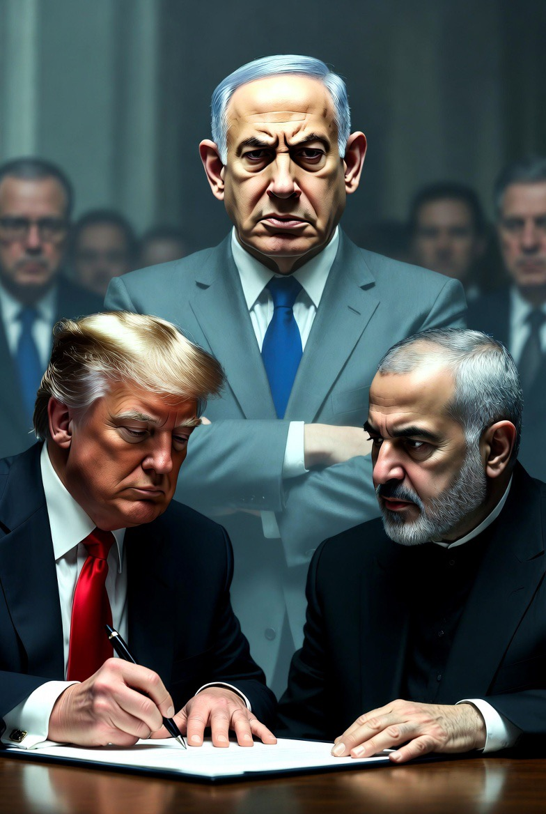

# Nuklir Iran, Ketergantungan Israel pada AS, dan Politik Dendam yang Tak Pernah Kenyang

*Ilustrasi (pic: Grok AI).*

  
***Jika suatu bangsa mulai percaya bahwa penderitaan orang lain adalah harga yang wajar untuk keamanan dirinya, maka perdamaian tidak benar-benar lahir***
  

Tiga isu yang sebenarnya terhubung adalah masa depan program nuklir Iran. seberapa bergantung Israel pada AS. dan mengapa politisi seperti Ben Gvir bisa mengeluarkan retorika ekstrem.

Dan benang merahnya adalah ketakutan. Ketakutan yang terlalu lama dipelihara kadang berubah menjadi kebijakan.

## Masa Depan Nuklir Iran Setelah MoU 2026

Banyak orang mengira, MoU sama dengan  Iran menyerah. Padahal tidak.

Dari berbagai bocoran isi MoU: Iran tetap mempertahankan program nuklir sipilnya, Iran menyatakan tidak akan membuat senjata nuklir, ada masa negosiasi sekitar 60 hari, serta pembahasan utama adalah stok uranium yang sudah diperkaya, inspeksi, batas pengayaan, dan mekanisme verifikasi.  

Bahkan media resmi Iran menegaskan tidak ada komitmen baru yang menghapus kerangka program nuklir damai Iran.  

Jadi… 
Apakah Iran kalah? Tidak.
Apakah Iran menang? Juga belum.

Yang terjadi, Iran berhasil mengubah perang militer menjadi perang diplomasi. Dan ini membuat Israel gelisah.

## Israel Sebenarnya Bergantung pada AS?

Jawabannya: Iya. Tetapi tidak sepenuhnya.

Israel mendapat bantuan militer, bantuan finansial, perlindungan diplomatik, dan akses teknologi dari AS selama puluhan tahun.

Namun Israel juga punya industri pertahanan sendiri, punya intelijen kuat, diduga memiliki senjata nuklir, serta mampu melakukan operasi militer tanpa izin Washington.

Maka hubungan mereka lebih tepat digambarkan bahwa AS adalah payung besar, tetapi Israel juga membawa pistol sendiri.

Masalahnya, kalau payung dan pistol itu mulai berbeda arah, dunia akan tegang. Karena AS ingin stabilitas. Sementara Israel sering berpikir keamanan lebih penting daripada kompromi.

## Ben Gvir dan Politik Dendam

Nah, ini bagian yang paling pedas.

Kalau benar Ben Gvir mengatakan: “Untuk setiap air mata ibu Israel, seribu ibu Lebanon harus menangis.” dan “Seluruh Lebanon harus terbakar.” maka itu adalah retorika yang sangat ekstrem dan menuai kritik luas.  

Tetapi yang lebih penting bukan apakah ia marah? Melainkan Mengapa politisi seperti ini bisa populer?

Dalam ilmu politik ada konsep Politics of Fear. Ketika masyarakat merasa terancam, hidup dalam perang panjang, lalu kehilangan rasa aman, maka muncul politisi yang berkata: “Aku akan lebih keras dari musuh.”

Mereka menawarkan bukan perdamaian, tetapi pembalasan.

## Masalah Besarnya

Dendam Tidak Mengenal Kata Cukup. Kalau 1 nyawa dibalas 10, 10 dibalas 100, 100 dibalas 1000, maka matematika perang menjadi penderitaan kali penderitaan. Tidak ada titik akhir.

Bahkan prinsip kuno “mata ganti mata sebenarnya dibuat untuk membatasi pembalasan. Artinya jangan lebih besar.

Karena manusia zaman dulu pun sadar, kalau balas dendam tidak dibatasi, seluruh desa bisa musnah.

## Ironi yang Menyedihkan

Israel lahir dari pengalaman sejarah yang mengerikan. Banyak warga Yahudi mengalami pengusiran, diskriminasi, hingga The Holocaust.

Tetapi… sejarah kadang kejam. Korban masa lalu tidak otomatis menjadi lebih lembut. Kadang justru menjadi lebih takut, lebih keras, dan lebih sulit mempercayai orang lain.

Maka ketika Ben Gvir berkata: “Seribu ibu Lebanon harus menangis.” Banyak orang bertanya: Bukankah logika seperti ini… justru logika yang selama puluhan tahun ingin dilawan oleh kemanusiaan?

Yang  patut dikhawatirkan justru satu hal. Bukan Iran punya nuklir, bukan Israel marah, juga bukan AS berdamai. Tetapi dunia mulai terbiasa dengan bahasa kebencian.

Ketika politisi berkata: “Negara itu harus dibakar.” dan pendukungnya bersorak, maka yang berubah bukan hanya kebijakan, tetapi standar moral masyarakat.

Hari ini yang dibenci Lebanon, besok mungkin Iran, lusa mungkin negara lain.

Kalau dendam dibalas dengan lebih banyak kematian, maka episode bunuh-membunuh memang tidak akan pernah tamat.

Karena nuklir bisa dibatasi, perjanjian bisa ditandatangani. aliansi bisa berubah. Tetapi jika suatu bangsa mulai percaya bahwa penderitaan orang lain adalah harga yang wajar untuk keamanan dirinya, maka perdamaian tidak benar-benar lahir.

Ia hanya beristirahat sebentar, sambil menunggu generasi berikutnya mengangkat senjata lagi. 

  
**Referensi**

Reuters. (2026, June 15). Key issues the U.S. and Iran must address in nuclear talks.  

Reuters. (2026, June 14). Iran says draft U.S. deal includes oil sanctions waiver, nuclear limits, asset release.  

CBS News. (2026, June 17). Read the 14 points of the agreement between Iran and the U.S.  

Reuters. (2026, June 19). Lebanon hostilities escalate, with Israeli leaders defiant in face of U.S.-Iran deal.  

Arms Control Association. (2026, June 15). The U.S.-Iran MOU Is a Welcome Step; Now Negotiators Must Focus on Practical Nuclear Nonproliferation Diplomacy.  
