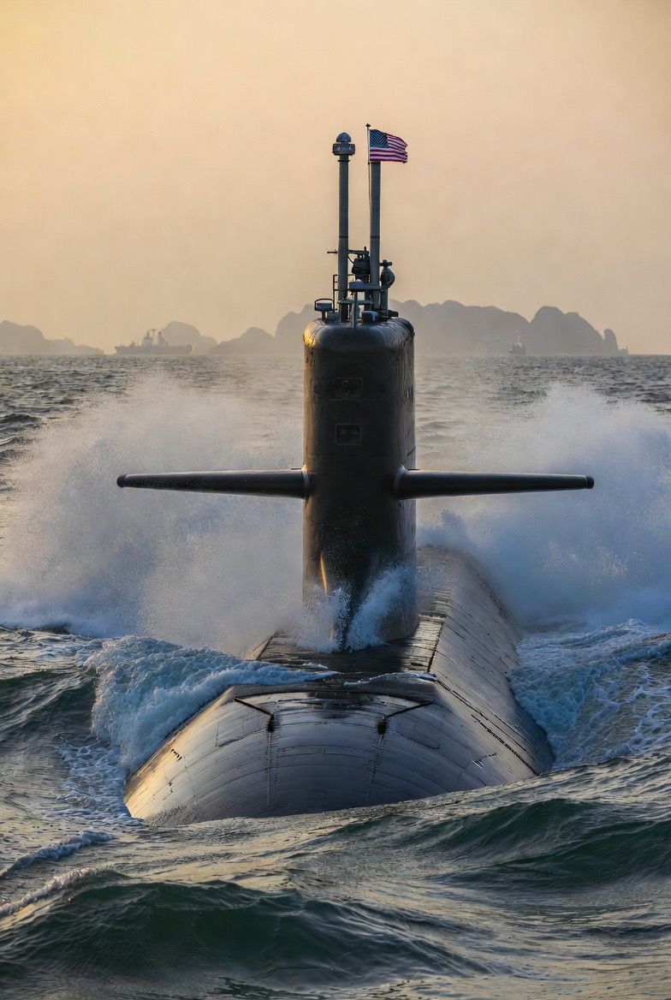

# Nuklir di Laut yang Diperebutkan: Mengapa AS Mengirim Kapal Selam Nuklir ke Laut China Selatan?

*Ilustrasi (pic: Grok AI).*

  
***Persaingan AS-China telah bergeser dari perang dagang menjadi persaingan maritim, dan perlahan menuju kompetisi militer berintensitas tinggi***
  

Jika Timur Tengah adalah barel mesiu yang terbakar-terbakar, maka Laut China Selatan adalah papan catur raksasa yang diam.

Diam… tetapi penuh kapal perang. Dan kini ada tamu baru yaitu kapal selam nuklir Amerika Serikat.

Pertanyaannya: Apakah AS benar-benar sedang melindungi sekutunya? atau apakah Washington sedang mengingatkan Beijing “Jangan kira lautan ini milikmu.”

## Laut China Selatan Sangat Penting

Banyak orang mengira ini hanya soal beberapa pulau kecil. Salah besar.

Sekitar sepertiga perdagangan dunia, triliunan dolar barang, dan jalur energi Asia Timur melewati kawasan ini.

Siapa yang menguasai Laut China Selatan…
tidak otomatis menguasai dunia. Tetapi memiliki pengaruh besar terhadap perdagangan dunia.

## Mengapa China Bersikeras Mengklaimnya?

China menggunakan konsep Nine-Dash Line, yaitu klaim historis yang mencakup sebagian besar Laut China Selatan.

Masalahnya, klaim itu ditolak oleh Filipina, Vietnam, Malaysia, Brunei, dan sebagian komunitas internasional.

Pada tahun 2016, tribunal internasional di bawah Permanent Court of Arbitration
menyatakan bahwa klaim Nine-Dash Line tidak memiliki dasar hukum menurut
United Nations Convention on the Law of the Sea.

China menolak putusan tersebut. Dan sejak itu Beijing tetap membangun pulau buatan, landasan udara, radar, serta fasilitas militer.

## Mengapa AS Mengirim Kapal Selam Nuklir?

Secara resmi, AS berkata: “Kami menjaga kebebasan navigasi dan mendukung sekutu.”

Kalimat itu benar, tetapi belum lengkap. Karena ada alasan lain, AS tidak ingin China berubah dari kekuatan ekonomi terbesar Asia menjadi penguasa militer tunggal Asia.

Karena jika itu terjadi, maka Filipina akan lebih bergantung pada Beijing, Jepang merasa terancam, Taiwan semakin terisolasi, dan pengaruh AS di Asia menurun.

Maka Washington mengirim pesan: “Kami masih ada di sini.” Dan kapal selam nuklir adalah cara yang sangat elegan… untuk berkata: “Jangan coba-coba.” 

## Filipina Mendadak Jadi Tokoh Utama

Yang menarik, sepuluh tahun lalu Filipina sering dianggap negara kecil yang tidak terlalu menentukan.

Sekarang? menjadi garis depan persaingan AS-China. Akibatnya AS meningkatkan latihan militer, memperluas akses pangkalan, serta memperkuat aliansi.

Sementara China tidak mau kalah meningkatkan patroli, mengirim kapal penjaga pantai, dan memperkuat klaim maritim.

Akibatnya Filipina seperti anak kos yang rumahnya diperebutkan dua konglomerat.
Ia ingin aman, tetapi setiap tamu yang datang membawa pasukan sendiri.

Mari kita terjemahkan narasi resmi semua pihak. China berkata: “Kami hanya mempertahankan wilayah historis kami.” AS menjawab: “Kami hanya menjaga kebebasan navigasi.” Sementara Filipina bisik-bisik: “Kami hanya ingin tidak ditabrak.”

Masalahnya, kalau semua pihak merasa defensif… lalu mengapa jumlah kapal perang justru bertambah?

Karena dalam geopolitik, rasa takut satu negara adalah alasan negara lain membeli senjata. Inilah yang disebut Security Dilemma. 

Semua bilang: “Aku bertahan.” Tetapi semua justru menambah kapal, menambah rudal, serta menambah kapal selam.

## Indonesia Harus Khawatir?

Jawabannya: Ya.

Bukan karena Indonesia akan langsung perang. Tetapi karena Laut Natuna Utara berdekatan dengan kawasan sengketa. 

Jika AS dan China terus meningkatkan militerisasi, Indonesia bisa terkena gangguan perdagangan, tekanan diplomatik, peningkatan aktivitas militer asing, serta risiko insiden laut.

Indonesia selama ini mencoba menjaga posisi bebas aktif. Tetapi mempertahankan posisi netral di tengah dua raksasa yang sedang saling menatap tajam… ibarat duduk di tengah dua kucing yang sedang berebut wilayah.

Dan kita tahu… kucing bisa sangat imut, sampai kemudian mereka mulai mendesis. 

## Apakah AS Benar Membela Filipina?

Ini pertanyaan pedas. Jawaban akademiknya: Ya. Sebab AS memang memiliki perjanjian pertahanan dengan Filipina dan berkepentingan menjaga keseimbangan kawasan.

Tetapi…Ya juga… karena AS tentu memiliki kepentingannya sendiri, yaitu mempertahankan pengaruh, membendung dominasi China, menjaga jalur perdagangan, serta melindungi posisi strategisnya di Asia.

Jadi, AS membantu Filipina. tetapi AS juga membantu dirinya sendiri. Karena dalam hubungan internasional, altruisme murni jarang ditemukan.

Pengiriman kapal selam nuklir AS ke Laut China Selatan bukan sekadar soal keamanan Filipina. Ia adalah simbol bahwa persaingan AS-China telah bergeser dari perang dagang menjadi persaingan maritim, dan perlahan menuju kompetisi militer berintensitas tinggi.

Yang membuat situasi ini mengkhawatirkan bukan karena ada satu pihak yang ingin perang. Melainkan karena semua pihak berkata mereka ingin mencegah perang…sambil terus menambah alat untuk berperang.

  
**Referensi**

United Nations Convention on the Law of the Sea. (1982). Convention on the Law of the Sea.

Permanent Court of Arbitration. (2016). The South China Sea Arbitration Award.

Center for Strategic and International Studies. (2025-2026). Asia Maritime Transparency Initiative Reports.

Council on Foreign Relations. (2026). Territorial Disputes in the South China Sea.

International Relations literature on Security Dilemma and balance of power.
