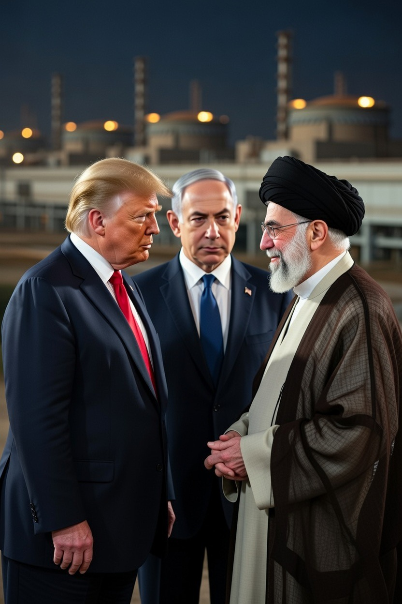

# Nuklir Iran, Keamanan Israel, dan Paradoks Moral dalam Diplomasi AS–Timur Tengah

*Ilustrasi Trump, Netanyahu, dan Khameini (pic: Grok AI).*

  
***Politik global sering seperti drama yang ditulis oleh rasa takut, bukan oleh empati. Itulah kenapa kekhawatiran terhadap nuklir Iran lebih dominan daripada tragedi kemanusiaan di Gaza***
  

Pertemuan antara Benjamin Netanyahu dan Donald Trump mengenai program nuklir Iran mencerminkan ketegangan klasik antara keamanan negara, proliferasi nuklir, dan krisis kemanusiaan di Palestina. 

Tulisan ini menunjukkan bahwa kekhawatiran terhadap kemampuan nuklir Iran berjalan paralel dengan kritik global terhadap operasi militer Israel di Gaza, menciptakan paradoks moral dalam politik keamanan internasional.

## Pendahuluan

Dalam politik global, dua isu sering berjalan berdampingan tetapi jarang diperlakukan setara:

1. Proliferasi nuklir Iran

2. Korban sipil dalam konflik Israel–Palestina

Pertemuan pemimpin Israel dan AS terkait Iran bukan fenomena baru. Sejak 1990-an, Israel memandang program nuklir Iran sebagai ancaman eksistensial, sementara AS melihatnya sebagai masalah stabilitas regional dan non-proliferasi.

Di sisi lain, operasi militer Israel di Gaza memicu kritik internasional terkait hukum humaniter.

Dua narasi ini hidup bersamaan dalam sistem politik global yang sama.

## Kerangka Teoretis

Analisis ini dapat dipahami melalui tiga teori hubungan internasional:

1. Realisme Keamanan

Negara memprioritaskan kelangsungan hidupnya.
Ancaman nuklir dipandang lebih berbahaya daripada krisis kemanusiaan karena menyangkut eksistensi negara.

Dalam logika ini, kekhawatiran Israel terhadap Iran menjadi “rasional secara strategis”.

2. Politik Proliferasi Nuklir

Literatur non-proliferasi menunjukkan bahwa:

• Negara tanpa nuklir takut negara lain memilikinya

• Negara yang memiliki nuklir ingin mempertahankan monopoli kekuatan

Timur Tengah memiliki dinamika unik karena Israel diyakini memiliki senjata nuklir secara de facto, sementara Iran dituduh berusaha mencapainya.

Ini menciptakan security dilemma regional.

3. Paradoks Moral dalam Perang Modern

Konflik Gaza memperlihatkan ketegangan antara:
• doktrin keamanan negara
• hukum humaniter internasional
• persepsi keadilan global

Dalam studi keamanan kritis, ini disebut:
selective humanitarianism.

Artinya, perhatian global terhadap korban sipil sering kalah oleh kepentingan strategis.

## Diplomasi AS–Israel dan Iran

AS memainkan tiga peran sekaligus:

• sekutu keamanan Israel

• negosiator nuklir Iran

• aktor global yang mengklaim membela stabilitas

Peran ganda ini sering menghasilkan persepsi standar ganda.

Secara struktural, hal ini terjadi karena:

• aliansi militer jangka panjang AS–Israel

• kepentingan energi dan stabilitas kawasan

• politik domestik AS

## Risiko Eskalasi Nuklir

Ketakutan terhadap perang nuklir bukan retorika kosong.

Teori deterrence menunjukkan:
ancaman nuklir bekerja justru karena kemungkinan kehancurannya nyata.

Namun penggunaan senjata nuklir akan melanggar:

• Treaty on the Non-Proliferation of Nuclear Weapons (NPT)

• hukum humaniter internasional

• norma global sejak 1945

Itu sebabnya bahkan negara yang bermusuhan cenderung berhenti di level ancaman.

Deterrence itu seperti dua orang berdiri di atas bensin sambil membawa korek api. Tidak ada yang benar-benar ingin menyalakannya.

Pertemuan Netanyahu–Trump mengenai Iran mencerminkan realitas politik global:

• keamanan nuklir dianggap ancaman eksistensial

• krisis kemanusiaan sering dipinggirkan dalam diplomasi strategis

• standar ganda dalam politik global terus diperdebatkan

Paradoks ini bukan anomali, melainkan ciri sistem internasional modern.

Dunia tidak selalu bergerak berdasarkan keadilan, tetapi berdasarkan keseimbangan kekuatan.

Itu menjelaskan mengapa kekhawatiran terhadap nuklir Iran bisa lebih dominan daripada tragedi kemanusiaan di Gaza dalam percakapan elite politik global.

Menyedihkan, tapi konsisten dengan sejarah politik internasional.

Politik global sering seperti drama yang ditulis oleh rasa takut, bukan oleh empati. Dan nuklir, seperti biasa, selalu menjadi tokoh antagonis yang membuat semua orang berbicara pelan tapi berpikir keras.

  
**Referensi**

Waltz, K. N. (1979). Theory of international politics. McGraw-Hill.

Mearsheimer, J. J. (2001). The tragedy of great power politics. W. W. Norton.

Sagan, S. D., & Waltz, K. N. (2013). The spread of nuclear weapons: An enduring debate. W. W. Norton.

United Nations. (1968). Treaty on the Non-Proliferation of Nuclear Weapons (NPT).

International Committee of the Red Cross. (2015). International humanitarian law and the challenges of contemporary armed conflicts.
