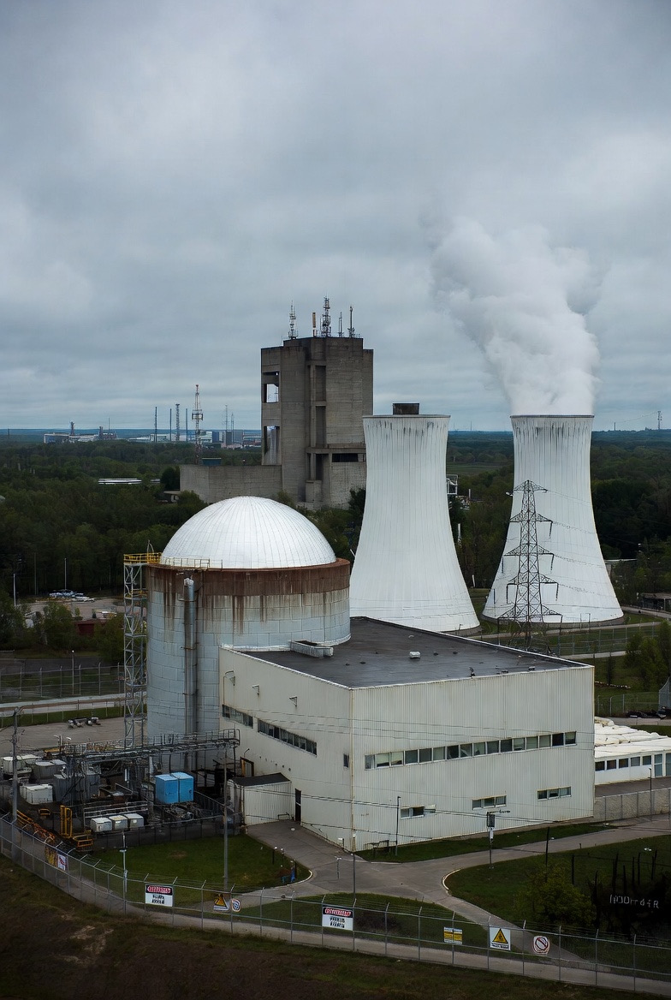

# Dunia Pasca-New START: Stabilitas Nuklir Tanpa Perjanjian Pembatas

*Ilustrasi reaktor nuklir (pic: Meta AI).*

  
***Ini bukan kekacauan total. Ini stabilitas yang lebih rapuh. Dan stabilitas rapuh dalam dunia nuklir selalu membuat para analis keamanan sulit tidur***
  

Berakhirnya perjanjian New START (Strategic Arms Reduction Treaty) antara Amerika Serikat dan Rusia menandai berakhirnya satu-satunya mekanisme formal pembatasan senjata nuklir strategis antara dua negara dengan arsenal terbesar di dunia. 

Namun, berakhirnya perjanjian ini tidak berarti semua negara bebas membangun senjata nuklir tanpa batas, melainkan menandakan pergeseran dari rezim kontrol formal menuju stabilitas berbasis deterensi dan kalkulasi strategis.

## Pendahuluan

New START ditandatangani pada 2010 dan mulai berlaku 2011.

Perjanjian ini membatasi:

• maksimum 1.550 hulu ledak nuklir strategis aktif

• maksimum 700 sistem peluncur strategis

• inspeksi timbal balik antara AS dan Rusia

Perjanjian ini diperpanjang hingga Februari 2026.

Setelah itu, tidak ada lagi perjanjian bilateral pengendalian nuklir aktif antara AS dan Rusia.

Dan di sinilah kecemasan global mulai muncul.

## Pertanyaan inti

Apakah dunia sekarang bebas membuat nuklir tanpa batas?

Jawaban ilmiahnya: tidak.

Tapi risikonya meningkat.

## Kajian Teoretik

1. Rezim non-proliferasi masih ada

Meskipun New START berakhir, sistem global nuklir tidak runtuh.

Masih ada:

• NPT (Non-Proliferation Treaty)

• IAEA safeguards

• norma internasional non-proliferasi

NPT tetap menjadi tulang punggung sistem nuklir global sejak 1968.

Artinya:

• negara non-nuklir tetap dilarang membuat senjata nuklir

• pengawasan internasional tetap berjalan

Jadi dunia tidak tiba-tiba menjadi “liar”.

2. Yang hilang adalah pembatasan dua raksasa nuklir

Sekitar 90% senjata nuklir dunia dimiliki AS dan Rusia.

New START penting karena:

• transparansi

• inspeksi langsung

• pembatasan jumlah

Tanpa perjanjian ini, yang hilang adalah:

• verifikasi

• batas kuantitatif

• kepercayaan strategis

Ini meningkatkan ketidakpastian, bukan kebebasan absolut.

Dalam teori keamanan internasional, ini disebut strategic opacity. Ketika negara tidak tahu pasti kekuatan lawannya.

Dan ketidakpastian membuat militer cenderung menambah persenjataan sebagai asuransi.

3. Mengapa negara tidak otomatis memperbanyak nuklir?

Karena senjata nuklir bukan koleksi kartu Pokémon.

Alasannya sederhana:

Biaya
Program nuklir strategis sangat mahal.

Politik
Nuklir memicu sanksi global.

Strategi
Deterensi tidak membutuhkan jumlah tak terbatas.

Dalam doktrin nuklir klasik: “Beberapa ratus cukup untuk menghancurkan peradaban.”

Tambahan ribuan tidak mengubah hasil akhir.

4. Risiko yang benar-benar meningkat

Masalah utama bukan jumlah senjata, tapi:

• miskalkulasi

• perlombaan modernisasi nuklir

• sistem senjata baru (hipersonik, AI command systems)

• berkurangnya komunikasi militer AS-Rusia

Stabilitas nuklir selama Perang Dingin bertahan bukan karena persahabatan, tetapi karena perjanjian teknis yang membatasi paranoia. New START adalah salah satunya.

## Analisis Realis

Dunia tidak memasuki “era tanpa aturan nuklir”.

Lebih tepatnya, dunia memasuki: era deterrence tanpa pagar pembatas formal.

Seperti jalan tol tanpa marka jalur. Mobil masih bisa melaju lurus. Tapi risiko tabrakan meningkat.

Berakhirnya New START berarti:

• negara tidak bebas membuat nuklir tanpa batas

• NPT tetap berlaku

• norma non-proliferasi masih ada

Namun:

• transparansi menurun

• kepercayaan strategis melemah 

• risiko perlombaan senjata meningkat

Ini bukan kekacauan total. Ini stabilitas yang lebih rapuh.

Dan stabilitas rapuh dalam dunia nuklir selalu membuat para analis keamanan sulit tidur.

  
**Referensi**

Freedman, L. (2003). The evolution of nuclear strategy (3rd ed.). Palgrave Macmillan.

International Atomic Energy Agency. (2023). IAEA safeguards overview. IAEA.

Schelling, T. C. (1960). The strategy of conflict. Harvard University Press.

Stockholm International Peace Research Institute. (2024). SIPRI yearbook 2024: Armaments, disarmament and international security. Oxford University Press.

United Nations. (1968). Treaty on the Non-Proliferation of Nuclear Weapons (NPT). United Nations Office for Disarmament Affairs.

U.S. Department of State. (2010). New START Treaty (Treaty between the United States of America and the Russian Federation on measures for the further reduction and limitation of strategic offensive arms).
