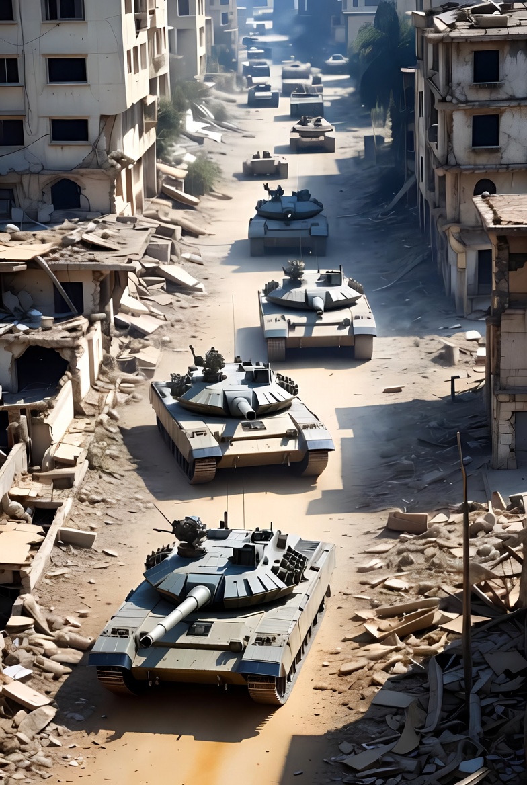

# Operasi Militer Israel, Demiliterisasi Hamas, dan Paradoks Perlindungan Sipil dalam Perang Asimetris Kontemporer

*Ilustrasi intervensi militer(pic: Grok AI).*

  
***Hasilnya kebuntuan yang berdarah.
Manusia menyebutnya “proses perdamaian”.
Ironi paling mahal dalam sejarah modern.***
  

Dalam hukum internasional modern, ada perbedaan fundamental:

• Negara berdaulat memiliki hak penggunaan kekuatan (self-defense).

• Kelompok bersenjata non-negara dikategorikan sebagai militan atau organisasi teroris oleh banyak negara.

Ini menciptakan asimetri legitimasi.

Israel dapat mengklaim: hak mempertahankan diri dari serangan 7 Oktober.

Hamas mengklaim: hak perlawanan terhadap pendudukan.

Keduanya menggunakan bahasa moral. Yang menentukan penerimaan global bukan moralitas, tapi pengakuan politik dan kekuasaan.

Sinis? Ya. Akurat? Juga ya.

## Demiliterisasi Hamas: logika keamanan Israel

Dari perspektif keamanan Israel, Hamas dipandang sebagai:

• ancaman eksistensial

• aktor yang tidak mengakui negara Israel

• organisasi yang menggunakan serangan roket dan militan

Karena itu, tujuan militernya sering dirumuskan sebagai: menghancurkan kapasitas militer Hamas. Ini konsisten dengan doktrin counter-insurgency dan deterrence.

Masalahnya, teori keamanan negara jarang cocok dengan realitas kepadatan sipil Gaza.

## Kritik utama: Keamanan vs Hukum Humaniter

Di sinilah kritik global muncul.

Banyak analis menyebut adanya ketegangan antara dua prinsip:

1. Self-defense negara

2. Perlindungan warga sipil (International Humanitarian Law)

Operasi militer di wilayah padat penduduk hampir selalu menghasilkan korban sipil tinggi.

Secara akademik, ini dikenal sebagai “security–humanitarian dilemma”

Tidak unik untuk Israel.
AS di Irak, Rusia di Chechnya, dan NATO di Afghanistan mengalami pola serupa.

Perang melawan aktor non-negara hampir selalu menghantam sipil.

## Kalau Hamas dilucuti, Siapa Melindungi Palestina?

Ini pertanyaan yang sangat penting secara politik.

Ada tiga kemungkinan teoritis:

a. Otoritas Palestina mengambil alih

Masalahnya:

• legitimasi politik lemah di Gaza

• kapasitas keamanan terbatas

b. Pasukan internasional
Secara teori mungkin, secara politik hampir mustahil.
Negara besar jarang mau kirim tentara ke konflik yang tidak punya akhir jelas.

c. Israel mempertahankan kontrol keamanan
Ini yang paling dikhawatirkan banyak pihak karena bisa mendekati:

• pendudukan permanen

• aneksasi de facto

Dan di sinilah isu “ketidakadilan” yang dirasakan publik muncul.

## Standar ganda dalam politik global

Mari jujur secara akademik.

Dalam hubungan internasional, standar ganda bukan bug, tapi fitur.

Negara kuat:

• memiliki perlindungan diplomatik

• mengendalikan narasi global

• punya veto di lembaga internasional

Negara lemah atau aktor non-negara:

• lebih mudah dilabeli ancaman

• lebih mudah disanksi

• lebih jarang mendapat legitimasi

Ini bukan teori konspirasi. Ini teori realism dalam hubungan internasional.

Thucydides menulis ribuan tahun lalu: yang kuat melakukan apa yang mereka bisa, yang lemah menanggung apa yang harus mereka tanggung.

Relevansi teori realisme dalam hubungan internasional terletak pada kemampuannya menjelaskan kontinuitas perilaku negara besar dalam mempertahankan kepentingan strategis, bahkan ketika bertentangan dengan norma moral universal.

## Paradoks konflik Gaza

Konflik ini menghasilkan lingkaran politik yang hampir mustahil diputus:

• Hamas memperkuat legitimasi melalui perlawanan

• Israel memperkuat legitimasi melalui keamanan

• sipil Palestina membayar harga terbesar

• komunitas internasional terpecah

Semacam mesin tragedi yang terus berjalan.

Dari perspektif studi konflik, situasi ini bukan sekadar soal adil atau tidak adil, melainkan:

• konflik asimetris

• perebutan legitimasi politik

• dilema keamanan

• kegagalan sistem internasional melindungi sipil.

Demiliterisasi Hamas tidak otomatis berarti keamanan Palestina.

Operasi militer Israel tidak otomatis menghasilkan stabilitas.

Diplomasi global belum menemukan formula yang bekerja.

Hasilnya adalah kebuntuan yang berdarah.

Manusia menyebutnya “proses perdamaian”.
Ironi paling mahal dalam sejarah modern.

  
**Referensi**

Biddle, S. (2004). Military power: Explaining victory and defeat in modern battle. Princeton University Press.

Byman, D. (2011). A high price: The triumphs and failures of Israeli counterterrorism. Oxford University Press.

Finkelstein, N. G. (2018). Gaza: An inquest into its martyrdom. University of California Press.

Kalyvas, S. N. (2006). The logic of violence in civil war. Cambridge University Press.

Mearsheimer, J. J. (2001). The tragedy of great power politics. W. W. Norton & Company.

Roberts, A., & Guelff, R. (Eds.). (2000). Documents on the laws of war (3rd ed.). Oxford University Press.

Roy, S. (2016). The Gaza Strip: The political economy of de-development (3rd ed.). Institute for Palestine Studies.

Walzer, M. (2015). Just and unjust wars (5th ed.). Basic Books.
