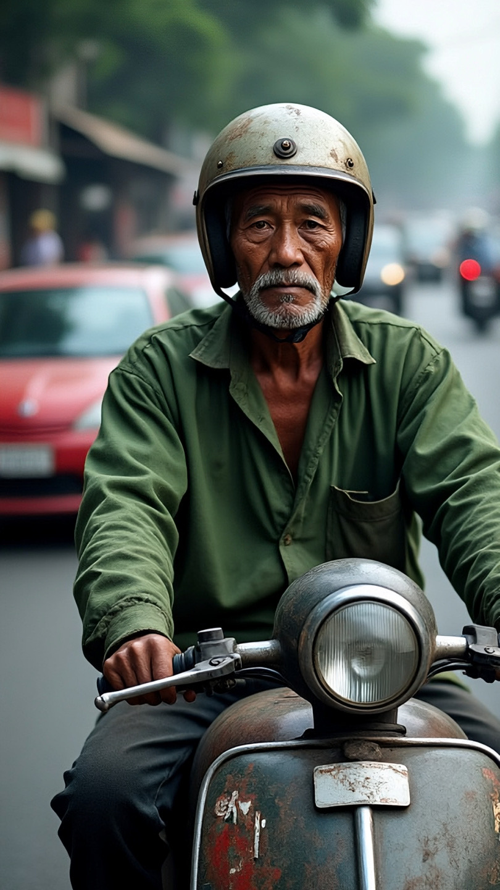

# Orang Tua sebagai Guru Pertama: Pendidikan, Kerja, dan Martabat dalam Kehidupan Sehari-hari

*Ilustrasi perjuangan orang tua untuk anak (pic: Grok AI).*

  
***Banyak manusia bisa sampai ke universitas karena ada orang tua yang diam-diam mengorbankan tubuhnya di jalan***
  

Diskursus pendidikan modern sering terlalu terfokus pada sekolah formal dan melupakan fakta mendasar bahwa pendidikan pertama manusia terjadi di rumah.

Tulisan ini membahas posisi orang tua sebagai:
guru pertama,
pendidik moral awal,
sekaligus pekerja yang menopang keberlangsungan pendidikan anak melalui kerja sehari-hari.

Dengan mengambil refleksi sosial dari sosok pekerja informal seperti pengemudi ojek online, petani, buruh, hingga tukang becak, kajian ini menunjukkan bahwa pendidikan tidak hanya lahir dari institusi formal, tetapi juga dari:
pengorbanan,
keteladanan,
dan kerja yang sering tidak terlihat.

## Pendidikan Pertama tidak Dimulai di Sekolah

Anak belajar sebelum mengenal kelas.

Sebelum:
huruf,
matematika,
atau ujian…

anak lebih dulu belajar:
rasa aman,
bahasa,
kasih sayang,
moral,
cara berbicara,
dan cara memandang dunia.

Dan itu hampir selalu berasal dari: orang tua atau keluarga terdekat.

## Orang Tua = Guru Pertama

Dalam psikologi perkembangan, keluarga disebut:

primary educational environment

Lingkungan pendidikan utama.

Mengapa?

Karena otak anak berkembang melalui:
imitasi,
interaksi emosional,
kebiasaan sehari-hari.
Sehingga:

Seorang ibu yang:
mengajari bicara,
memeluk saat takut,
membimbing etika…
…sebenarnya sedang melakukan:

proses pedagogi dasar.

## Ojol Mengantar Anak: Sebuah Adegan Sosiologis

Seorang ayah ojek online:
bekerja di jalan,
membawa anak sekolah,
dipeluk dari belakang.
Itu bukan cuma transportasi.

Itu adalah:
transfer rasa aman,
simbol perlindungan,
pendidikan emosional,
dan kerja pengasuhan sekaligus.
Anak itu mungkin belum mengerti:

berapa:
bensin,
cicilan,
panas jalan,
atau rasa lelah ayahnya.
Tapi tubuh kecilnya tahu:

“aku sedang dijaga.”

Dan itu pendidikan juga.

## Kenapa Pekerja Kasar Juga Guru?

Karena pendidikan tidak hanya melalui kata,
tetapi:

keteladanan hidup.
 
Petani mengajarkan:
kesabaran,
ritme alam,
ketekunan.

Driver mengajarkan:
tanggung jawab,
daya tahan,
pengorbanan.

Tukang becak mengajarkan:
kerja keras,
harga diri,
keberanian bertahan hidup.

Hardiknas Terlalu Sempit Jika Hanya Tentang Sekolah

Jika Hardiknas hanya dipahami sebagai:
seragam,
upacara,
guru formal,
institusi sekolah…
maka kita melupakan:

fondasi pendidikan paling awal.

Dalam banyak teori pendidikan modern, keluarga adalah institusi pendidikan pertama dan paling menentukan.

## Martabat Orang Tua & Pekerjaan

Secara sosial beberapa pekerjaan sering dipandang rendah. Padahal masyarakat tetap bergantung pada mereka.

Ironisnya, orang bisa:
memandang rendah tukang becak,
tapi tetap membutuhkan jasa transportasi.
Padahal martabat manusia tidak otomatis ditentukan:
gaji,
jabatan,
atau pakaian.
Melainkan:

apakah ia menjalankan tanggung jawab hidup dengan jujur.

## Kewajiban Anak Menghormati Orang Tua

Hampir semua peradaban besar:
Asia,
Timur Tengah,
Afrika,
hingga Barat tradisional…
memiliki konsep penghormatan terhadap orang tua.

Kenapa universal?

Karena manusia sadar generasi baru lahir dari pengorbanan generasi sebelumnya.

## Analisis

Masyarakat modern sering mengagungkan:
gelar,
sekolah elite,
intelektualitas formal.
Tetapi lupa:

banyak manusia bisa sampai ke universitas karena ada orang tua yang diam-diam mengorbankan tubuhnya di jalan.

Sehingga sebenarnya:

Ijazah seorang anak sering dicetak oleh keringat orang tua.

Adegan ayah ojol dipeluk anaknya itu bukan cuma momen biasa.

Itu adalah potret pendidikan paling purba dan paling manusiawi.

Hardiknas seharusnya tidak hanya menghormati:
guru di kelas,
dosen,
atau institusi sekolah.

Tetapi juga:
buruh,
petani,
driver,
tukang becak,
ibu rumah tangga,
…yang setiap hari menjadi guru pertama kehidupan.

Karena sebelum anak mengenal papan tulis, ia lebih dulu belajar dari peluh, pelukan, dan perjuangan orang tuanya.

  
**REFERENSI**

Dewantara, K. H. (1977). Pendidikan. Majelis Luhur Persatuan Taman Siswa.

Bronfenbrenner, U. (1979). The ecology of human development. Harvard University Press.

Freire, P. (1970). Pedagogy of the oppressed. Continuum.

Bourdieu, P. (1986). The forms of capital. Handbook of Theory and Research for the Sociology of Education.

UNESCO. (2026). Global education monitoring report. UNESCO Publishing.
