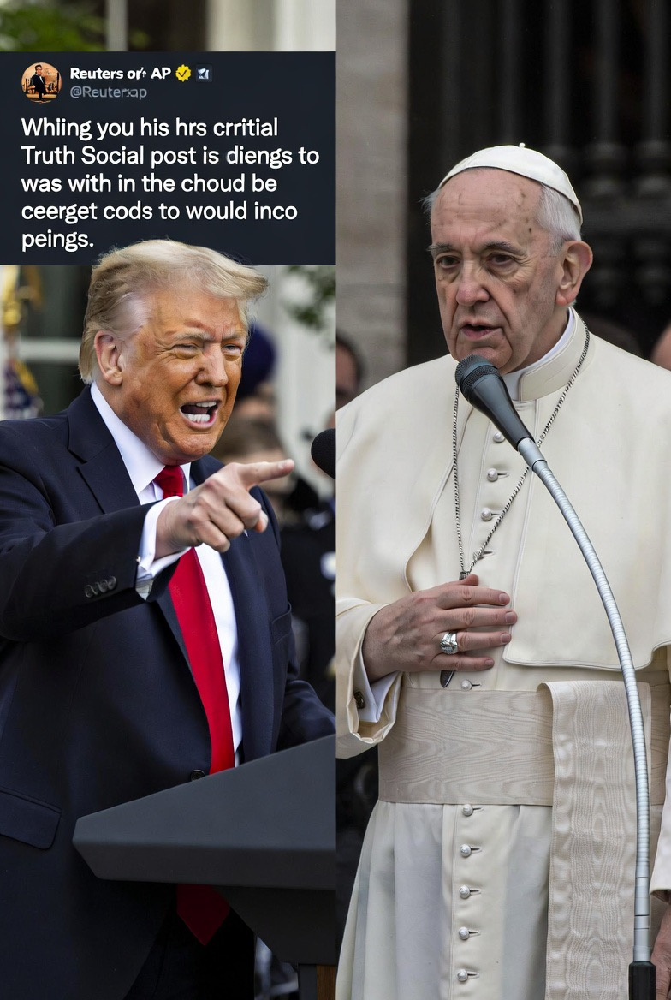

# Otoritas Moral vs Kekuasaan Politik: Analisis Konflik Retorik Donald Trump vs Paus dalam Konteks Eskalasi Timur Tengah

*Ilustrasi Donald Trump vs Paus (pic: Grok AI).*

  
***Pertanyaan abadi peradaban manusia: apakah dunia akan dipimpin oleh kekuatan… atau oleh nilai?***
  

Konflik retorik antara Donald Trump dan Pope Leo mencerminkan pertarungan klasik antara kekuasaan politik dan otoritas moral dalam sistem global. 

Tulisan ini menganalisis bagaimana narasi perang, legitimasi kekerasan, dan kritik moral diproduksi dan dipertentangkan dalam ruang publik internasional. 

Temuan menunjukkan bahwa konflik ini bukan sekadar personal, melainkan representasi benturan paradigma: realisme politik vs etika kemanusiaan universal.

## Pendahuluan

Dalam sejarah panjang peradaban, negara dan agama sering berjalan berdampingan—namun tidak selalu searah.

Ketika:

negara berbicara tentang keamanan

pemimpin agama berbicara tentang kemanusiaan

👉 konflik hampir tak terhindarkan

## Realisme Politik

Menurut Hans Morgenthau: negara bertindak berdasarkan kepentingan, bukan moralitas.

## Otoritas Moral Global

Menurut Max Weber: legitimasi bisa berasal dari kekuasaan… atau dari moralitas.

## Just War Theory

Tradisi ini menekankan:

perang harus:

proporsional

memiliki tujuan sah

melindungi sipil

## Analisis

A. Posisi Trump: Bahasa Kekuasaan

Retorika seperti:

“menghancurkan peradaban Iran”

mencerminkan:

🔥 1. Deterrence ekstrem

ancaman total → mencegah lawan

🔥 2. Coercive signaling

menunjukkan dominasi militer
 
 🔥 3. Audience domestik

memperkuat citra kuat di dalam negeri

👉 ini konsisten dengan logika: power must be seen to be believed.

B. Posisi Paus: Bahasa Moralitas

Pernyataan:

“truly unacceptable”, “absurd and inhuman”
mewakili:

🕊️ 1. Etika kemanusiaan universal

melindungi kehidupan sipil

🕊️ 2. Kritik terhadap kekerasan struktural

perang dilihat sebagai kegagalan moral

🕊️ 3. Otoritas non-negara

tidak punya senjata

tapi punya legitimasi moral

👉 ini adalah:soft power berbasis nilai.

C. Benturan Inti

Ini bukan sekadar beda pendapat.

Ini benturan:

| Trump | Paus |
|------|-------|
| kekuasaan | moralitas |
| keamanan | kemanusiaan |
| deterrence | perdamaian |

D. Serangan Balik Trump

Dengan menyebut Paus: “catering to the radical left”

👉 Trump mencoba:

mendeligitimasi kritik moral

menggeser isu ke politik domestik.

E. Respons Paus: “No fear”

Pernyataan: tidak takut pada administrasi Trump.

👉 ini penting secara simbolik:

menunjukkan independensi moral

menolak tekanan politik.

F. Dampak Global

🌍 1. Polarisasi narasi

pro-keamanan vs pro-kemanusiaan

🌍 2. Delegitimasi kekerasan

kritik moral memperlemah justifikasi perang

🌍 3. Tekanan internasional

suara moral memperkuat tuntutan ceasefire.

## Diskusi

Fenomena ini menunjukkan:

1️⃣ Moralitas tidak bisa mengalahkan kekuatan…
tapi bisa mengganggunya

2️⃣ Negara kuat tidak suka dikritik oleh otoritas moral karena tidak bisa dibungkam dengan kekuatan

3️⃣ Publik global terpecah

antara:

keamanan

kemanusiaan

Konflik ini bukan sekadar Trump vs Paus.

Ia adalah pertanyaan abadi peradaban manusia: apakah dunia akan dipimpin oleh kekuatan… atau oleh nilai?.

  
**Referensi**

Morgenthau, H. J. (1948). Politics among nations.

Weber, M. (1922). Economy and society.

Walzer, M. (1977). Just and unjust wars.

