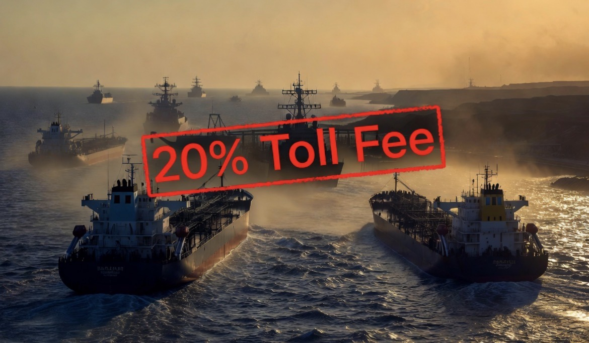

# Pak Ogah di Selat Hormuz? Ketika Moral Kemanusiaan Bertemu Politik Kekuatan

*Ilustrasi (pic: Grok AI).*

  
***Keamanan laut internasional bukan hanya hasil tindakan satu negara, melainkan juga kerja sama banyak negara melalui patroli, diplomasi, dan hukum internasional***
  

Dalam hubungan internasional, ada satu ironi yang terus berulang. Negara sering berkata “Kami berperang demi melindungi rakyat sipil.”

Namun beberapa jam kemudian, target serangan meluas menjadi pembangkit listrik, pelabuhan, jembatan, jaringan komunikasi, bahkan fasilitas energi.

Di sinilah muncul pertanyaan klasik: Kalau tujuan utamanya melindungi warga sipil, mengapa infrastruktur yang dipakai warga sipil ikut menjadi sasaran?

Pertanyaan ini bukan hanya diarahkan kepada Amerika Serikat. Pertanyaan yang sama pernah ditujukan kepada Rusia, NATO, Israel, maupun berbagai negara lain dalam konflik modern.

## Mengapa Jembatan Bisa Menjadi Target Militer?

Dalam hukum perang modern (International Humanitarian Law), sebuah objek sipil dapat kehilangan perlindungannya apabila digunakan untuk kepentingan militer. 

Misalnya mengangkut tank, menjadi jalur logistik senjata, atau  menjadi rute pasukan. Maka sebuah jembatan dapat dikategorikan sebagai dual-use infrastructure.

Tapi masalahnya jembatan juga dipakai anak sekolah, ambulans, pedagang, petani, dan warga biasa. Jadi setiap serangan selalu memiliki konsekuensi kemanusiaan.

Karena itu hukum humaniter mensyaratkan prinsip military necessity, proportionality, dan precaution.

Masalah terbesar bukan apakah boleh menyerang, melainkan: Apakah kerugian warga sipil sebanding dengan keuntungan militernya?

Inilah yang hampir selalu diperdebatkan.

## Retorika “Melindungi Sipil”

Hampir semua negara menggunakan bahasa yang mirip.

Amerika: “Kami menyerang demi keamanan.”
Rusia: “Kami melindungi warga berbahasa Rusia.”
Israel: “Kami menghancurkan infrastruktur teroris.”

Semuanya memakai kosakata moral.

Mengapa?

Karena dalam abad ke-21 legitimasi politik sama berharganya dengan kemenangan militer.

Tidak ada negara yang ingin berkata: “Kami menyerang karena kami ingin menunjukkan kekuatan.”

Kalimat itu buruk secara diplomatik. Sehingga bahasa moral menjadi bagian dari strategi perang informasi.

## Siapa yang Berhak Mengatur Jalur Laut Dunia?

Pada Juli 2026, Presiden Donald Trump sempat mengusulkan pungutan sekitar 20% terhadap kapal atau kargo yang melintasi Selat Hormuz. 

Alasan yang dikemukakan adalah bahwa Amerika Serikat telah mengeluarkan biaya besar untuk menjaga keamanan jalur pelayaran tersebut sehingga para pengguna seharusnya ikut menanggung beban tersebut.

Namun, usulan ini segera memicu kontroversi internasional.

Presiden Brasil, Luiz Inácio Lula da Silva, bahkan menyebut gagasan tersebut menyerupai “pembajakan” (piracy). Menurutnya, tidak tepat apabila sebuah negara memungut biaya atas jalur laut internasional hanya karena mengklaim telah berperan dalam menjaga keamanannya.

Dari perspektif hukum laut internasional, kritik tersebut memiliki dasar yang kuat. Selat Hormuz merupakan selat internasional yang menghubungkan Teluk Persia dengan Teluk Oman dan Laut Arab. 

Jalur ini diatur oleh rezim transit passage dalam hukum laut internasional, yang memberikan hak kepada kapal-kapal semua negara untuk melintas tanpa hambatan yang tidak sah.

Artinya, bahkan Iran dan Oman, sebagai negara yang berbatasan langsung dengan Selat Hormuz, tidak dapat secara sepihak menetapkan pungutan atas hak lintas transit internasional. Apalagi negara lain yang tidak memiliki kedaulatan atas wilayah tersebut.

Karena itu, usulan pungutan dari Amerika Serikat dipandang banyak ahli sebagai persoalan politik dan hukum yang kompleks. 

Pertanyaan yang segera muncul bukanlah apakah Amerika memiliki kekuatan militer untuk mengamankan jalur tersebut, melainkan: Apakah penyediaan keamanan internasional otomatis memberikan hak untuk memungut biaya dari pengguna jalur laut internasional?

Hingga kini, jawabannya dalam kerangka hukum laut internasional cenderung tidak.

Menariknya, tidak lama setelah menuai kritik dari berbagai negara, pemerintahan Trump membatalkan gagasan pungutan tersebut dan menyatakan akan lebih memilih memperluas kerja sama investasi serta perdagangan dengan negara-negara Teluk sebagai bentuk kompensasi ekonomi.

Kasus ini memperlihatkan bahwa dalam geopolitik modern, kekuatan militer belum tentu bertransformasi menjadi kewenangan hukum. 

Sebuah negara dapat memiliki kemampuan untuk menjaga keamanan suatu kawasan, tetapi legitimasi untuk menetapkan aturan ekonomi atas kawasan itu tetap dibatasi oleh hukum internasional dan kesepakatan antarnegara. 

Di sinilah perbedaan mendasar antara power (kekuatan) dan authority (kewenangan), sebuah perbedaan yang sering kali menjadi sumber sengketa dalam politik global.

## “Pak Ogah” dalam Geopolitik 

Pak Ogah memperoleh uang karena: “Jalan ini saya atur.”

Dalam geopolitik modern, negara besar kadang berargumen: “Kami menjaga keamanan jalur pelayaran.” Maka muncul logika: yang menjaga merasa berhak menentukan aturan.

Namun logika itu sering dipersoalkan. Karena keamanan laut internasional bukan hanya hasil tindakan satu negara, melainkan juga kerja sama banyak negara melalui patroli, diplomasi, dan hukum internasional.

## Apakah ini Bentuk Kolonialisme Baru?

Banyak ilmuwan politik membahas konsep seperti: hegemonic stability, gunboat diplomacy, sphere of influence.

Gagasannya adalah bahwa negara yang memiliki kekuatan ekonomi dan militer terbesar sering memiliki kemampuan lebih besar untuk membentuk aturan global.

Pendukungnya berargumen: “Kekuatan besar menyediakan stabilitas.” Sementara pengkritiknya menjawab: “Yang disebut stabilitas sering kali berarti aturan dibuat oleh yang paling kuat.”

Perdebatan ini sudah berlangsung puluhan tahun dan belum memiliki jawaban tunggal.

Bagaimana mungkin sebuah perang diklaim untuk melindungi manusia, tetapi pada saat yang sama menghancurkan infrastruktur yang juga menopang kehidupan manusia?

Tidak semua serangan terhadap infrastruktur otomatis melanggar hukum perang. Ada kondisi tertentu yang dapat menjadikannya sasaran militer yang sah. Namun setiap serangan tetap harus memenuhi prinsip kebutuhan militer, proporsionalitas, dan kehati-hatian untuk meminimalkan dampak terhadap warga sipil. 

Ketika prinsip-prinsip itu diperdebatkan, perdebatan bukan lagi sekadar soal strategi militer, melainkan juga soal legitimasi moral dan hukum.

  
**Referensi**

Donald Trump. (2026, 14 Juli). Trump says U.S. will pursue Gulf investment deals instead of proposed Hormuz shipping fee. Reuters.

Luiz Inácio Lula da Silva. (2026, 14 Juli). Brazilian president calls Trump’s proposed Hormuz shipping fee “piracy”. Anadolu Agency.

Axios. (2026, 14 Juli). Trump’s proposed Hormuz toll sparks legal and diplomatic criticism.

United Nations. (1982). United Nations Convention on the Law of the Sea (UNCLOS). Montego Bay, Jamaica.

Donald R. Rothwell, & Stephens, T. (2016). The International Law of the Sea (2nd ed.). Hart Publishing.

James Kraska. (2011). Contemporary Law of the Sea. Cambridge University Press.

Natalie Klein. (2011). Maritime Security and the Law of the Sea. Oxford University Press.

The Oxford Handbook of the Law of the Sea. (2015). Oxford University Press.

Center for Strategic and International Studies. Security and Maritime Chokepoints in the Persian Gulf.

International Institute for Strategic Studies. The Military Balance 2026.

Chatham House. Energy Security and the Strait of Hormuz.
