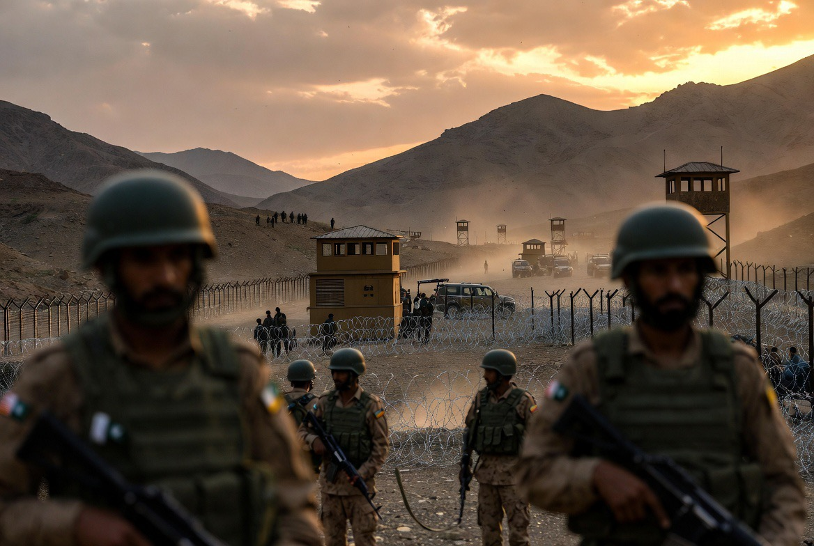

# Pakistan Mediator Perdamaian Tapi Sulit Berdamai dengan Afghanistan? Paradoks Diplomasi Modern

*Ilustrasi (pic: Grok AI).*

  
***Banyak negara bisa tampak sangat bijak di forum internasional, namun tetap kesulitan menyelesaikan konflik yang tepat berada di depan pintunya***
  

Sekilas memang terdengar ironis, “Kalau Pakistan pintar mendamaikan negara lain, kenapa tetangganya sendiri masih sering ribut?”

Tetapi dalam hubungan internasional, paradoks seperti ini bukan hal yang aneh.

## Mediator Tidak Harus Bebas Konflik

Sejarah menunjukkan banyak mediator justru memiliki konflik sendiri.

Contohnya: Norway pernah menjadi mediator dalam konflik Timur Tengah, padahal memiliki tantangan keamanan domestik sendiri, Qatar sering memediasi konflik internasional meski pernah mengalami blokade diplomatik oleh negara-negara Teluk, Türkiye menjadi tuan rumah pembicaraan Rusia-Ukraina meski memiliki persoalan keamanan dengan kelompok bersenjata di wilayahnya.

Artinya, kemampuan menjadi mediator tidak otomatis berarti mampu menyelesaikan seluruh persoalan nasionalnya sendiri.

## Mengapa Pakistan Sulit Berdamai dengan Afghanistan?

Ini jauh lebih tua daripada pemerintahan mana pun. Akar utamanya antara lain:

1. Garis Durand

Perbatasan yang dibuat Inggris pada 1893 masih diperselisihkan hingga kini.

Afghanistan selama puluhan tahun tidak pernah benar-benar mengakui Garis Durand sebagai batas internasional permanen.

Akibatnya: sengketa wilayah, perpindahan suku Pashtun, hingga konflik perbatasan.

2. Kelompok Bersenjata

Pakistan menuduh kelompok seperti Tehrik-i-Taliban Pakistan menggunakan wilayah Afghanistan sebagai tempat berlindung.

Sebaliknya, pemerintah Afghanistan beberapa kali menolak tuduhan tersebut atau memberikan penjelasan yang berbeda.

Akibatnya, kepercayaan kedua negara terus rendah.

3. Kepentingan Keamanan

Bagi Pakistan, Afghanistan bukan sekadar tetangga, melainkan bagian dari strategi keamanan terhadap India.

Konsep lama yang sering disebut para analis adalah strategic depth, yaitu keinginan agar Afghanistan tidak menjadi wilayah yang bersahabat dengan musuh Pakistan.

Walaupun konsep ini diperdebatkan dan telah berkembang, pengaruhnya terhadap cara berpikir strategis Pakistan masih sering dibahas dalam literatur keamanan.

## Kemana “Kecerdasan Politik”-nya?

Nah, ini pertanyaan yang lucu. Sebenarnya bukan hilang, melainkan tujuannya berbeda.

Dalam diplomasi internasional, negara sering melakukan mediasi karena meningkatkan reputasi, memperoleh pengaruh, memperbaiki posisi tawar, serta memperkuat hubungan dengan kekuatan besar.

Sedangkan konflik dengan tetangga menyangkut: keamanan nasional, perbatasan, identitas, sejarah, dan politik domestik. Itu jauh lebih sulit.

## “Divide et Impera” Masih Berlaku?

Kalau yang dimaksud adalah strategi “pecah belah”, istilah itu berasal dari praktik kekuasaan kolonial dan kemudian dipakai lebih luas dalam politik. Namun, tidak semua konflik modern bisa dijelaskan dengan konsep itu.

Hubungan Pakistan-Afghanistan lebih banyak dipengaruhi oleh warisan kolonial, batas wilayah, kelompok bersenjata, dinamika regional, serta kepentingan keamanan masing-masing negara.

Jadi akan terlalu sederhana jika semua dijelaskan hanya dengan satu konsep.

Ada pepatah dalam diplomasi yang cukup menarik: “Lebih mudah menjadi penengah pertengkaran tetangga daripada menyelesaikan pertengkaran di rumah sendiri.”

Kenapa?

Karena ketika menjadi mediator relatif netral. Tetapi ketika menyangkut negara sendiri maka akan diliputi emosi sejarah, politik dalam negeri, militer, opini publik, dan keamanan nasional ikut masuk ke meja perundingan.

Itulah sebabnya banyak negara bisa tampak sangat bijak di forum internasional, namun tetap kesulitan menyelesaikan konflik yang tepat berada di depan pintunya.

Ironi yang kita lihat memang nyata. Tetapi dalam studi hubungan internasional, itu bukanlah kontradiksi yang aneh. 

Hal tersebut justru menggambarkan bahwa kapasitas diplomasi dan kemampuan menyelesaikan konflik domestik atau bilateral adalah dua kemampuan yang berbeda, meskipun kadang saling berkaitan. 

  
**Referensi**

International Crisis Group. (2024). Pakistan-Afghanistan Relations: Managing the Durand Line and Cross-Border Militancy.

Council on Foreign Relations. (2025). Global Conflict Tracker: Instability in Afghanistan.

United States Institute of Peace. (2024). Pakistan, Afghanistan, and Regional Security.

Chatham House. (2023). The Durand Line and Pakistan-Afghanistan Relations.

Encyclopaedia Britannica. (2025). Durand Line.
