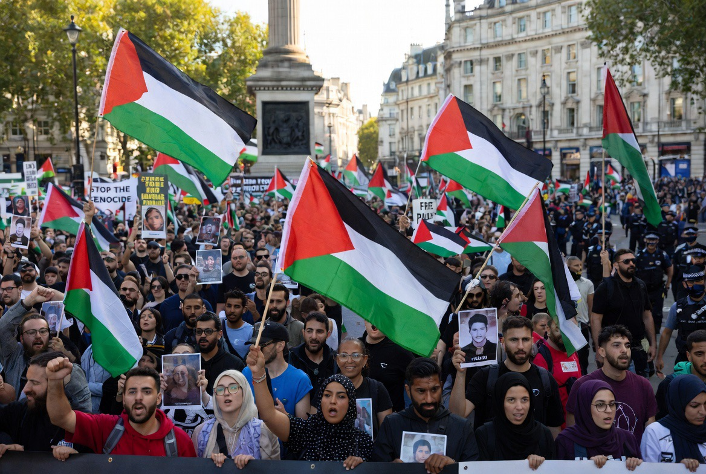

# Palestina & Jalanan Dunia 2026: Mengapa Jutaan Orang yang Tidak Pernah Menginjak Gaza Tetap Membela Palestina

*Ilustrasi (pic: Grok AI).*

  
***Apakah dunia harus tetap diam ketika suatu kelompok manusia kehilangan tanah, keamanan, martabat, atau masa depannya?***
  

Ada pertanyaan yang sangat menarik secara sosiologis, mengapa seorang mahasiswa di London, seorang buruh di Barcelona, seorang pensiunan di Paris, atau seorang aktivis di Jakarta bisa menangis untuk tempat yang bahkan belum pernah mereka kunjungi?

Kenapa konflik yang terjadi ribuan kilometer jauhnya mampu memenuhi jalanan kota-kota dunia?

Kalau dijawab dengan satu kalimat, karena Palestina telah berubah dari sekadar wilayah geografis menjadi simbol moral global.

Gelombang demonstrasi pro-Palestina yang berlanjut hingga 2026 menunjukkan transformasi konflik Israel-Palestina dari isu regional menjadi gerakan solidaritas transnasional. 

Demonstrasi besar di berbagai kota dunia tidak hanya dipicu oleh perkembangan militer di Gaza dan Tepi Barat, tetapi juga oleh faktor identitas, media sosial, hak asasi manusia, anti-kolonialisme, dan persepsi ketimpangan kekuasaan global. 

Tulisan ini menganalisis mengapa Palestina menjadi salah satu isu yang mampu memobilisasi massa lintas negara dalam skala yang jarang terlihat dalam konflik internasional modern.

## Palestina Bukan Lagi Sekadar Konflik Regional

Pada awalnya konflik ini dipandang sebagai sengketa wilayah antara dua bangsa.

Namun dalam perkembangannya, Palestina berubah menjadi simbol pendudukan, simbol pengungsian, simbol ketimpangan kekuatan,
serta simbol hak menentukan nasib sendiri.

Akibatnya, ketika orang membawa bendera Palestina di London atau Stockholm, sering kali mereka tidak hanya berbicara tentang Gaza.

Mereka sedang berbicara tentang gagasan yang lebih besar, yaitu keadilan, martabat, dan hak manusia untuk hidup bebas.

## Mengapa Demonstrasi Terus Membesar?

1. Revolusi Media Sosial

Perang Vietnam masuk ke ruang tamu melalui televisi, sedangkan Perang Gaza masuk ke saku celana melalui telepon genggam.

Setiap hari orang melihat reruntuhan, pengungsian, rumah yang hancur, anak-anak terluka, dan kesaksian warga sipil.

Tidak perlu menunggu surat kabar esok pagi, konflik hadir secara langsung. Akibatnya jarak emosional antara Gaza dan dunia menjadi jauh lebih pendek.

2. Psikologi Empati Global

Dalam psikologi sosial terdapat konsep Moral Shock. Yaitu saat seseorang melihat peristiwa yang dianggap sangat tidak adil sehingga terdorong melakukan aksi politik.

Banyak peserta demonstrasi tidak memiliki hubungan etnis atau agama dengan Palestina. Namun mereka mengalami kemarahan moral, empati, dan keinginan untuk bertindak. Mereka merasa, diam berarti ikut membiarkan.

3. Palestina Sebagai Simbol Anti-Kolonial

Ini salah satu faktor terbesar yang sering diremehkan. Bagi banyak aktivis muda di Afrika, Asia, Amerika Latin, bahkan Eropa, memandang Palestina melalui lensa anti-kolonialisme.

Mereka melihat pengusiran, permukiman, pendudukan, dan ketimpangan kekuatan. Lalu menghubungkannya dengan sejarah kolonialisme di negara mereka sendiri.

Akibatnya solidaritas Palestina sering menjadi bagian dari narasi global yang jauh lebih luas.

## Mengapa London Menjadi Episentrum?

London memiliki beberapa keunggulan, diantaranya adalah komunitas diaspora besar, tradisi demonstrasi politik kuat, media internasional, serta akses ke pusat kekuasaan Inggris.

Karena itu setiap demonstrasi Palestina di London memiliki efek simbolik besar. Puluhan ribu peserta dapat berkumpul dan menarik perhatian dunia.

## Kampus dan Generasi Baru

Fenomena menarik lainnya adalah dominasi generasi muda. Mahasiswa sering menjadi motor gerakan.

Mengapa?

Karena generasi muda lebih aktif di media sosial, lebih sensitif terhadap isu HAM, lebih terbuka pada solidaritas lintas negara.

Akibatnya banyak kampus berubah menjadi pusat mobilisasi politik global.

## Palestina dan Perubahan Narasi Dunia

Dulu narasi konflik Timur Tengah banyak ditentukan oleh negara, diplomat, dan media besar.

Kini?

Seorang warga sipil dengan telepon genggam bisa memengaruhi opini jutaan orang. Inilah perubahan terbesar abad ke-21, kekuatan narasi tidak lagi dimonopoli oleh pemerintah.

## Mengapa Isu Ini Tidak Kunjung Padam?

Banyak konflik besar menghilang dari perhatian dunia setelah beberapa bulan.

Palestina berbeda. Karena konflik ini mengandung hampir semua unsur yang mampu mempertahankan perhatian publik, yaitu agama, identitas nasional, pengungsi, hak asasi manusia, kolonialisme, geopolitik, dan simbolisme moral. Seolah-olah banyak lapisan sejarah bertumpuk di tempat yang sama.

## Apakah Demonstrasi Bisa Mengubah Kebijakan?

Pertanyaan ini penting.

Secara langsung? Tidak selalu. Tetapi secara historis demonstrasi besar dapat mengubah opini publik, menekan politisi, memengaruhi pemilu, mengubah kebijakan luar negeri, dan memaksa media memberi perhatian lebih besar.

Dalam demokrasi, opini publik adalah mata uang politik, dan demonstrasi adalah salah satu cara mencetaknya.

## Fenomena yang Lebih Besar dari Palestina

Sebenarnya yang sedang terjadi bukan hanya tentang Palestina. Yang sedang kita lihat adalah lahirnya Solidaritas Global Digital.

Untuk pertama kalinya dalam sejarah, seseorang dapat melihat penderitaan di benua lain, merasakan kedekatan emosional, lalu turun ke jalan beberapa jam kemudian.

Palestina menjadi salah satu contoh paling kuat dari fenomena ini.

Demonstrasi pro-Palestina 2026 bukan sekadar reaksi terhadap peristiwa harian di Gaza atau Tepi Barat.

Ia merupakan hasil pertemuan antara empati global, media sosial, sejarah kolonialisme, hak asasi manusia, dan identitas politik generasi baru.

Karena itu ketika puluhan ribu orang memenuhi jalanan London, Paris, Barcelona, Stockholm, atau kota-kota lain, mereka tidak hanya sedang berbicara tentang wilayah kecil di Timur Tengah.

Mereka sedang memperdebatkan pertanyaan yang jauh lebih besar: Apakah dunia harus tetap diam ketika suatu kelompok manusia merasa kehilangan tanah, keamanan, martabat, atau masa depannya?

Dan selama pertanyaan itu belum menemukan jawaban yang memuaskan, bendera Palestina kemungkinan akan terus berkibar di jalanan dunia. 

  
**Referensi**

The Guardian World News⁠. (2026). Coverage of pro-Palestinian demonstrations in London and Europe.

Al Jazeera Palestine News⁠. (2026). Global solidarity movements and Gaza coverage.

Tarrow, S. (2011). Power in Movement: Social Movements and Contentious Politics. Oxford University Press.

Castells, M. (2012). Networks of Outrage and Hope: Social Movements in the Internet Age. Polity Press.

Jasper, J. M. (1997). The Art of Moral Protest. University of Chicago Press.

Keck, M., & Sikkink, K. (1998). Activists Beyond Borders. Cornell University Press.
