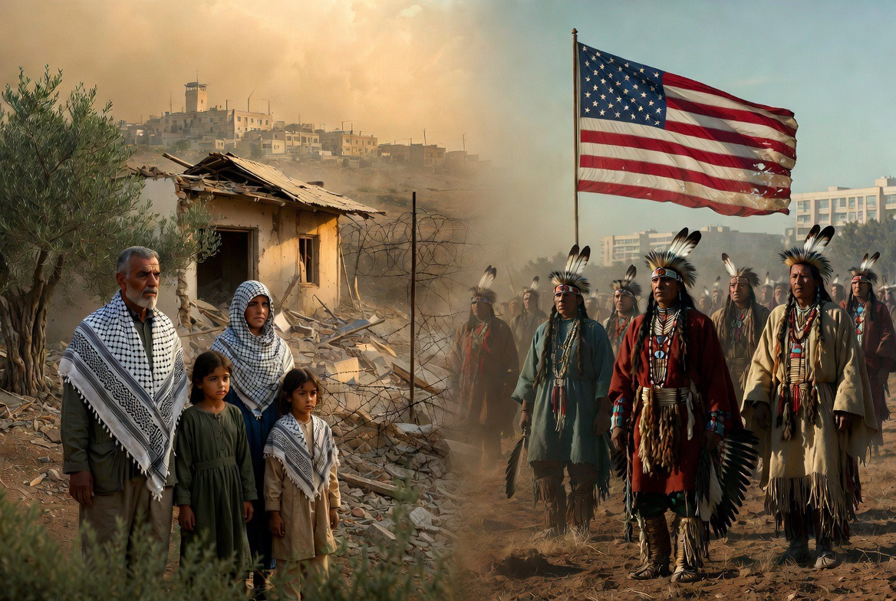

# Palestina dan Bangsa Indian: Benarkah Sejarah Mengulang Luka yang Sama?

*Ilustrasi (pic: Grok AI).*

  
***Adanya kemiripan pada beberapa aspek, terutama terkait tanah, pengungsian, dan ketimpangan kekuasaan***
  

Perbandingan ini muncul saat para akademisi membuat analogi dengan  melihat beberapa pola yang dianggap serupa.

Pola tersebut diantaranya adalah perebutan atau perubahan kontrol atas wilayah, perpindahan atau pengungsian penduduk, konflik mengenai kedaulatan, identitas nasional yang saling bertabrakan, serta narasi historis yang saling bertentangan mengenai siapa yang memiliki hak atas tanah.

Karena itulah dalam bidang kajian kolonial dan sejarah, analogi ini sering dibahas.

## Apa Kemiripannya?

Beberapa kemiripan yang sering disebut antara lain:

1. Sengketa Tanah

Dalam kedua kasus, tanah menjadi inti konflik.
Bagi bangsa-bangsa Indian, tanah leluhur adalah identitas. Sementara bagi bangsa Palestina, tanah juga merupakan bagian dari identitas nasional dan kehidupan sosial.

2. Pengungsian

Baik masyarakat adat Amerika maupun banyak warga Palestina mengalami pengalaman kehilangan tempat tinggal dalam berbagai periode sejarah. Meskipun penyebab, waktu, dan konteks sejarahnya berbeda.

3. Ketimpangan Kekuatan

Dalam kedua kasus, banyak pengamat menyoroti adanya perbedaan besar dalam kapasitas militer, ekonomi, dan institusi antara pihak-pihak yang berkonflik.

## Perbedaan Penting

Di sinilah analogi mulai terbatas. Kasus Amerika Utara melibatkan kolonisasi oleh kerajaan-kerajaan Eropa, pembentukan negara baru, dan berlangsung selama beberapa abad.

Sementara konflik Israel-Palestina melibatkan unsur-unsur lain, seperti nasionalisme Yahudi dan Arab, dampak The Holocaust, berakhirnya Mandat Britania, perang tahun 1948 dan sesudahnya, serta dinamika kawasan Timur Tengah.

Jadi, meskipun ada pola yang mirip, konteks sejarahnya tidak identik.

## Mengapa Analogi Ini Diperdebatkan?

Sebagian akademisi mengatakan bahwa analogi membantu memahami pola sejarah. Sebagian lainnya menyebut analogi bisa menyederhanakan konflik yang jauh lebih kompleks.

Kedua pandangan itu memiliki dasar, sebab tujuan sejarah bukan mencari kasus yang “persis sama”, melainkan memahami persamaan dan perbedaannya.

Ada satu ironi yang sering dibahas dalam kajian sejarah.

Banyak negara modern lahir melalui perjuangan melawan penindasan, namun setelah menjadi kuat, mereka juga dapat dituduh melakukan tindakan yang oleh pihak lain dipandang sebagai bentuk penindasan.

Ironi ini tidak hanya berlaku untuk satu negara. Ia muncul dalam berbagai tempat dan zaman.

Karena itu, dalam konflik Israel-Palestina, ada dua narasi yang sama-sama kuat, yaitu:
- Banyak warga Israel melihat negaranya sebagai tempat perlindungan setelah sejarah panjang antisemitisme dan penganiayaan terhadap orang Yahudi.
- Banyak warga Palestina melihat pengalaman mereka sebagai sejarah kehilangan tanah, pengungsian, pendudukan, dan pembatasan kehidupan sehari-hari.
Kedua narasi itu hidup berdampingan, saling bertentangan, dan sama-sama membentuk cara masing-masing masyarakat memandang konflik.

Ketika ada pertanyaan: “Apakah ada kemiripan pola antara perlakuan terhadap sebagian masyarakat adat Amerika dan pengalaman sebagian warga Palestina?”

Jawabannya adalah: Ya, sejumlah akademisi memang melihat adanya kemiripan pada beberapa aspek, terutama terkait tanah, pengungsian, dan ketimpangan kekuasaan.

Namun kalau pertanyaannya: “Apakah kedua sejarah itu sama?”

Jawabannya: Tidak. Masing-masing memiliki konteks, aktor, dan perkembangan sejarah yang berbeda, sehingga analogi tersebut berguna sebagai alat analisis, tetapi tidak dapat menggantikan pemahaman atas masing-masing kasus.

Pelajaran paling penting dari kedua sejarah itu adalah bahwa cara sebuah masyarakat mengingat masa lalunya sangat memengaruhi cara mereka memandang keadilan di masa kini. 

Memahami pengalaman satu pihak tidak berarti meniadakan pengalaman pihak lain. 

Dalam kajian sejarah dan hubungan internasional, justru tantangannya adalah mampu melihat kedua narasi sekaligus tanpa kehilangan ketelitian terhadap fakta.

  
**Referensi**

An Indigenous Peoples’ History of the United States. (2014). Beacon Press.

The Ethnic Cleansing of Palestine. (2006). Oneworld.

Righteous Victims. (2001). Vintage.

United Nations. Question of Palestine.

International Court of Justice. (2024). Advisory Opinion on the Legal Consequences arising from the Policies and Practices of Israel in the Occupied Palestinian Territory.
