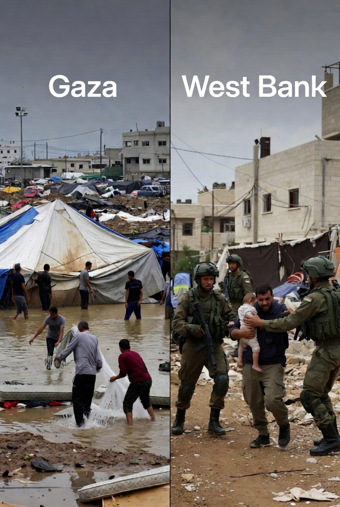

# Geopolitik Distraksi dan Normalisasi Penjajahan: Palestina dalam Orde Kekacauan Regional Timur Tengah

*Ilustrasi kondisi Palestina (pic: Grok).*

  
***Palestina hari ini tidak kalah oleh kekuatan militer semata, tetapi oleh dunia yang memilih kenyamanan geopolitik daripada konsistensi moral***
  

Situasi kontemporer Timur Tengah menunjukkan fragmentasi konflik yang simultan: instabilitas internal Iran, perang regional Saudi–Yaman, perang saudara Yaman, dan eskalasi berlapis di berbagai front. 

Dalam kondisi ini, isu Palestina mengalami apa yang dalam studi hubungan internasional disebut strategic neglect. Bukan dilupakan secara pasif, melainkan dipinggirkan secara struktural.

Palestina tidak hilang dari peta. Ia disingkirkan dari prioritas.

## Politics of Distraction

1. Overlapping Crises Theory

Menurut literatur konflik kontemporer, ketika banyak krisis terjadi secara bersamaan, aktor internasional cenderung:

• memprioritaskan konflik yang berdampak langsung pada stabilitas energi,

• menunda konflik yang dianggap “status quo manageable”.

Palestina masuk kategori kedua.

2.Normalization Through Noise

Kebisingan regional menciptakan efek psikopolitik:

• pendudukan menjadi latar belakang,

• kekerasan menjadi rutinitas,

• pelanggaran hukum internasional kehilangan urgensi.

Penjajahan tidak perlu dibela, cukup dibiarkan berlangsung.

## Analisis Regional

1.Iran: Destabilisasi Internal sebagai Pengalih Fokus

Demonstrasi di Iran:

• menyedot perhatian global,

• memecah fokus negara-negara Muslim besar,

• melemahkan posisi Iran sebagai penyeimbang regional terhadap Israel.

Akibatnya, isu Palestina kehilangan salah satu suara kerasnya.

2. Arab Saudi & Yaman: Fragmentasi Solidaritas Arab

Perang Saudi–Yaman:

• menguras sumber daya politik dan moral dunia Arab,

• merusak kredibilitas narasi kemanusiaan,

• membuat solidaritas Palestina terdengar selektif dan hipokrit.

Yaman menjadi luka terbuka yang menyandera empati regional.

3.Yaman: Perang Saudara sebagai Kuburan Atensi

Perang saudara menciptakan:

• kelelahan empatik,

• hierarki penderitaan,

• kompetisi korban.

Dalam kompetisi ini, Palestina kalah bukan karena kurang menderita, tapi karena penderitaannya dianggap “lama”.

## Israel dan Kenyamanan Status Quo

1. The Advantage of Global Distraction

Dalam kondisi dunia sibuk:

• ekspansi pemukiman di Tepi Barat meningkat,

• pengusiran warga berlangsung lebih sistematis,

• Gaza dipersempit secara geografis dan eksistensial.

Tidak perlu agresi besar. Cukup administrasi harian penjajahan.

2.Gaza: Dari Enklave ke Ujung Laut

Gaza mengalami:

• pengecilan ruang hidup,

• tekanan ke arah laut tanpa akses bebas,

• transformasi dari wilayah hidup menjadi holding zone kemanusiaan.

Ini bukan kegagalan kebijakan. Ini desain struktural.

Hukum Internasional dan Keheningan Terorganisir

Piagam PBB, Konvensi Jenewa, dan resolusi-resolusi internasional tetap ada. Yang hilang adalah kehendak politik untuk menegakkannya.

Ketika:

• hukum tidak ditegakkan secara konsisten,

• pelanggar tidak dikenai sanksi bermakna,

• korban dipaksa bertahan sendiri,

maka hukum internasional berubah dari norma menjadi ornamen moral.

## Implikasi Global

1. Penjajahan menjadi praktik yang bisa dinormalisasi selama dilakukan perlahan.

2. Penderitaan yang berkepanjangan kehilangan nilai berita, lalu kehilangan nilai politik.

3. Keadilan internasional menjadi selektif, tergantung siapa pelakunya dan siapa korbannya.

Palestina hari ini tidak kalah oleh kekuatan militer semata, tetapi oleh:

• kebisingan regional,

• konflik yang saling menutupi,

• dunia yang memilih kenyamanan geopolitik daripada konsistensi moral.

Israel tidak perlu tertawa keras. Cukup diam, bekerja, dan menunggu dunia terlalu sibuk untuk peduli.

Dan dunia… memang sedang sibuk.
  

**Referensi**

Achille, M. B. (2019). The politics of distraction in international conflicts. International Affairs, 95(4), 845–862.
https://doi.org/10.1093/ia/iiz103

Galtung, J. (1969). Violence, peace, and peace research. Journal of Peace Research, 6(3), 167–191.
https://doi.org/10.1177/002234336900600301

Nixon, R. (2011). Slow violence and the environmentalism of the poor. Harvard University Press.

Pappé, I. (2014). The idea of Israel: A history of power and knowledge. Verso.

Finkelstein, N. G. (2018). Gaza: An inquest into its martyrdom. University of California Press.

United Nations Human Rights Council. (2023). Israeli settlements in the Occupied Palestinian Territory. UN Doc. A/HRC/52/76.

Gause, F. G. (2014). Beyond sectarianism: The new Middle East Cold War. Brookings Institution Press.

Lynch, M. (2016). The new Arab wars: Uprisings and anarchy in the Middle East. PublicAffairs.

Valbjørn, M., & Bank, A. (2012). Examining the “post” in post-democratization. Mediterranean Politics, 17(2), 183–202.
https://doi.org/10.1080/13629395.2012.694043

International Crisis Group. (2023). Yemen’s fragmentation and regional implications. Middle East Report No. 247.

Axworthy, M. (2013). Revolutionary Iran: A history of the Islamic Republic. Oxford University Press.

Orford, A. (2003). Reading humanitarian intervention. Cambridge University Press.

Koskenniemi, M. (2005). From apology to utopia: The structure of international legal argument. Cambridge University Press.

United Nations General Assembly. (2022). Applicability of the Fourth Geneva Convention to the Occupied Palestinian Territory. A/RES/77/247.

Chomsky, N., & Herman, E. S. (1988). Manufacturing consent. Pantheon Books.

Moeller, S. D. (1999). Compassion fatigue. Routledge.
