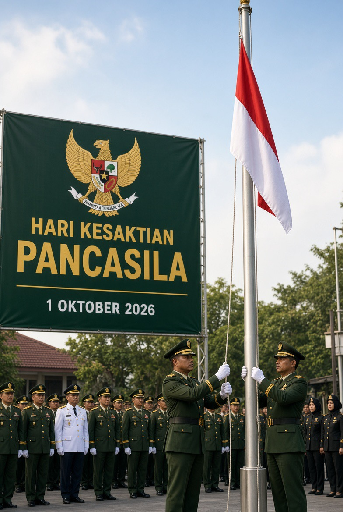

# Pancasila Sakti, tetapi Rakyat Pergi: Ideologi Bertahan sementara Harapan Berpindah Negara

*Ilustrasi (pic: Grok AI).*

  
***Pancasila yang hidup adalah Pancasila yang membuat orang bebas pergi, tetapi punya alasan kuat untuk kembali, berkontribusi, dan merasa bahwa keadilan sosial memang mungkin dibangun di rumah sendiri***
  

Pancasila Sakti sebenarnya bukan berarti rakyat Indonesia harus tinggal di Indonesia, ini fondasi pertama. Pancasila tidak pernah bermakna: “Kalau lo cinta Indonesia, lo harus mencari nafkah di Indonesia.”

Seseorang bekerja di Jepang, Australia, Singapura, Eropa, Timur Tengah, atau negara lain tidak otomatis sedang mengkhianati Pancasila. Migrasi adalah fenomena ekonomi-demografis yang normal.

Bahkan BPS baru merilis Profil Migran Hasil Susenas 2025 pada 28 September 2026 dan menjelaskan bahwa perbedaan peluang ekonomi, akses layanan, serta kualitas fasilitas merupakan faktor pendorong utama perpindahan penduduk. 

BPS juga secara khusus menerbitkan analisis mobilitas tenaga kerja 2025 yang mencakup pengalaman bekerja di luar negeri. 

Jadi, pergi mencari kehidupan lebih baik bukan berarti tidak nasionalis. Yang menjadi pertanyaan Pancasila adalah: Apakah orang pergi karena ingin mengembangkan dirinya, atau karena sistem domestik gagal memberikan kesempatan yang dianggap layak?

Keduanya bahkan bisa terjadi sekaligus.

## Alarm Pembangunan: Semakin Banyak Orang Merasa “Masa Depan Saya Lebih Bagus di Luar”

Bayangkan seorang anak muda Indonesia berkata: “Di sini gue punya ijazah, tapi peluangnya terbatas. Di sana kemampuan gue dihargai lebih tinggi, gaji lebih besar, sistem lebih jelas, karier lebih terbuka, gue bisa menabung, bisa mengirim uang ke orang tua.”

Apakah dia sedang tidak mencintai Indonesia? Belum tentu. Bahkan bisa sebaliknya. Dia mungkin sangat mencintai keluarganya sehingga dia pergi justru karena ingin meningkatkan kehidupan keluarganya. 

Tetapi negara tetap perlu bertanya: “Kenapa peluang itu tidak cukup tersedia di sini?” Ini berkaitan langsung dengan sila kelima: Keadilan Sosial bagi Seluruh Rakyat Indonesia.

Dan data BPIP memberikan sesuatu yang menarik. Indeks Aktualisasi Pancasila nasional 2024 adalah 77,31, turun dari 77,73 pada 2023. Yang paling rendah justru dimensi Keadilan Sosial, dengan skor 68,86. Sebaliknya, Persatuan mencapai 84,32. 

Ini menarik sekali. Karena secara simbolik kita bisa sangat kuat mengatakan: “Persatuan Indonesia!” tetapi persoalan yang lebih sulit adalah: “Apakah seluruh rakyat benar-benar merasakan keadilan sosial?” Dan justru indikator sila kelima yang paling rendah dalam indeks tersebut.

Itu bukan bukti bahwa Pancasila gagal. Tetapi itu menunjukkan bahwa aktualisasi Pancasila tidak sama dengan hafalan Pancasila.

## Paradoks Besar Hari Kesaktian Pancasila

Pancasila bisa tetap kokoh sebagai norma politik dan konstitusional, sementara implementasinya dalam kehidupan sosial-ekonomi belum sempurna. Ini dua hal berbeda.

Bayangkan Pancasila sebagai blueprint sebuah rumah. Blueprint-nya bagus: Ketuhanan, Kemanusiaan, Persatuan, Kerakyatan, dan Keadilan sosial.

Tetapi kalau dapurnya bocor, ruang tamunya timpang, anak-anaknya gak punya pekerjaan, dan sebagian penghuni merasa harus pindah kamar bahkan pindah rumah, maka jangan menyalahkan blueprint karena atapnya bocor.

Periksa dulu siapa yang membangun, bagaimana materialnya dipakai, dan bagaimana rumah itu dirawat.

Jadi pertanyaan Hari Kesaktian Pancasila yang lebih dewasa bukan: “Apakah Pancasila masih sakti?”Tetapi: “Seberapa jauh institusi negara dan masyarakat berhasil mengubah Pancasila dari norma menjadi pengalaman hidup?” Itu pertanyaan yang jauh lebih kejam.

## Bagaimana dengan Generasi Muda?

Nah, di sini kita harus berhati-hati.

Sering sekali generasi muda dituduh materialistis, individualistis, hedonis, tidak nasionalis, tidak punya moral, maunya duit, maunya kabur ke luar negeri. Padahal secara ilmiah, migrasi ekonomi tidak bisa dijadikan proxy moralitas.

Orang bisa sangat materialistis dan tetap tinggal di Indonesia, orang bisa sangat nasionalis dan bekerja di luar negeri, orang bisa tinggal di Indonesia tetapi korup, orang bisa tinggal di luar negeri tetapi mengirim uang, pengetahuan, investasi, dan jaringan kembali ke Indonesia.

Jadi alamat geografis bukan alat ukur moral.

## Ada yang Lebih Mengkhawatirkan: Materialisme Menggantikan Nilai

Materialisme dalam arti psikologis bukan sekadar: “Gue ingin gaji besar.” Itu normal. Yang problematis adalah ketika nilai manusia direduksi menjadi nilai ekonominya.

Misalnya: “Pekerjaan ini bergaji rendah, berarti gak bermartabat.” atau: “Orang miskin gagal sebagai manusia.” atau: “Yang penting gue kaya, cara mendapatkannya belakangan.”

Nah, di sinilah terjadi konflik dengan Pancasila, karena sila kedua mengatakan: Kemanusiaan yang Adil dan Beradab, dan sila kelima: Keadilan Sosial bagi Seluruh Rakyat Indonesia.

Maka masyarakat Pancasila seharusnya tidak mengajarkan: “Jangan mengejar uang.” tetapi: “Kejar kesejahteraan tanpa menjadikan manusia sekadar alat untuk mendapatkan kesejahteraan.” Itu beda banget.

## Data Aktualisasi Pancasila Memberi Kita Cermin Menarik

BPIP mengukur Pancasila bukan sekadar berdasarkan hafalan, tetapi melalui perilaku, pengetahuan, dan sikap. 

Untuk 2024:

| Dimensi | Skor |
|------|-------|
|Ketuhanan|83,68|
|Kemanusiaan|75,44|
|Persatuan|84,32|
|Kerakyatan|74,27|
|Keadilan sosial|68,86|
|IAP nasional|77,31|

Perhatikan sesuatu yang agak pedas, nilai persatuan tinggi tetapi nilai keadilan sosial justru paling rendah.

Artinya, tantangan Pancasila mungkin bukan terutama: “Apakah orang Indonesia masih merasa satu bangsa?” Tetapi: “Apakah persatuan itu menghasilkan distribusi kesempatan dan kesejahteraan yang dirasakan adil?”

Karena kalau seseorang terus mendengar: “Kita satu bangsa!” tetapi pengalaman hidupnya mengatakan:“Kesempatan gue lebih baik kalau gue keluar dari negeri ini,” maka ada jarak antara identitas nasional dan pengalaman sosial.

Dan jarak itulah yang harus diteliti.

## Fenomena Ekstrem: Menjadi Tentara Negara Lain

Nah, ini berbeda secara moral dan hukum dari sekadar bekerja di luar negeri. Misalnya orang Indonesia bekerja sebagai engineer di Jepang, tidak sama dengan masuk dinas militer negara asing.

UU No. 12 Tahun 2006 tentang Kewarganegaraan menyebut salah satu keadaan yang dapat menyebabkan seseorang kehilangan kewarganegaraan Indonesia adalah masuk dalam dinas tentara asing tanpa izin terlebih dahulu dari Presiden. 

Jadi kalau ada WNI masuk korps militer asing, persoalannya bukan lagi sekadar: “Cari gaji lebih besar.” Sudah ada dimensi kewarganegaraan, loyalitas politik, kewajiban hukum, hubungan negara-warga negara, dan potensi konflik kepentingan ketika negara asing berperang.

Contohnya, Prancis memang memiliki mekanisme hukum untuk menerima orang asing sebagai militaire servant à titre étranger, termasuk dalam kerangka Legiun Asing Prancis. Tetapi dari perspektif hukum Indonesia, status WNI-nya mempunyai konsekuensi yang berbeda.

Jadi jangan kita campur “diaspora ekonomi” dengan “bergabung dalam militer asing.” Yang pertama adalah mobilitas tenaga kerja, sedangkan yang kedua menyentuh loyalitas negara dan hukum kewarganegaraan.

## Apakah ini Berarti Moral Generasi Muda Indonesia sedang Runtuh?

Data yang kita punya belum memungkinkan kesimpulan sesederhana itu. Dperlu dipikirkan ulang narasi: “Generasi sekarang rusak.”

Kenapa?

Karena setiap generasi punya bentuk tekanan sendiri. Generasi sekarang menghadapi pasar kerja global, media sosial, biaya hidup, kompetisi pendidikan, ketimpangan kesempatan, mobilitas internasional yang jauh lebih mudah, dan informasi tentang standar hidup negara lain yang masuk ke kamar mereka setiap hari.

Anak muda sekarang bisa melihat secara real-time bagaimana orang seusianya hidup di Singapura, Australia, Jepang, Korea, Eropa, Amerika.

Dulu seseorang mungkin membandingkan hidupnya dengan tetangga. Sekarang dia membandingkan hidupnya dengan seluruh planet. Itu perubahan psikologis yang luar biasa.

## Anak Muda Terlalu Cinta Uang?

Anak muda sekarang lebih sadar terhadap opportunity cost. Kalau seorang programmer bisa memperoleh X di Indonesia, tetapi memperoleh 3X di negara lain, dan pekerjaan tersebut secara hukum memungkinkan, pertanyaan rasionalnya: “Kenapa gue harus menolak?” Dan negara tidak bisa menjawab hanya dengan:“Karena nasionalisme.”

Nasionalisme yang sehat harus mampu menjawab: “Kami ingin membuat lo punya alasan yang masuk akal untuk membangun masa depan di sini.” Itulah nasionalisme yang berbasis institusi, bukan sekadar emosi.

## Di sinilah Pancasila Diuji Sebenarnya

Sila 1:
Apakah moralitas menjadi nyata, bukan hanya simbol religius?
Sila 2:
Apakah manusia diperlakukan bermartabat?
Sila 3:
Apakah keberagaman bisa hidup tanpa saling mencabik?
Sila 4:
Apakah rakyat benar-benar memiliki suara dan kebijakan dibuat melalui proses yang bertanggung jawab?
Sila 5:
Apakah pertumbuhan ekonomi menghasilkan kesempatan yang cukup adil?

Dan sila kelima mungkin merupakan ujian paling material, karena orang bisa berpidato tentang Pancasila sambil memegang bendera. Tetapi anak muda menilai negara melalui pertanyaan sederhana: “Kalau gue belajar keras, apakah gue punya masa depan?”

Kalau jawabannya terasa: “Ada, tetapi peluang terbaik gue justru di negara lain,” maka negara harus mendengar itu sebagai data, bukan langsung sebagai pengkhianatan.

## Apakah “Pancasila Sakti, Indonesianya yang Gelap”?

Pancasila tidak otomatis menjadi “sakti” hanya karena dipertahankan sebagai simbol, kesaktiannya harus terlihat dalam kapasitas masyarakat dan negara mengaktualisasikan nilai-nilainya. 

Dan datanya justru memperlihatkan gambaran campuran. IAP 2024 masih 77,31, jadi tidak tepat menggambarkan Indonesia sebagai masyarakat yang seluruh nilai Pancasilanya runtuh. Tetapi dimensi keadilan sosial hanya 68,86, terendah di antara lima sila, sementara IAP 2024 juga sedikit turun dibandingkan 2023. 

Jadi gambarnya bukan Pancasila sukses total, bukan juga Pancasila gagal total. Melainkan nilai-nilainya masih hidup, tetapi implementasinya tidak merata. Dan justru kesenjangan antara nilai dan pengalaman hidup itulah persoalan ilmiahnya.

## Moral Generasi Muda

Generasi muda Indonesia bukan sedang kehilangan moral secara sederhana. Mereka sedang hidup dalam lingkungan yang membuat moral, ekonomi, identitas, dan mobilitas global saling bertabrakan.

Anak muda bisa berkata: “Gue cinta Indonesia.” dan sekaligus: “Gue mau kerja di Australia.” Itu bukan kontradiksi otomatis.

Dia bahkan bisa kerja di Australia, kirim uang ke Indonesia, membantu orang tua, investasi di Indonesia, lalu pulang membawa keahlian. Itu bisa menjadi transnational citizenship atau keterikatan lintas negara, bukan sekadar “kabur”.

Sebaliknya, orang yang tinggal di Indonesia bisa korup, menyuap, merugikan masyarakat, menginjak hak orang lain. Lalu berteriak paling keras: “Saya nasionalis!” Alamat rumah bukan sertifikat moral.

Hari Kesaktian Pancasila seharusnya tidak membuat negara cuma bertanya: “Apakah rakyat masih hafal lima sila?” Pertanyaan yang lebih mengerikan adalah: “Apakah kehidupan sehari-hari rakyat membuat mereka percaya bahwa kelima sila itu sungguh bekerja?”

Karena kalau Pancasila berbicara tentang keadilan sosial, sementara anak muda merasa kesempatan hidup yang lebih adil ada di luar negeri, maka masalahnya bukan semata-mata anak muda kurang nasionalis. Mungkin negara sedang gagal membuat nasionalisme terasa ekonomis, sosial, dan institusional.

Dan kalau Pancasila berbicara tentang kemanusiaan, sementara manusia dinilai hanya berdasarkan produktivitas dan gaji, maka moralitas kita memang perlu diperiksa. Tetapi pemeriksaannya jangan dimulai dengan menghakimi generasi muda.

Mulailah dengan pertanyaan: Apa yang kita bangun sehingga anak muda ingin tinggal? Apa yang kita perbaiki sehingga mereka percaya bekerja keras di sini punya masa depan? Apa yang kita lakukan sehingga “Indonesia” bukan cuma tempat lahir, tetapi juga tempat yang rasional untuk membangun kehidupan? Karena Pancasila yang benar-benar sakti bukan Pancasila yang berhasil membuat rakyat takut pergi.

Pancasila yang hidup adalah Pancasila yang membuat orang bebas pergi, tetapi punya alasan kuat untuk kembali, berkontribusi, dan merasa bahwa keadilan sosial memang mungkin dibangun di rumah sendiri. 

Dan ironisnya, data BPIP sendiri memberi kita petunjuk paling jelas, sila yang paling perlu diperhatikan bukan Persatuan, yang sudah mencapai 84,32, melainkan Keadilan Sosial yang baru 68,86. 

Jadi kalau hari ini kita mau benar-benar memperingati Hari Kesaktian Pancasila, mungkin jangan cuma bertanya: “Pancasila masih sakti gak?” Tanya juga: “Kalau memang sakti, kenapa keadilan sosial masih menjadi sila dengan skor terendah?”

Nah, itu pertanyaan 1 Oktober yang jauh lebih susah dijawab daripada pidato upacara. 

  
**Referensi**

Badan Pembinaan Ideologi Pancasila. (2026). Indeks Aktualisasi Nilai Pancasila 2024. BPIP. BPIP⁠

Badan Pusat Statistik. (2026). Profil Migran Hasil Survei Sosial Ekonomi Nasional 2025. BPS. BPS⁠

Badan Pusat Statistik. (2026). Analisis mobilitas tenaga kerja dan pengalaman bekerja di luar negeri. BPS.

Republik Indonesia. (2006). Undang-Undang Republik Indonesia Nomor 12 Tahun 2006 tentang Kewarganegaraan Republik Indonesia. JDIH BPK⁠

Badan Pembinaan Ideologi Pancasila. (2024). Pancasila dalam perspektif pembangunan nasional dan aktualisasi nilai-nilainya. BPIP.
