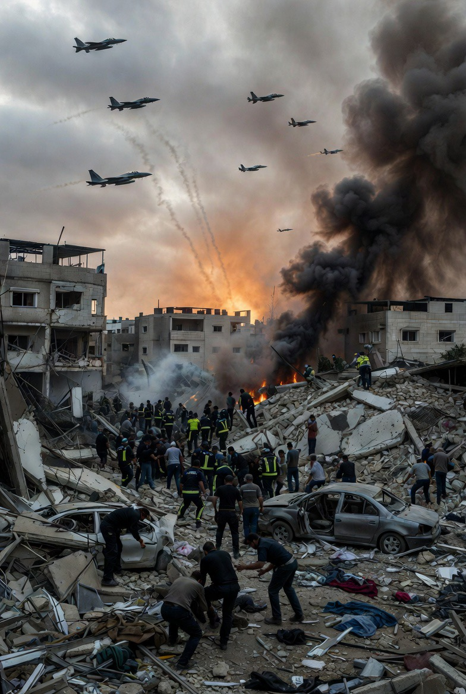

# Pelanggaran Gencatan Senjata dan Ambiguitas Front Perang: Analisis Eskalasi Israel di Lebanon Pasca-Ceasefire
*Ilustrasi kondisi setelah eskalasi (pic: Grok AI).*

  
***Peristiwa 9 April menunjukkan: gencatan senjata bukan akhir konflik… tapi perubahan bentuk konflik***
  

Artikel ini menganalisis eskalasi militer Israel di Lebanon pasca-gencatan senjata 8 April 2026, serta konflik interpretasi atas cakupan kesepakatan tersebut. 

Dengan pendekatan conflict ambiguity dan multi-front warfare, tulisan ini menunjukkan bahwa ketidakjelasan definisi ceasefire membuka ruang bagi pelanggaran de facto tanpa pelanggaran de jure, serta memperkuat ketegangan antara aktor negara dan non-negara.

## Pendahuluan

Sehari setelah gencatan senjata diumumkan, muncul paradoks:

•	gencatan senjata masih berlaku

•	tapi serangan besar tetap terjadi

Israel melancarkan serangan udara di Lebanon, termasuk Beirut, dengan korban besar.

Namun Israel menyatakan: ceasefire tidak mencakup Lebanon / Hezbollah. Sementara Iran dan mediator Pakistan menyatakan sebaliknya.

Di sinilah konflik bergeser dari militer ke: perang definisi.

## Strategic Ambiguity

Dalam hubungan internasional: kesepakatan sengaja dibuat kabur agar semua pihak bisa mengklaim kemenangan.

## Multi-Front Conflict

Konflik modern tidak lagi satu garis.

Dalam kasus ini:

•	Iran (state actor)

•	Israel (state actor)

•	Hezbollah (non-state actor, tapi quasi-state)

👉 menciptakan medan perang berlapis

## Plausible Legitimacy

Konsep di mana: suatu tindakan bisa dipertahankan secara hukum… meski dipersoalkan secara moral

## Analisis

A. Apakah ini pelanggaran ceasefire?

👉 tergantung definisi cakupan

•	Jika Lebanon termasuk → pelanggaran

•	Jika tidak → bukan pelanggaran secara formal

B. Masalah utama: kesepakatan tidak jelas sejak awal

Kita lihat pola:

•	tidak ada dokumen publik detail

•	masing-masing pihak punya interpretasi berbeda

👉 Ini bukan bug.

👉 Ini sering fitur dalam diplomasi darurat.

C. Israel: Strategi Segmentasi Front

Israel memposisikan konflik sebagai:
	
  •	Iran → satu front
	
  •	Hezbollah → front berbeda

Artinya:

bisa “setuju damai di satu sisi” sambil tetap berperang di sisi lain

D. Iran & Pakistan: Narasi Integrasi

Sebaliknya:

•	Iran melihat Hezbollah sebagai bagian dari porosnya

•	mediator melihat konflik sebagai satu paket

👉 jadi mereka menilai:

serangan ke Lebanon = pelanggaran

E. Amerika Serikat: Tekanan Berlapis

Pernyataan Donald Trump:
	
  •	pasukan tetap siaga
	
  •	ancaman serangan lanjutan

Ini menunjukkan:

ceasefire belum dianggap final oleh AS

## Titik Paling Sensitif

“Yang diserang Israel, kok Iran yang ditekan?”

Secara emosional → masuk akal

Secara geopolitik → ini logikanya:

1️⃣ Iran dianggap pusat jaringan

Dalam strategi AS-Israel:

•	Hezbollah = proxy Iran

•	jadi tekanan diarahkan ke “kepala”, bukan “tangan”

2️⃣ Coercive Signaling

Ancaman ke Iran bertujuan: menghentikan semua aktivitas jaringan, bukan hanya satu front

3️⃣ Realitas politik

Dalam aliansi: sekutu utama (Israel) sering mendapat ruang legitimasi lebih besar dibanding lawannya.

## Diskusi

Fenomena ini menunjukkan:

1. Ceasefire tanpa definisi = konflik lanjutan

Kesepakatan kabur menciptakan ruang eskalasi.

2. Perang narasi lebih cepat dari perang senjata

Setiap pihak:

•	mengklaim benar

•	mendefinisikan ulang realitas

3. Asimetri legitimasi

Tindakan satu pihak:

•	dianggap defensif

Tindakan pihak lain:

•	dianggap provokatif

Peristiwa 9 April menunjukkan: gencatan senjata bukan akhir konflik… tapi perubahan bentuk konflik.

Dari:

•	perang terbuka

menjadi:

•	perang definisi

•	perang legitimasi

•	perang tekanan politik.

Apakah berat sebelah?

Ini bukan sekadar emosi.

Dalam ilmu, itu disebut: perceived asymmetry of justice. Dan itu memang sering muncul dalam konflik dengan:

•	aliansi kuat

•	aktor non-negara

•	dan kepentingan global.

  
**Referensi**

Reuters. (2026, April 9). Israel launches strikes in Lebanon after ceasefire dispute with Iran.

Al Jazeera. (2026, April 9). Deadly Israeli air raids hit Beirut amid ceasefire ambiguity.

Associated Press. (2026, April 9). Hundreds killed in Israeli strikes as ceasefire terms disputed.

The Guardian. (2026, April 9). Israel says Lebanon not part of Iran ceasefire deal.

CNN International. (2026, April 9). US warns Iran despite Israeli escalation in Lebanon.

Schelling, T. C. (1966). Arms and influence. Yale University Press

Walt, S. M. (1987). The origins of alliances. Cornell University Press.

Posen, B. R. (1984). The sources of military doctrine. Cornell University Press.

Freedman, L. (2013). Strategy: A history. Oxford University Press.

United Nations. (2024). Reports on Middle East conflict and ceasefire mechanisms.

International Crisis Group. (2025). Iran-Israel tensions and regional escalation dynamics.
