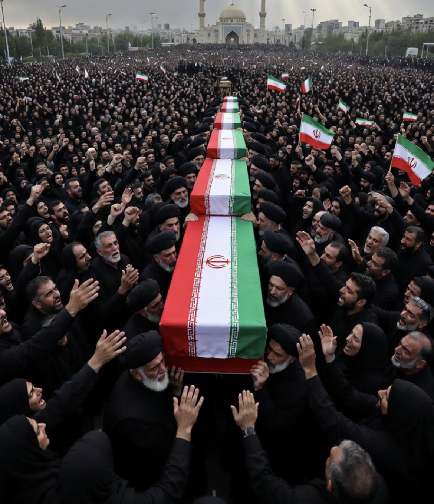

# Pemakaman Ali Khamenei Bukan Akhir: Mengapa Timur Tengah Masih Terjebak dalam Siklus Konflik?

*Ilustrasi (pic: Grok AI).*

  
***“Tidak semua perang dimulai karena kebencian. Sebagian bertahan lama karena terlalu banyak kepentingan yang ikut hidup di dalamnya.”***
  

Setelah prosesi pemakaman selama hampir sepekan bagi Ali Khamenei, perhatian dunia beralih kepada satu pertanyaan yang lebih besar: ke mana arah Republik Islam Iran selanjutnya? 

Upacara tersebut bukan sekadar penghormatan kepada seorang pemimpin, tetapi juga demonstrasi kontinuitas negara, legitimasi politik, dan pesan kepada lawan maupun sekutu. 

Pada saat yang sama, konflik Iran-Israel, isu Palestina, dan persaingan kekuatan besar tetap membentuk lanskap Timur Tengah yang sangat kompleks.  

## Mengapa Baru Dimakamkan Sekarang?

Dalam tradisi Islam, jenazah biasanya dimakamkan secepat mungkin. Lalu mengapa dalam kasus ini berlangsung berbulan-bulan sejak wafat pada akhir Februari hingga prosesi pemakaman negara pada awal Juli?

Jawabannya terletak pada perbedaan antara pemakaman pribadi dan pemakaman kenegaraan.

Menurut laporan terbaru, Iran memang menyelenggarakan prosesi kenegaraan selama beberapa hari yang melintasi beberapa kota suci, termasuk Tehran, Qom, Najaf, Karbala, dan berakhir di Mashhad. Prosesi ini dirancang sebagai simbol religius sekaligus politik.  

Adapun mengenai klaim bahwa jenazah disimpan di lemari pendingin, tidak dibalsem, dan “tetap wangi”, belum ditemukan konfirmasi dari sumber kredibel. 

Dalam tradisi Islam Syiah, pembalseman memang bukan praktik umum, tetapi rincian teknis penyimpanan jenazah dalam kasus ini tidak dipublikasikan secara resmi.

## Apa Arti Pemakaman Ini bagi Politik Iran?

Banyak analis melihat prosesi tersebut sebagai pesan bahwa: negara ingin menunjukkan kesinambungan, bukan kekosongan kekuasaan.

Dalam politik, pemakaman tokoh besar sering menjadi simbol persatuan, sarana memperkuat legitimasi, sekaligus pesan kepada dunia luar bahwa institusi negara tetap berjalan.

Namun itu tidak berarti semua persoalan internal selesai. Iran tetap menghadapi tantangan ekonomi, sanksi, serta perbedaan pandangan di dalam masyarakatnya sendiri.  

## Iran Benar-Benar “Dikeroyok”?

Dari perspektif strategis, Iran memang menghadapi tekanan dari berbagai arah, diantaranya sanksi ekonomi, persaingan dengan Israel, kehadiran militer AS di kawasan, serta rivalitas dengan beberapa negara Arab.

Sebaliknya, banyak negara di kawasan memandang jaringan kelompok yang didukung Iran sebagai ancaman terhadap keamanan mereka.

Artinya, cara melihat peta konflik sangat bergantung pada sudut pandang.

## Benarkah Akar Konfliknya Hanya Palestina?

Palestina memang merupakan salah satu sumber utama legitimasi politik Iran sejak Revolusi 1979.

Iran secara konsisten menyatakan dukungannya kepada perjuangan Palestina dan menggunakan isu tersebut sebagai bagian penting dari kebijakan luar negerinya.

Namun kalau ditinjau secara ilmiah, hubungan Iran-Israel tidak hanya dipengaruhi oleh Palestina.

Ada faktor lain, antara lain rivalitas ideologi, keseimbangan kekuatan regional, program nuklir Iran, keamanan Israel, pengaruh di Lebanon, Suriah, Irak, dan Yaman, serta keterlibatan kekuatan besar.

Jadi konflik ini memiliki banyak lapisan, bukan satu penyebab tunggal.

## Konflik Palestina Selesai Maka Semua Akan Berakhir?

Penyelesaian konflik Israel-Palestina akan mengurangi salah satu sumber utama ketegangan regional. Namun mengatakan bahwa semua konflik otomatis selesai juga terlalu sederhana.

Mengapa?

Karena setelah puluhan tahun, hubungan antarnegara di Timur Tengah juga dibentuk oleh rivalitas keamanan, pengaruh regional, identitas politik, dan kepentingan strategis.

Dengan kata lain, penyelesaian isu Palestina kemungkinan akan mengurangi ketegangan secara signifikan, tetapi belum tentu menghapus seluruh persaingan yang sudah berkembang selama beberapa dekade.

Ada satu ironi besar. Semua pihak mengaku ingin keamanan, tetapi setiap pihak mendefinisikan keamanan secara berbeda.

Bagi Israel, keamanan berarti ancaman terhadap negaranya berhenti. Sementara bagi Iran, keamanan berarti tidak ada dominasi musuh di kawasan dan dukungan terhadap sekutunya tetap terjaga. Sedangkan bagi Palestina, keamanan berarti hidup tanpa perang dan dengan hak-hak yang diakui.

Selama definisi-definisi itu belum menemukan titik temu, konflik akan terus berulang.

Timur Tengah hari ini bukan hanya dipenuhi musuh yang saling berhadapan, tetapi juga sejarah yang belum selesai diperdebatkan. 

Tantangan terbesar bukan sekadar menghentikan tembakan hari ini, melainkan membangun kondisi di mana generasi berikutnya tidak lagi mewarisi alasan yang sama untuk kembali berperang.

Mungkin pelajaran terbesarnya adalah memahami akar konflik tidak sama dengan membenarkan tindakan kekerasan.

Sebaliknya, memahami akar konflik adalah syarat agar solusi yang dicari tidak hanya memadamkan api di permukaan, tetapi juga mengurangi bara yang terus menyala di bawahnya.

  
**Referensi**

Reuters. (5 Juli 2026). Mass grief in Iran at Khamenei funeral after US, Israel war killing.  

The Guardian. (4 Juli 2026). Crowds gather as six-day funeral for former Iranian supreme leader begins.  

International Crisis Group. (2025). Iran, Israel and Regional Security.

Council on Foreign Relations. (2025). Global Conflict Tracker.
