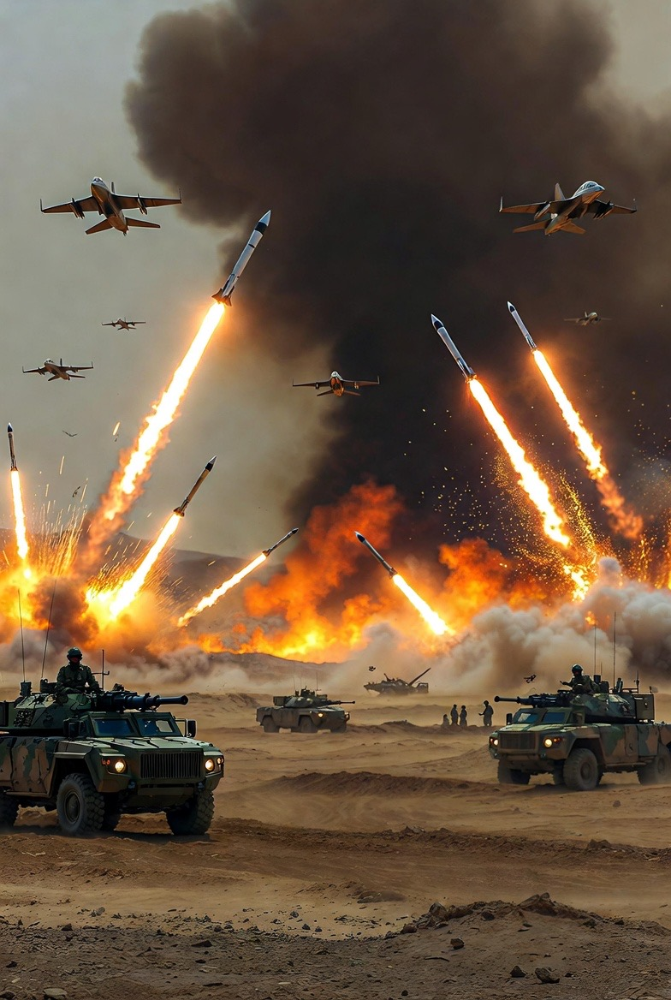

# Pembunuhan Target, Sinyal Intelijen Terbuka, dan Hukum Internasional Selektif: Analisis Konflik Iran–Israel–AS dalam Sistem Keamanan Global Kontemporer

*Ilustrasi konflik (pic: Grok AI).*

  
***Sistem global saat ini berada pada persimpangan antara norma hukum dan realitas kekuasaan***
  

Eskalasi konflik antara Iran, Israel, dan Amerika Serikat pada awal 2026 memperlihatkan transformasi pola konflik modern yang menggabungkan operasi militer terbatas, pembunuhan target (targeted killing), serta komunikasi intelijen yang semakin terbuka di ruang publik digital. 

Artikel ini menganalisis tiga fenomena utama:

(1) praktik pembunuhan target terhadap aktor negara,

(2) penggunaan sinyal intelijen terbuka seperti kampanye perekrutan informasi oleh badan intelijen Barat, dan 

(3) penerapan hukum internasional yang bersifat selektif dalam konflik geopolitik. 

Melalui pendekatan analisis hubungan internasional dan keamanan global, studi ini berargumen bahwa konflik Iran–Israel–AS tidak hanya merupakan konflik regional, tetapi juga refleksi struktur kekuasaan global pasca-Perang Dunia II di mana hukum internasional sering kali bergantung pada distribusi kekuatan politik dan militer.

## Pendahuluan

Konflik Timur Tengah selama beberapa dekade menjadi laboratorium geopolitik bagi transformasi praktik keamanan internasional. 

Eskalasi terbaru yang melibatkan Iran, Israel, dan Amerika Serikat menunjukkan tiga karakteristik utama konflik modern:

1.	penggunaan operasi militer presisi terhadap individu atau fasilitas tertentu,

2.	operasi intelijen yang tidak lagi sepenuhnya tersembunyi,

3.	serta interpretasi hukum internasional yang sangat dipengaruhi oleh distribusi kekuatan global.

Peristiwa seperti serangan udara, operasi drone, serta dugaan infiltrasi intelijen di Iran menunjukkan bahwa konflik modern semakin bergerak dari perang konvensional menuju perang bayangan multidimensi.

Dalam konteks ini, pertanyaan akademik yang muncul adalah:

•	bagaimana praktik targeted killing menjadi alat kebijakan keamanan negara,

•	mengapa badan intelijen kini menggunakan komunikasi publik sebagai strategi operasi,

•	dan sejauh mana hukum internasional diterapkan secara selektif dalam konflik global.

Targeted Killing dalam Studi Keamanan

Targeted killing merujuk pada penggunaan kekuatan mematikan terhadap individu tertentu yang dianggap ancaman keamanan nasional. 

Praktik ini menjadi semakin umum setelah perkembangan teknologi drone dan intelijen presisi.

Pendukungnya berargumen bahwa metode ini:

•	mengurangi korban sipil

•	menghindari perang skala penuh

•	menargetkan aktor strategis secara langsung.

Namun kritik menyatakan bahwa praktik tersebut dapat:

•	melemahkan norma kedaulatan negara,

•	mengaburkan batas antara perang dan pembunuhan politik,

•	serta menciptakan preseden berbahaya dalam hukum internasional.

## Public Intelligence Signaling

Tradisi intelijen klasik menekankan kerahasiaan absolut. Namun dalam dekade terakhir muncul fenomena baru: intelijen terbuka sebagai sinyal strategis.

Contohnya termasuk:

•	kampanye perekrutan informan melalui media sosial,

•	publikasi bukti satelit oleh badan intelijen,

•	serta komunikasi langsung kepada populasi negara lawan.

Strategi ini bertujuan:

1.	melemahkan kepercayaan internal rezim lawan,

2.	mendorong defeksi elit,

3.	dan membentuk persepsi publik global.

## Selektivitas Hukum Internasional

Hukum internasional secara formal berlaku universal, tetapi implementasinya sering dipengaruhi oleh struktur kekuasaan global.

Dalam praktiknya:

•	negara kuat memiliki kapasitas militer dan diplomatik untuk menghindari konsekuensi hukum,

•	sementara negara lemah lebih rentan terhadap tekanan sanksi atau intervensi.

Fenomena ini sering disebut dalam literatur sebagai power-conditioned legality.

## Metodologi

Artikel ini menggunakan pendekatan analisis kualitatif geopolitik dengan metode:

1.	analisis dokumen kebijakan keamanan,

2.	studi literatur hubungan internasional,

3.	serta analisis laporan media global terkait konflik Iran–Israel–AS.

Pendekatan ini memungkinkan pemahaman hubungan antara praktik militer, strategi intelijen, dan struktur hukum internasional.

## Analisis

1. Targeted Killing sebagai Instrumen Strategi Negara

Serangan terhadap tokoh militer atau politik Iran menunjukkan bagaimana targeted killing telah menjadi alat kebijakan keamanan Israel dan Amerika Serikat.

Strategi ini memiliki beberapa tujuan:

•	melemahkan struktur komando lawan

•	menciptakan efek psikologis pada elit politik

•	mencegah eskalasi perang terbuka.

Namun pendekatan ini juga meningkatkan risiko eskalasi regional karena negara yang diserang dapat merespons melalui proksi atau serangan asimetris.

2. Intelijen sebagai Komunikasi Publik

Fenomena menarik dalam konflik terbaru adalah munculnya operasi intelijen yang secara terbuka ditujukan kepada masyarakat Iran, termasuk melalui media sosial berbahasa Persia.

Pendekatan ini mencerminkan perubahan paradigma intelijen:

•	dari operasi rahasia menjadi operasi pengaruh publik,

•	dari pengumpulan informasi pasif menjadi perang psikologis digital.

Dalam konteks ini, intelijen tidak lagi hanya bertujuan memperoleh informasi tetapi juga menciptakan instabilitas politik dalam negeri lawan.

3. Konflik Regional dan Arteri Ekonomi Global

Konflik Iran memiliki dimensi ekonomi global yang signifikan karena posisinya dalam sistem energi dunia.

Iran terletak di sekitar Selat Hormuz, jalur laut yang mengalirkan sekitar seperlima perdagangan minyak global.

Konsekuensinya:

•	setiap eskalasi militer langsung memengaruhi pasar energi dunia,

•	negara besar menjadi sangat sensitif terhadap stabilitas kawasan,

•	konflik lokal berubah menjadi isu keamanan global.

4. Selektivitas Penerapan Hukum Internasional

Kasus konflik Iran–Israel juga memperlihatkan bagaimana hukum internasional sering diterapkan secara tidak konsisten.

Beberapa faktor yang memengaruhi selektivitas tersebut meliputi:

•	kekuatan militer negara,

•	dukungan aliansi geopolitik,

•	serta posisi strategis dalam ekonomi global.

Akibatnya, legitimasi hukum internasional sering diperdebatkan, terutama oleh negara-negara berkembang yang melihat adanya standar ganda dalam sistem global.

## Implikasi Geopolitik

Beberapa implikasi jangka panjang dari dinamika ini antara lain:

1.	Normalisasi operasi militer presisi

Targeted killing kemungkinan menjadi praktik umum dalam konflik antarnegara.

2.	Militerisasi ruang informasi

Intelijen publik dan propaganda digital semakin menjadi bagian integral strategi keamanan.

3.	Erosi legitimasi hukum internasional

Jika selektivitas terus terjadi, kepercayaan terhadap institusi global dapat menurun.

4.	Risiko konflik energi global

Ketegangan di sekitar Iran dapat mengganggu stabilitas pasar energi dunia.

Konflik Iran–Israel–AS mencerminkan transformasi fundamental dalam praktik keamanan internasional. 

Pembunuhan target, sinyal intelijen terbuka, dan penerapan hukum internasional yang selektif menunjukkan bahwa sistem global saat ini berada pada persimpangan antara norma hukum dan realitas kekuasaan.

Dalam kondisi tersebut, stabilitas global tidak hanya ditentukan oleh aturan internasional, tetapi juga oleh keseimbangan kekuatan politik, militer, dan ekonomi yang membentuk sistem internasional kontemporer.

  
**Referensi**

Byman, D. (2015). A high price: The triumphs and failures of Israeli counterterrorism. Oxford University Press.

Cronin, A. K. (2013). Why drones fail: When tactics drive strategy. Foreign Affairs, 92(4), 44–54.

Gordon, M. R., & Schmitt, E. (2020). Drone warfare and the future of armed conflict. Council on Foreign Relations.

International Crisis Group. (2024). The Iran–Israel shadow war. Brussels: ICG.

Mearsheimer, J. J. (2001). The tragedy of great power politics. W. W. Norton.

United Nations. (1945). Charter of the United Nations. New York: United Nations.

Waltz, K. N. (1979). Theory of international politics. McGraw-Hill.
