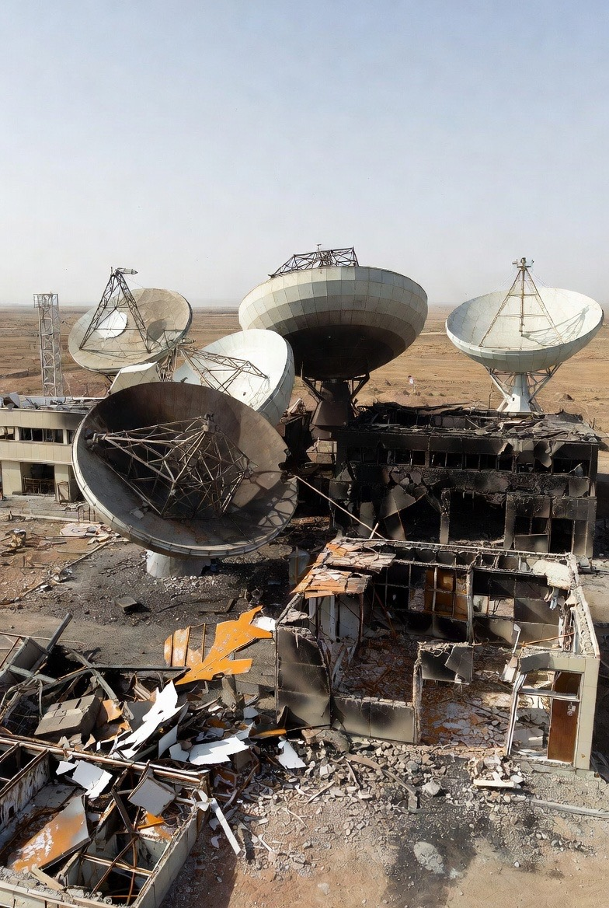

# Pembunuhan Terarah, Sinyal Intelijen Terbuka, dan Penerapan Selektif Hukum Internasional: Rekonfigurasi Kedaulatan dalam Hegemoni Hibrida Abad ke-21

*Ilustrasi sintal intelijen (pic: Meta AI).*

  
***Pertanyaannya bukan lagi apakah sistem internasional adil, melainkan: siapa yang memiliki kapasitas untuk mendefinisikan apa yang disebut adil***
  

Artikel ini menganalisis integrasi tiga fenomena kontemporer dalam politik internasional: praktik pembunuhan terarah terhadap elite negara, penggunaan sinyal intelijen yang dipublikasikan secara strategis, dan penerapan hukum internasional secara selektif oleh aktor dominan. 

Dengan pendekatan realisme struktural, teori deterrence, serta kajian hukum internasional kritis, studi ini berargumen bahwa ketiganya membentuk pola baru yang disebut sebagai hegemoni hibrida. 

Dalam pola ini, kekuatan militer, kontrol narasi, dan legitimasi normatif bekerja simultan untuk merekonfigurasi konsep kedaulatan negara. 

Studi ini menunjukkan bahwa tatanan internasional kontemporer tidak runtuh, melainkan bertransformasi menjadi sistem hierarkis dengan fleksibilitas hukum yang bergantung pada distribusi kekuatan.

## Pendahuluan

Dalam beberapa dekade terakhir, praktik targeted killing telah berevolusi dari operasi rahasia menjadi instrumen strategis yang terbuka. 

Ketika tindakan ini dilakukan terhadap figur tinggi negara dan dibingkai sebagai langkah preventif, pertanyaan mendasarnya bukan hanya soal keamanan, melainkan soal legitimasi.

Secara paralel, badan intelijen modern tidak lagi sepenuhnya bekerja dalam bayangan. Mereka memanfaatkan ruang publik, media sosial, bahkan pesan terbuka lintas bahasa sebagai bagian dari strategi tekanan psikologis dan delegitimasi rezim lawan.

Pada saat yang sama, pembenaran atas tindakan tersebut sering kali mengacu pada interpretasi fleksibel atas hukum internasional. 

Di sinilah muncul ketegangan normatif: apakah hukum internasional universal, ataukah ia elastis mengikuti konfigurasi kekuatan?

## Realisme Struktural dan Distribusi Kekuatan

Menurut realisme struktural, sistem internasional bersifat anarkis dan negara bertindak untuk memaksimalkan keamanan. 

Dalam konteks ini, pembunuhan terarah dapat dipahami sebagai strategi preventif untuk mencegah perubahan distribusi kekuatan.

Namun, tindakan tersebut juga berfungsi sebagai sinyal hegemonik: pesan kepada aktor lain bahwa penetrasi intelijen dan kapabilitas militer berada pada tingkat dominan.

## Teori Deterrence dan Decapitation Strategy

Strategi decapitation bertujuan melumpuhkan kemampuan koordinasi dan legitimasi simbolik lawan. Akan tetapi, efektivitasnya tidak selalu linier. 

Dalam beberapa kasus, tindakan ini justru memperkuat konsolidasi internal rezim yang diserang.

Pertanyaannya bukan hanya apakah strategi ini berhasil secara militer, tetapi bagaimana dampaknya terhadap stabilitas sistem internasional.

## Intelijen sebagai Instrumen Naratif

Tradisionalnya, intelijen bekerja dalam kerahasiaan. Kini, publikasi informasi atau demonstrasi kemampuan intelijen menjadi bagian dari perang psikologis.

Fenomena ini menunjukkan pergeseran dari sekadar information gathering menjadi information shaping. 

Narasi tidak lagi sekadar produk sampingan perang, melainkan medan perang itu sendiri.

Penerapan Selektif Hukum Internasional

Hukum internasional mengatur larangan penggunaan kekuatan kecuali dalam konteks pertahanan diri. Namun interpretasi atas “ancaman langsung” sering kali diperluas.

Dalam praktiknya, negara kuat memiliki kapasitas lebih besar untuk membingkai tindakannya sebagai defensif, sementara negara lemah menghadapi sanksi lebih cepat ketika melakukan tindakan serupa.

Di sinilah muncul dugaan bahwa rules-based order bersifat bertingkat, bukan egaliter.

## Sintesis: Hegemoni Hibrida

Integrasi tiga elemen tersebut menunjukkan pola berikut:

1.	Pembunuhan terarah sebagai proyeksi kekuatan keras

2.	Sinyal intelijen terbuka sebagai dominasi naratif

3.	Legitimasi hukum selektif sebagai pelindung normatif

Kombinasi ini menghasilkan model kekuasaan yang tidak hanya bergantung pada militer, tetapi juga pada kontrol persepsi dan fleksibilitas legal.

Konsep kedaulatan dalam model ini tidak sepenuhnya dihapus, tetapi menjadi bersyarat terhadap posisi dalam hierarki sistem internasional.

## Implikasi

1.	Potensi normalisasi tindakan ekstrateritorial terhadap elite negara

2.	Erosi kepercayaan terhadap institusi hukum internasional

3.	Meningkatnya risiko eskalasi berbasis persepsi, bukan semata kapabilitas

Jika tren ini berlanjut, sistem internasional bergerak dari anarki yang relatif terstruktur menuju anarki yang semakin hierarkis.

Artikel ini tidak menyimpulkan bahwa hukum internasional telah runtuh. Sebaliknya, hukum tersebut tetap ada, namun aplikasinya menunjukkan pola diferensiasi kekuasaan.

Dalam konfigurasi baru ini, pembunuhan terarah, sinyal intelijen terbuka, dan legitimasi normatif bekerja sebagai satu arsitektur dominasi terpadu.

Pertanyaannya bukan lagi apakah sistem internasional adil, melainkan:
siapa yang memiliki kapasitas untuk mendefinisikan apa yang disebut adil.

  
**Referensi:**

1.	Kenneth Waltz. (1979). Theory of International Politics. Addison-Wesley.

2.	John J. Mearsheimer. (2001). The Tragedy of Great Power Politics. W. W. Norton.

3.	James D. Fearon. (1995). Rationalist explanations for war. International Organization, 49(3), 379–414.

4.	Robert Powell. (2006). War as a commitment problem. International Organization, 60(1), 169–203.

5.	Jack S. Levy. (1987). Declining power and the preventive motivation for war. World Politics, 40(1), 82–107.

6.	Thomas C. Schelling. (1966). Arms and Influence. Yale University Press.

7.	Robert Jervis. (1978). Cooperation under the security dilemma. World Politics, 30(2), 167–214.

8.	Mark M. Lowenthal. (2017). Intelligence: From Secrets to Policy. CQ Press.

9.	Loch K. Johnson. (2010). The Oxford Handbook of National Security Intelligence. Oxford University Press.

10.	Michael J. Glennon. (2001). Why the security council failed. Foreign Affairs, 82(3), 16–35.

11.	Martti Koskenniemi. (2005). From Apology to Utopia. Cambridge University Press.

12.	Daniel Byman. (2006). Do targeted killings work? Foreign Affairs, 85(2), 95–111.

13.	Jenna Jordan. (2009). When heads roll: Assessing the effectiveness of leadership decapitation. Security Studies, 18(4), 719–755.
