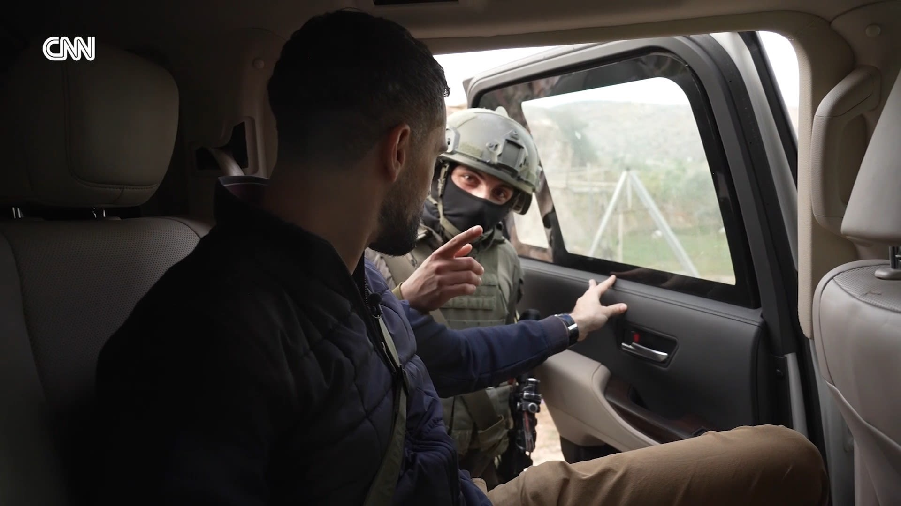

# Penahanan Jurnalis, Ideologi Pemukim, dan Logika Kolonial Modern: Analisis Komparatif antara Tepi Barat dan Kolonisasi Amerika Utara

*penahanan jurnalis CNN (pic: CNN.com).*

  
***Analisis komparatif dengan kolonisasi Amerika Utara menunjukkan kesamaan dalam pola penguasaan wilayah, meskipun konteks historisnya berbeda***
  

Artikel ini menganalisis laporan penahanan jurnalis internasional dan warga Palestina oleh militer Israel pada Maret 2026 dalam kerangka settler colonialism dan security-military nexus. 

Dengan pendekatan komparatif historis, studi ini mengaitkan dinamika kekerasan di Tepi Barat dengan pola kolonisasi Amerika Utara, khususnya dalam hal ekspansi pemukim, marginalisasi penduduk asli, dan peran negara dalam memfasilitasi transformasi demografis. 

Temuan menunjukkan adanya kesamaan struktural dalam praktik penguasaan wilayah yang melibatkan kekerasan, delegitimasi, dan kontrol naratif.

## Pendahuluan

Laporan mengenai penahanan tim media internasional oleh tentara Israel, disertai pernyataan ideologis yang menggeneralisasi warga Palestina sebagai “teroris”, menimbulkan pertanyaan serius tentang relasi antara militer negara dan ideologi pemukim. 

Dalam konteks ini, kekerasan tidak hanya bersifat insidental, melainkan dapat dipahami sebagai bagian dari struktur yang lebih luas.

## Settler Colonialism

Menurut Patrick Wolfe (2006), kolonialisme pemukim bukan sekadar eksploitasi, melainkan: “a structure, not an event”.

Ciri utamanya:

•	penghapusan penduduk asli (elimination of the native)

•	penggantian demografis

•	klaim permanen atas tanah

## Security-Military Nexus

Relasi antara aparat keamanan dan kepentingan sipil tertentu (misalnya pemukim) menciptakan:

•	perlindungan asimetris

•	impunitas de facto

•	legitimasi kekerasan

## Narrative Control

Penahanan jurnalis menunjukkan pentingnya:

•	kontrol informasi

•	pembatasan dokumentasi kekerasan

•	pengelolaan persepsi global

## Bukti Empiris dan Pola

1. Kekerasan oleh Pemukim dan Aparat

Laporan dari Human Rights Watch dan United Nations Office for the Coordination of Humanitarian Affairs menunjukkan:

•	peningkatan serangan pemukim terhadap warga Palestina

•	pembakaran lahan, perusakan kebun zaitun

•	pengusiran paksa

2. Peran Aparat Negara

Data menunjukkan:

•	intervensi militer sering minim terhadap pemukim

•	dalam beberapa kasus, aparat hadir namun tidak mencegah kekerasan

•	penahanan warga Palestina dan jurnalis terjadi dalam konteks operasi keamanan

3. Penahanan Jurnalis

Kasus penahanan tim media internasional (termasuk jaringan global seperti CNN) mencerminkan:

•	pembatasan akses informasi

•	tekanan terhadap peliputan independen

•	risiko kriminalisasi dokumentasi lapangan

## Analisis Komparatif: Palestina vs Kolonisasi Amerika Utara

1. Ekspansi Pemukim

Kesamaan pola:

•	pemukim bersenjata

•	dukungan implisit/eksplisit negara

•	ekspansi bertahap wilayah

Bandingkan dengan:

•	kolonisasi oleh pemukim Eropa terhadap penduduk asli Amerika

2. Pengusiran dan Dispossession

Dalam kedua kasus:

•	penduduk asli kehilangan tanah

•	sumber ekonomi dihancurkan

•	migrasi paksa terjadi

Contoh historis: perampasan tanah dan pemusnahan sumber pangan seperti bison di Amerika Utara.

3. Perlindungan Negara

Negara berfungsi sebagai:

•	pelindung pemukim

•	regulator yang tidak netral

•	aktor yang menentukan legitimasi kekerasan

## Diskusi

1. Apakah Ini Kolonialisme?

Banyak akademisi berargumen bahwa dinamika di Tepi Barat memiliki karakteristik:

•	settler colonial

•	bukan sekadar konflik militer biasa

Namun posisi ini tetap diperdebatkan dalam studi internasional.

2. Ideologi sebagai Pendorong Kekerasan

Pernyataan seperti: “semua warga Palestina adalah teroris”.

Menunjukkan proses:

•	dehumanisasi

•	legitimasi kekerasan

•	penghapusan batas sipil–kombatan.

3. Implikasi Global

Fenomena ini berdampak pada:

•	legitimasi hukum internasional

•	kredibilitas norma HAM

•	persepsi global terhadap konflik

Penahanan jurnalis dan kekerasan terhadap warga Palestina tidak dapat dipahami sebagai insiden terisolasi, melainkan sebagai bagian dari struktur yang lebih luas yang melibatkan ideologi pemukim, dukungan negara, dan dinamika kolonial modern. 

Analisis komparatif dengan kolonisasi Amerika Utara menunjukkan kesamaan dalam pola penguasaan wilayah, meskipun konteks historisnya berbeda.

  
**Referensi**

Wolfe, P. (2006). Settler colonialism and the elimination of the native. Journal of Genocide Research.

Human Rights Watch. (2023–2026). West Bank reports.

United Nations Office for the Coordination of Humanitarian Affairs. (2023–2026). Occupied Palestinian Territory updates.

Amnesty International. (2024–2026). Reports on Israel/Palestine.

CNN. (2026). Field reporting incidents.
