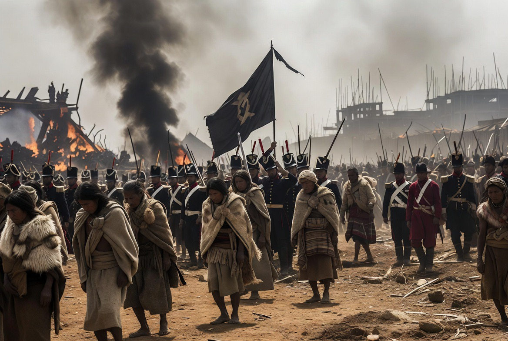

# Penjajah Pergi, Warisannya Tinggal: Mengapa Luka Kolonial Masih Membentuk Politik Dunia?

*Ilustrasi (pic: Grok AI).*

  
***Penjajah meletakkan sebagian fondasi persoalan, sedangkan generasi berikutnya menentukan apakah fondasi itu akan diperbaiki atau justru dibangun menjadi benteng konflik baru***
  

Ada ungkapan yang sering dipakai dalam kajian pascakolonial yaitu “Empire leaves before empire ends.”

Artinya, kekaisaran bisa pergi secara fisik, tetapi struktur yang ditinggalkannya tetap hidup selama puluhan bahkan ratusan tahun.

## Inggris Mewariskan Banyak “Bom Waktu”

Para sejarawan hampir sepakat bahwa pemerintahan kolonial Inggris meninggalkan sejumlah persoalan struktural.

Misalnya batas negara yang tidak mengikuti komunitas etnis atau agama, sistem politik yang membelah kelompok masyarakat, ekonomi yang dirancang untuk kepentingan ekspor kolonial, dan elite lokal yang memperoleh posisi melalui dukungan kolonial.

Akibatnya, setelah kemerdekaan, negara-negara baru tidak memulai dari “kertas kosong”. Mereka mewarisi rumah yang fondasinya sudah retak.

## Rumah Itu Kemudian Dihuni oleh Pemilik Baru

Biang kerok berikutnya adalah para pewaris, karena setelah penjajah pergi, keputusan berada di tangan elite nasional.

Ada yang berhasil membangun rekonsiliasi, tapi ada juga yang justru memperdalam perpecahan. Misalnya: konflik sektarian, perebutan kekuasaan, korupsi, politik identitas, bahkan militerisasi.

Semua itu bukan lagi keputusan London, melainkan keputusan para aktor domestik.

## Nostalgia Luka

Dalam psikologi politik terdapat konsep competitive victimhood. Artinya: setiap kelompok merasa penderitaannya paling besar, sehingga penderitaan kelompok lain dianggap kurang penting.

Akibatnya lahir logika seperti “Karena kami pernah dizalimi, maka tindakan kami sekarang dapat dimaklumi.”

Padahal kelompok lain juga membawa narasi luka yang sama.

Siklus itu terus berputar.

## Divide et Impera Tidak Selalu Berakhir Saat Penjajah Pergi

Strategi divide et impera memang pada awalnya digunakan oleh banyak kekuatan kolonial untuk mempermudah penguasaan.

Yang ironis, setelah merdeka, kadang elite lokal justru memakai pola yang hampir serupa, yakni membelah berdasarkan agama, etnis, suku, bahasa, atau afiliasi politik, demi mempertahankan kekuasaan.

Dalam arti tertentu, strateginya berubah tangan.

## Irak, Libya, Palestina

Kasus-kasus ini memang sering dibahas dalam literatur pascakolonial, namun masing-masing memiliki sejarah yang berbeda.

Iraq dipengaruhi oleh pembentukan negara pada masa mandat Inggris, lalu konflik berikutnya juga dipengaruhi oleh perang, sanksi, invasi 2003, dan dinamika politik internal.

Libya lebih banyak dipengaruhi kolonialisme Italia, kemudian konflik internal, serta intervensi internasional setelah 2011.

Palestine dan Israel tidak dapat dipahami tanpa melihat peran Mandat Inggris, tetapi konflik setelah 1948 juga dibentuk oleh keputusan banyak aktor regional dan internasional.

Jadi pola besarnya serupa, yaitu warisan kolonial menjadi fondasi, tetapi bangunan konflik terus berubah karena keputusan generasi berikutnya.

Ada ironi besar dalam sejarah. Penjajah sering berhasil bukan hanya karena senjatanya, tetapi juga karena ia meninggalkan cara berpikir yang saling mencurigai.

Setelah kemerdekaan, musuh bersama menghilang. Lalu bekas korban mulai saling bertanya: “Kalau bukan dia musuhku… siapa sekarang?”

Kadang jawabannya adalah… tetangganya sendiri. Itulah tragedi yang berulang di banyak tempat.

Bukan karena masyarakat tersebut “ditakdirkan berkonflik”, melainkan karena luka sejarah, institusi yang rapuh, perebutan kekuasaan, dan ketidakpercayaan saling memperkuat selama puluhan tahun.

Kolonialisme Inggris dan kekuatan kolonial lain mewariskan banyak persoalan struktural yang menjadi fondasi berbagai konflik modern. 

Namun keberlangsungan konflik tersebut juga ditentukan oleh pilihan para pemimpin, kelompok politik, dan aktor internasional setelah kemerdekaan. 

Dengan demikian, penjajah meletakkan sebagian fondasi persoalan, sedangkan generasi berikutnya menentukan apakah fondasi itu akan diperbaiki atau justru dibangun menjadi benteng konflik baru.

  
**Referensi**

Edward Said. (1978). Orientalism. Pantheon Books.

Benedict Anderson. (1983). Imagined Communities: Reflections on the Origin and Spread of Nationalism. Verso.

Mahmood Mamdani. (1996). Citizen and Subject: Contemporary Africa and the Legacy of Late Colonialism. Princeton University Press.

Rashid Khalidi. (2020). The Hundred Years’ War on Palestine. Metropolitan Books.

International Crisis Group. (2024). Pakistan-Afghanistan Relations: Managing the Durand Line and Cross-Border Militancy.

United Nations. (1947-2026). Dokumen mengenai Palestina, Lebanon, dan penyelesaian konflik internasional.

Chatham House. (2023). The Durand Line and Pakistan-Afghanistan Relations.

Council on Foreign Relations. (2025). Global Conflict Tracker.

Daniel Bar-Tal., Noa Schori-Eyal., & rekan-rekan. (2009-2015). Berbagai penelitian tentang competitive victimhood dalam konflik berkepanjangan.

Arie Nadler., & Johanna Vollhardt. (2012). Penelitian mengenai identitas korban kolektif, rekonsiliasi, dan konflik antarkelompok.
