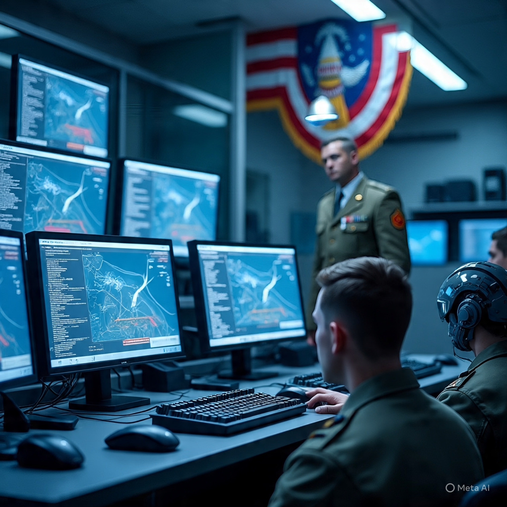

# Pentagon dan Grojok Etika Deepfake AI: Keamanan Digital dan Militerisasi Teknologi

*Ilustrasi Pentagon dan Grok AI (pic: Meta AI).*

  
***Tanpa kerangka global yang kuat, negara akan mengatur AI berdasarkan prioritas domestik masing-masing — sesuatu yang bisa menyebabkan fragmentasi aturan teknologi di seluruh dunia***
  

Kejadian terbaru menunjukkan negara seperti Indonesia dan Malaysia memblokir akses Grok AI — model kecerdasan buatan generatif yang dikembangkan oleh xAI dan terintegrasi di platform X — karena penyalahgunaan untuk membuat konten deepfake eksplisit tanpa persetujuan, termasuk gambar yang melibatkan perempuan dan anak-anak, yang dianggap mencederai hak digital dan martabat individu. 

Namun secara bersamaan, Pentagon justru mengadopsi Grok dalam jaringan militernya, menunjukkan konvergensi teknologi komersial dengan tujuan strategis militer secara terlepas dari kontroversi etika global. 

Kajian ini mengelaborasi ketegangan antara kebijakan nasional terhadap perlindungan publik dan dinamika adopsi teknologi AI dalam konteks keamanan dan kekuasaan global.

## Deepfake dan Risiko Roh Digital

Deepfake adalah teknologi generatif yang memungkinkan pembuatan konten audio/video/gambar yang tampak asli tetapi palsu, sering tanpa persetujuan subjek asli. 

Ancaman ini diprediksi oleh para pakar sebagai risiko keamanan siber besar, karena potensi penipuan, pencemaran nama baik, dan disinformasi semakin luas.  

## Grok AI dan Kontroversi Global

1. Blokir di Indonesia dan Malaysia

•	Indonesia memblokir akses Grok AI karena kemampuan model ini dipakai untuk menghasilkan gambar seksual eksplisit dan deepfake tanpa persetujuan, yang dianggap melanggar hak privasi dan martabat digital.  

•	Malaysia juga mengambil langkah yang sama setelah regulator menilai fitur deepfake terlalu mudah disalahgunakan dan perlindungan konten kurang memadai.  

Pemerintah kedua negara menilai bahwa teknologi AI yang dapat memanipulasi foto dan video pribadi harus tunduk pada undang-undang nasional terkait pornografi, privasi, dan keamanan digital, agar tidak menjadi alat eksploitasi atau ancaman psikologis bagi warga.  

2.Reaksi Korban dan Keprihatinan HAM

Kisah nyata dari para individu yang menjadi subjek deepfake — seperti artis dan warga biasa yang gambarnya diubah secara eksplisit tanpa izin — menunjukkan dampak psikologis dan sosial pada korban, serta perhatian para ahli hak digital terhadap era konten AI tanpa batas.  

## Pencegahan dan Regulasi Lokal

Pemerintah Indonesia dan Malaysia menggunakan landasan hukum lokal yang mengatur:

•	Privasi dan data pribadi

•	Pornografi dan konten eksplisit

•	Hak citra diri dan martabat digital

Langkah pemblokiran ditujukan bukan sekadar “sensorship”, tetapi sebagai coli legal dan etis untuk melindungi warga negara dari teknologi yang masih berkembang tanpa kerangka pengawasan yang kuat.  

## Paradoks: Grok di Jaringan Militer AS

Dalam arah yang tampak kontras, Departemen Pertahanan AS (Pentagon) mengumumkan integrasi Grok AI ke dalam jaringan militernya, termasuk unclassified dan classified systems, sebagai bagian dari strategi modernisasi AI untuk analitis dan intelijen.  

Paradoks ini mencerminkan dua gaya kebijakan teknologi yang sangat berbeda:

| Negara/Aktor | Pendekatan terhadap AI |
|------|-------|
| Indonesia & Malaysia | Membatasi/blokir AI u tuk melindungi HAM dan etika publik |
| Pentagon(AS) | Mengadopsi AI meskipun kontroversi etika demi keunggulan strategis |

Adopsi ini dipandang sebagai bagian dari dorongan militernya untuk mengatasi hambatan teknologis lama dan memanfaatkan kemampuan AI dalam lingkungan operasional yang semakin kompetitif secara global.  

## Ketegangan Global: Etika vs. Keamanan & Strategi

Perspektif regulasi AI mengungkap dua kekuatan utama yang saling tarik-menarik:

1.Etika dan Perlindungan Publik

Pendekatan negara seperti Indonesia dan Malaysia mengutamakan:

•	Perlindungan privasi

•	Martabat manusia

•	Pencegahan eksploitasi digital

Ini sejalan dengan upaya internasional untuk memperluas hukum lokal pada teknologi generatif yang belum diatur secara global.

2. Keamanan dan Dominasi Teknologi

Pihak militer — terutama di negara adidaya — cenderung memandang AI sebagai force multiplier:

•	Peningkatan analisis data intelijen

•	Otomasi tugas berulang

•	Keunggulan kompetitif terhadap rival geopolitik

Namun adopsi ini menimbulkan pertanyaan etis serius mengenai penerapan dua standar:

Ketika teknologi sama bisa menyelamatkan masyarakat atau melanggengkan dominasi, pihak mana yang menentukan konteks penggunaannya?

Fenomena Grok AI yang diblokir di Indonesia dan Malaysia, namun sekaligus diintegrasikan ke jaringan militer AS, menunjukkan ketegangan struktural dalam tata kelola AI global:

Regulasi di tingkat nasional menekankan etika, hak asasi, dan keselamatan digital.  

Alih fungsi AI untuk tujuan militer menyoroti bagaimana kepentingan strategis dapat mengesampingkan kekhawatiran etika publik.  

Kasus ini memperlihatkan bahwa tanpa kerangka global yang kuat, negara akan mengatur AI berdasarkan prioritas domestik masing-masing — sesuatu yang bisa menyebabkan fragmentasi aturan teknologi di seluruh dunia.

  
**Referensi**

Antara News Agency. (2026, January 15). Government cuts off Grok access to protect the public. https://infopublik.id/kategori/english/954607/government-cuts-off-grok-access-to-protect-the-public

Antara News Agency. (2026, January 14). Ministry probes alleged misuse of Grok AI for immoral content. https://en.antaranews.com/news/398845/ministry-probes-alleged-misuse-of-grok-ai-for-immoral-content

Associated Press. (2026, January 16). Indonesia, Malaysia block Grok AI over deepfake and explicit content concerns. https://apnews.com/article/c7cb320327f259c4da35908e1269c225

Channel News Asia. (2026, January 17). Victims speak out after explicit AI-generated images prompt Grok bans in Southeast Asia. https://www.channelnewsasia.com/asia/grok-ai-ban-indonesia-malaysia-victims-explicit-ai-images-southeast-asia-bikini-sexualised-5863151

Defense News. (2026, January 13). Pentagon embraces Musk’s Grok AI chatbot amid global backlash. https://www.defensenews.com/news/pentagon-congress/2026/01/13/pentagon-is-embracing-musks-grok-ai-chatbot-as-it-draws-global-outcry/

Reuters. (2026, January 13). Malaysia to take legal action against X over Grok AI concerns. https://www.reuters.com/world/asia-pacific/malaysia-take-legal-action-against-x-over-grok-ai-concerns-2026-01-13/

South China Morning Post. (2026, January 18). Malaysia suspends Grok access amid global backlash over Musk’s AI. https://www.scmp.com/news/asia/southeast-asia/article/3339510/malaysia-suspends-grok-access-amid-global-backlash-musks-ai

United News of Bangladesh. (2026, January 14). Pentagon to deploy Musk’s Grok AI on military networks despite global backlash. https://unb.com.bd/category/Tech/pentagon-to-deploy-musks-grok-ai-on-military-networks-despite-global-backlash/177239
