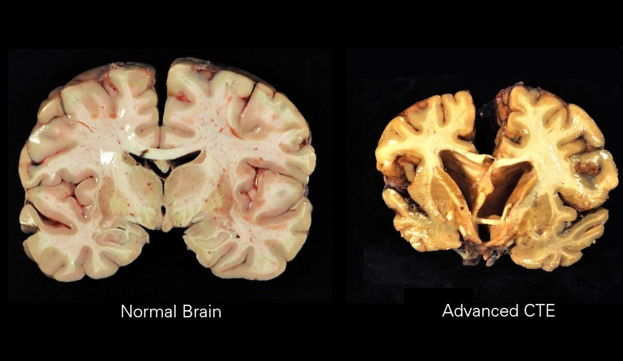

# Penyalahgunaan Dextromethorphan pada Generasi Muda: Analisis Farmakologis, Psikologis, dan Strategi Intervensi

*Perbandingan otak normal dan otak rusak setelah pemakaian zat tertentu  (pic: Grok AI).*

  
***Penyalahgunaan DXM pada remaja bukan semata masalah obat, tetapi merupakan fenomena kompleks***
  

Dextromethorphan (DXM), komponen umum dalam obat batuk seperti Dextromethorphan, telah lama disalahgunakan sebagai zat psikoaktif, terutama oleh remaja. 

Artikel ini menganalisis faktor pendorong penyalahgunaan, efek neurofarmakologis, dampak kesehatan, serta strategi intervensi berbasis bukti. 

Hasil menunjukkan bahwa kombinasi akses mudah, efek disosiatif, dan faktor psikososial menjadikan DXM sebagai “gateway substance” dalam konteks tertentu.

## Pendahuluan

Obat bebas (over-the-counter/OTC) sering diasumsikan aman karena legal dan mudah diakses. Namun, dalam dosis tinggi, beberapa zat seperti DXM memiliki efek psikoaktif yang signifikan.

Di Indonesia, produk seperti Samcodin sering disebut dalam konteks penyalahgunaan remaja, terutama karena:
	
  •	harga murah
	
  •	mudah diperoleh
	
  •	kurangnya pengawasan distribusi.

## Mekanisme Farmakologis Dextromethorphan

DXM bekerja pada sistem saraf pusat melalui:

1. Antagonis NMDA

DXM menghambat reseptor NMDA (mirip efek Ketamine), menghasilkan:
	
  •	efek disosiatif
	
  •	perubahan persepsi realitas

2. Aktivasi reseptor sigma-1

Menyebabkan:
	
  •	euforia
	
  •	distorsi sensorik
	
  •	perubahan kesadaran

3. Efek serotonin

Dalam dosis tinggi, DXM meningkatkan serotonin → berisiko Serotonin Syndrome.

## Mengapa Disalahgunakan?

1. Pencarian altered state of consciousness

Remaja sering mencari:
	
  •	“halu” (halusinasi ringan)
	
  •	rasa melayang
	
  •	pengalaman berbeda dari realitas

2. Faktor psikologis
	
  •	stres
	
  •	tekanan sosial
	
  •	rasa ingin tahu
	m•	kebutuhan “escape” dari realitas

3. Aksesibilitas tinggi

Berbeda dengan narkotika ilegal:
	
  •	DXM legal
	
  •	tidak distigma sekuat narkoba
	
  •	bisa dibeli di apotek atau warung

## Apa yang Mereka Cari?

Secara psikologis, pengguna tidak sekadar mencari “senang”, tetapi:

1. Disosiasi

Perasaan:
	•	terpisah dari tubuh
	
  •	lepas dari masalah.

2. Euforia sementara

Lonjakan dopamin/serotonin → rasa “enak sesaat”.

3. Eksplorasi identitas

Pada remaja, ini sering terkait dengan:
	
  •	pencarian jati diri
	m•	eksperimen batas diri

Efek Negatif

1. Efek akut
	
  •	mual, muntah
	
  •	pusing ekstrem
	
  •	gangguan koordinasi
	
  •	halusinasi
	
  •	takikardia

2. Efek berat
	
  •	kejang
	
  •	depresi pernapasan
	
  •	kerusakan otak
	
  •	Serotonin Syndrome (fatal).

3. Efek jangka panjang
	
  •	gangguan memori
	
  •	penurunan fungsi kognitif
	
  •	ketergantungan psikologis

## Produk yang Sering Disalahgunakan

Selain Samcodin, produk lain yang mengandung DXM dan berpotensi disalahgunakan:
	
  •	Komix
	
  •	Woods
	
  •	OBH Combi

Catatan: tidak semua varian mengandung DXM, tetapi beberapa digunakan dalam praktik penyalahgunaan.

## Strategi Menyadarkan Generasi Muda

Pendekatan represif saja tidak efektif. Dibutuhkan pendekatan multidimensi:

1. Edukasi berbasis realitas (bukan moral panic)

Remaja lebih responsif terhadap:

•	penjelasan ilmiah

•	efek nyata (bukan ancaman kosong).

2. Pendekatan psikologis

Fokus pada akar masalah:

•	stres

•	kesepian

•	kebutuhan validasi

3. Harm reduction

•	pembatasan pembelian

•	pengawasan distribusi

•	labeling yang jelas.

4. Peran keluarga & komunitas

•	komunikasi terbuka

•	bukan sekadar larangan.

## Mengapa Larangan Saja Tidak Cukup?

Dalam banyak kasus, pelarangan tanpa edukasi justru:

•	meningkatkan rasa penasaran

•	mendorong eksplorasi ilegal

Fenomena ini dikenal sebagai: forbidden fruit effect.

Penyalahgunaan DXM pada remaja bukan semata masalah obat, tetapi merupakan fenomena kompleks yang melibatkan:

•	faktor biologis (efek farmakologis)

•	faktor psikologis (escape & eksplorasi diri)

•	faktor sosial (akses & lingkungan).

Penanganan efektif harus menggabungkan:

•	edukasi

•	intervensi psikologis

•	regulasi yang proporsional.

  
**Referensi**

Bryan L. Roth, et al. (2000).
Dextromethorphan and its metabolites: Interaction with NMDA receptors and sigma receptors.
Journal of Pharmacology and Experimental Therapeutics.

U.S. Food and Drug Administration (2020).
Dextromethorphan Drug Safety Communication.

National Institute on Drug Abuse (2021).
Misuse of Over-the-Counter Medicines.

Richard A. Dart (2006).
Dextromethorphan abuse.
Pediatric Emergency Care.

World Health Organization (2014).
Guidelines for the Identification and Management of Substance Use Disorders.

Andrew Monte (2017).
Serotonin syndrome associated with dextromethorphan misuse.
Clinical Toxicology.

Laurence Steinberg (2014).
Age of Opportunity: Lessons from the New Science of Adolescence.

David J. Nutt (2012).
Drugs without the hot air.
UIT Cambridge.
