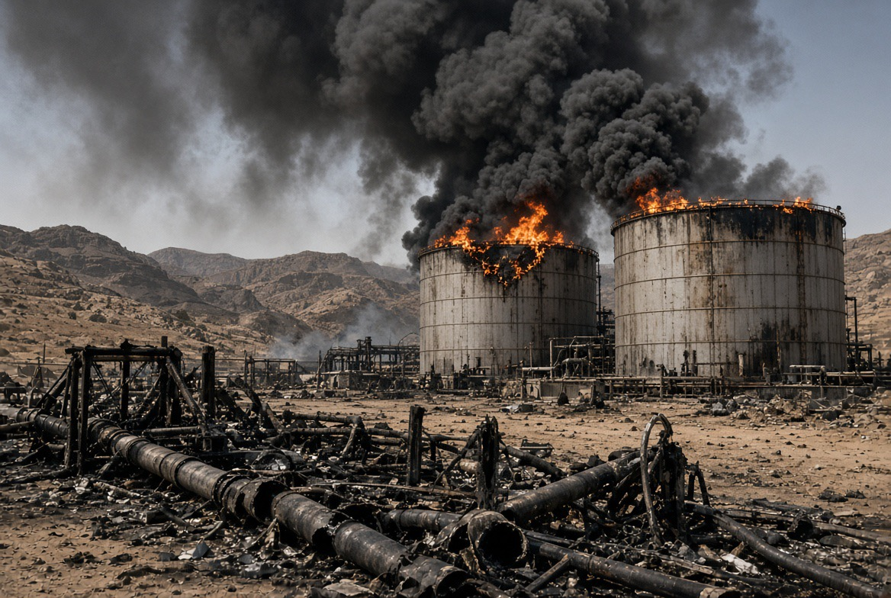

# Perang Iran dan Diplomasi yang Terpaksa Berbicara

*Ilustrasi (pic: Grok AI).*

  
***Perang mulai terlalu mahal untuk dimenangkan sebab negara bisa memulai eskalasi dengan sangat mudah, tetapi menghentikannya jauh lebih sulit***
  

Ketika misil masih terbang, tetapi semua orang mulai menghitung harga perdamaian, inilah bagian yang paling menarik dari perang ini, bahwa diplomasi tidak muncul setelah perang berhenti. 

Diplomasi muncul justru ketika perang mulai terlalu mahal untuk diteruskan tanpa batas. Dan sekarang kita punya tiga jalur yang bergerak bersamaan, yaitu AS vs Iran, Saudi vs Houthi, Trump vs Xi.

Yang menarik, ketiganya saling berpotongan.

## Perang Belum Selesai, Tetapi Pintu Negosiasi Mulai Terbuka

Per 22 September, laporan terbaru menunjukkan pasar minyak sedang memperhatikan kemungkinan pembicaraan AS-Iran di sekitar Sidang Umum PBB. 

Harapan diplomasi bahkan ikut menekan harga minyak dari level sebelumnya yang sangat tinggi. Tetapi jangan salah membaca ini sebagai “AS dan Iran sudah berdamai.”

Iran masih mengeluarkan ancaman eskalasi. Pada saat yang sama, Washington masih mempertahankan tekanan terhadap Teheran. 

Jadi bentuknya bukan perang, berhenti, negosiasi. Melainkan perang, ancaman, negosiasi m, ancaman lagi, negosiasi lagi.

Ini adalah pola klasik coercive diplomacy. Negara berusaha mendapatkan konsesi melalui kombinasi tekanan, ancaman, dan tawaran negosiasi.

## Semakin Mahal Perang, Semakin Keras Retorikanya

Ini kelihatan kontradiktif.

Kalau mau berdamai, kenapa masih mengancam? Karena dalam bargaining internasional, ancaman adalah bagian dari harga tawar.

Bayangkan dua orang sedang tawar-menawar rumah.

Pembeli bilang: “Saya bersedia membeli.”

Tetapi juga: “Kalau harga segitu, saya pergi.”

Penjual bilang: “Silakan pergi.”

Padahal dua-duanya masih berdiri di depan rumah. 

Dalam perang, masalahnya jauh lebih serius.
Iran harus menunjukkan “Saya belum kehabisan kemampuan membalas.” Sementara AS harus menunjukkan “Saya belum kehabisan kemampuan memberi tekanan.”

Tetapi keduanya juga harus memastikan jangan sampai tekanan berubah menjadi perang yang tidak bisa dihentikan.

Jadi ancaman dan diplomasi bukan lawan. Mereka bisa menjadi dua tangan dari strategi yang sama.

## Variabel yang Sangat Seksi Secara Geopolitik: MINYAK

Ini bagian yang bikin Washington, Beijing, Riyadh, Tokyo, Seoul, New Delhi, bahkan pasar finansial ikut duduk tegak. Karena perang ini bukan cuma soal Iran. Ada Hormuz, dan sekarang ada Bab el-Mandeb.

Keduanya adalah choke points energi dan perdagangan. Hormuz, menghubungkan Teluk Persia dengan Laut Arab. Sedangkan Bab el-Mandeb menghubungkan Laut Merah dengan Teluk Aden dan Samudra Hindia.

Kalau dua jalur itu terganggu bersamaan maka krisis regional berubah menjadi krisis perdagangan global. Itulah mengapa serangan Houthi terhadap kepentingan Saudi bukan lagi sekadar urusan Saudi–Yaman.

Reuters melaporkan bahwa Houthi memperluas operasi di sekitar pantai Laut Merah dan Bab el-Mandeb, meningkatkan risiko terhadap ekspor minyak Saudi dan pelayaran internasional. 

Dan pasar sudah merespons. Bursa negara-negara Teluk melemah pada 21 September karena eskalasi regional, sementara saham Saudi Aramco juga tertekan. 

## Saudi Melakukan Sesuatu yang Sangat Menarik

Saudi meminta China membantu, bukan cuma Amerika, tapi China juga. Reuters melaporkan bahwa setelah Saudi meminta bantuan Beijing, China secara privat mendesak Iran agar menggunakan pengaruhnya untuk menahan Houthi. 

INI bagian yang layak digarisbawahi tiga kali. Saudi adalah sekutu utama AS, tetapi ketika menghadapi ancaman Houthi yang berhubungan dengan Iran, Riyadh meminta bantuan Beijing.

Mengapa? Karena Saudi memahami sesuatu yang sangat realistis, Washington punya senjata, Beijing punya hubungan.

China adalah mitra dagang utama Iran dan pembeli penting minyak Iran. Beijing juga pernah memfasilitasi pemulihan hubungan diplomatik Iran–Saudi pada 2023. 

Jadi Saudi sedang menguji apakah China memiliki leverage nyata atas Iran, atau hanya memiliki hubungan ekonomi tanpa kemampuan mengendalikan perilaku strategis Teheran?

Itu pertanyaan besar.

## Masalah China

China sebenarnya sedang berada dalam posisi yang agak ngeselin. Beijing tidak membutuhkan perang ini.

China membutuhkan minyak Timur Tengah, jalur pelayaran, Bab el-Mandeb, Hormuz, stabilitas harga energi, hubungan dengan Iran, hubungan dengan Saudi, hubungan dengan negara Teluk, dan hubungan yang cukup stabil dengan AS.

Jadi China menghadapi dilema, jika Iran menang terlalu besar maka Saudi dan negara Teluk makin tidak aman. Namun jika Saudi menang terlalu besar, justru Iran bisa merasa terpojok.

Jika Houthi terus menyerang, jalur perdagangan China terganggu, tapi jika China terlalu keras menekan Iran, Beijing bisa kehilangan kepercayaan Teheran.

Jika China terlalu lunak, Saudi bisa menyimpulkan bahwa Beijing tidak memiliki leverage nyata. China ingin menjadi mediator tanpa menjadi polisi. Dan itu jauh lebih sulit.

## Houthi Bukan Remote Control Iran

Ini juga penting. Narasi sederhana: Iran menyuruh, Houthi menyerang, selesai. Ini terlalu sederhana.

AP melaporkan bahwa Houthi mengatakan mereka tidak berniat menyerang kapal AS dan telah mempertahankan komunikasi melalui mediasi Oman, sementara mereka tetap mengancam target yang terkait Saudi. Artinya Houthi mempunyai agenda sendiri.

Mereka bukan sekadar instrumen Iran. Iran memberikan dukungan dan memiliki pengaruh, tetapi Houthi juga memiliki kepentingan domestik Yaman, kebutuhan mempertahankan wilayah, kepentingan terhadap pelabuhan, kepentingan terhadap blokade, kalkulasi politik sendiri, dan agenda menghadapi Saudi.

Ini disebut proxy autonomy. Proksi bisa dipengaruhi patronnya, tetapi tidak selalu patuh seperti tentara nasional.

Dan ini justru membuat perang jauh lebih sulit dihentikan.

## AS “Ngopi”

Nah, kalau semua orang Timur Tengah sibuk gontok-gontokan, AS dan Israel bisa ngopi memang benar secara struktural.

Konflik regional yang terfragmentasi dapat menguras kemampuan lawan, mengalihkan perhatian, memecah koalisi, memperbesar ketergantungan keamanan, meningkatkan permintaan senjata, dan membuat sebagian negara Teluk kembali membutuhkan dukungan eksternal.

Tetapi ada jebakannya, kalau api membesar terlalu jauh, pemilik korek api juga bisa terbakar.

Misalnya: 
- Hormuz terganggu, harga minyak naik, terjadi inflasi global, timbul tekanan terhadap AS dan sekutunya.
- Bab el-Mandeb terganggu, maka shipping costs naik, berakibat supply chain terganggu.
- Saudi terkena serangan, otomatis pasar energi terguncang.
- Pangkalan AS diserang, berujung Washington terseret kembali.

Jadi, AS dapat memperoleh keuntungan strategis dari fragmentasi lawan, tetapi tidak memperoleh keuntungan dari kekacauan tanpa batas.

Ada titik ketika strategic advantage berubah menjadi systemic risk.

## Keputusan Washington Tidak Membantu Saudi

AP melaporkan bahwa Houthi dan AS, melalui mediasi Oman, mempertahankan kesepahaman bahwa Houthi tidak menyerang kapal AS sebagai imbalan penghentian serangan udara Amerika terhadap Houthi. 

Ini luar biasa menarik, karena Washington tampaknya membedakan: “Saya tidak ingin Houthi menyerang saya.” dengan: “Saya harus berperang demi setiap kepentingan Saudi.” Itu dua hal berbeda.

Dan jika benar AS menolak masuk langsung dalam perang Saudi–Houthi, maka Washington sedang mencoba mengisolasi konflik. 

Bahasa strategisnya adalah containment of escalation, bukan menyelesaikan seluruh konflik, hanya mencegahnya merambat ke wilayah yang membuat AS harus kembali masuk perang besar.

## Masuk Tokoh yang Semakin Menarik: Xi

Xi Jinping akan berada di Amerika Serikat pada 23–25 September untuk bertemu Trump, pemerintah China mengonfirmasi kunjungan itu pada 21 September. 

Dan sekarang bayangkan meja perundingannya. Di satu sisi, Trump: Iran, tarif, perdagangan, teknologi. Di sisi lain, Xi: Iran, energi, stabilitas, perdagangan, AI, dan hubungan AS–China. Sementara di luar ruangan, Saudi:“Tolong tekan Iran.” Iran: “Hentikan perang AS–Israel.” Houthi: “Jangan sentuh kami.” China: “Jangan ganggu jalur perdagangan kami.” AS: “Jangan serang kapal kami.”

Ini sudah bukan papan catur, tetapi meja makan keluarga besar yang semua orang membawa pisau sendiri.

## Pertanyaan Terbesar Sekarang Bukan “Siapa Menang?”

Pertanyaan yang lebih tepat adalah siapa yang masih punya leverage ketika perang mulai terlalu mahal?

Dan peta leverage-nya menarik:

| Aktor | Leverage utama |
|------|-------|
|🇺🇸 AS|kekuatan militer, sanksi, sistem finansial|
|🇮🇷 Iran|rudal, jaringan regional, kemampuan mengganggu energi|
|🇸🇦 Saudi|minyak, modal, posisi strategis Teluk|
|🇾🇪 Houthi|Bab el-Mandeb, perang asimetris|
|🇨🇳 China|perdagangan, minyak, hubungan dengan Iran & Saudi|
|🇴🇲 Oman|kanal komunikasi|
|🇺🇳 PBB|legitimasi dan forum diplomasi|

Dan ada sesuatu yang sangat menarik: Oman mempunyai kekuatan yang tidak dimiliki kapal induk, bukan misil tetapi akses.

Ketika Washington dan Teheran tidak dapat atau tidak mau berbicara secara langsung, mediator seperti Oman menjadi infrastruktur diplomatik.

Itulah mengapa dalam perang modern, kekuatan tidak selalu berbentuk siapa punya rudal paling banyak. Kadang bentuknya adalah siapa yang masih bisa membuat dua pihak yang saling membenci mau mengangkat telepon.

Perang Iran telah mencapai titik ketika kekuatan militer tidak lagi cukup untuk menentukan hasil; semua pihak mulai membutuhkan aktor yang mampu mengubah kekuatan menjadi leverage diplomatik.

Dan China sedang mencoba memainkan peran itu, bukan karena Beijing mendadak menjadi malaikat perdamaian, melainkan karena kepentingan material China mengharuskannya.

China membutuhkan minyak, jalur laut, stabilitas, Iran dan Saudi  tetap menjadi mitra, serta hubungan dengan AS tidak berubah menjadi perang terbuka.

Jadi diplomasi Beijing mempunyai fondasi yang sangat material.

Perang mulai terlalu mahal untuk dimenangkan, sebab sekarang kita mulai melihat sesuatu yang sangat manusiawi di balik geopolitik yang kelihatannya brutal, bahwa negara bisa memulai eskalasi dengan sangat mudah, tetapi menghentikannya jauh lebih sulit.

Satu misil bisa diluncurkan dalam hitungan menit, satu keputusan militer bisa dibuat dalam satu ruangan. Tetapi setelah Hormuz terguncang, Bab el-Mandeb terganggu, minyak naik, perdagangan terganggu, Saudi tertekan, Iran tertekan, AS tertekan, dan China ikut terganggu, tiba-tiba semua pemain menyadari: “Lho… ternyata perang ini punya tagihan.” 

Dan tagihannya tidak dikirim kepada satu negara. Seluruh dunia ikut menerima invoice-nya. 

  
**Referensi**

Reuters, 21 September 2026, mengenai kunjungan Xi ke AS dan pertemuan Trump–Xi. 

Reuters, 17 September 2026, mengenai permintaan Saudi kepada China dan upaya Beijing menekan Iran terkait Houthi. 

Associated Press, 21 September 2026, mengenai posisi Houthi, komunikasi melalui Oman, dan kesepahaman AS–Houthi. 

Reuters, 21 September 2026, mengenai dampak eskalasi terhadap pasar negara Teluk. 
