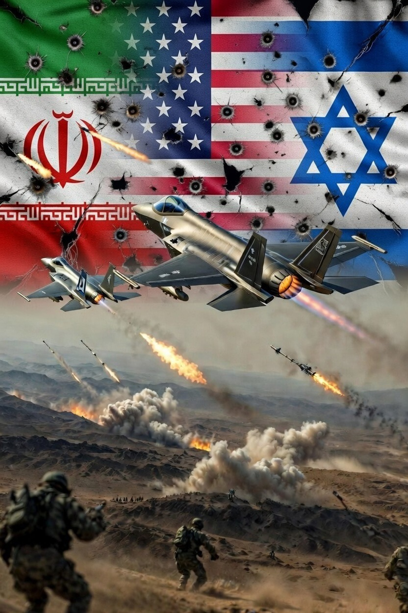

# Perang Iran–Israel–Amerika Serikat 2026: Simetri Asimetris dalam Konflik Modern

*Ilustrasi perang (pic: Grok AI).*

  
***Perang Iran–Israel–Amerika Serikat menunjukkan bahwa dalam konflik modern, superioritas militer tidak selalu menghasilkan kemenangan cepat***
  

Perang Iran–Israel–Amerika Serikat tahun 2026 menunjukkan dinamika konflik modern di mana kekuatan militer besar menghadapi negara regional yang mengandalkan strategi asimetris. 

Artikel ini menganalisis bagaimana Iran mempertahankan kemampuan tempurnya meskipun mengalami serangan awal yang menghancurkan, termasuk pembunuhan pemimpin tertinggi negara tersebut. 

Penelitian ini menunjukkan bahwa ketahanan Iran berasal dari struktur militer terdesentralisasi, jaringan sekutu regional, dan strategi perang berlapis.

## Pendahuluan

Perang yang dimulai pada 28 Februari 2026 antara Iran, Israel, dan Amerika Serikat menjadi salah satu konflik paling kompleks di Timur Tengah modern.

Serangan awal yang menewaskan pemimpin Iran Ali Khamenei dimaksudkan untuk mempercepat runtuhnya rezim Iran. Namun kenyataannya, negara tersebut tetap bertahan dan melancarkan serangan balasan luas terhadap Israel dan aset Amerika Serikat di kawasan.

Fenomena ini menantang asumsi klasik bahwa penghancuran kepemimpinan negara akan langsung menyebabkan kekalahan strategis.

## Strategi “Decapitation Strike”

Strategi pembunuhan pemimpin negara sering digunakan untuk:

•	menciptakan kekacauan politik

•	memutus rantai komando militer

•	memicu keruntuhan rezim.

Namun dalam kasus Iran, efek tersebut tidak terjadi secara langsung karena struktur komando militer telah disiapkan untuk skenario tersebut.

## Doktrin Pertahanan “Mosaic Defence”

Iran mengembangkan konsep pertahanan yang disebut: mosaic defence.

Strategi ini mencakup:

•	komando militer yang terdesentralisasi

•	jaringan milisi regional

•	kemampuan misil jarak jauh

•	perang ekonomi melalui jalur energi global.

Akibatnya, meskipun mengalami serangan besar, Iran tetap mampu melancarkan serangan balasan ke berbagai target regional.

## Perang Asimetris

Konflik ini menunjukkan karakteristik perang asimetris.

Koalisi Israel–AS memiliki:

•	superioritas udara

•	teknologi militer maju

•	kapasitas ekonomi besar.

Sementara Iran mengandalkan:

•	jaringan proksi regional

•	misil balistik

•	strategi tekanan ekonomi melalui jalur energi.

Perbedaan ini membuat konflik menjadi panjang dan sulit diselesaikan secara cepat.

## Dampak Global

Perang ini memiliki implikasi global besar, termasuk:

1.	gangguan perdagangan energi melalui Selat Hormuz

2.	kenaikan harga minyak dunia

3.	ketidakstabilan geopolitik di Timur Tengah

4.	risiko eskalasi konflik regional yang lebih luas.

Perang Iran–Israel–Amerika Serikat menunjukkan bahwa dalam konflik modern, superioritas militer tidak selalu menghasilkan kemenangan cepat.

Ketahanan negara yang menggunakan strategi asimetris dapat memperpanjang konflik dan mengubah perang menjadi kompetisi daya tahan jangka panjang.

Manusia selalu yakin perang berikutnya akan cepat.
Hampir selalu salah.

Perang modern punya kebiasaan aneh.
Ia dimulai dengan pidato kemenangan…
dan berakhir dengan generasi yang kelelahan.

  
**Referensi**

Al Jazeera. (2026, March 1). Iran begins 40-day mourning after Khamenei killed in US-Israeli attack. https://www.aljazeera.com

Associated Press. (2026, March 6). About 140 US troops injured in Iran war, Pentagon says. https://apnews.com

Reuters. (2026, March 5). Israel decided to kill Khamenei in November, defence minister says. https://www.reuters.com

Le Monde. (2026, March 1). Iran state media say 100 killed in strike on girls’ school. https://www.lemonde.fr

OneIndia. (2026, March 8). Benjamin Netanyahu death rumours spread online amid Israel-Iran tensions. https://www.oneindia.com

European Broadcasting Union. (2026). False claims of assassinations and misinformation in Iran-Israel war. https://spotlight.ebu.ch

Verfassungsblog. (2026). Killing Khamenei? Legal analysis of targeted assassination in armed conflict. https://verfassungsblog.de
