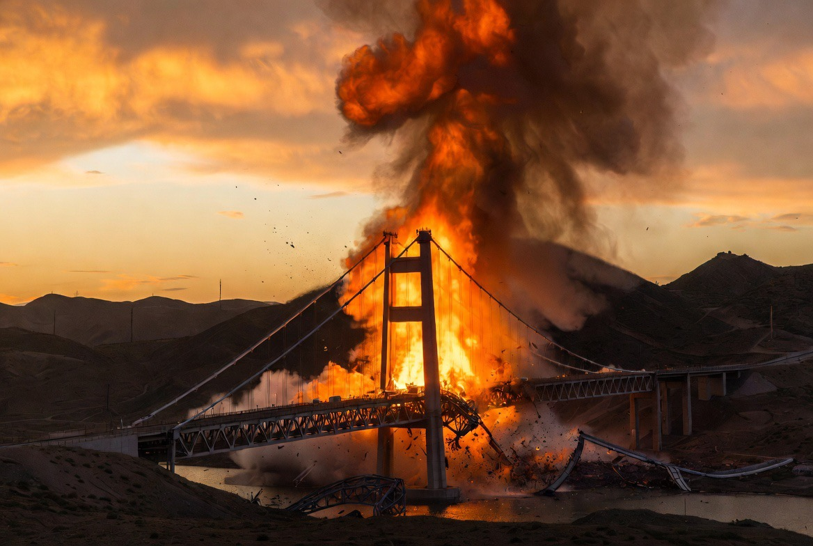

# Perang Kehilangan Rem: Konflik AS-Iran Memasuki Fase Paling Berbahaya

*Ilustrasi (pic: Grok AI).*

  
***“Perang paling berbahaya bukanlah ketika bom pertama dijatuhkan, melainkan ketika kedua pihak mulai percaya bahwa mereka tidak bisa lagi mundur.”***
  

Selama beberapa bulan terakhir, konflik AS-Iran mengalami pola yang relatif dapat diprediksi, yakni: Serangan → Balasan → Pernyataan diplomatik → Jeda → Negosiasi.

Namun, perkembangan pada 24 Juli 2026 menunjukkan pola itu mulai berubah. Yang berubah bukan hanya jumlah serangan, tetapi logika perang itu sendiri.

Jika sebelumnya tujuan utama adalah memberi tekanan, kini perang mulai bergeser menjadi perang pemaksaan (coercive war), yaitu perang yang bertujuan membuat lawan menyerah melalui tekanan militer, ekonomi, dan psikologis secara bersamaan. 

# Dari “Operasi Militer” Menjadi “Perang Tanpa Rem”

Laporan terbaru menunjukkan Amerika telah melakukan 13 malam berturut-turut serangan udara terhadap Iran.

Angka itu sendiri bukan sekadar statistik, ini menunjukkan bahwa operasi ini telah berubah dari aksi balasan terbatas menjadi kampanye militer berkelanjutan.

Dalam teori strategi militer, kampanye yang berlangsung terus-menerus memiliki tujuan berbeda.

Bukan hanya menghancurkan target, melainkan juga melelahkan lawan, menguras logistik, merusak moral, serta mempersempit pilihan politik lawan.

Masalahnya, semakin lama kampanye berlangsung, maka semakin besar peluang terjadinya salah sasaran, salah identifikasi, dan salah perhitungan, yang akhirnya memperbesar korban sipil.

Itulah sebabnya mengapa konflik ini memasuki fase eskalasi yang lebih berbahaya. 

# Perang Tidak Lagi Terjadi di Iran

Awalnya perhatian dunia hanya tertuju pada Iran. Namun sekarang, medan konflik telah meluas menjadi jaringan kawasan. Misalnya: Selat Hormuz, Laut Merah, Bab el-Mandeb, Bahrain, Kuwait, serta Jordan.

Artinya, setiap rudal yang ditembakkan hari ini tidak hanya memengaruhi dua negara tetapi juga  mengguncang harga minyak, jalur logistik, premi asuransi kapal, biaya pangan, dan inflasi dunia.

Inilah yang disebut systemic conflict, bahwa perang tidak lagi berhenti di medan tempur, ia mulai menjalar ke sistem ekonomi global. 

# Infrastruktur Sipil Mulai Masuk Daftar Ancaman

Perkembangan yang paling mengkhawatirkan adalah ketika Trump memperingatkan bahwa bila kapal kembali diserang, Amerika dapat membalas dengan menyerang jembatan atau pembangkit listrik Iran.

Secara militer, infrastruktur tertentu memang bisa memiliki nilai strategis. Namun dari sudut pandang kemanusiaan, muncul pertanyaan yang jauh lebih sulit: Ketika jembatan runtuh, siapakah yang pertama kali kehilangan akses?

Bukan jenderal, melainkan ambulans, petugas pemadam, anak sekolah, pedagang kecil, atau keluarga yang hendak mencari sesuap nasi.

Di sinilah paradoks perang modern muncul. Semakin luas definisi “target strategis”, semakin tipis pula batas antara tekanan militer dan penderitaan masyarakat sipil. 

# Mengapa PBB Mulai Mengubah Nada Bicaranya?

PBB jarang menggunakan bahasa yang dramatis.

Karena itu, ketika Sekretaris Jenderal António Guterres memperingatkan bahwa krisis Timur Tengah sedang “getting out of control”, pernyataan tersebut bukan sekadar retorika diplomatik.

Kalimat itu mencerminkan kekhawatiran bahwa konflik telah mendekati titik di mana diplomasi tertinggal dari operasi militer, pembalasan menjadi rutinitas, dan setiap serangan menciptakan alasan bagi serangan berikutnya.

Dalam teori hubungan internasional, kondisi seperti ini dikenal sebagai escalation trap. Artinya setelah masuk ke dalamnya, setiap pihak merasa bahwa berhenti justru terlihat sebagai kelemahan.

Akibatnya, perang terus bergerak, meskipun semua pihak mengetahui biayanya semakin mahal. 

# Korban Terbesar Belum Tentu Negara yang Kalah

Ironisnya, korban terbesar perang modern sering kali bukan negara yang kalah secara militer. Melainkan masyarakat yang hidup di antara keputusan-keputusan politik.

Mereka kehilangan listrik, pekerjaan, sekolah, rumah sakit, keamanan. Sementara para pemimpin masih berdebat mengenai deterrence, kredibilitas, pengaruh regional, sampai keseimbangan kekuatan.

Dalam statistik militer, semua itu mungkin disebut collateral damage, tetapi dalam kehidupan nyata, itu adalah nama seseorang, rumah seseorang, dan masa depan seseorang.

Yang membuat konflik AS-Iran pada Juli 2026 disebut memasuki fase paling berbahaya bukan semata karena lebih banyak rudal ditembakkan. Melainkan karena logika perang telah berubah.

Perang kini tidak hanya memperebutkan wilayah atau menghancurkan kemampuan militer lawan. Ia mulai menyentuh infrastruktur strategis, jalur perdagangan dunia, dan stabilitas ekonomi internasional.

Semakin luas medan konflik, semakin besar pula kemungkinan bahwa mereka yang tidak pernah memilih perang justru menjadi pihak yang membayar harganya.

Itulah ironi paling tajam dalam geopolitik modern. Negara-negara berbicara tentang kemenangan,  tetapi kemanusiaan menghitung kehilangan.

  
**Referensi**

United Nations. (2026). Pernyataan Sekretaris Jenderal António Guterres mengenai eskalasi krisis Timur Tengah. 

International Committee of the Red Cross. (1949). Geneva Conventions of 1949.

United Nations. (1977). Additional Protocol I to the Geneva Conventions.

Reuters. (24 Juli 2026). Trump vows to punish Iran and Houthis for attacks in Red Sea. 

Associated Press. (24 Juli 2026). US strikes Iran and Bahrain warns of incoming fire as clashes over shipping routes escalate. 

Center for Strategic and International Studies. Kajian mengenai dinamika eskalasi dan keamanan kawasan Timur Tengah.

S&P Global Market Intelligence. (Juli 2026). Geopolitical Risk Brief: July 2026. 
