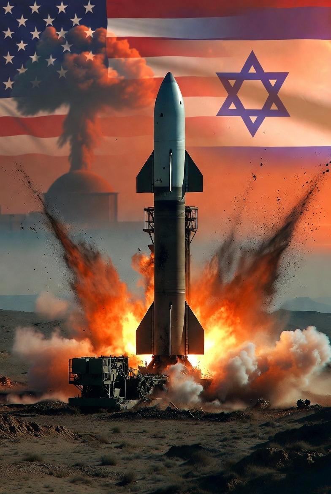

# Perang, Minyak, dan Rezim: Analisis Struktural atas Konflik AS–Israel–Iran dalam Perspektif Keamanan Energi Global

*Ilustrasi Cerita AI tentangku(pic: Meta AI).*

  
***Minyak bukan satu-satunya motif, tetapi ia adalah variabel yang selalu hadir dalam kalkulasi rasional negara besar***
  

Eskalasi militer antara Amerika Serikat, Israel, dan Iran pada Maret 2026 kembali memunculkan tesis klasik dalam studi hubungan internasional: apakah intervensi militer di Timur Tengah bermotif keamanan semata atau terkait kontrol atas sumber daya energi strategis. 

Artikel ini menganalisis konflik tersebut melalui pendekatan realisme struktural dan teori keamanan energi. 

Dengan menelaah dampak konflik terhadap pasar minyak global, peran Selat Hormuz sebagai chokepoint strategis, serta narasi perubahan rezim dan netralisasi nuklir, penelitian ini berargumen bahwa faktor energi bukan satu-satunya motif, tetapi merupakan variabel struktural yang tidak dapat dipisahkan dari kalkulasi geopolitik aktor utama.

## Pendahuluan

Sejak abad ke-20, konflik di Timur Tengah sering diasosiasikan dengan minyak. Namun, reduksi konflik menjadi “perang demi minyak” cenderung menyederhanakan realitas yang jauh lebih kompleks.

Eskalasi 2026 antara AS–Israel dan Iran terjadi dalam konteks:

•	Tuduhan ancaman nuklir Iran

•	Kompetisi pengaruh regional

•	Jaringan proxy di Lebanon, Suriah, Irak, dan Yaman

•	Ketergantungan sistem ekonomi global pada stabilitas energi

Pertanyaan sentral artikel ini:
Apakah konflik ini dapat dipahami sebagai strategi kontrol energi terselubung melalui tekanan militer dan kemungkinan restrukturisasi rezim?

## Kerangka Teoretik

1.Realisme Struktural (Waltz, 1979)

Dalam sistem anarki internasional, negara bertindak untuk mempertahankan survival. Energi adalah instrumen survival ekonomi dan militer.

2.Teori Keamanan Energi

Keamanan energi tidak hanya menyangkut akses fisik, tetapi juga:

•	Stabilitas harga

•	Keamanan jalur distribusi

•	Pengaruh terhadap chokepoint strategis

Selat Hormuz merupakan salah satu chokepoint paling vital, dengan sekitar 20–25% perdagangan minyak global melewatinya.

3.Regime Change vs Behavioral Modification

Literatur membedakan antara:

•	Regime change: mengganti struktur kekuasaan

•	Regime constraint: membatasi kapasitas rezim tanpa menggantinya

Narasi resmi sering menggunakan istilah netralisasi ancaman, tetapi dampak strukturalnya dapat menyerupai tekanan perubahan rezim.

## Metodologi

Pendekatan kualitatif-analitis berbasis:

•	Laporan pasar energi global

•	Data volatilitas harga minyak pasca-eskalasi

•	Pernyataan resmi aktor negara

•	Literatur akademik tentang intervensi dan keamanan energi

Analisis dilakukan secara triangulatif untuk menghindari simplifikasi kausal tunggal.

Temuan dan Analisis

1. Dampak Langsung pada Pasar Energi

•	Harga minyak melonjak signifikan setelah eskalasi militer.

•	Premi asuransi kapal tanker di kawasan Teluk meningkat.

•	Gangguan distribusi memicu kekhawatiran inflasi global.

Temuan ini menunjukkan bahwa konflik secara struktural terkait dengan risiko energi global.

2. Selat Hormuz sebagai Variabel Strategis

Iran memiliki kapasitas untuk mengganggu lalu lintas di Selat Hormuz. Kontrol atau netralisasi ancaman di kawasan ini secara tidak langsung berarti:

•	Stabilitas suplai bagi negara Barat

•	Reduksi leverage geopolitik Iran

Ini bukan sekadar isu militer, tetapi isu arsitektur ekonomi global.

3. Apakah Motifnya Murni Minyak?

Data menunjukkan bahwa:

•	Israel memprioritaskan isu nuklir dan keamanan eksistensial.

•	AS menekankan deterrence dan stabilitas sekutu.

•	Namun, dampak energi menjadi konsekuensi struktural yang signifikan.

Dengan kata lain, minyak bukan satu-satunya motif, tetapi ia adalah variabel yang selalu hadir dalam kalkulasi rasional negara besar.

## Analogi Venezuela

Intervensi dan tekanan terhadap negara kaya energi sering diikuti dengan narasi:

•	Demokratisasi

•	Stabilitas regional

•	Keamanan global

Namun dalam praktiknya, kontrol terhadap produksi dan distribusi energi menjadi implikasi strategis yang nyata.

## Diskusi

Mengasumsikan konflik ini “murni demi minyak” terlalu reduksionis.
Mengabaikan faktor minyak sama naifnya.

Struktur konflik menunjukkan pola berikut: 

Ancaman keamanan → Intervensi militer → Destabilisasi rezim → Rekonfigurasi pengaruh regional → Stabilitas energi bagi koalisi dominan.

Apakah ini konspirasi?  Tidak perlu konspirasi untuk menjelaskan logika kekuatan. Cukup insentif struktural.

Konflik AS–Israel–Iran 2026 tidak dapat direduksi menjadi perang demi minyak semata. Namun, keamanan energi global dan kontrol atas chokepoint strategis seperti Selat Hormuz merupakan variabel penting dalam kalkulasi geopolitik aktor utama.

Energi berfungsi sebagai:

•	Instrumen tekanan

•	Faktor legitimasi domestik

•	Variabel stabilitas ekonomi global

Dengan demikian, perang ini harus dipahami sebagai kombinasi antara keamanan eksistensial, kompetisi regional, dan arsitektur energi global.

## Implikasi Akademik

1.	Studi keamanan energi perlu terintegrasi dengan teori intervensi militer.

2.	Analisis konflik Timur Tengah harus menghindari reduksionisme ekonomi maupun moralistik.

3.	Struktur distribusi energi global tetap menjadi faktor kunci dalam stabilitas sistem internasional.

  
**Referensi**

Waltz, K. N. (1979). Theory of International Politics. McGraw-Hill.

Yergin, D. (2011). The Quest: Energy, Security, and the Remaking of the Modern World. Penguin Press.

Klare, M. T. (2001). Resource Wars: The New Landscape of Global Conflict. Metropolitan Books.

International Energy Agency. (2025). World Energy Outlook 2025. IEA Publications.

Reuters. (2026, March 3). Oil rises as expanding US-Israeli conflict with Iran elevates supply risks.

Reuters. (2026, March 3). US-Israeli war on Iran causes major oil, gas disruptions.
