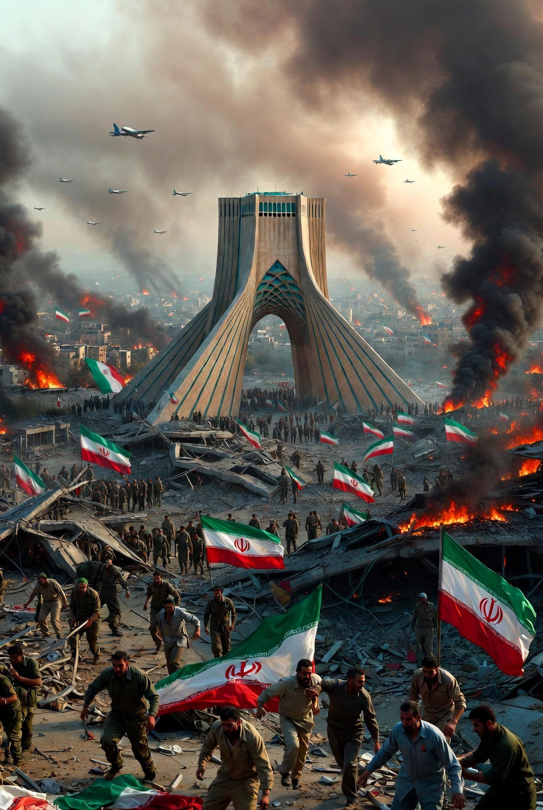

# Perang Pencegahan atau Kotak Pandora? Konflik Iran 2026 dan Krisis Legitimasi Tatanan Internasional

*Ilustrasi (pic: Grok AI).*

  
***Peradaban kadang runtuh bukan karena kebencian. Tetapi karena terlalu banyak orang yang berkata: “Aku hanya ingin aman.”***
  

Konflik Iran 2026 memunculkan pertanyaan yang lebih besar daripada sekadar siapa menang atau kalah. 

Perang ini berpotensi menjadi preseden berbahaya bagi tatanan internasional, sebab apakah negara boleh menyerang lebih dulu demi mencegah ancaman yang belum terjadi? Dan jika ya, siapa yang berhak menentukan ancaman itu nyata atau hanya ketakutan politik? 

Pertanyaan ini tidak hanya menyangkut Iran, tetapi masa depan hukum internasional itu sendiri.  

## Dari Self-Defense ke Preventive War

Dalam hukum internasional klasik, sebuah negara boleh menggunakan kekuatan militer bila diserang terlebih dahulu, atau menghadapi ancaman yang sangat dekat dan tak terhindarkan.

Standar ini dikenal sebagai Caroline Test, yaitu ancaman harus “instant, overwhelming, leaving no choice of means and no moment for deliberation.”

Masalahnya, jika ancamannya masih berupa kemungkinan masa depan, seperti Iran mungkin punya bom nuklir suatu hari nant, atau Iran mungkin lebih berbahaya lima tahun lagi, maka perang berubah dari preemptive war menjadi preventive war.

Dan preventive war secara umum tidak diakui dalam hukum internasional modern.  

## Ketakutan yang Diinstitusionalisasi

Israel dan AS berargumen: “Kami tidak bisa menunggu sampai Iran benar-benar memiliki bom.”

Dari perspektif mereka, holocaust membentuk trauma eksistensial Israel, rudal Iran dan jaringan proksi dianggap ancaman serius, serta negara kecil tidak punya kemewahan untuk salah hitung.

Argumen ini tidak sepenuhnya irasional. Tetapi bila ketakutan dijadikan dasar perang, maka dunia memasuki wilayah berbahaya, yakni siapa yang menentukan ketakutan itu objektif? Karena semua negara punya ketakutan.

## Kotak Pandora Geopolitik

Bayangkan kalau doktrin ini diterima dunia. Maka India bisa menyerang Pakistan dengan argumen: “Kami khawatir mereka suatu hari menyerang.” China bisa menyerang Taiwan dengan alasan: “Kami khawatir separatisme makin kuat.” Sementara Rusia beralasan: “Kami takut NATO makin dekat.”

Lalu… apa yang tersisa dari larangan perang ? Sedikit, sangat sedikit. Karena perang tak lagi dimulai oleh serangan nyata, melainkan oleh prediksi, asumsi, dan rasa takut.

Inilah yang dikhawatirkan banyak ahli hukum internasional.  

## Tatanan Dunia: Rule of Law atau Rule of Fear?

Perang Iran 2026 bukan hanya perang militer, tetapi ujian apakah dunia masih diatur oleh hukum, atau sudah diatur oleh ketakutan negara kuat.

Jika negara kuat boleh berkata: “Aku menyerangmu hari ini agar kau tak menyerangku esok.” maka negara lain akan belajar: “Kalau begitu, aku harus menyerang lebih dulu.”

Dunia berubah menjadi ruang tunggu perang. Dan semua orang berdiri sambil memegang korek api. 

## Ironi yang Pahit

Yang paling ironis, Israel sendiri hidup dari prinsip “Jangan pernah lagi menjadi korban.” Tetapi kritik terhadap perang Iran bertanya: Apakah ketakutan menjadi korban boleh dijadikan alasan untuk menciptakan korban baru?

Dan pertanyaan itu… tidak mudah dijawab.
Karena sejarah manusia penuh dengan negara yang pernah dianiaya, lalu menjadi sangat takut, lalu mulai percaya bahwa keamanan adalah hak yang lebih penting daripada aturan.

Kalau dunia menerima prinsip: “Aku menyerangmu hari ini karena aku takut kamu menyerangku besok” maka… negara lain bisa berkata hal yang sama.

Lalu siapa yang salah? Yang menyerang lebih dulu? Atau yang membuat pihak lain takut?
Atau… semua pihak sedang mengaku defensif sambil melakukan hal yang secara praktis terasa ofensif bagi lawannya?  

Perang Iran 2026 bukan hanya soal Iran atau Israel. Melainkan ujian yang lebih besar, yakni apakah hukum internasional masih membatasi kekuatan, atau kekuatanlah yang perlahan menulis ulang hukum internasional? 

Perang Iran 2026 mungkin kelak dikenang bukan karena jumlah misilnya. Tetapi karena ia memaksa dunia menjawab pertanyaan yang mengerikan: Apakah perang boleh dilakukan untuk mencegah perang?

Jika jawabannya ya, maka setiap negara bisa mengaku takut. Dan jika semua orang berhak menyerang karena takut, maka… perang tidak lagi menjadi kegagalan diplomasi. Ia menjadi kebijakan standar.

Dan peradaban kadang runtuh bukan karena kebencian. Tetapi karena terlalu banyak orang yang berkata:“Aku hanya ingin aman.” 

  
**Referensi**

United Nations. (1945). Charter of the United Nations, Article 51.

Herz, J. H. (1950). Idealist Internationalism and the Security Dilemma. World Politics, 2(2), 157-180.

Jervis, R. (1978). Cooperation Under the Security Dilemma. World Politics, 30(2), 167-214.

Sikubwabo, J. M. V. (2024). A Critical Study of Legitimization of Preemptive Self-Defense as a Counter Terrorism Measure Under International Law.

United Nations. Chapter VII: Article 51.

The Guardian. (2026). Iran war: who is fighting and why?

Reuters Breakingviews. (2026). Stronger war norms can curb the law of the jungle.
