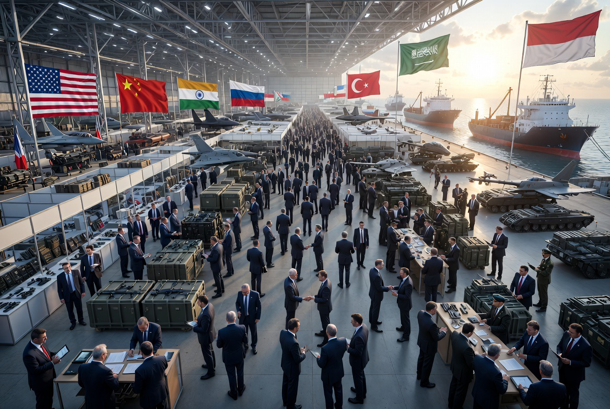

# Perang yang Menguntungkan: Perlombaan Belanja Militer Global dan Industri yang Tersenyum di Tengah Krisis Dunia

*Ilustrasi (pic: Grok AI).*

  
***Dunia tampaknya semakin rela menginvestasikan triliunan dolar untuk mempersiapkan perang daripada mencegahnya***
  

Laporan terbaru menunjukkan belanja militer dunia terus meningkat hingga mencapai rekor baru dalam beberapa tahun terakhir. 

Konflik di Ukraina, Gaza, Lebanon, Laut Merah, Taiwan, Semenanjung Korea, hingga ketegangan Iran-Israel telah mendorong banyak negara meningkatkan anggaran pertahanan. 

Di balik narasi keamanan nasional, muncul pertanyaan yang lebih tajam: siapa yang paling diuntungkan dari dunia yang semakin bersenjata? 

Tulisan ini membahas hubungan antara ketakutan geopolitik, industri persenjataan, dan ekonomi perang dalam sistem internasional modern.

## Ketika Dunia Takut, Bursa Saham Senjata Tersenyum

Bayangkan dua berita muncul pada hari yang sama. Berita pertama tentang “Konflik regional semakin memburuk.” Sementara berita kedua “Saham perusahaan pertahanan naik tajam.”

Kedengarannya sinis. Namun sering kali memang demikian. Ketika masyarakat khawatir akan perang, banyak perusahaan senjata justru melihat peningkatan pesanan.

Dalam logika pasar, lebih banyak ancaman sama dengan lebih banyak pembelian senjata, dan lebih banyak lagi keuntungan industri pertahanan.

Siapa yang Menjual Senjata Dunia?

Beberapa perusahaan pertahanan terbesar dunia antara lain: Lockheed Martin⁠, RTX (Raytheon)⁠, Northrop Grumman⁠, BAE Systems⁠, dan General Dynamics⁠.

Mereka memproduksi jet tempur, rudal, radar, sistem pertahanan udara, kapal perang, serta satelit militer.

Semakin besar ketegangan internasional, semakin besar pula peluang kontrak baru.

## Paradoks Keamanan

Di sinilah muncul konsep terkenal dalam ilmu hubungan internasional yaitu Security Dilemma.

Misalnya: Negara A membeli 100 rudal membuat Negara B ketakutan sehingga membeli 150 rudal. Akibatnya Negara A merasa terancam lalu membeli 200 rudal lagi.

Hasil akhirnya? Tidak ada yang merasa lebih aman, tetapi semua mengeluarkan uang lebih banyak.

Dan perusahaan senjata? Mereka tajir menerima pesanan dari kedua sisi.

## Ekonomi Ketakutan

Perang modern tidak hanya menciptakan korban. Ia juga menciptakan pasar.

Setiap konflik menghasilkan permintaan untuk amunisi, kendaraan tempur, sistem pertahanan udara, drone, dan teknologi pengawasan.

Perang Ukraina misalnya membuat produksi amunisi NATO melonjak. Sementara konflik Laut Merah meningkatkan kebutuhan sistem pertahanan kapal. Demikian juga ketegangan Taiwan mendorong pembelian rudal dan pesawat tempur di Asia Timur.

Dengan kata lain, ketakutan telah menjadi komoditas ekonomi.

## Apakah Industri Senjata Menginginkan Perang?

Nah, ini bagian yang sering menjadi teori konspirasi. Secara akademik, kita harus hati-hati, sebab tidak ada bukti bahwa perusahaan senjata “mengendalikan semua perang dunia.”

Namun ada fakta yang sulit dibantah, industri pertahanan memperoleh keuntungan ketika negara meningkatkan belanja militer.

Ini bukan tuduhan, ini konsekuensi model bisnis mereka. Sama seperti perusahaan farmasi memperoleh keuntungan ketika lebih banyak obat dibeli.

Perbedaannya, produk yang dijual industri pertahanan dirancang untuk konflik.

## Kompleks Industri Militer

Istilah ini terkenal sejak pidato perpisahan Presiden AS Dwight D. Eisenhower tahun 1961.

Ia memperingatkan tentang “military-industrial complex”, yakni hubungan erat antara militer, industri pertahanan, dan elite politik.

Eisenhower tidak mengatakan semua pihak jahat. Ia hanya mengingatkan bahwa kekuatan ekonomi dan politik yang sangat besar perlu diawasi agar tidak mendominasi kebijakan publik.

Menariknya… peringatan itu disampaikan oleh seorang jenderal bintang lima yang memimpin Sekutu pada Perang Dunia II.

## Siapa yang Membayar?

Pada akhirnya ada pertanyaan sederhana. Siapa yang membayar semua ini?

Jawabannya: masyarakat.

Anggaran pertahanan berasal dari pajak, utang negara, dan penerimaan publik.

Setiap miliar dolar yang masuk ke rudal adalah miliar dolar yang tidak masuk ke sekolah, rumah sakit, penelitian sipil, dan program sosial.

Tentu negara tetap membutuhkan pertahanan. Namun di sinilah dilema kebijakan muncul, berapa banyak senjata yang cukup? Dan kapan keamanan berubah menjadi perlombaan tanpa garis akhir?

## Mengapa Belanja Militer Terus Naik Tahun 2026?

Karena dunia sedang menghadapi banyak krisis sekaligus: Rusia-Ukraina, Israel-Iran, Gaza-Lebanon, Laut Merah, Taiwan, Semenanjung Korea, ditambah persaingan AS-China

Akibatnya banyak pemerintah merasa: “Lebih baik membeli sekarang daripada menyesal nanti.”

Logika ini dapat dipahami. Masalahnya, jika semua negara berpikir demikian secara bersamaan, hasil akhirnya adalah dunia yang semakin dipenuhi senjata.

Belanja militer global yang terus meningkat menunjukkan bahwa ketidakpercayaan antarnegara masih menjadi ciri utama politik internasional abad ke-21.

Apakah perusahaan senjata diuntungkan? Secara ekonomi, ya. 
Semakin besar permintaan sistem pertahanan, semakin besar pula pendapatan industri pertahanan.

Namun persoalan yang lebih besar bukanlah keuntungan perusahaan semata. Persoalannya adalah bahwa dunia tampaknya semakin rela menginvestasikan triliunan dolar untuk mempersiapkan perang daripada mencegahnya.

  
**Referensi**

Stockholm International Peace Research Institute (SIPRI)⁠. (2026). Trends in World Military Expenditure.

North Atlantic Treaty Organization. (2025-2026). Defence Expenditure Reports.

Dwight D. Eisenhower. (1961). Farewell Address to the Nation.

International Relations literature on Security Dilemma and Military-Industrial Complex.
