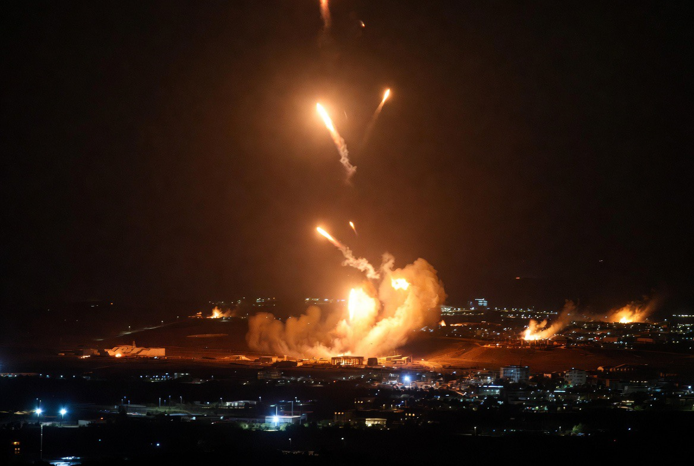

# Perang yang Tak Lagi Bertujuan Menang: Mengapa Negara Modern Memilih Mengelola Konflik daripada Mengakhirinya?

*Ilustrasi (pic: Grok AI).*

  
***Konflik yang “terkendali” tetap membawa korban jiwa, pengungsian, trauma lintas generasi, dan ketidakpastian ekonomi***
  

Selama ribuan tahun, tujuan perang tampak sederhana: Mengalahkan musuh.

Carl von Clausewitz menyebut perang sebagai kelanjutan politik dengan cara lain. Dalam bayangan klasik, perang berakhir ketika salah satu pihak menyerah, ibu kota jatuh, atau rezim berganti. Namun abad ke-21 memperlihatkan sesuatu yang berbeda.

Lihat beberapa konflik besar: Rusia vs Ukraina, Israel vs Hamas, Israel vs Hizbullah, Iran vs Israel, Amerika Serikat vs Iran, serangan terhadap Houthi di Yaman, serta berbagai konflik proksi di Afrika dan Timur Tengah.

Sebagian besar tidak menghasilkan kemenangan mutlak. Mereka justru berlangsung lama. Bahkan kadang sengaja dijaga agar tidak terlalu kecil untuk selesai, tetapi juga tidak terlalu besar hingga berubah menjadi Perang Dunia.

Inilah yang disebut sebagai managed conflict atau managed escalation.

## Dari Total War menuju Controlled War

Perang Dunia II adalah contoh Total War. Targetnya jelas menaklukkan, mengganti rezim,  dan menguasai wilayah.

Tetapi setelah hadirnya senjata nuklir, biaya ekonomi global, dan saling ketergantungan perdagangan, perang total menjadi jauh lebih berbahaya.

Kini negara besar justru mencari sesuatu yang berbeda. Mereka ingin cukup menyerang untuk memberi pesan, tetapi tidak cukup besar hingga menghancurkan sistem internasional yang juga menopang kepentingan mereka sendiri.

## Mengapa Tidak Diselesaikan Saja?

Pertanyaan yang terdengar sederhana ternyata memiliki jawaban yang sangat kompleks.

1. Kemenangan Total Sangat Mahal

Bayangkan Amerika benar-benar menginvasi Iran. Secara militer mungkin memungkinkan, tetapi setelah itu, siapa yang menjaga negara seluas Iran? siapa yang membayar rekonstruksi? bagaimana menghadapi puluhan juta penduduk? bagaimana mencegah perang gerilya selama bertahun-tahun?

Pengalaman Irak dan Afghanistan menjadi pelajaran yang mahal.

Dalam ilmu strategi, kemenangan di medan perang tidak otomatis menjadi kemenangan politik.

2. Konflik yang Terkelola Bisa Menjadi Alat Diplomasi

Ini terdengar sinis, tetapi sering kali realistis.
Konflik dapat digunakan untuk menekan lawan agar bernegosiasi, menunjukkan kredibilitas militer, menguji teknologi senjata, serta memperkuat posisi tawar di meja diplomasi.

Artinya, kadang perang bukan bertujuan menghancurkan musuh. Melainkan mengubah perilaku musuh.

3. Ekonomi Dunia Sudah Terlalu Terhubung

Globalisasi menciptakan paradoks, musuhmu bisa sekaligus menjadi mitra dagangmu.

Jika perang berubah menjadi total, maka harga minyak melonjak, inflasi global meningkat, pasar saham runtuh, rantai pasok terganggu, juga investasi berhenti.

Akibatnya bahkan negara yang “menang” pun ikut mengalami kerugian besar.

## Perang sebagai Sinyal Politik

Dalam teori Thomas Schelling, penggunaan kekuatan sering kali lebih efektif sebagai komunikasi daripada penghancuran.

Misalnya: “Aku mampu menyerangmu.” Tetapi yang ingin disampaikan sebenarnya adalah “Jangan melewati garis merahku.”

Dengan kata lain… rudal menjadi bahasa, drone menjadi kalimat, dan sanksi ekonomi menjadi tanda baca.

Diplomasi tetap berlangsung, hanya medianya berubah.

## Mengapa Konflik Modern Tampak “Naik Turun”?

Ini disebut escalation ladder, bahwa negara tidak langsung menggunakan seluruh kekuatan, sebaliknya mereka menaiki tangga sedikit demi sedikit.

Misalnya sanksi ekonomi, perang siber, serangan drone, rudal terbatas, operasi khusus, tekanan diplomatik, kembali bernegosiasi. Pola ini terus berulang.

Tujuannya bukan sekadar mengalahkan lawan, tetapi menjaga agar konflik tetap berada di bawah ambang perang total.

## Apakah Ini Berarti Dunia Lebih Damai?

Ironisnya… Belum tentu.

Perang mungkin tidak sebesar Perang Dunia II, tetapi justru menjadi lebih sering, lebih tersebar, dan lebih berkepanjangan.

Sebagian ilmuwan menyebutnya sebagai the normalization of conflict, yaitu kekerasan menjadi bagian dari keseharian hubungan internasional.

Dunia tidak selalu berada dalam keadaan damai, tetapi juga tidak sepenuhnya berada dalam perang. Kita hidup di wilayah abu-abu.

## Dimensi Psikologi Politik

Konflik yang berlangsung lama juga membentuk persepsi publik.

Masyarakat perlahan terbiasa mendengar ada rudal ditembakkan, kapal diserang, drone jatuh, pangkalan dibom. Yang dulu dianggap luar biasa kini terasa seperti berita rutin.

Fenomena ini dikenal sebagai desensitisasi, sebuah kondisi ketika publik semakin kebal terhadap kekerasan, ruang politik untuk melanjutkan konflik pun menjadi lebih luas.

## Dimensi Teknologi: Perang yang “Lebih Murah”

Drone, AI, dan senjata presisi mengubah kalkulasi. Jika dulu mengirim satu skuadron pesawat berarti mempertaruhkan banyak pilot, kini sebagian operasi dapat dilakukan dari ribuan kilometer jauhnya.

Biaya politik menurun, risiko domestik berkurang. Akibatnya, ambang untuk menggunakan kekuatan militer ikut turun.

Paradoksnya, semakin “murah” biaya politik perang, semakin mudah keputusan untuk melakukan serangan terbatas.

## Apakah Dunia Sedang Memasuki Era “Perang Permanen”?

Inilah pertanyaan paling mengganggu.

Kita mulai memasuki kondisi yang bisa digambarkan sebagai persistent competition, yaitu negara tidak selalu berperang, tetapi juga tidak pernah benar-benar keluar dari persaingan yang dapat sewaktu-waktu berubah menjadi konflik terbatas.

Bentuknya bisa berupa perang siber, operasi informasi, sanksi ekonomi, tekanan maritim, hingga serangan presisi.

Perdamaian dan perang tidak lagi dipisahkan oleh garis tegas, melainkan oleh spektrum.

Paradoks terbesar abad ke-21 menunjukkan bahwa perang modern semakin jarang dimenangkan, tetapi semakin sering dikelola.

Tujuan strategis banyak negara bergeser dari menghancurkan lawan menjadi mengendalikan perilaku lawan, menjaga kredibilitas, melindungi kepentingan nasional, dan mencegah eskalasi yang dapat merugikan semua pihak.

Namun strategi ini memiliki harga. Konflik yang “terkendali” tetap membawa korban jiwa, pengungsian, trauma lintas generasi, dan ketidakpastian ekonomi. 

Bagi para pembuat kebijakan, konflik mungkin tampak sebagai variabel yang bisa diatur. Namun bagi warga sipil yang hidup di bawah sirene dan reruntuhan, setiap hari tetap terasa sebagai perang yang nyata.

  
**Referensi**

Clausewitz, C. von. (1976). On War. Princeton University Press.

Schelling, T. C. (1966). Arms and Influence. Yale University Press.

Freedman, L. (2017). The Future of War: A History. PublicAffairs.

Kaldor, M. (2012). New and Old Wars: Organized Violence in a Global Era (3rd ed.). Stanford University Press.

Gray, C. S. (2005). Another Bloody Century: Future Warfare. Weidenfeld & Nicolson.

Nye, J. S. (2024). A Life in the American Century. Polity Press. (Untuk konteks evolusi strategi dan kekuasaan dalam hubungan internasional.)
