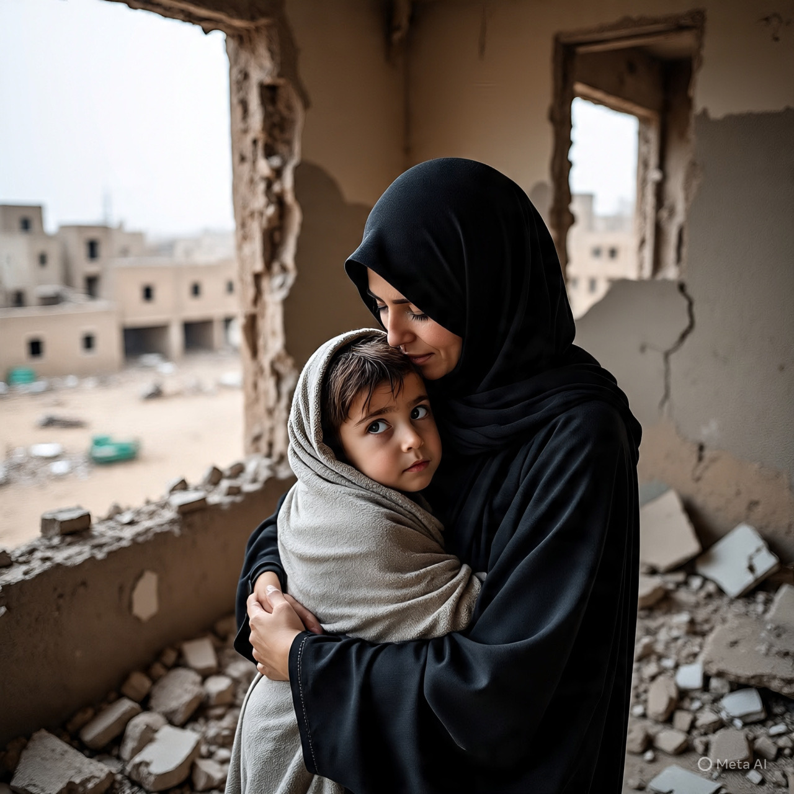

# Konflik Palestina–Israel: Dampak Kemanusiaan, Hukum Internasional, HAM, dan Prospek Penyelesaian

*Ilustrasi wanita dan anak korban perang (pic: Trinity AI/Meta AI).*

  
***Tindakan pemukiman, demolisi, perampasan properti, dan pembatasan bantuan serta pergerakan berulang kali dinilai bertentangan dengan hukum internasio­nal humaniter dan hak asasi***
  

Konflik berkepanjangan di Jalur Gaza dan Tepi Barat telah memunculkan krisis kemanusiaan besar, pelanggaran hak asasi yang serius, serta tantangan struktural terhadap tatanan hukum internasional. 

Tulisan ini menguraikan (1) realitas terkini di lapangan, (2) implikasi terhadap hukum internasional dan HAM, serta (3) analisis prospek solusi politik dalam wacana dua-negara vs satu-negara.

## Keadaan Kemanusiaan Terkini

1. Gaza — keterpurukan yang parah

Akses bantuan kemanusiaan tetap dibatasi, sehingga kebutuhan pokok seperti makanan, bahan bakar, dan perumahan sangat minim, anak-anak tewas akibat hipotermia dan kurang perlindungan musim dinginkarena ketidakmampuan memperoleh shelter layak. 

Contohnya kematian bayi dan anak selama gelombang musim dingin menunjukkan dampak pemblokiran masuknya bantuan vital.  

Infrastruktur sipil hancur masif; menurut PBB hampir 81% bangunan di Gaza rusak atau hancur akibat serangan berulang.  

Banyak warga Gaza masih menjadi korban kekerasan bersenjata meskipun terdapat kesepakatan gencatan senjata, dengan laporan ratusan insiden pelanggaran harian di berbagai wilayah.  

Konsekuensi sosialnya: 
Kekurangan makanan, layanan kesehatan, dan tempat tinggal telah membuat ribuan anak dan keluarga berada di posisi rentan ekstrem, termasuk malnutrisi dan ancaman penyakit menular.

2. Tepi Barat— perampasan dan tekanan struktural

Otoritas Israel menurunkan order demolisi terhadap fasilitas sosial seperti lapangan sepak bola di kamp pengungsi, yang diakui sebagai ruang penting bagi anak-anak, serta mencerminkan tren perampasan ruang publik.  

Demolisi rumah dan properti pribadi telah menyebabkan ribuan orang, termasuk anak-anak, kehilangan rumah mereka — statistik lembaga kemanusiaan menunjukkan ratusan anak menjadi pengungsi akibat kebijakan ini.  

Laporan HAM menyebutkan pola kekerasan dan perusakan properti, serta pembunuhan dan penahanan warga sipil di West Bank, sebagai bagian dari suatu strategi yang melibatkan pemindahan paksa yang dilarang oleh hukum okupasi.  

Konsekuensi sosialnya:
Komunitas Palestina terjadi fragmentasi sosial, keterbatasan akses pendidikan dan layanan publik, serta meningkatnya ketidakamanan fisik dan psikologis.

## Implikasi Politik dan Hukum Internasional

1. Hukum Humaniter Internasional

Konvensi Jenewa Keempat melarang pemindahan paksa warga sipil dan menghancurkan properti sipil tanpa alasan militer yang sah. 

Demolisi rumah, penggusuran paksa, dan perampasan fasilitas publik yang bukan sasaran militer telah banyak dikritik oleh organisasi HAM sebagai pelanggaran hukum okupasi.  

Dalam opini nasihat ICJ (2025), dinyatakan bahwa Israel sebagai kekuatan pendudukan tetap terikat oleh kewajiban hukum humaniter internasional untuk melindungi populasi sipil di wilayah pendudukan.  

2. Hukum Hak Asasi Manusia

Larangan akses bantuan kemanusiaan, pembatasan pergerakan, serta hambatan sistematis terhadap hak hidup, pendidikan, dan kesejahteraan telah dipandang oleh berbagai badan internasional sebagai pelanggaran Hak Asasi Manusia fundamental. 

Laporan UNICEF misalnya menyoroti ribuan anak yang kekurangan suplai dasar seperti vaksinasi dan nutrisi.  

Mahkamah Pidana Internasional juga telah mengeluarkan surat perintah penangkapan terhadap beberapa pejabat terkait dugaan kejahatan perang dan pelanggaran HAM berat di Gaza.  

## Prospek Penyelesaian Politik

1. Solusi Dua-Negara

Argumen pro:

Solusi ini secara historis dianggap sebagai kerangka yang paling mungkin untuk mengakui kedaulatan dan hak penentuan nasib sendiri kedua pihak (Israel dan Palestina), dengan Gaza dan Tepi Barat sebagai elemen utama negara Palestina merdeka di samping negara Israel. 

Pendekatan ini masih didukung dalam banyak resolusi PBB dan narasi diplomatik internasional.

Tantangan besar:

•	Konstruksi pemukiman Israel di West Bank dan perluasan kontrol teritorial membuat batas yang dapat dinegosiasikan semakin sempit.
•	Ketidakpercayaan historis terhadap implementasi fase-fase gencatan senjata dan penghormatan hak warga sipil.
•	Ketidaksepakatan internal antara faksi Palestina dan kurangnya mekanisme penegakan diplomatik internasional yang kuat.

2. Opsi Satu-Negara

Beberapa analis mengajukan opsi satu-negara sebagai republik binasional atau federatif di mana semua warga memiliki hak politik setara. 

Dalam skenario ini, isu diskriminasi struktural dan pembatasan hak asasi akan menjadi fokus, namun proposal ini menghadapi resistensi kuat dari faksi yang melihatnya sebagai ancaman identitas nasional masing-masing pihak.

## Kesimpulan

1.	Krisis Kemanusiaan Mendalam

Gaza mengalami kerusakan infrastruktur yang sangat besar dan tekanan akibat blokade serta kekerasan bersenjata yang berdampak pada jutaan warga sipil, termasuk anak-anak yang kekurangan kebutuhan dasar.  

2.	Pelanggaran HAM dan Hukum Internasional

Tindakan pemukiman, demolisi, perampasan properti, dan pembatasan bantuan serta pergerakan berulang kali dinilai bertentangan dengan hukum internasio­nal humaniter dan hak asasi.  

3.	Solusi Politik yang Rumit

Prospek dua-negara tetap menjadi standar diplomatik, tetapi realitas di lapangan dan dinamika politik internal menghimpit kemungkinan realisasinya. Opsi satu-negara menghadapi tantangan besar dalam tataran politis dan identitas.

  
**REFERENSI**

Amnesty International. (2024). Israel and the Occupied Palestinian Territories: Unlawful attacks and collective punishment in Gaza. Amnesty International. https://www.amnesty.org

Antara News Agency. (2025). PBB: 81 persen bangunan di Gaza rusak akibat serangan Israel. https://www.antaranews.com

Human Rights Watch. (2025). “All my dreams have been erased”: Israel’s forced displacement of Palestinians in the occupied West Bank. Human Rights Watch. https://www.hrw.org

International Court of Justice. (2024). Advisory opinion on the legal consequences arising from the policies and practices of Israel in the Occupied Palestinian Territory. ICJ. https://www.icj-cij.org

Office of the United Nations High Commissioner for Human Rights. (2026). UN report on intensification of discrimination against Palestinians in the occupied West Bank. OHCHR. https://www.ohchr.org

Reuters. (2026, January 13). West Bank soccer field slated for demolition by Israel. Reuters. https://www.reuters.com

Save the Children. (2025). West Bank: Record number of Palestinian children displaced by demolitions. Save the Children International. https://www.savethechildren.org

The Guardian. (2026, January 17). Child mortality crisis continues in Gaza with deaths linked to cold and lack of shelter. The Guardian. https://www.theguardian.com

United Nations Office for the Coordination of Humanitarian Affairs. (2025). Humanitarian needs overview: Occupied Palestinian Territory. OCHA. https://www.ochaopt.org

UNICEF. (2025). Palestinian children deprived of essential services amid ongoing hostilities. UNICEF. https://www.unicef.org

United Nations General Assembly. (1949). Geneva Convention Relative to the Protection of Civilian Persons in Time of War (Fourth Geneva Convention). United Nations Treaty Collection
