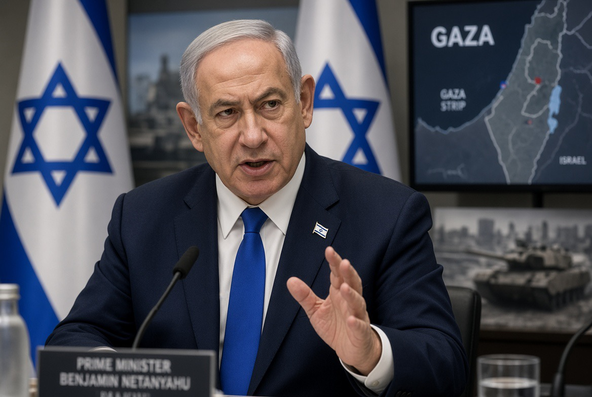

# Perdamaian dengan Syarat Sepihak: Gaza, Perlucutan Hamas, & Masalah Kepercayaan terhadap Israel

*Ilustrasi (pic: Grok AI).*

  
***Perdamaian yang hanya meminta pihak yang lebih lemah melepaskan senjatanya, tanpa mengubah struktur yang membuatnya merasa tidak aman, bukanlah perdamaian. Itu hanya jeda sebelum bab berikutnya***
  

Pertanyaan yang jauh lebih fundamental adalah: Apa yang terjadi kepada Palestina setelah senjata Hamas benar-benar diletakkan? Sebab perlucutan senjata adalah alat, bukan tujuan akhir. 

Kalau Hamas dilucuti tetapi tentara Israel tetap berada di Gaza, wilayah Palestina tetap dikendalikan dari luar, pembangunan kembali tidak berjalan, penduduk tetap tidak memiliki keamanan, dan tidak ada mekanisme politik yang menjamin pemerintahan Palestina, maka perlucutan senjata berpotensi berubah dari jalan menuju perdamaian menjadi mekanisme demiliterisasi sepihak.

Itulah sumber ketidakpercayaan terbesar.

## Netanyahu Meminta Perubahan Urutan

Menurut laporan Reuters, Trump menginginkan skema gencatan senjata, kemudian perlucutan Hamas, lalu dilanjut penarikan Israel secara bertahap, sehingga tercipta stabilisasi internasional.

Tetapi Netanyahu mengatakan bahwa Hamas harus benar-benar dilucuti terlebih dahulu, baru Israel bersedia menarik pasukannya. 

Kelihatannya seperti perbedaan teknis. Padahal secara politik, ini perbedaan fundamental, karena pihak yang menyerahkan kartu terakhir terlebih dahulu berada dalam posisi tawar yang lebih lemah.

## Setelah Hamas dilucuti lalu apa?

Justru ini problem klasik dalam teori perdamaian, yakni commitment problem.

Dua pihak mungkin sama-sama ingin mengakhiri perang, tetapi tidak percaya pihak lain akan memenuhi janji setelah mereka sendiri kehilangan kemampuan untuk memaksa.

Bayangkan Palestina berkata: “Kami menyerahkan senjata. Sekarang Israel harus pergi.” Tetapi Israel menjawab: “Kami pergi setelah kami yakin Hamas benar-benar tidak mampu mengancam kami.”

Maka muncul lingkaran: Israel menuntut keamanan, Palestina menuntut penarikan, Israel menuntut perlucutan, Palestina takut dilucuti tanpa perlindungan.

Tanpa third-party enforcement, kesepakatan semacam ini gampang berubah menjadi permainan saling curiga.

## Sejarah Menjadi Relevan

Kekhawatiran mengenai perlakuan terhadap warga Palestina setelah perlucutan senjata juga tidak muncul dari ruang hampa.

Di Tepi Barat, OHCHR pada 2026 mencatat persoalan serius terkait kekerasan pemukim, pembunuhan dengan impunitas, serta pelanggaran due process terhadap warga Palestina. 

Salah satu dokumen PBB menyebut 9.243 warga Palestina berada dalam tahanan Israel per Januari 2026, termasuk 3.385 administrative detainees yang ditahan tanpa persidangan. 

Jadi ada pertanyaan politik yang sah: Kalau masyarakat Palestina diminta menyerahkan alat perlawanan, siapa yang menjamin mereka terhadap kekerasan yang justru berasal dari aktor negara atau pemukim bersenjata?

Jawabannya tidak bisa “Percaya saja.” Sebab dalam hubungan internasional, kepercayaan bukan mekanisme keamanan.

## Tepi Barat “Laboratorium Kepercayaan”

Ini bagian yang paling penting. Jika sebuah negara mengatakan: “Kami membutuhkan perlucutan Hamas demi keamanan.”

Tetapi pada saat yang sama warga Palestina di Tepi Barat menghadapi kekerasan pemukim, pengambilalihan properti, pembatasan, dan sistem penahanan yang dipersoalkan lembaga HAM internasional, maka kredibilitas argumen tersebut ikut diuji.

Bukan berarti setiap tindakan Israel identik dengan Hamas, bukan itu argumennya.

Argumennya adalah: Keamanan harus berlaku dua arah. Kalau hanya satu pihak yang memperoleh keamanan sementara pihak lain hanya memperoleh kewajiban, itu bukan security architecture. Itu hierarki keamanan.

## Penjara Israel: Bukti PBB Sangat Serius

OHCHR mencatat laporan tentang kondisi penahanan yang sangat keras, termasuk kepadatan ekstrem, kekurangan makanan, malnutrisi, buruknya sanitasi dan layanan kesehatan, serta dugaan kekerasan terhadap tahanan. 

Dokumen OHCHR 2026 juga mencatat laporan bahwa setidaknya 75 tahanan Palestina meninggal sejak 7 Oktober 2023, disertai laporan mengenai dugaan penyiksaan, penolakan perawatan medis, dan malnutrisi ekstrem. 

Jadi ketika kita mengatakan kondisi tahanan Palestina perlu diperhatikan, itu bukan sekadar narasi emosional. Ada dokumentasi badan PBB yang memang harus dianggap serius.

Tentu, setiap tuduhan individual tetap perlu investigasi dan proses hukum. Tetapi pola kondisi penahanan yang didokumentasikan lembaga internasional tidak pantas disapu ke bawah karpet.

## Berapa Banyak Warga Gaza yang Tewas?

Ini harus hati-hati karena angka berubah terus dan terdapat perbedaan antara kematian langsung yang tercatat dan estimasi excess mortality.

Reuters melaporkan bahwa pada akhir November 2025, Kementerian Kesehatan Gaza telah melaporkan lebih dari 70.000 kematian Palestina sejak perang dimulai; Israel mempertanyakan akurasi angka tersebut, tetapi tidak menerbitkan angka tandingan komprehensifnya sendiri. 

Yang bahkan lebih mengerikan, penelitian yang dipublikasikan pada 2026 dan dilaporkan Reuters memperkirakan bahwa lebih dari 75.000 warga Palestina mungkin telah meninggal dalam 15 bulan pertama perang, jauh di atas angka administratif yang tersedia pada saat itu. 

Dan ingat, angka kematian langsung tidak sama dengan seluruh dampak perang. Ada pula kematian akibat kelaparan, penyakit, kehancuran fasilitas kesehatan, tidak tersedianya obat, luka yang tidak tertangani, dan kondisi hidup yang runtuh.

Karena itu angka korban sebenarnya baru mungkin diketahui lebih baik setelah akses administratif dan epidemiologis memungkinkan.

## Hamas Dilucuti lalu Kriminalisasi?

Risikonya ada sebagai persoalan politik dan hukum, tetapi kita tidak boleh menyatakan sebagai fakta bahwa itu pasti akan terjadi.

Ini justru alasan mengapa kesepakatan damai harus mempunyai jaminan institusional. Misalnya:Pengawasan internasional.

Bukan hanya memantau Hamas, tetapi juga memantau IDF, kelompok bersenjata Palestina, pemukim bersenjata, serta aparat keamanan Palestina.

1. Mekanisme investigasi independen

Jika ada penangkapan, pembunuhan, penyiksaan atau perampasan properti, harus ada lembaga yang dapat memeriksa semuanya.

2. Penarikan militer yang terjadwal

Bukan: “Kami pergi nanti kalau kami sudah merasa aman.” Tetapi tanggal, lokasi, tahapan, dan mekanisme verifikasi yang jelas.

3. Perlindungan politik Palestina

Demiliterisasi tanpa horizon politik hanya menghasilkan populasi yang tidak bersenjata tetapi tetap berada dalam konflik. Itu bukan perdamaian.

## Satu Paradoks Besar

Netanyahu mengatakan Israel tidak akan menarik pasukannya sebelum Hamas sepenuhnya dilucuti. 

Tetapi justru kehadiran militer yang terus-menerus dapat menjadi salah satu alasan Hamas dan masyarakat Palestina tidak mempercayai perlucutan senjata.

Jadi:

Israel:
“Taruh senjata dulu supaya kami aman.”

Palestina:
“Tarik pasukan dulu supaya kami percaya.”

Dan tanpa mekanisme pihak ketiga, keduanya mempunyai alasan rasional untuk tidak menjadi pihak pertama yang menyerah. Inilah commitment problem dalam bentuk yang sangat brutal.

## Damai Harus Diukur dari Kedua Sisi

Kalau definisi perdamaian hanya Israel tidak lagi diserang, maka itu bukan perdamaian. Itu keamanan Israel.

Perdamaian yang sesungguhnya harus menjawab dua pertanyaan sekaligus:

Apakah warga Israel aman dari serangan?

Ya.

Apakah warga Palestina aman dari pendudukan, pengusiran, kekerasan, penahanan sewenang-wenang, dan penghancuran kehidupan sipil?

Juga harus ya.

Kalau salah satunya “tidak”, sistem tersebut masih menghasilkan konflik laten.

Problem Gaza sekarang bukan sekadar “Apakah Hamas mau menyerahkan senjata?” Problem sebenarnya adalah “Apa yang akan diberikan kepada Palestina sebagai imbalan atas senjata yang mereka serahkan?”

Kalau jawabannya hanya “Israel tetap tinggal sampai merasa aman.” maka Palestina mempunyai alasan kuat untuk takut bahwa perlucutan senjata berarti kehilangan daya tawar tanpa memperoleh keamanan atau kedaulatan sebagai gantinya.

Sebaliknya, jika Israel diminta menarik diri tanpa mekanisme yang dapat mencegah serangan terhadap warga Israel, Israel juga mempunyai alasan keamanan yang tidak boleh diabaikan.

Maka jalan keluarnya bukan memilih salah satu ketakutan. Jalan keluarnya adalah membuat kedua pihak kehilangan kemampuan untuk mengkhianati kesepakatan.

Itulah fungsi sebenarnya dari pengawasan internasional, jadwal penarikan, jaminan keamanan, akuntabilitas, pemerintahan Palestina, rekonstruksi, serta penyelesaian politik.

Dan kalau satu pihak berkata: “Saya akan menyerahkan senjata, tetapi saya ingin jaminan bahwa saya tidak akan ditinggalkan setelahnya,”

itu bukan permintaan ekstrem. Itu adalah masalah desain perdamaian yang sangat rasional.

Karena sejarah konflik menunjukkan satu hal yang kejam: Perdamaian yang hanya meminta pihak yang lebih lemah melepaskan senjatanya, tanpa mengubah struktur yang membuatnya merasa tidak aman, bukanlah perdamaian. Itu hanya jeda sebelum bab berikutnya. 

  
**Referensi**

Associated Press. (2026, August 9). Israel rejects Trump’s Gaza plan as Netanyahu insists on disarming Hamas. Associated Press. AP News⁠

Office of the United Nations High Commissioner for Human Rights. (2026, May 19). Special Rapporteur on torture warns of persistent risks for Palestinian detainees. United Nations. OHCHR⁠

Office of the United Nations High Commissioner for Human Rights. (2026, February 19). Ethnic cleansing concerns in Gaza and West Bank amid intensified violence and displacement. United Nations. OHCHR⁠

Reuters. (2026, August 3). After deadly day, Gazans say Trump’s plan jars with grim reality. Reuters. Reuters⁠

Reuters. (2026, August 9). Israel rejects Trump’s 15-point plan for Gaza, PM Netanyahu says. Reuters. Reuters⁠

Reuters. (2026, February 19). Gaza deaths in war’s first 15 months higher than reported, study says. Reuters. Reuters⁠

Reuters. (2025, November 29). Gaza death toll tops 70,000, health ministry says. Reuters. Reuters⁠
