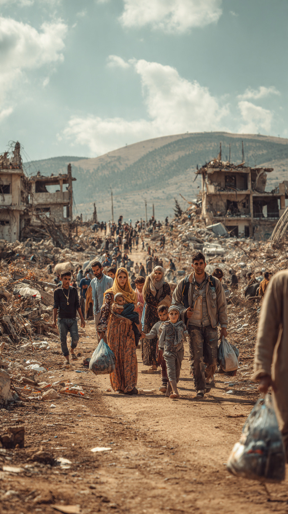

# Gencatan Senjata Tanpa Kedamaian: Perempuan & Anak sebagai Korban Utama Konflik Lebanon 2026

*Ilustrasi (pic: Meta AI).*

  
***Ada satu kalimat yang sering hilang di tengah angka korban dan laporan militer: Anak-anak tidak pernah memulai perang, tetapi hampir selalu ikut mewarisinya***
  

Dalam teori hubungan internasional, gencatan senjata (ceasefire) sering dipahami sebagai langkah pertama menuju perdamaian. 

Namun kasus Lebanon 2026 menunjukkan paradoks yang menyakitkan: senjata mungkin berkurang, tetapi penderitaan sipil tetap berlangsung. 

Tulisan ini menganalisis dampak konflik terhadap perempuan dan anak di Lebanon Selatan dengan menggunakan perspektif keamanan manusia (human security), trauma kolektif, dan hukum humaniter internasional. 

Temuan menunjukkan bahwa kelompok yang paling sedikit berperan dalam pengambilan keputusan perang justru menanggung beban terbesar akibat perang.

## Pendahuluan

Ada kalanya kata yang paling menipu dalam politik internasional adalah: “gencatan senjata” Karena masyarakat awam membayangkan:
bom berhenti,
tentara pulang,
anak-anak kembali sekolah.

Padahal dalam banyak konflik modern, yang berhenti sering kali hanya headline berita. Sementara di lapangan:
rumah masih hancur,
keluarga masih mengungsi,
anak masih ketakutan setiap malam.

## Ceasefire di Atas Kertas vs Ceasefire di Dunia Nyata

Dalam studi perdamaian terdapat perbedaan antara: Negative Peace (Tidak ada pertempuran besar) dan Positive Peace (Keamanan, stabilitas, layanan publik, dan kehidupan normal benar-benar kembali.)

Lebanon saat ini lebih dekat ke kondisi pertama. Secara diplomatik:“ceasefire exists” sementara secara sosial: “peace does not.”

Akibatnya warga sipil hidup dalam keadaan yang oleh para peneliti konflik disebut: Suspended War, yakni perang yang belum benar-benar selesai.

## Mengapa Perempuan Menjadi Korban Utama?

Perang sering dibayangkan sebagai urusan tentara. Padahal dampak terbesarnya justru menimpa:
ibu,
anak perempuan,
perempuan hamil,
janda perang.

Ketika desa hancur, yang pertama hilang adalah:
akses air,
sanitasi,
klinik,
layanan kesehatan reproduksi.

Akibatnya risiko meningkat:
komplikasi kehamilan,
kematian ibu,
infeksi,
kekurangan gizi.

Dalam banyak konflik, perempuan akhirnya menjadi manajer penderitaan keluarga. Mereka harus mencari:
makanan,
air,
obat,
tempat berlindung,
sementara seluruh sistem sosial runtuh.

## Anak-Anak dan Perang yang Tidak Mereka Pilih

Ada fakta pahit dalam semua perang, anak-anak tidak memilih perang namun mereka mewarisi akibatnya.

Ketika anak tidur sambil mendengar:
ledakan,
sirene,
tembakan,
otak mereka belajar bahwa dunia adalah tempat berbahaya.

Dalam psikologi trauma, paparan konflik berkepanjangan dapat memicu:
kecemasan kronis,
gangguan tidur,
PTSD,
kesulitan belajar,
masalah perkembangan sosial.

Yang mengerikan, bekas luka psikologis sering bertahan jauh lebih lama daripada reruntuhan bangunan.

## Kelaparan sebagai Senjata Tak Terlihat

Banyak laporan kemanusiaan menunjukkan keluarga:
mencari makanan di reruntuhan,
hidup dengan bantuan terbatas,
kehilangan mata pencaharian.

Perang modern tidak hanya membunuh dengan peluru. Ia juga membunuh melalui: penghancuran sistem kehidupan.

Ketika:
pasar hancur,
jalan rusak,
ladang terbakar,
maka kelaparan menjadi konsekuensi yang hampir otomatis.

## Krisis Kesehatan yang Jarang Masuk Berita

Media biasanya meliput:
ledakan,
serangan udara,
korban tewas.

Yang lebih jarang terlihat adalah:
bayi tanpa susu,
ibu hamil tanpa dokter,
pasien kronis tanpa obat.

Padahal secara statistik, setelah konflik besar, kematian akibat gangguan layanan kesehatan sering kali dapat menyamai atau bahkan melampaui korban langsung pertempuran.

## Trauma Kolektif Sebuah Bangsa

Yang sedang terjadi bukan hanya trauma individu tetapi trauma kolektif. Seluruh komunitas mengalami:
kehilangan rumah,
kehilangan keluarga,
kehilangan rasa aman.

Dan trauma kolektif punya sifat berbahaya: ia dapat diwariskan.

Anak yang tumbuh dalam ketakutan ekstrem berisiko membawa memori konflik itu hingga dewasa. 

Akibatnya perang tidak hanya menghancurkan masa kini. Ia juga menciptakan bayangan bagi masa depan.

## Krisis Moral Komunitas Internasional

Konflik Lebanon memunculkan pertanyaan yang tidak nyaman: Apakah dunia hanya peduli saat bom jatuh, tetapi melupakan korban setelah kamera pergi?

Karena setelah gencatan senjata diumumkan:
perhatian media turun,
bantuan melambat,
donor mulai beralih ke krisis lain.

Padahal bagi ibu yang kehilangan rumah dan anak yang kehilangan sekolah, perang belum selesai.

## Inti Terdalamnya

Ketika para pemimpin berbicara tentang:
strategi,
keamanan,
geopolitik,
mereka sering berbicara dalam bahasa negara.

Tetapi perang akhirnya selalu diterjemahkan ke bahasa manusia. Bahasa itu berbunyi:
seorang ibu mencari susu,
seorang anak mencari ayahnya,
seorang keluarga mencari rumah yang sudah tidak ada.

Di situlah ukuran sebenarnya dari sebuah konflik. Bukan berapa rudal yang ditembakkan, bukan berapa wilayah yang direbut. Melainkan berapa banyak masa kecil yang hilang sebelum orang dewasa memutuskan bahwa perang sudah cukup.

Kasus Lebanon 2026 menunjukkan bahwa gencatan senjata tidak otomatis menghasilkan perdamaian, selama:
pengungsian berlanjut,
rumah belum dibangun kembali,
layanan kesehatan lumpuh,
dan trauma terus menghantui,
maka perdamaian masih menjadi janji yang belum ditepati.

Dan seperti sering terjadi dalam sejarah… yang membayar harga tertinggi bukanlah para pemimpin yang membuat keputusan perang, melainkan perempuan yang harus menjaga keluarganya tetap hidup, dan anak-anak yang bahkan belum cukup umur untuk memahami mengapa dunia mereka runtuh.

  
**Referensi**

United Nations Population Fund
United Nations Population Fund. (2025). Women and girls in humanitarian crises: Lebanon situation update.

United Nations Children’s Fund
UNICEF. (2025). The impact of armed conflict on children in the Middle East.

United Nations High Commissioner for Refugees
UNHCR. (2025). Lebanon displacement and protection report.

World Health Organization
World Health Organization. (2025). Health emergencies and conflict settings: Lebanon assessment.

United Nations Office for the Coordination of Humanitarian Affairs
OCHA. (2025). Humanitarian needs overview: Lebanon.
