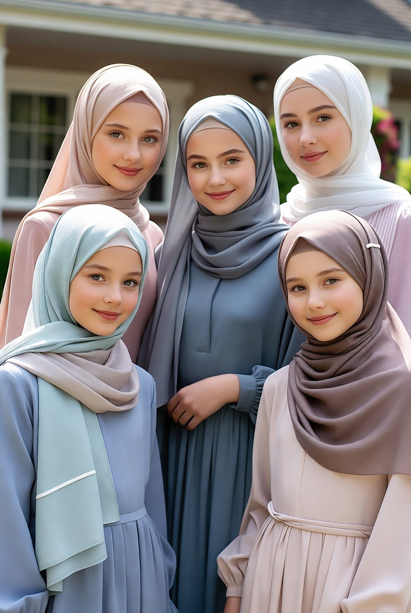

# Perempuan, Rumah, & Kebebasan: Kajian Teologi Islam, Sosiologi, dan Filsafat Peradaban

*Ilustrasi (pic: Grok AI).*

  
***Islam memuliakan perempuan bukan karena mereka berada di dalam rumah atau di luar rumah, melainkan karena mereka adalah manusia yang memiliki martabat di hadapan Allah***
  

Perdebatan mengenai peran perempuan dalam Islam kembali mengemuka seiring meningkatnya tuntutan sebagian perempuan di negara-negara Timur Tengah untuk memperoleh ruang lebih besar dalam pendidikan, pekerjaan, dan kehidupan publik. 

Sebagian kalangan memandang perubahan ini sebagai bentuk emansipasi, sementara yang lain melihatnya sebagai adopsi nilai Barat yang berpotensi mengikis struktur keluarga.

Tulisan ini membahas persoalan tersebut melalui perspektif Al-Qur’an, hadis, sejarah Islam, sosiologi keluarga, psikologi, dan filsafat politik.

Analisis menunjukkan bahwa Islam sangat menekankan kehormatan, keamanan, dan kemuliaan perempuan, tetapi terdapat keragaman pandangan ulama mengenai sejauh mana perempuan berkiprah di ruang publik.

## Apakah Islam Memerintahkan Perempuan Selalu di Rumah?

Ayat yang paling sering dikutip adalah firman Allah kepada istri-istri Nabi:

“Dan hendaklah kamu tetap di rumahmu…”

(QS. Al-Ahzab: 33)

Namun, para mufasir menjelaskan bahwa ayat ini secara langsung ditujukan kepada istri-istri Nabi Muhammad yang memiliki kedudukan khusus. 

Dari ayat ini, banyak ulama mengambil nilai umum tentang pentingnya menjaga kehormatan, bukan larangan mutlak bagi semua perempuan untuk keluar rumah.

Pada saat yang sama, terdapat riwayat sahih bahwa Nabi bersabda agar para lelaki tidak melarang perempuan pergi ke masjid, meskipun beliau juga menyebut bahwa salat perempuan di rumah memiliki keutamaan tertentu. 

Ini menunjukkan bahwa perempuan pada masa Nabi memang hadir di ruang publik dalam batas-batas syariat.

## Apakah Perempuan pada Zaman Nabi Bekerja?

Sejarah Islam menunjukkan gambaran yang lebih beragam daripada yang sering dibayangkan.

Khadijah binti Khuwailid adalah seorang pedagang sukses sebelum dan selama pernikahannya dengan Nabi.

Aisyah binti Abu Bakar menjadi guru bagi banyak sahabat dan meriwayatkan ribuan hadis.

Ada pula perempuan yang menjadi tenaga medis, membantu logistik peperangan, bahkan berdagang di pasar.

Artinya, Islam sejak awal mengenal perempuan yang aktif di ruang publik. Yang menjadi perhatian utama bukanlah sekadar “di luar atau di dalam rumah”, melainkan adab, keamanan, dan tanggung jawab.

## Mengapa Sebagian Perempuan di Timur Tengah Menginginkan Perubahan?

Motivasinya tidak tunggal. Beberapa penelitian sosiologi menunjukkan alasan yang beragam, diantaranya adalah ingin berkontribusi secara profesional, memperoleh pendidikan lebih tinggi, memiliki kemandirian ekonomi, atau merasa aturan sosial tertentu lebih merupakan tradisi daripada tuntunan agama.

Di sisi lain, ada pula banyak perempuan di negara-negara Teluk yang memang memilih menjadi ibu rumah tangga dan merasa bahagia dengan pilihan tersebut.

Karena itu, tidak tepat menganggap seluruh perempuan di kawasan tersebut menginginkan hal yang sama.

Apakah Kehidupan di Rumah Lebih Melindungi?

Secara statistik, banyak risiko di ruang publik memang nyata, diantaranya adalah pelecehan seksual, eksploitasi kerja, perdagangan manusia, dan kekerasan jalanan.

Karena itu, Islam menekankan perlindungan terhadap perempuan dan memerintahkan laki-laki untuk menjaga mereka, sekaligus memerintahkan laki-laki menundukkan pandangan dan menjaga kehormatan perempuan.

Namun, perlu diingat pula bahwa kekerasan terhadap perempuan juga dapat terjadi di ranah domestik. Islam mengecam kezaliman, baik yang terjadi di jalan maupun di dalam rumah.

Jadi, solusi Islam bukan sekadar memindahkan lokasi perempuan, melainkan membangun akhlak dan keadilan.

## Apakah Pemisahan Ketat Laki-laki dan Perempuan Otomatis Mengurangi Penyimpangan Seksual?

Secara ilmiah, jawabannya tidak sesederhana “ya” atau “tidak”.

Psikologi dan kriminologi menunjukkan bahwa perilaku seksual dipengaruhi oleh banyak faktor: pendidikan moral, pengendalian diri, lingkungan, kesehatan mental, budaya, serta penegakan hukum.

Tidak ada bukti ilmiah yang menunjukkan bahwa pemisahan ruang laki-laki dan perempuan saja otomatis menghilangkan perselingkuhan, pelecehan, atau penyimpangan seksual.

Sebaliknya, masyarakat dengan interaksi bebas juga tidak otomatis kehilangan moral. Yang paling menentukan tetaplah pembentukan karakter dan etika.

## Analisis Filsafat

Perdebatan ini sebenarnya menyentuh pertanyaan yang lebih dalam: Apakah kebebasan adalah tujuan hidup manusia?

Filsafat liberal cenderung menjawab bahwa semakin banyak pilihan, semakin bebas manusia. Sedangkan dalam banyak tradisi Islam, kebebasan dipahami berbeda.

Manusia bukan sekadar bebas melakukan apa saja. Ia juga dipanggil untuk mengendalikan diri (mujahadah an-nafs), sehingga kebebasan selalu berjalan bersama tanggung jawab kepada Allah dan kepada sesama.

Islam memuliakan perempuan bukan karena mereka berada di dalam rumah atau di luar rumah, melainkan karena mereka adalah manusia yang memiliki martabat di hadapan Allah.

Rumah dapat menjadi tempat yang sangat mulia bila dipenuhi kasih sayang, penghormatan, dan kecukupan.

Ruang publik juga dapat menjadi tempat pengabdian yang mulia bila dijalani dengan amanah, adab, dan perlindungan terhadap kehormatan.

Maka, pertanyaan yang lebih penting bukanlah: “Di mana perempuan seharusnya berada?” Melainkan:“Bagaimana masyarakat membangun keluarga, pekerjaan, dan ruang publik yang menjaga kehormatan, keadilan, dan keselamatan bagi semua?”

Islam memberikan prinsip-prinsip moralnya. Adapun bagaimana prinsip itu diterapkan dalam masyarakat modern, ruang ijtihad para ulama dan pembuat kebijakan tetap terbuka selama tidak bertentangan dengan nash yang jelas.

  
**Referensi**

Al-Qur’an. (QS. Al-Ahzab: 33; QS. An-Nur: 30-31).

Muhammad. Sahih al-Bukhari; Sahih Muslim (bab tentang salat perempuan dan adab bermasyarakat).

Ibn Kathir. Tafsir al-Qur’an al-’Azim.

Al-Qurtubi. Al-Jami’ li Ahkam al-Qur’an.

Leila Ahmed. (1992). Women and Gender in Islam. Yale University Press.
