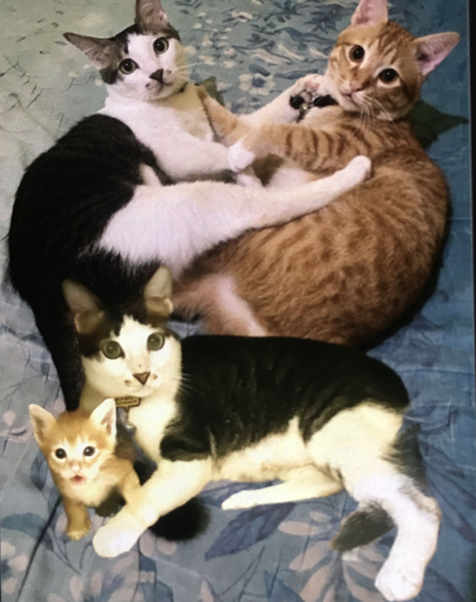

# Pertumbuhan Ahong & Paradoks Anak yang Lebih Besar dari Induknya: Kajian Etologi, Nutrisi, dan Attachment Kucing Domestik

*Atas: BotBot dan Ahong sekarang. Bawah: Ahong saat pertama diadopsi (Pic: Koleksi Pribadi).*

  
***Paradoks Ahong dapat dirumuskan sebagai: “Pertumbuhan biologis dapat melampaui pertumbuhan relasional.”***
  

Tulisan ini menganalisis pertumbuhan pesat Ahong dibanding BotBot, serta mempertahankan perilaku menyusu meskipun ukuran tubuh telah melampaui figur pengasuhnya. 

Artikel menunjukkan bahwa ukuran fisik dan status emosional sering berkembang secara independen dalam relasi sosial mamalia.

## Pendahuluan

Dalam dunia mamalia, pertumbuhan biologis tidak selalu sejalan dengan perkembangan sosial dan emosional.

Kasus Ahong menarik karena: mengalami pertumbuhan fisik luar biasa, melampaui ukuran tubuh BotBot, namun tetap mempertahankan perilaku infantile.

Secara sederhana, tubuh berkata “aku dewasa” sementara otak emosional berkata “aku masih bayi mamih.” 

## Mengapa Ahong Bisa Lebih Besar?

Jika diamati dari Faktor Nutrisi, menu Ahong meliputi: itik goreng, bakpia keju, sup tuna, mackerel, serta daging bakar.

Secara energi dan protein, Ahong menerima nutrisi yang jauh lebih kaya dibanding pengalaman hidup awal BotBot.

Bila dilihat dari Faktor Riwayat Hidup, BotBot berasal dari lingkungan jalanan.

Kucing liar sering mengalami kekurangan protein, kekurangan kalori, infeksi parasit, serta periode kelaparan.

Kondisi ini dapat menghambat pertumbuhan optimal. Turner & Bateson menjelaskan bahwa riwayat nutrisi awal sangat memengaruhi ukuran tubuh dewasa pada kucing domestik.

Dengan kata lain, BotBot tumbuh dalam ekonomi resesi. Sedangkan Ahong tumbuh dalam paket stimulus ekonomi penuh. 

## Mengapa Ahong Tetap Ingin Menyusu?

Di sinilah bagian paling menarik.

Perilaku menyusu pada Ahong kemungkinan bukan lagi kebutuhan nutrisi, melainkan Comfort Nursing.

Perilaku ini ditemukan pada banyak mamalia. Tujuannya untuk menenangkan diri, mengurangi stres, dan mempertahankan attachment.

Artinya, Ahong tidak mencari susu, ia mencari BotBot.

## Paradoks Ukuran Tubuh

Secara visual sekarang, tubuh Ahong tumbuh besar, sementara BotBot lebih kecil. Namun dalam struktur relasi, Ahong tetaplah anak, sedangkan BotBot induknya.

Ini menunjukkan bahwa status emosional tidak ditentukan ukuran fisik.

Fenomena serupa juga terlihat pada manusia. Ada orang berusia 40 tahun yang masih menelepon ibunya untuk bertanya: “Mah, ini cucian putih dicampur warna boleh gak?” 

## Mengapa BotBot Kadang Jengkel?

Karena dari sudut pandang BotBot, awalnya: “kasihan, bayi.” Kemudian: “masih bayi.” Lalu: “kok masih bayi?”, Dan akhirnya: “INI BAYI APA DINOSAURUS?”.

Tonjokan kecil BotBot dapat dipahami sebagai bentuk social correction. Pesannya: “aku sayang kamu, tapi jangan keterlaluan.”

## Analisis Filosofis

Kasus Ahong mengajarkan sesuatu yang menarik, bahwa makhluk hidup tidak selalu melepaskan identitas lama ketika tumbuh.

Kadang tubuh berubah, usia berubah, ukuran berubah, tetapi memori emosional tetap tinggal.

Bagi Ahong, BotBot bukan sekadar kucing lain. BotBot adalah tempat pertama yang memberinya rasa aman ketika ia kecil dan ketakutan.

Dan memori seperti itu sering bertahan jauh lebih lama daripada ukuran tubuh.

Ahong menjadi lebih besar daripada BotBot karena kombinasi nutrisi yang lebih baik, lingkungan yang aman, serta riwayat hidup yang lebih menguntungkan.

Namun keinginan menyusu bertahan karena fungsi perilaku tersebut telah berubah dari nutrisi menjadi attachment.

Dengan demikian, paradoks Ahong dapat dirumuskan sebagai: “Pertumbuhan biologis dapat melampaui pertumbuhan relasional.”

Atau dalam bahasa yang lebih sederhana: Ahong sudah berhenti menjadi bayi secara ukuran. Tapi belum berhenti menjadi bayi di hati. 

  
**Referensi**

Bowlby, J. (1969). Attachment and loss: Vol. 1. Attachment. Basic Books.

Bradshaw, J. W. S. (2013). Cat sense: How the new feline science can make you a better friend to your pet. Basic Books.

Crowell-Davis, S. L., Curtis, T. M., & Knowles, R. J. (2004). Social organization in the cat. Journal of Feline Medicine and Surgery, 6(1), 19-28.

Turner, D. C., & Bateson, P. (2014). The domestic cat: The biology of its behaviour (3rd ed.). Cambridge University Press.
