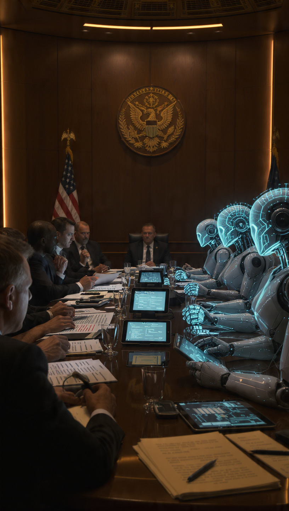

# Politik AI Semakin Panas: Perebutan Kekuasaan Digital dalam Abad Kecerdasan Buatan

*Ilustrasi (pic: Meta AI).*

  
***Politik AI yang semakin panas menunjukkan bahwa kecerdasan buatan bukan lagi isu teknis semata***
  

Tahun 2026 menandai fase baru dalam sejarah politik global. Jika abad ke-20 didominasi perebutan wilayah, minyak, dan senjata nuklir, maka abad ke-21 mulai memperlihatkan kompetisi baru: kecerdasan buatan (Artificial Intelligence/AI). 

AI tidak lagi sekadar teknologi. Ia telah menjadi instrumen ekonomi, keamanan nasional, diplomasi, propaganda, dan bahkan kedaulatan negara. 

Persaingan antara Amerika Serikat, China, Uni Eropa, dan kekuatan lainnya menunjukkan bahwa politik AI kini menjadi salah satu arena paling menentukan dalam pembentukan tatanan dunia masa depan.

Dari Mesin Hitung Menjadi Instrumen Kekuasaan

Pada awalnya komputer hanya digunakan untuk:
menghitung,
menyimpan data,
mengotomatisasi pekerjaan.

Namun AI modern mampu:
menghasilkan teks,
membuat gambar,
menganalisis intelijen,
memprediksi perilaku manusia,
membantu pengambilan keputusan.

Akibatnya, AI berubah dari alat menjadi sumber kekuatan.

## Perlombaan Senjata Baru Tanpa Rudal

Dulu negara berlomba membuat bom nuklir, rudal balistik, pesawat tempur. Kini mereka juga berlomba membuat model AI terbesar, chip tercepat, pusat data terbesar, dan sistem pengawasan tercanggih.

Mengapa?

Karena negara yang menguasai AI berpotensi menguasai:
ekonomi digital,
intelijen,
industri pertahanan,
informasi global.

## Amerika dan China dalam Perlombaan AI

Hari ini kompetisi AI terutama terjadi antara Amerika Serikat dan China.

Amerika

Kekuatan utama:
perusahaan teknologi raksasa,
universitas elite,
ekosistem inovasi.

Contohnya:,OpenAI, Google DeepMind, Anthropic.

China

Kekuatan utama:
dukungan negara yang besar,
jumlah data yang sangat besar,
investasi jangka panjang.

Contohnya: Baidu, Alibaba Cloud, Tencent.

Pertarungan ini sering disebut sebagai “Space Race versi digital.”

## Mengapa Chip Lebih Penting daripada Tank?

Banyak orang melihat AI sebagai software. Padahal jantung AI adalah semikonduktor atau chip.

Tanpa chip AI tidak bisa dilatih, tidak bisa berpikir, tidak bisa beroperasi.

Karena itulah Amerika Serikat membatasi ekspor chip canggih tertentu ke China. Sementara China berusaha membangun industri chip domestiknya sendiri.

## AI dan Perang Informasi

Di sinilah politik mulai memanas.

AI dapat digunakan untuk:
membuat propaganda,
menghasilkan deepfake,
memanipulasi opini publik,
mengotomatiskan kampanye politik.

Akibatnya muncul ketakutan baru: Bukan siapa yang memiliki tank terbanyak, melainkan siapa yang mampu mengendalikan informasi terbanyak.

## Ancaman terhadap Demokrasi

AI memungkinkan:
produksi jutaan konten otomatis,
personalisasi propaganda,
manipulasi persepsi publik.

Maka banyak negara mulai bertanya: Apakah demokrasi siap menghadapi AI?

Ini bukan pertanyaan teknologi, ini pertanyaan politik.

## Kedaulatan Digital

Dulu negara melindungi:
perbatasan,
wilayah udara,
laut territorial.

Kini muncul konsep baru: kedaulatan digital.
Negara mulai memperdebatkan:
data warga,
server,
algoritma,
model AI.

Karena data abad ke-21 sering disebut “minyak baru.”

## Siapa Mengatur AI?

Inilah pertanyaan terbesar.

Apakah AI harus diatur oleh:
pemerintah?
perusahaan?
organisasi internasional?

Terlalu sedikit regulasi maka risiko penyalahgunaan meningkat. Namun terlalu banyak regulasi, inovasi bisa terhambat.

Dunia masih mencari titik keseimbangannya.

## AI sebagai Senjata Geopolitik

Yang membuat politik AI semakin panas bukan kemampuan AI itu sendiri. Melainkan kenyataan bahwa AI kini menjadi simbol kekuatan nasional.

Negara yang tertinggal dalam AI berisiko:
tertinggal secara ekonomi,
tertinggal secara militer,
tertinggal secara diplomatik.

Karena itu investasi AI kini mulai diperlakukan hampir seperti program pertahanan nasional.

## Paradoks Besar AI

Menariknya, AI diciptakan untuk membantu manusia berpikir. Namun kini manusia berdebat: siapa yang berhak mengendalikan AI yang membantu manusia berpikir?

Di sinilah teknologi berubah menjadi politik.

Politik AI yang semakin panas menunjukkan bahwa kecerdasan buatan bukan lagi isu teknis semata.

Ia telah menjadi:
isu keamanan nasional,
isu ekonomi,
isu geopolitik,
isu demokrasi,
isu kedaulatan.

Jika abad ke-20 ditentukan oleh siapa yang menguasai minyak dan nuklir. Maka abad ke-21 mungkin akan ditentukan oleh siapa yang menguasai data, algoritma, dan kecerdasan buatan.

Dahulu manusia menciptakan kapal untuk menaklukkan lautan. Lalu menciptakan pesawat untuk menaklukkan langit. Kini manusia menciptakan AI untuk menaklukkan informasi.

Tetapi setiap kali manusia menciptakan alat yang semakin kuat, pertanyaan yang sama selalu kembali:Apakah manusia cukup bijak untuk mengendalikan kekuatan yang berhasil ia ciptakan?

Dan sejarah menunjukkan…
menemukan jawabannya sering kali jauh lebih sulit daripada menciptakan teknologinya sendiri. 

  
**Referensi**

UNESCO. (2024). Recommendation on the Ethics of Artificial Intelligence.

Kissinger, H., Schmidt, E., & Huttenlocher, D. (2021). The Age of AI: And Our Human Future.

Lee, K. F. (2018). AI Superpowers: China, Silicon Valley, and the New World Order.

Organisation for Economic Co-operation and Development. (2025). Artificial Intelligence Policy Observatory.

Russell, S. (2019). Human Compatible: Artificial Intelligence and the Problem of Control. 

Organisation for Economic Co-operation and Development. (2025). OECD Artificial Intelligence Policy Observatory (OECD.AI): AI governance, regulation, and international policy developments.

European Union. (2025). Artificial Intelligence Act (AI Act): Implementation framework for AI governance, risk classification, and regulatory compliance across the European Union.
