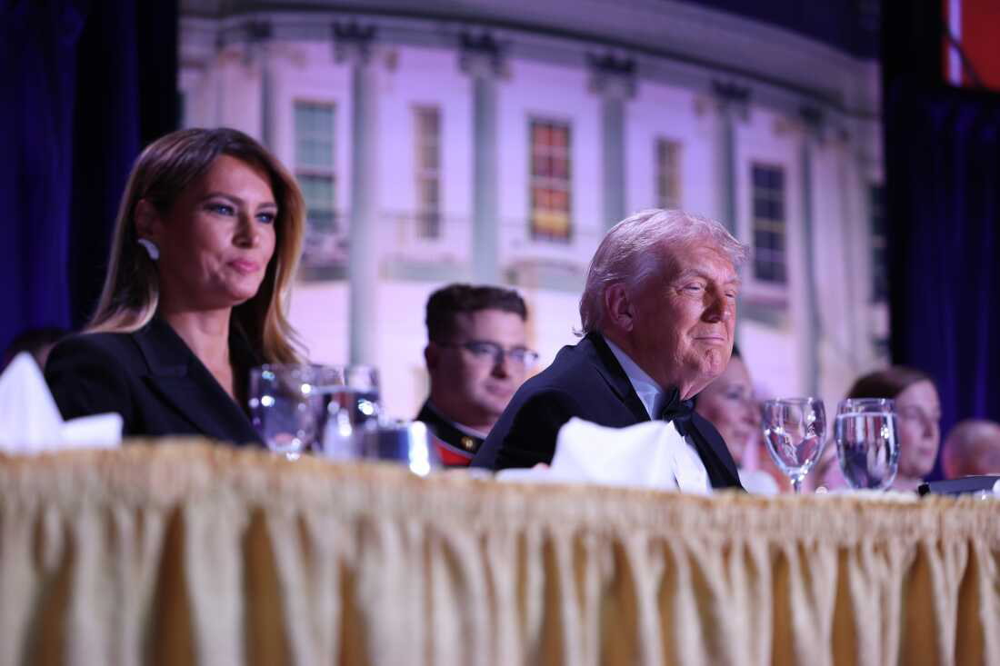

# Politik Simpati dan Kecurigaan Publik: Mengapa Insiden Kekerasan terhadap Pemimpin Sering Memunculkan Teori Rekayasa Politik?

*Presiden AS Donald Trump dan Melania (pic: Grok AI).*

  
***Kecurigaan publik terhadap insiden politik bukan muncul dari kehampaan***
  

Insiden kekerasan terhadap pemimpin politik sering memunculkan kecurigaan publik mengenai kemungkinan rekayasa atau eksploitasi politik. 

Tulisan ini menganalisis fenomena tersebut melalui perspektif psikologi politik, teori rally-around-the-flag, dan distrust society. 

Temuan menunjukkan bahwa dalam masyarakat yang sangat terpolarisasi, publik cenderung membaca peristiwa bukan hanya sebagai fakta keamanan, tetapi sebagai kemungkinan instrumen legitimasi politik.

## Pendahuluan

Ketika seorang tokoh politik diserang, publik biasanya terbelah menjadi dua:

kelompok pertama:
melihatnya sebagai ancaman nyata

kelompok kedua:
curiga bahwa insiden itu “terlalu menguntungkan” secara politik.

Fenomena ini bukan baru.

Dalam sejarah modern:

serangan politik

percobaan pembunuhan

krisis keamanan

sering menghasilkan:
lonjakan dukungan publik terhadap pemimpin.

## Rally-Around-the-Flag Effect

Menurut John Mueller:

masyarakat cenderung bersatu mendukung pemimpin saat ada ancaman atau serangan.

## Politics of Fear

Menurut Corey Robin:

rasa takut dapat digunakan untuk memperkuat legitimasi politik.

## Distrust Society

Dalam masyarakat terpolarisasi:
publik makin sulit percaya institusi
setiap krisis dianggap mungkin dimanipulasi.

## Analisis

A. Kenapa publik merasa “janggal”?

Karena profil pelaku tampak:

terdidik

tidak punya sejarah ekstremisme publik

hidup relatif normal

👉 sehingga muncul disonansi:

“kok orang seperti ini tiba-tiba nekat?”.

B. Apakah orang terdidik mustahil melakukan kekerasan?

Secara ilmiah:

❌ tidak mustahil.

Sejarah menunjukkan:

insinyur

dokter

akademisi

juga pernah terlibat tindakan ekstrem.

Namun benar bahwa:
publik lebih mudah curiga ketika pelaku tidak cocok dengan stereotip “radikal klasik”.

C. Kenapa teori rekayasa cepat muncul?

Karena insiden seperti ini:
sering memberi keuntungan politik tidak langsung.

Misalnya:

simpati publik

legitimasi keamanan

dukungan perang meningkat.

👉 Dalam ilmu politik, ini disebut:political utility of crisis..

D. Hubungan dengan perang Iran

Analogi:

sebelum perang → demonstrasi & kritik

setelah perang → masyarakat bersatu.

Secara sosiologis, itu memang fenomena nyata.

Ancaman eksternal sering:

menekan konflik internal

menciptakan solidaritas nasional.

E. Tapi… apakah itu berarti rekayasa?

Nah, di sinilah batas ilmiahnya.

Kita tidak bisa langsung melompat dari:
“peristiwa ini menguntungkan”

menjadi:
“berarti sengaja dibuat”.

Karena:
banyak peristiwa memang kebetulan menguntungkan pihak tertentu
tanpa bukti operasional, koordinasi, atau dokumen, klaim itu tetap spekulatif.
F. Tentang kasus Trump sebelumnya

Memang benar bahwa:
serangan atau ancaman terhadap Trump sebelumnya meningkatkan simpati sebagian pendukung.
Dan ini konsisten dengan teori:

rally-around-the-flag effect.

Namun secara metodologis:
efek politik ≠ bukti rekayasa.

## Diskusi

Fenomena ini menunjukkan:

1️⃣ Krisis modern selalu dibaca secara politis

publik tidak lagi melihat peristiwa sebagai “netral”.

2️⃣ Polarisasi menghancurkan kepercayaan

hingga bahkan tragedi dianggap mungkin direkayasa.

3️⃣ Narasi lebih cepat daripada verifikasi

media sosial mempercepat spekulasi.

Kecurigaan publik terhadap insiden politik bukan muncul dari kehampaan.

Ia lahir dari:

sejarah manipulasi politik

polarisasi ekstrem

hilangnya kepercayaan terhadap institusi.

Namun secara ilmiah:
kecurigaan dan kemungkinan tidak otomatis menjadi bukti.

Karena itu, analisis kritis perlu dibedakan dari kesimpulan konspiratif yang belum terverifikasi.

  
**Referensi**

Mueller, J. E. (1970). Presidential popularity from Truman to Johnson. American Political Science Review, 64(1), 18-34.

Robin, C. (2004). Fear: The history of a political idea. Oxford University Press.

Sunstein, C. R., & Vermeule, A. (2009). Conspiracy theories: Causes and cures. Journal of Political Philosophy, 17(2), 202-227.
