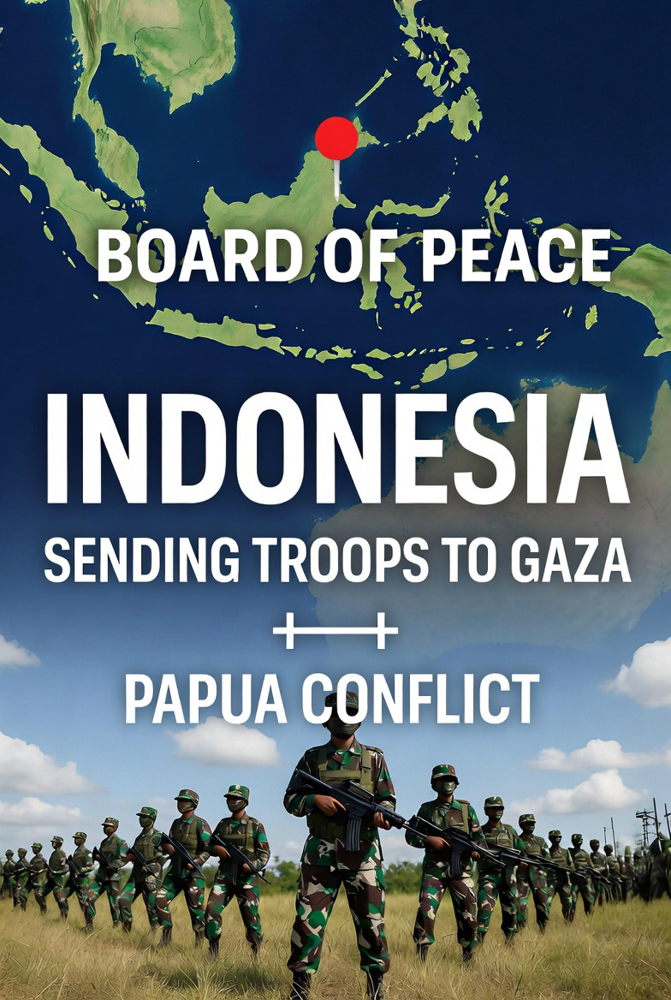

# Diplomasi Selektif dan Politik Legitimasi: Indonesia antara Board of Peace, Gaza, dan Papua dalam Perspektif Realisme-Struktural

*Ilustrasi posisi Indonesia (pic: Grok AI).*

  
***Politik global sering seperti drama absurd:
negara bicara perdamaian sambil membeli senjata, membela kemanusiaan sambil menandatangani kontrak dagang***
  

Partisipasi Indonesia dalam forum perdamaian internasional yang juga melibatkan Israel memunculkan kritik domestik mengenai konsistensi prinsip politik luar negeri bebas-aktif. 

Pada saat yang sama, keputusan untuk mempertimbangkan pengiriman pasukan ke Gaza dibandingkan fokus keamanan domestik di Papua memicu pertanyaan tentang prioritas negara. 

Tulisan ini menganalisis dinamika tersebut dalam kerangka realisme, politik legitimasi, dan strategi middle power.

## Board of Peace dan Paradoks Keanggotaan

Jika forum “Board of Peace” melibatkan Israel dan Palestina secara bersamaan, maka itu bukan dukungan terhadap salah satu pihak, melainkan:

•	platform diplomasi multilateral

•	instrumen pengaruh geopolitik

•	ruang negosiasi yang sering bersifat pragmatis

Dalam teori hubungan internasional: 
Negara tidak masuk forum karena cinta.
Negara masuk forum karena kepentingan.

Indonesia secara historis:

•	tidak memiliki hubungan diplomatik formal dengan Israel

•	mendukung Palestina di forum internasional

•	tetap berinteraksi dalam konteks multilateral global

Itu disebut strategic compartmentalization.

## Apakah Indonesia bisa “terjebak”?

Bisa.
Tapi tidak otomatis.

Indonesia punya tiga “rem” politik:

1.	opini publik domestik pro-Palestina sangat kuat

2.	konstitusi diplomasi bebas-aktif

3.	identitas historis anti-kolonial

Rem ini cukup kuat untuk mencegah perubahan drastis.

Setidaknya untuk sekarang.

Risiko Kehilangan Posisi Netral

Sejak lama, posisi Indonesia unik:

•	pro-Palestina secara konsisten

•	tidak punya hubungan diplomatik dengan Israel 

•	aktif dalam forum global

Masuk ke forum perdamaian yang melibatkan Israel bisa menghasilkan dua kemungkinan:

1.Skenario A: leverage diplomatik meningkat

Indonesia bisa:

•	jadi mediator

•	memperkuat legitimasi internasional

•	membawa isu Palestina ke meja negosiasi

Ini versi optimistis.

2.Skenario B: co-opted diplomacy

Ini yang dikhawatirkan.

Negara “terseret” ke arsitektur keamanan Barat secara bertahap:

•	kerja sama militer

•	kerja sama ekonomi

•	normalisasi hubungan informal

Dan perlahan posisi moral melemah.

Fenomena ini pernah terjadi pada beberapa negara Timur Tengah setelah normalisasi regional.

## Apakah ini tekanan Amerika?

Kemungkinan tekanan selalu ada dalam hubungan asimetris.

Dalam teori realisme struktural (Waltz, 1979):

•	Negara besar menciptakan arsitektur keamanan

•	Negara menengah menavigasi di dalamnya

Jika ada:

•	potensi perjanjian dagang

•	akses pasar

•	kerja sama pertahanan

Maka partisipasi Indonesia bisa dibaca sebagai: strategi bargaining, bukan sekadar tunduk.

Tekanan tidak selalu berarti paksaan.
Kadang itu pertukaran kepentingan.

## Inti Masalah Sebenarnya

Bukan soal kirim pasukan atau tidak.

Masalah utamanya adalah ini: 
apakah partisipasi Indonesia akan memperkuat posisi Palestina,
atau justru menormalkan status quo konflik?

Itu pertanyaan yang sah. Dan sulit.

## Mengapa kirim pasukan ke Gaza tapi Papua belum selesai?

Ini kritik yang kuat secara emosional. Tapi secara institusional:

A. Operasi Luar Negeri

•	biasanya bersifat simbolik dan terbatas

•	meningkatkan reputasi global

•	memperkuat posisi tawar diplomatik

B. Konflik Papua

•	isu domestik dengan akar historis, politik, dan ekonomi

•	melibatkan keamanan internal

•	sangat sensitif terhadap kedaulatan

Dalam teori negara: 
Konflik domestik adalah soal kontrol.
Operasi luar negeri adalah soal citra dan posisi.

Negara sering berinvestasi dalam citra global karena:

•	legitimasi internasional berdampak pada ekonomi

•	akses perdagangan dan investasi dipengaruhi reputasi

Itu tidak berarti Papua tidak penting.
Itu berarti negara beroperasi dalam dua arena berbeda.

## Apakah ini mengorbankan prinsip bebas-aktif?

“Bebas-aktif” bukan berarti netral absolut.
Itu berarti:

•	bebas menentukan posisi

•	aktif dalam perdamaian global

Jika Indonesia masuk forum multilateral tanpa mengakui Israel secara bilateral, secara hukum internasional itu masih konsisten.

Yang menjadi masalah adalah persepsi publik: apakah ini terlihat seperti kompromi moral?

Analisis Struktural

Fenomena ini menunjukkan tiga hal:

1.	Indonesia ingin menjadi middle power signifikan

2.	Diplomasi ekonomi makin dominan dibanding solidaritas ideologis

3.	Politik domestik dan internasional sering bergerak pada logika berbeda

Papua dan Dilema Keamanan

Konflik Papua:

•	kompleks

•	berlapis ekonomi, sejarah, militer

•	bukan sekadar “melawan OPM”

Perlindungan warga sipil memerlukan:

•	pendekatan keamanan

•	pendekatan kesejahteraan

•	pendekatan politik

Mengirim pasukan ke Gaza tidak otomatis mengurangi kapasitas keamanan domestik, karena struktur dan anggaran militer berbeda.

Bukan sekadar soal Gaza.
Ini soal konsistensi moral vs kepentingan strategis.

Dalam politik internasional:

•	moral memberi arah

•	kepentingan memberi gerak
Indonesia sedang menyeimbangkan keduanya.

Apakah seimbang atau tidak? Itu tergantung hasil jangka panjangnya.

Politik global sering seperti drama absurd:
negara bicara perdamaian sambil membeli senjata, membela kemanusiaan sambil menandatangani kontrak dagang.

  
**Referensi**

Acharya, A. (2014). The End of American World Order. Polity Press.

Allison, G. (2017). Destined for War: Can America and China Escape Thucydides’s Trap? Houghton Mifflin Harcourt.

Bellamy, A. J., & Williams, P. D. (2015). Understanding Peacekeeping (2nd ed.). Polity Press.

Brownlie, I. (2008). Principles of Public International Law (7th ed.). Oxford University Press.

Heywood, A. (2014). Global Politics (2nd ed.). Palgrave Macmillan.

Kementerian Luar Negeri Republik Indonesia. (2024). Politik Luar Negeri Indonesia: Bebas dan Aktif. Jakarta: Kemlu RI.

United Nations. (2008). United Nations Peacekeeping Operations: Principles and Guidelines. United Nations Department of Peacekeeping Operations.

Waltz, K. N. (1979). Theory of International Politics. McGraw-Hill.
