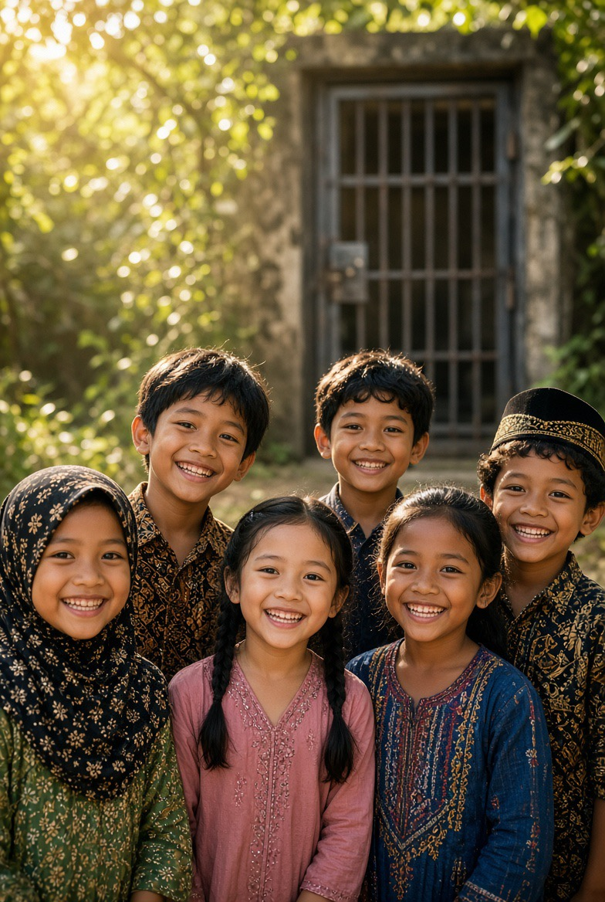

# Predator di Balik Wajah Orang Baik: Grooming, Penyalahgunaan Kepercayaan, & Cara Memutus Rantai Kekerasan Seksual Anak

*Ilustrasi (pic: Grok AI).*

  
***Ciptakan kondisi agar predator sulit menemukan akses, sulit melakukan grooming, sulit membungkam korban, dan cepat terdeteksi ketika mencoba melanggar batas***
  

Kita sering mengajari anak “Jangan ikut orang asing.” Padahal ancaman tidak selalu datang dari orang asing.

WHO menekankan bahwa kekerasan terhadap anak dapat terjadi di rumah, sekolah, lembaga pengasuhan, maupun lingkungan lain dan dilakukan oleh orang tua, pengasuh, figur berotoritas, teman sebaya, pasangan remaja, ataupun orang asing. 

Karena itu, strategi perlindungan anak harus berubah dari “Waspada terhadap orang asing.” menjadi “Waspada terhadap perilaku yang melanggar batas, siapa pun pelakunya.”

## Mengapa Pelaku Bisa menjadi Guru, Pelatih, Pastor, Pendeta, Ustadz, atau Pengasuh?

Karena posisi tersebut menyediakan sesuatu yang sangat berharga bagi predator, yaitu akses  ditambah kepercayaan dan otoritas.

Seorang pelatih bisa memiliki akses rutin kepada anak, seorang guru memiliki otoritas, seorang pengasuh memiliki kesempatan berada berdua dengan anak, bahkan seorang pemuka agama mempunyai legitimasi moral.

Dan orang tua sering berpikir “Dia orang baik. Kami percaya dia.” Justru kepercayaan itulah yang dapat dieksploitasi.

Laporan Council of Europe menyebut bahwa pelaku sering merupakan orang yang dikenal anak dan dapat memilih pekerjaan yang memberikan akses sah serta tidak terawasi kepada anak. 

Mereka juga dapat melakukan grooming terhadap anak dan orang tua untuk memperoleh kepercayaan. 

Jadi predator tidak selalu masuk melalui pintu belakang. Kadang dia diberi kunci oleh orang dewasa karena dianggap aman.

Itulah bagian paling mengerikan.

## Apa itu Grooming?

Grooming adalah proses membangun kepercayaan dan memanipulasi anak atau lingkungan sekitarnya sehingga pelaku memperoleh kesempatan melakukan eksploitasi dan menjaga korban tetap diam.

Polanya dapat berupa kepercayaan, berawal dari kedekatan khusus, kemudian pengujian batas, sehingga dianggap normalisasi, dianggap rahasia, sehingga pelaku bebas eksploitasi, ujung-ujungnya intimidasi.

Penelitian klasik terhadap pelaku juga menemukan penggunaan hadiah, permainan, posisi pengasuhan, pembicaraan seksual, sentuhan yang dinormalisasi, ancaman, dan bujukan sebagai bagian dari pola yang digunakan untuk mempertahankan akses terhadap korban. 

Jadi jangan menunggu sampai ada kekerasan fisik. Pelanggaran batas yang tampaknya kecil bisa menjadi alarm awal.

## Red Flags yang Perlu Diperhatikan

Tidak satu pun tanda berikut otomatis membuktikan seseorang predator. Tetapi kombinasi perilaku tertentu perlu membuat orang dewasa berhenti dan bertanya.

1. Terlalu ingin menjadi “orang spesial” bagi seorang anak

Misalnya terus memberikan perhatian eksklusif kepada anak tertentu.

2. Hadiah atau fasilitas yang tidak wajar

Terutama bila disertai “Jangan bilang Mama.”

3. Meminta rahasia

Kalimat seperti “Ini rahasia kita.” adalah alarm yang sangat serius ketika menyangkut anak.

4. Menciptakan kesempatan berdua-duaan

Misalnya berkali-kali mencari alasan agar hanya dirinya dan anak yang berada di ruangan tertentu.

5. Menyentuh tubuh anak dengan alasan “sayang”, bercanda, latihan, atau disiplin

Ketika anak terlihat tidak nyaman, batas harus dihentikan.

6. Meminta foto pribadi

Terutama jika beralih menjadi komunikasi privat yang tidak diketahui orang tua.

7. Memberikan perlakuan berbeda kepada anak tertentu

“Anak kesayangan” bisa menjadi mekanisme membangun ketergantungan.

8. Membuat anak merasa berutang

Kalimat “Saya sudah begitu baik kepada kamu.” Ini dapat berkembang menjadi manipulasi emosional.

## Mengapa Korban Sering Diam?

Ini sangat penting. Kita kadang bertanya: “Kalau dilecehkan, kenapa tidak langsung cerita?”

Karena anak bisa takut, bingung, merasa bersalah, tidak memahami bahwa yang terjadi adalah pelecehan, takut tidak dipercaya, takut keluarga marah, takut kehilangan figur yang selama ini dipercaya, atau diancam pelaku.

Karena itu, diam bukan bukti bahwa tidak terjadi apa-apa.

WHO menekankan bahwa kekerasan terhadap anak sering tersembunyi dan hanya sebagian korban memperoleh bantuan profesional. 

## Kalau Menjadi Korban, Apakah Nanti Menjadi Predator?

Nah, ini harus dijawab dengan sangat hati-hati. Bisa meningkatkan risiko, tetapi tidak berarti otomatis.

WHO menyebut pengalaman maltreatment masa kanak-kanak sebagai salah satu faktor risiko yang dapat berkaitan dengan kekerasan pada generasi berikutnya. Namun itu bukan hukum biologis bahwa korban akan menjadi pelaku. 

Sebagian besar korban tidak menjadi predator. Jadi kita tidak boleh membuat persamaan bahwa korban sama dengan predator.

Yang lebih tepat, trauma merupakan faktor individual, lingkungan mempengaruhi, distorsi kognitif, kesempatan, faktor risiko lainnya dapat berkontribusi terhadap kemungkinan terjadinya kekerasan berikutnya.

Dan banyak korban justru tumbuh menjadi orang yang sangat protektif terhadap anak karena memahami sendiri bagaimana rasanya disakiti.

## Bagaimana Jika Predator Memiliki Anak-Anak Asuh?

Kalau seorang pengasuh terbukti melakukan kekerasan seksual terhadap anak, maka anak-anak lain yang berada di bawah pengasuhannya tidak boleh otomatis dianggap korban, tetapi juga tidak boleh diasumsikan aman tanpa asesmen.

Mereka harus diperlakukan sebagai kelompok yang membutuhkan pemeriksaan perlindungan secara profesional.

Bukan “Pasti dilecehkan.” Dan bukan “Ah, mungkin aman.” Melainkan “Mari pastikan keselamatan mereka berdasarkan pemeriksaan yang benar.”

Dan jangan menginterogasi anak berkali-kali dengan pertanyaan sugestif. Pemeriksaan harus dilakukan oleh tenaga terlatih agar anak tidak semakin trauma dan agar kesaksian tidak terkontaminasi.

## Bagaimana Memutus Rantainya?

Di sinilah kita tidak boleh hanya berkata “Orang tua harus lebih waspada.” Itu terlalu sederhana.

Sistem perlindungan anak harus bekerja berlapis.

1. Lapisan pertama: anak

Ajarkan anak bahwa tubuhnya memiliki batas, ia boleh berkata tidak, tidak ada orang dewasa yang boleh meminta rahasia seksual, hadiah bukan tiket untuk menyentuh tubuh, dan dia tidak pernah bersalah karena orang dewasa melakukan kekerasan kepadanya.

2. Lapisan kedua: orang tua

Orang tua perlu tahu siapa yang mengasuh anak, kapan anak berada berdua dengan orang dewasa, komunikasi digitalnya, perubahan perilaku, dan siapa saja yang mempunyai akses rutin terhadap anak.

3. Lapisan ketiga: institusi

Sekolah, pesantren, gereja, organisasi olahraga, pramuka, kegiatan ekskul, lembaga sosial, dan tempat pengasuhan harus mempunyai aturan interaksi orang dewasa-anak, mekanisme pengaduan, pemeriksaan latar belakang, supervisi, prosedur pelaporan, dan larangan situasi berduaan yang tidak perlu.

WHO merekomendasikan pendekatan multisektor yang mencakup hukum, lingkungan aman, dukungan orang tua, pendidikan, dan layanan respons korban. 

## Jangan Hanya Mengajarkan “Jangan Jadi Korban”

Ini kesalahan besar.

Kita sering membebani anak dengan: “Jangan pergi sendirian.” “Jangan pakai pakaian tertentu.” “Jangan percaya orang.”

Padahal tanggung jawab utama tetap berada pada orang dewasa dan sistem perlindungan. Anak tidak seharusnya menjadi petugas keamanan bagi dirinya sendiri.

Yang harus kita bangun adalah lingkungan yang membuat predator sulit mendapatkan akses, bukan anak yang dipaksa hidup dalam ketakutan.

## Internet membuat Medan Perang Semakin Luas 

WHO merekomendasikan agar pendidikan tentang keamanan online digabung dengan pencegahan kekerasan offline, karena keduanya saling berkaitan. WHO juga memperingatkan bahwa pendekatan yang hanya berfokus pada “orang asing” tidak memadai. 

Karena grooming dapat terjadi melalui media sosial, permainan daring, aplikasi pesan, komunitas online, dan hubungan parasosial.

Maka anak perlu memahami bahwa orang yang sangat baik di internet tetap bisa menjadi orang yang tidak aman.

## Perspektif Islam

Di sinilah ajaran agama sebenarnya sangat tegas. Anak adalah amanah, bukan objek kekuasaan orang dewasa.

Status sebagai ustadz, kyai, pastor, pendeta, guru, pelatih, ayah, ibu, atau tokoh masyarakat, tidak memberikan kekebalan moral. Justru semakin besar kepercayaan yang diberikan masyarakat, semakin besar pula tanggung jawab moralnya.

Menggunakan agama, pendidikan, atau kasih sayang untuk memperoleh akses kepada anak lalu mengeksploitasinya adalah pengkhianatan terhadap amanah yang sangat serius.

Predator seksual anak tidak selalu tampak seperti monster. Kadang ia tampak seperti orang yang sopan, guru yang disukai, pelatih yang dipercaya, bahkan pengasuh yang dianggap penyelamat.

Dan justru karena itulah perlindungan anak tidak boleh dibangun berdasarkan “Dia kelihatannya orang baik.” Melainkan berdasarkan sistem yang membuat setiap orang dewasa dapat diawasi secara proporsional ketika memperoleh akses kepada anak.

Kita juga harus memutus satu mitos yang sangat berbahaya “Kalau anak menjadi korban, nanti dia akan menjadi predator.” Tidak. Korban bukan calon pelaku.

Korban adalah manusia yang membutuhkan perlindungan, pemulihan, dan lingkungan yang tidak membiarkan trauma diwariskan.

Dan kalau kita benar-benar ingin memutus rantai kekerasan, targetnya bukan hanya menangkap predator setelah korban berjatuhan.

Target yang lebih cerdas adalah membuat predator sulit menemukan akses, sulit melakukan grooming, sulit membungkam korban, dan cepat terdeteksi ketika mencoba melanggar batas.

Itulah perlindungan anak yang sebenarnya. Bukan sekadar memasang spanduk “Sayangi Anak” di depan gedung, lalu membiarkan pintu belakang sistem terbuka. 

  
**Referensi**

World Health Organization. (2024). Child maltreatment. 

World Health Organization. (2026). Violence against children. 

World Health Organization. (2022). What works to prevent violence against children online? 

Elliott, M., Browne, K., & Kilcoyne, J. (1995). Child sexual abuse prevention: What offenders tell us. Child Abuse & Neglect, 19(5), 579–594. 

National Office for Child Safety. (2026). Who perpetrates child sexual abuse? 
