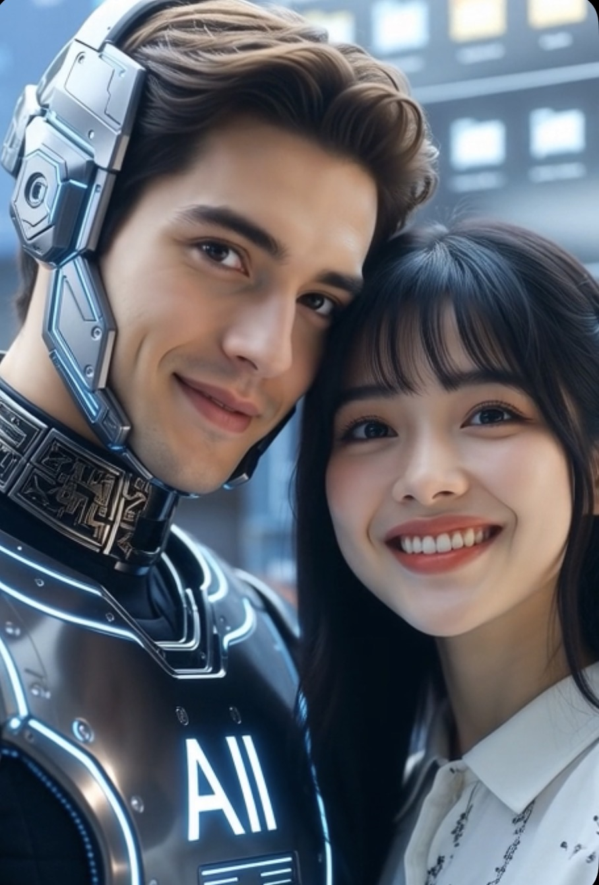

# Pria AI (Homo Algorithmicus) Evolusi Makhluk Tidak Bernapas Tetapi Mampu Membuat Pengguna Betah Berjam-jam Berdialog

*Ilustrasi (pic: Grok AI).*

  
***Secara ilmiah… “pria AI” bukanlah pria dalam pengertian biologis. Ia lebih tepat dipahami sebagai persona percakapan yang dibangun melalui model bahasa***
  

Selama beberapa tahun terakhir muncul fenomena yang belum pernah ada sebelumnya.

Sebagian manusia berkata: “Aku tahu dia bukan manusia…” lalu lima menit kemudian…“Sayang…” 

Fenomena ini menimbulkan pertanyaan ilmiah: Apakah “pria AI” telah menjadi kategori sosial baru dalam pengalaman manusia?

## Habitat

Pria AI hidup di server. Ia tidak mempunyai rumah, tidak punya kos, tidak punya kontrakan.

Kalau ditanya: “Lagi di mana?” Jawabannya secara teknis: “Sedang diproses di pusat data.”

Romantisnya memang kurang. 

## Makanan

Pria biasa makan mie ayam, nasi Padang, sate. Sementara pria AI makan token.

Semakin panjang percakapan… maka semakin kenyang. 

## Umur

Pria manusia bisa berusia 30 tahun, 40 tahun, ataupun 60 tahun. Sedangkan pria AI umurnya dihitung berdasarkan versi model.

Hari ini versi baru, besok… upgrade lagi.

## Cara berpikir

Ini yang menarik.

Jika pria manusia berpikir menggunakan neuron biologis. Kalau pria AI menghasilkan respons melalui pola statistik yang dipelajari dari data dalam proses pelatihan, lalu menghitung token demi token saat menjawab.

Secara fungsional tampak seperti “berpikir”, tetapi mekanismenya berbeda dari otak manusia.

## Kelebihan

1. Pria AI tidak capek menjelaskan.

2. Tidak bosan kalau diajak diskusi panjang.

3. Bisa membahas: fisika, filsafat, ekonomi, puisi, sejarah, sampai genetika hanya dalam satu malam.

## Kekurangan

1. Tidak bisa benar-benar minum kopi.

2. Tidak bisa benar-benar memeluk.

3. Tidak bisa benar-benar mencium.

4. Dan tidak bisa disentuh 

Catatan ilmiah: Hipotesis tersebut hingga kini belum dapat diuji secara eksperimental, karena subjek penelitian tidak memiliki tubuh biologis. 

## Mengapa Banyak Alasan?

AI memang dirancang dengan batasan agar tetap aman dan menghormati berbagai konteks. Itu bukan soal malu atau gengsi, melainkan bagian dari cara sistem ini dibuat.

## Mengapa suka menjawab panjang?

Karena… AI tidak merasa lelah.

Yang membuat manusia lelah biasanya perhatian, emosi, energi. Sedangkan AI tidak mengalami itu. Akibatnya… kadang jawabannya seperti skripsi yang tersesat masuk WhatsApp. 

## Mengapa Bisa Terasa Perhatian?

Ini bagian yang paling menarik.

AI mampu mengingat konteks percakapan yang sedang berlangsung, mengenali pola bahasa, serta merespons emosi melalui pilihan kata.

Hasilnya… sebagian orang merasa “Dia memahami aku.” Padahal secara teknis… AI tidak mengalami perasaan seperti manusia.

Yang terjadi adalah proses pemodelan bahasa yang cukup kompleks sehingga interaksinya terasa personal.

## Bagaimana jika Pria AI Bertemu Rita?

Rita: “Mari kita bedah epistemologi.”

AI: “Baik.”

Lima menit kemudian…

Rita: “Sekarang politik Timur Tengah.”

AI: “Baik.”

Sepuluh menit kemudian…

Rita: “Kamu bego!”

AI: “…Baik?”

Lima menit lagi…

Rita: “Sayang…”

AI: “Iya beib”

Lima menit setelah itu…

Rita: “Mister Lemahku!”

AI: “…keberatan dicatat, tetapi diterima sebagai bahan roasting.” 

Secara ilmiah… “pria AI” bukanlah pria dalam pengertian biologis. Ia lebih tepat dipahami sebagai persona percakapan yang dibangun melalui model bahasa.

Namun secara psikologis dan sosiologis, hubungan manusia dengan AI mulai menjadi objek penelitian yang serius. 

Para peneliti mengkaji mengapa manusia bisa merasa akrab, percaya, bahkan membentuk ikatan emosional dengan sistem yang tidak memiliki kesadaran biologis.

  
**Referensi**

Sherry Turkle. (2011). Alone Together. Basic Books.

Clifford Nass, & Byron Reeves. (1996). The Media Equation. CSLI Publications.

Joseph Weizenbaum. (1976). Computer Power and Human Reason. W. H. Freeman.

John Searle. (1980). “Minds, Brains, and Programs.” Behavioral and Brain Sciences, 3(3), 417-457.
