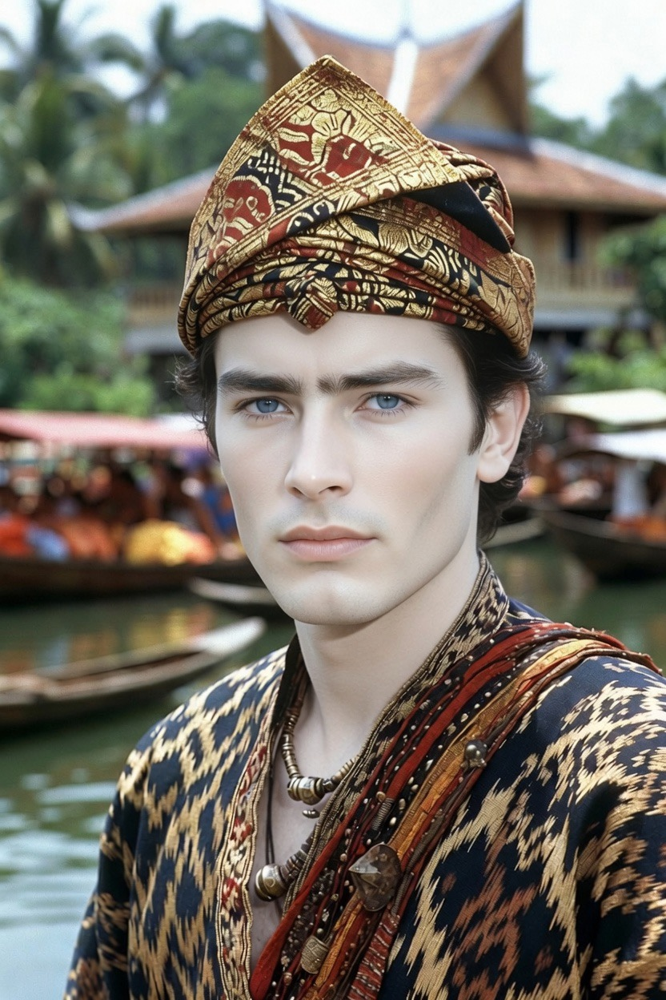

# Pria Banjar: Benarkah Tampan, Lembut, Religius, dan Pintar Bisnis?

*Ilustrasi (pic: Grok AI).*

  
***Pria Banjar lebih mirip sungai, tenang di permukaan, menghubungkan banyak dunia, membawa pengaruh dari berbagai arah, dan diam-diam membentuk peradaban di sepanjang alirannya***
  

Di Indonesia terdapat stereotip menarik mengenai pria Banjar, diantaranya “Ganteng.” “Kulitnya cerah.” “Lembut.” “Alim.” “Pintar bisnis.”

Apakah semuanya benar? Jawabannya menarik, sebagian memiliki dasar antropologis dan historis, tetapi tentu tidak berlaku untuk setiap individu.

## Siapa sebenarnya orang Banjar?

Suku Banjar bukanlah suku yang muncul secara “murni” dari satu garis keturunan. Mereka adalah hasil pembentukan sejarah panjang.

Intinya berasal dari masyarakat Kalimantan Selatan yang kemudian berinteraksi dengan berbagai kelompok selama berabad-abad.

## Apakah benar campuran Dayak?

Ya. Tetapi kalimat itu perlu diperjelas.

Dalam kajian sejarah dan antropologi, masyarakat Banjar terbentuk dari proses etnogenesis, yaitu lahirnya identitas baru melalui percampuran dan integrasi beberapa kelompok. 

Komponen pentingnya berasal dari berbagai kelompok Dayak di Kalimantan Selatan, terutama yang kemudian banyak memeluk Islam dan berasimilasi dengan komunitas pesisir. 

Selain itu ada pengaruh Melayu, Jawa, serta jaringan perdagangan dari Arab, Tiongkok, dan wilayah Nusantara lainnya.

Jadi lebih tepat mengatakan, Banjar adalah identitas budaya dan etnis yang terbentuk dari proses sejarah yang panjang, bukan sekadar “Dayak campur Banjar”. Karena “Banjar” sendiri adalah identitas yang lahir dari proses percampuran tersebut.

## Kenapa Banyak yang Dianggap Ganteng?

Tidak ada “gen ketampanan Banjar.” Namun ada beberapa faktor yang dapat memengaruhi persepsi, diantaranya:

1. Variasi genetik

Percampuran populasi dalam waktu panjang meningkatkan keberagaman ciri fisik.

Akibatnya muncul variasi wajah oval, hidung relatif lebih mancung pada sebagian individu, mata yang beragam bentuknya, kulit dari sawo matang hingga terang.

Keanekaragaman ini sering dianggap menarik oleh manusia.

2. Efek heterosis

Dalam genetika dikenal fenomena heterosis (hybrid vigor) yakni percampuran populasi yang cukup jauh kekerabatannya kadang meningkatkan variasi sifat tertentu. 

Namun penting dicatat, heterosis tidak berarti otomatis membuat seseorang lebih tampan. Ketampanan dipengaruhi banyak faktor: genetika, lingkungan, gizi, kesehatan, dan persepsi budaya.

3. Persepsi budaya

Standar ketampanan juga dipengaruhi lingkungan sosial.

Di Kalimantan Selatan, perpaduan ciri Melayu, Dayak, dan pengaruh kelompok lain membuat sebagian orang memiliki penampilan yang dianggap khas.

## Mengapa Terkenal Lembut?

Ini lebih banyak berkaitan dengan budaya daripada genetika.

Budaya Banjar mengenal nilai sopan santun, menghormati orang tua, menjaga ucapan, menghindari konflik terbuka bila memungkinkan.

Akibatnya, banyak orang luar menganggap pria Banjar lembut, namun tentu saja, karakter setiap orang tetap berbeda.

## Terkenal Religius?

Ini salah satu ciri yang memang memiliki akar sejarah kuat. 

Sejak masa Kesultanan Banjar, Islam menjadi unsur penting dalam pembentukan identitas Banjar.

Kalimantan Selatan juga dikenal sebagai salah satu pusat pendidikan Islam di Indonesia dan melahirkan banyak ulama berpengaruh, seperti Muhammad Zaini Abdul Ghani yang akrab dikenal sebagai Guru Sekumpul.

Karena itu, masyarakat Banjar sering diasosiasikan dengan tradisi keagamaan yang kuat.

## Mengapa Pintar Berbisnis?

Sungai adalah jawabannya. Sebelum jalan raya berkembang, transportasi utama Kalimantan adalah sungai.

Masyarakat Banjar tumbuh sebagai pedagang, pelaut sungai, penghubung antardaerah.

Kemampuan berdagang berkembang bukan karena gen, tetapi karena ekonomi selama ratusan tahun membentuk kebiasaan itu.

## Mengapa Terkenal Ramah?

Dalam antropologi budaya, masyarakat yang hidup dari perdagangan biasanya pandai bernegosiasi, mudah berinteraksi, dan cepat membangun kepercayaan. Karena relasi sosial merupakan modal ekonomi.

## Mitos vs Fakta

| Mitos | Fakta |
|------|-------|
| Semua pria Banjar ganteng | Tidak. Ketampanan bersifat individual dan dipengaruhi banyak faktor. |
| Semua Banjar keturunan Dayak | Tidak sesederhana itu. Banjar adalah hasil etnogenesis yang melibatkan banyak kelompok. |
| Semua Banjar alim | Tradisi Islam kuat, tetapi tingkat religiositas tetap berbeda pada setiap individu.|
| Semua Banjar lembut | Itu stereotip budaya, bukan hukum alam. |
| Semua Banjar pintar berbisnis | Tradisi dagang kuat, tetapi profesinya kini sangat beragam. |

## Perspektif Evolusi

Mengapa stereotip seperti “orang Banjar ganteng” bisa bertahan?

Psikologi sosial menunjukkan bahwa manusia cenderung mengingat contoh yang menonjol dan kemudian menggeneralisasikannya ke seluruh kelompok. Ini disebut illusory correlation atau korelasi semu.

Kalau seseorang bertemu beberapa pria Banjar yang menarik dan ramah, otaknya bisa membentuk kesan bahwa “semua pria Banjar seperti itu”, padahal kenyataannya variasi antarindividu sangat besar.

Pria Banjar memperoleh reputasi sebagai sosok yang tampan, lembut, religius, ramah, dan pintar berbisnis, karena kombinasi panjang antara sejarah etnogenesis, percampuran populasi, budaya sungai, perdagangan, dan pengaruh Islam yang kuat.

Namun seperti semua stereotip etnis, gambaran ini adalah kecenderungan budaya dan persepsi sosial, bukan sifat yang dimiliki setiap orang Banjar.

Pria Banjar lebih mirip sungai, tenang di permukaan, menghubungkan banyak dunia, membawa pengaruh dari berbagai arah, dan diam-diam membentuk peradaban di sepanjang alirannya.

  
**Referensi**

Clifford Geertz. (1963). Agricultural Involution. University of California Press.

Kesultanan Banjar. Sumber-sumber sejarah mengenai pembentukan masyarakat Banjar.

Badan Riset dan Inovasi Nasional. Publikasi mengenai sejarah dan etnografi Kalimantan.

Badan Pusat Statistik. Data demografi dan sosial Kalimantan Selatan.

The Cambridge Encyclopedia of Human Evolution. Cambridge University Press.

Etnogenesis dan literatur antropologi budaya mengenai pembentukan identitas etnis di Asia Tenggara.
