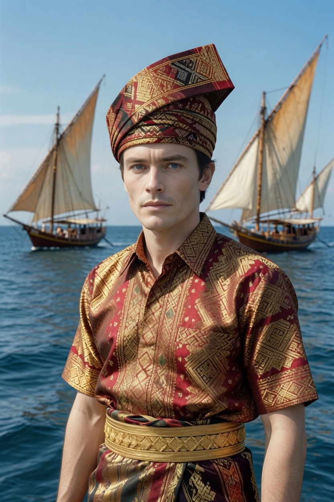

# Pria Bugis & Makassar: Benarkah Berani, Tegas, dan Setia pada Harga Diri?

*Ilustrasi (pic: Grok AI).*

  
***Pria Bugis-Makassar adalah lautan. Luas, berani menantang cakrawala, tetapi juga memiliki aturan kehormatan yang kuat***
  

Pria Bugis dan Makassar sering diibaratkan ombak laut. Sebab sejarah mereka sangat erat dengan pelayaran, perdagangan, pelaut, perantauan, dan peperangan.

Selama ratusan tahun mereka menjelajahi Nusantara bahkan hingga Australia Utara. Lingkungan seperti ini cenderung membentuk budaya yang menghargai keberanian dan kemandirian.

## Julukan yang Paling Terkenal

Kalau ada satu konsep yang hampir selalu muncul ketika membahas Bugis-Makassar, itu adalah: Siri’ na Pacce. Ini bukan sekadar “malu”. 

Siri’ berarti harga diri, kehormatan, martabat. Pacce berarti empati mendalam, solidaritas, dan rasa ikut merasakan penderitaan orang lain. Gabungan keduanya membentuk etika sosial yang sangat kuat.

Bagi banyak orang Bugis dan Makassar, kehilangan kehormatan dipandang sebagai sesuatu yang sangat serius.

##  Terkenal Pemberani?

Bukan karena gen, melainkan karena sejarah. Mereka hidup dalam budaya maritim, laut adalah tempat yang keras.

Orang yang menjadi pelaut harus cepat mengambil keputusan, berani menghadapi badai, mampu memimpin, dan siap merantau jauh. Budaya seperti ini diwariskan lintas generasi.

## Mengapa Banyak yang Sukses Merantau?

Mirip Minangkabau, tetapi motifnya sedikit berbeda. Kalau Minang memiliki tradisi merantau yang kuat karena sistem sosial dan ekonomi, maka Bugis-Makassar memiliki sejarah mobilitas tinggi melalui pelayaran dan perdagangan.

Akibatnya, mereka ditemukan hampir di seluruh Indonesia.

##  Banyak yang Dianggap Tampan?

Tidak ada “gen ketampanan Bugis.” Tetapi beberapa faktor sering disebut, yaitu variasi genetik akibat interaksi antarpopulasi, proporsi wajah yang beragam, tubuh yang relatif atletis pada sebagian individu karena budaya kerja dan aktivitas fisik, serta cara membawa diri yang percaya diri.

Kepercayaan diri sendiri dapat memengaruhi persepsi daya tarik seseorang.

## Benarkah Keras?

Menariknya, banyak orang luar menganggap mereka keras. Padahal dari dalam budaya sendiri, yang dijaga adalah ketegasan.

Dalam banyak situasi sehari-hari, orang Bugis dan Makassar juga dikenal hangat terhadap tamu dan memiliki ikatan kekeluargaan yang kuat.

## Religius?

Mayoritas Bugis dan Makassar memeluk Islam sejak abad ke-17 setelah proses Islamisasi kerajaan-kerajaan di Sulawesi Selatan.

Karena itu, nilai agama menjadi bagian penting dalam kehidupan sosial mereka. Namun seperti etnis lain, tingkat religiositas setiap individu tentu beragam.

## Mitos vs Fakta

| Mitos | Fakta |
|------|-------|
| Semua pria Bugis pemberani | Keberanian dipengaruhi pendidikan, pengalaman, dan kepribadian, bukan etnis semata. |
| Semua Bugis keras | Yang menonjol adalah budaya menjaga martabat (siri’), bukan berarti semua berwatak keras. |
| Semua Bugis tampan | Persepsi ketampanan sangat subjektif dan dipengaruhi banyak faktor. |
| Semua perantau sukses | Merantau membuka peluang, tetapi keberhasilannya tetap bergantung pada usaha dan keadaan.|

## Perspektif Evolusi dan Budaya

Budaya maritim menuntut keberanian menghadapi ketidakpastian, kerja sama, kemampuan membaca lingkungan, dan jaringan sosial yang luas.

Tidak mengherankan bila masyarakat yang tumbuh dalam lingkungan seperti ini sering dipersepsikan sebagai tangguh, percaya diri, adaptif. Namun itu adalah kecenderungan budaya, bukan sifat bawaan biologis semua anggotanya.

Pria Bugis-Makassar adalah lautan. Luas, berani menantang cakrawala, tetapi juga memiliki aturan kehormatan yang kuat.

Tidak ada etnis yang “lebih unggul” dari yang lain. Yang ada adalah perjalanan sejarah yang berbeda-beda, sehingga melahirkan budaya, nilai, dan stereotip yang juga berbeda.

  
**Referensi** 

Christian Pelras. (1996). The Bugis. Blackwell Publishers.

Badan Riset dan Inovasi Nasional. Publikasi tentang sejarah dan etnografi Sulawesi.

Badan Pusat Statistik. Data sosial dan demografi Sulawesi.

Siri’ na Pacce dalam literatur antropologi dan sosiologi Indonesia.

The Austronesians: Historical and Comparative Perspectives. ANU Press.
