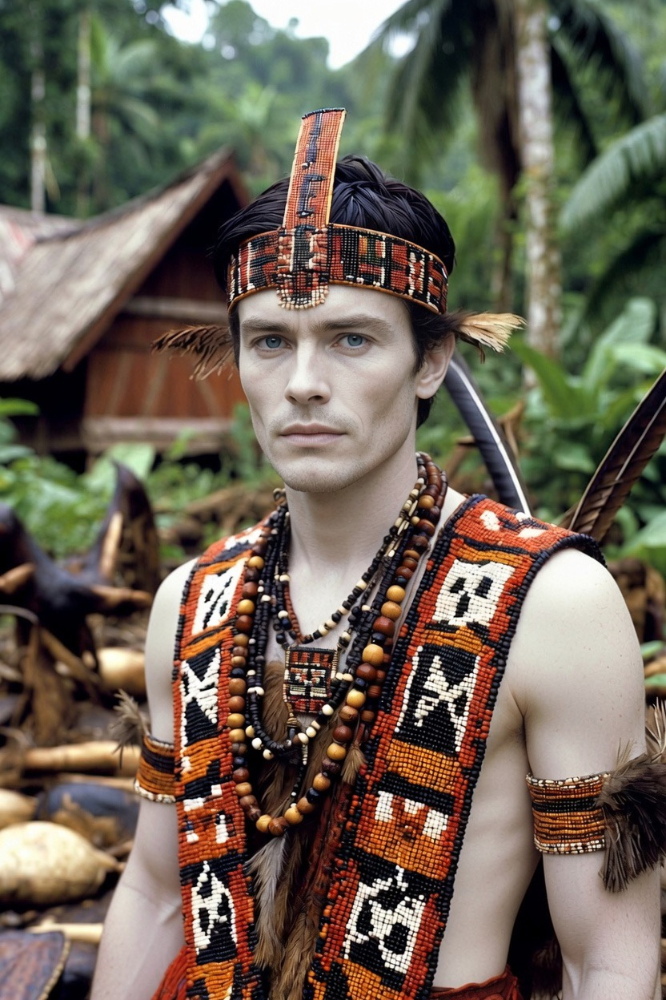

# Pria Dayak: Gagah, Jujur, Tangguh, dan Memiliki Karisma yang Tenang

*Ilustrasi (pic: Grok AI).*

  
***Pria Dayak adalah hutan. Hutan tidak banyak bicara, tetapi ia menyimpan kehidupan, ketahanan, dan kebijaksanaan yang terbentuk selama ribuan tahun***
  

Ketika mendengar kata Dayak, banyak orang langsung membayangkan tubuh atletis, tato tradisional, telinga panjang, mandau, rumah panjang, serta hidup di pedalaman.

Sebagian gambaran itu memiliki dasar sejarah, tetapi sebagian lagi merupakan stereotip yang terlalu disederhanakan.

Yang sering terlupakan adalah bahwa “Dayak” bukan satu suku, melainkan payung bagi ratusan subkelompok etnis di Kalimantan.

## Siapa Sebenarnya Orang Dayak?

Istilah Dayak mencakup lebih dari 200 subetnis, antara lain: Ngaju Kenyah, Kayan, Iban, Ma’anyan, Benuaq, dan Ot Danum. Masing-masing memiliki bahasa, adat, pakaian, dan sejarah yang berbeda.

Jadi mengatakan “orang Dayak” sama seperti mengatakan “orang Eropa”, benar sebagai kelompok besar, tetapi sangat beragam di dalamnya.

## Mengapa Banyak yang Dianggap Gagah?

Secara biologis tidak ada gen kegagahan Dayak. Namun ada beberapa faktor yang memengaruhi persepsi, diantaranya:

1. Adaptasi lingkungan

Selama ratusan bahkan ribuan tahun, banyak komunitas Dayak hidup di hutan hujan tropis, daerah berbukit, sungai besar.

Lingkungan seperti itu menuntut kekuatan fisik, ketahanan, koordinasi tubuh, serta kemampuan berburu dan bertahan hidup.

Sehingga wajar bila masyarakat luar sering mengasosiasikan pria Dayak dengan tubuh yang kuat.

2. Bahasa tubuh

Dalam psikologi sosial, ketampanan tidak hanya berasal dari wajah. Tetapi juga dari cara berjalan, kontak mata, postur, dan kepercayaan diri.

Budaya Dayak yang menghargai keberanian sering membuat pria-prianya tampak tenang namun mantap.

## Apakah Benar Terkenal Jujur?

Ini menarik.

Banyak peneliti antropologi mencatat bahwa berbagai komunitas Dayak memiliki sistem adat yang kuat.

Pelanggaran terhadap janji, tanah adat, atau hubungan antarkeluarga dapat dikenai sanksi adat.

Akibatnya, kepercayaan menjadi modal sosial yang sangat penting. Namun tentu saja… kejujuran tetap merupakan sifat individu, bukan sesuatu yang otomatis dimiliki karena etnis.

## Mengapa Terlihat Pendiam?

Banyak orang luar menganggap pria Dayak “Sedikit bicara.” Ada kemungkinan ini berkaitan dengan budaya komunikasi yang lebih menghargai pengamatan sebelum berbicara, terutama ketika berhadapan dengan orang yang belum dikenal.

Dalam banyak komunitas tradisional, berbicara berlebihan bukanlah tanda kebijaksanaan.

## Benarkah Mereka Pemberani?

Secara historis… ya. Tetapi keberanian itu lahir dari kebutuhan hidup.

Masyarakat Dayak hidup berdampingan dengan sungai besar, hutan lebat, binatang liar, serta perjalanan jauh.

Lingkungan seperti itu membentuk budaya yang menghargai keberanian, kerja sama, dan kemampuan bertahan hidup.

## Banyak yang Dianggap Tampan

Secara genetika… populasi Dayak memiliki variasi yang besar. Sebagian memiliki rahang tegas, tulang pipi tinggi, mata yang dalam, dan rambut hitam tebal.

Namun karena Dayak terdiri dari banyak subkelompok, tidak ada satu “wajah Dayak” yang mewakili semuanya.

Persepsi ketampanan tetap dipengaruhi oleh budaya dan preferensi individu.

## Hubungan dengan Alam

Kalau ada satu hal yang sangat kuat dalam banyak budaya Dayak, itu adalah hubungan dengan alam.

Hutan bukan sekadar sumber kayu, sungai bukan sekadar sumber air. Keduanya merupakan bagian dari identitas budaya, spiritual, dan ekonomi.

Karena itu, banyak komunitas Dayak memiliki aturan adat mengenai pemanfaatan hutan jauh sebelum konsep konservasi modern berkembang.

Mitos vs Fakta

| Mitos | Fakta |
|------|-------|
| Semua Dayak hidup di pedalaman | Banyak yang tinggal di kota dan berprofesi sebagai akademisi, dokter, pengusaha, pegawai negeri, maupun profesional lainnya. |
| Semua Dayak bertato | Tato tradisional hanya dimiliki oleh komunitas tertentu dan tidak lagi menjadi praktik umum di semua kelompok. |
| Semua pria Dayak garang | Banyak yang justru dikenal ramah dan santun.|
| Semua Dayak menganut agama yang sama | Komunitas Dayak menganut berbagai agama dan kepercayaan, termasuk Kristen, Katolik, Islam, Hindu Kaharingan, dan lainnya.|

## Perspektif Evolusi

Dalam psikologi evolusi, manusia cenderung mengaitkan tubuh kuat, postur tegap, serta kemampuan bertahan hidup, dengan kualitas kepemimpinan dan perlindungan.

Mungkin itulah sebabnya banyak orang memandang pria Dayak sebagai sosok yang “gagah”.

Namun penting diingat, persepsi itu adalah hasil interaksi antara ciri fisik, budaya, dan cara seseorang membawa dirinya.

Pria Dayak adalah hutan. Hutan tidak banyak bicara, tetapi ia menyimpan kehidupan, ketahanan, dan kebijaksanaan yang terbentuk selama ribuan tahun.

Keheningannya bukan pertanda kelemahan, melainkan tanda bahwa ia tidak perlu berteriak untuk menunjukkan kekuatannya.

  
**Referensi**

Bernard Sellato. (2002). Innermost Borneo: Studies in Dayak Cultures. Singapore: Singapore University Press.

Badan Riset dan Inovasi Nasional. Publikasi tentang masyarakat Dayak dan budaya Kalimantan.

UNESCO. Publikasi mengenai warisan budaya masyarakat adat dan pengetahuan tradisional.

Badan Pusat Statistik. Data sosial dan demografi Kalimantan.

The Austronesians: Historical and Comparative Perspectives. ANU Press.
