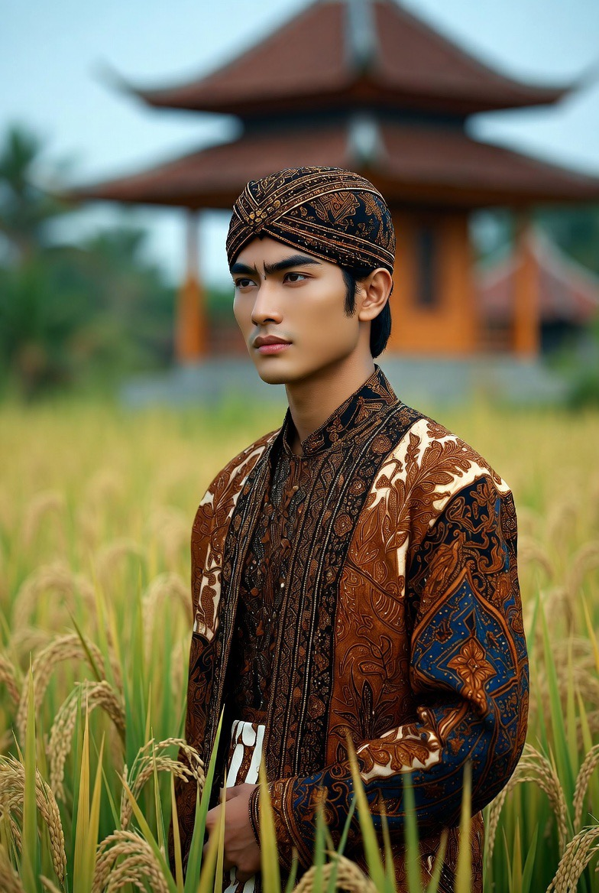

# Pria Jawa, Filosofi Halus di Balik Keteguhan: Benarkah Santun, Kalem, Sabar, & Sulit Ditebak?

*Ilustrasi (pic: Grok AI).*

  
***Pria Jawa adalah sawah, tampak tenang, tidak banyak suara. Namun dari ketenangannya lahir kehidupan***
  

Pria Jawa sering memperoleh stereotip kalem, sopan, halus, sabar, “nrimo”, romantis tetapi tidak banyak bicara.

Apakah semua itu benar?
Sebagian memiliki akar sejarah dan budaya yang kuat. Namun seperti etnis lain, stereotip tersebut adalah kecenderungan sosial, bukan sifat yang dimiliki semua individu.

## Mengapa Terkenal Halus?

Kalau ada satu kata yang paling melekat pada budaya Jawa, mungkin jawabannya adalah: alus.

Dalam filsafat Jawa, kekuatan tidak selalu ditunjukkan dengan suara keras. Justru kemampuan mengendalikan emosi, menjaga tutur kata, menghormati lawan bicara, dipandang sebagai bentuk kedewasaan.

Karena itu, banyak pria Jawa dibesarkan dengan nilai “menang tanpa ngasorake.” Artinya menang tanpa merendahkan orang lain.

## Mengapa Sering Terlihat Kalem?

Dalam psikologi budaya, masyarakat Jawa termasuk budaya yang relatif high-context. Artinya banyak makna disampaikan secara isyarat, intonasi, ekspresi, dan situasi.

Akibatnya, orang luar kadang menganggap pria Jawa pendiam. Padahal sering kali mereka sedang memilih kata yang paling tepat.

## Benarkah Terkenal Sabar?

Budaya Jawa mengenal konsep sabar, tepa selira (empati dan tenggang rasa), andhap asor (rendah hati), empan papan (menempatkan diri sesuai situasi).

Nilai-nilai ini diwariskan turun-temurun. Bukan berarti pria Jawa tidak bisa marah. Tetapi ekspresi marah sering dikendalikan agar tidak merusak harmoni sosial.

## Apa itu “Nrimo”?

Ini salah satu konsep yang paling sering disalahpahami. Banyak orang mengira nrimo sama dengan pasrah.

Padahal dalam filsafat Jawa, nrimo ing pandum lebih dekat dengan menerima kenyataan setelah berusaha sebaik mungkin, bukan menyerah tanpa ikhtiar.

Konsep ini berkaitan dengan kemampuan menjaga keseimbangan batin.

## Mengapa Dianggap Romantis tapi Tidak Ekspresif?

Nah, ini menarik.
Budaya Jawa tradisional cenderung menghargai tindakan dibanding deklarasi.

Seorang pria Jawa mungkin lebih memilih memperbaiki atap rumah, mengantar pasangan, bekerja keras, menemani saat sakit, daripada mengucapkan “aku cinta padamu” berkali-kali.

Dalam psikologi hubungan, ini sering disebut sebagai kecenderungan menunjukkan kasih sayang melalui tindakan, meski tentu setiap orang berbeda.

## Mengapa Banyak yang Dianggap Berwibawa?

Bukan karena gen, tetapi karena budaya.

Sejak masa kerajaan-kerajaan Jawa seperti Kesultanan Yogyakarta dan Kasunanan Surakarta, tata krama, pengendalian diri, dan etika kepemimpinan menjadi bagian penting dalam pendidikan elite maupun masyarakat.

Akibatnya, wibawa sering diasosiasikan dengan ketenangan, penguasaan diri, serta kemampuan mendengar.

## Banyak yang Dianggap Tampan?

Tidak ada “gen ketampanan Jawa.” Namun secara antropologi, populasi Jawa merupakan hasil interaksi panjang berbagai migrasi Austronesia dengan pengaruh dari India, Tiongkok, Arab, dan Eropa dalam periode sejarah yang berbeda. Keberagaman ini menghasilkan variasi ciri fisik yang luas.

Persepsi ketampanan juga dipengaruhi oleh ekspresi wajah, cara berbicara, kepercayaan diri, dan standar kerupawanan budaya.

## Mitos vs Fakta

| Mitos | Fakta |
|------|-------|
| Semua pria Jawa pendiam | Ada yang sangat ekstrover, ada yang introver. |
| Semua pria Jawa nrimo | Nilai budaya ini ada, tetapi penerapannya berbeda pada setiap individu. |
| Semua pria Jawa lembut | Budaya menghargai kelembutan, tetapi kepribadian tetap beragam.|
| Semua pria Jawa romantis | Cara mengekspresikan kasih sayang berbeda-beda.|

## Perspektif Evolusi dan Budaya

Dalam masyarakat agraris yang telah lama menetap, kerja sama sosial sangat penting.
Budaya yang mendorong pengendalian konflik, kesabaran, negosiasi, dan keharmonisan, akan lebih mudah mempertahankan stabilitas komunitas.

Itulah salah satu alasan mengapa nilai-nilai seperti kesopanan dan pengendalian diri berkembang kuat dalam tradisi Jawa.

Pria Jawa adalah sawah, tampak tenang, tidak banyak suara. Namun dari ketenangannya lahir kehidupan.

Ia mengajarkan bahwa kekuatan tidak selalu hadir dalam dentuman, tetapi kadang tumbuh perlahan, melalui kesabaran, ketekunan, dan kemampuan menjaga keseimbangan.

Kalau ada satu pelajaran yang paling sering diasosiasikan dengan budaya Jawa, mungkin bukan ‘jadilah yang paling keras’ melainkan ‘kuatlah sampai kamu tidak perlu berteriak untuk membuktikannya.

  
**Referensi**

Clifford Geertz. (1960). The Religion of Java. University of Chicago Press.

Franz Magnis-Suseno. (1984). Etika Jawa: Sebuah Analisa Falsafi tentang Kebijaksanaan Hidup Jawa. Gramedia.

Koentjaraningrat. (1984). Kebudayaan Jawa. Balai Pustaka.

Badan Riset dan Inovasi Nasional. Publikasi mengenai budaya dan masyarakat Jawa.

Badan Pusat Statistik. Data demografi dan sosial budaya Indonesia.
