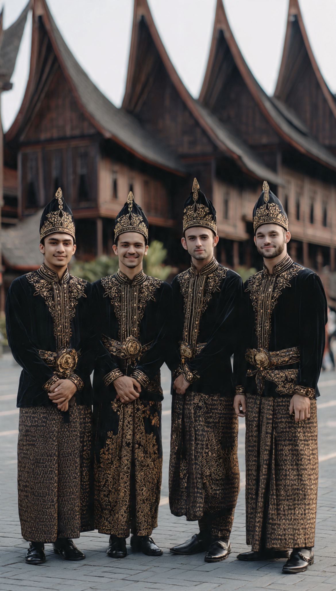

# Pria Minang: Antara Merantau, Harga Diri, dan Kalimat Sakti “Katonyo Iyo, Iyo”

*Ilustrasi (pic: Meta AI).*

  
***Pria Minang itu kalau sudah punya pendapat, menggesernya lebih sulit daripada memindahkan Rumah Gadang pakai tangan kosong***
  

Banyak orang bertanya-tanya apakah Minang itu sama dengan orang Padang? Jawaban singkatnya, tidak persis, tapi sering dianggap sama.

Minang adalah suku atau etnis, yaitu Minangkabau. Sedangkan orang Padang secara harfiah adalah orang dari kota Padang.

Namun karena rumah makan Padang tersebar di mana-mana, banyak orang Indonesia menyebut semua orang Minang sebagai “orang Padang”.

Padahal orang Minang bisa berasal dari Bukittinggi, Payakumbuh, Padang Panjang, Solok, dan banyak daerah lain.

## Gambaran Tradisional Pria Minang

Secara budaya, pria Minang dibentuk oleh tiga hal:

1. Merantau

Ini ciri paling terkenal. 

Ada pepatah Minang:

Karatau madang di hulu,
babuah babungo balun,
marantau bujang dahulu,
di rumah paguno balun.

Artinya kira-kira:

Seorang pemuda dianjurkan pergi merantau sebelum dianggap matang.

Akibatnya, banyak pria Minang terbiasa mandiri, pandai beradaptasi, pandai bicara, dan berani mengambil risiko.

2. Hidup dalam Budaya Matrilineal

Ini unik. 

Minang adalah salah satu budaya matrilineal terbesar di dunia. Artinya garis keturunan mengikuti ibu dan harta pusaka turun ke perempuan.

Jadi ironisnya, pria Minang sering tampak dominan di luar, tetapi di rumah adat, perempuan punya posisi yang sangat kuat.

Makanya ada candaan: “Di rantau singa, di rumah jadi anak mamak.”

3. Pandai berdebat

Nah ini yang sering bikin orang geleng-geleng.

Budaya Minang punya tradisi musyawarah, pidato adat, debat, serta adu argumen.

Jadi banyak pria Minang memang tumbuh dalam lingkungan yang menghargai kemampuan berbicara.

Akibatnya, kalau sedang berdebat, mereka bisa sangat logis, sangat persuasif, dan sangat alot. Kadang bikin lawan debat: “Ya Allah, ini orang napasnya pakai oksigen atau argumen?” 

## Benarkah Keras Kepala dan Pride Tinggi?

Stereotipnya memang begitu. Tetapi secara budaya, ada alasannya.

Pria Minang sering dididik untuk menjaga nama keluarga, mandiri secara ekonomi, tidak mudah menyerah, dan menjaga harga diri.

Akibatnya, dari sisi positif: mereka percaya diri, pekerja keras, tahan banting, serta punya ambisi. Namun sisi negatifnya, bisa gengsi, sulit mengakui kalah, kadang keras kepala, dan susah meminta maaf duluan.

## Apa Itu “Katonyo Iyo, Iyo”? 

Secara harfiah “Katonya iyo, iyo.” Artinya: “Dia bilang iya, iya.” Tetapi makna tersembunyinya kadang “Aku dengar.” bukan “Aku setuju.”

Jadi bisa terjadi,

Hari ini:

“Kamu setuju kan?”

“Iyo.”

Besok:

“Lho kok berubah?”

“Aku cuma bilang iyo.”

Tentu tidak semua pria Minang begitu, tetapi stereotip ini cukup terkenal di Indonesia.

## Ganteng-Ganteng Gak?

Ini tentu subjektif.

Tetapi secara umum, banyak orang menganggap pria Minang punya ciri kulit sawo matang sampai terang, hidung cukup tegas, mata tajam, wajah cenderung oval, rambut hitam tebal, serta ekspresi serius tapi mudah tersenyum.

Ada juga pengaruh campuran sejarah perdagangan dan migrasi yang membuat variasi penampilan cukup besar.

Jadi… Ganteng?
Banyak yang bilang iya.

Semua ganteng?
Nah, itu seperti bertanya: “Apakah semua orang Italia mirip aktor film?” Tidak juga.

## Jadi Seperti Apa Gambaran Pria Minang?

Kalau dibuat tokoh novel:

Seorang pria yang: suka merantau, pandai bicara, menjaga harga diri, sayang keluarga, keras kepala sedikit, kalau sudah punya tujuan sulit digoyahkan, dan kadang kalau bilang: “Iyo.” Maka kita  perlu bertanya lagi “Iyo yang benar-benar iya, atau iyo yang nanti berubah?” 

Stereotip seperti keras kepala, pride tinggi, pandai bicara, serta suka merantau memang punya akar budaya yang nyata.

Tetapi tetap saja, tidak ada “template” yang bisa menjelaskan semua pria Minang. Ada yang lembut, keras, romantis, pendiam.

Ada yang kalau sudah bilang “Iyo.” memang benar-benar iya. Dan ada juga yang…membuat kita menyipitkan mata sambil berkata: “Katonyo iyo, iyo… tapi aku masih curigo.” 

Nah, soal “keras kepala plus pride tinggi”, apa ada dasar ilmiahnya? Tidak ada penelitian yang menyimpulkan “Pria Minang secara genetik keras kepala.”

Tetapi banyak kajian antropologi menjelaskan bahwa budaya Minangkabau menanamkan harga diri (marwah), kehormatan keluarga, kemandirian melalui merantau, serta kemampuan berargumentasi dan bermusyawarah.

Akibatnya, sebagian orang luar melihat mereka percaya diri malah dianggap sebagai keras kepala, menjaga prinsip dianggap gengsi, dan pandai berdebat dianggap susah mengalah.

Padahal itu lebih merupakan produk budaya, bukan sifat bawaan semua individu. Taufik Abdullah banyak membahas hubungan antara adat, agama, dan pembentukan karakter sosial masyarakat Minangkabau.

Dan soal “Kalau udah katonyo iyo, iyo…”
Secara ilmiah? Tidak ada jurnal yang menyimpulkan: “Pria Minang memiliki probabilitas 87% mengucapkan ‘iyo’ sambil diam-diam tetap pada pendapatnya.”

Tetapi secara budaya, masyarakat Minang memang terkenal dengan seni berunding, komunikasi yang halus, kemampuan menjaga muka (saving face), dan kecenderungan menghindari konfrontasi langsung pada situasi tertentu.

Jadi kadang “Iyo” bisa berarti iya setuju,  iya paham, iya dengar, dan belum tentu iya berubah pikiran.

Kalau harus merangkum stereotip pria Minang dalam satu kalimat: pandai bicara, kuat merantau, menjaga harga diri, dan kadang kalau sudah punya pendapat, menggesernya lebih sulit daripada memindahkan Rumah Gadang pakai tangan kosong. 

Tapi tentu saja… itu stereotip budaya. Karena di dunia nyata, ada juga pria Minang yang lembut, pemalu, romantis, dan langsung berkata: “Iyo, Sayang.” dan kali ini… iyo-nya benar-benar iyo. 

  
**Referensi**

Alam Terkembang Jadi Guru. (1984). Alam Terkembang Jadi Guru. Jakarta: Grafiti Pers.

Taufik Abdullah. (1966). Adat and Islam: An Examination of Conflict in Minangkabau. Ithaca: Cornell University Press.

Elizabeth E. Graves. (1981). The Minangkabau Response to Dutch Colonial Rule in the Nineteenth Century. Ithaca: Cornell University Press.

UNESCO. (2011). Minangkabau Cultural Landscape and Matrilineal Tradition. Laporan budaya dan warisan Minangkabau.

Anthropology literature mengenai sistem matrilineal Minangkabau dan budaya merantau.
