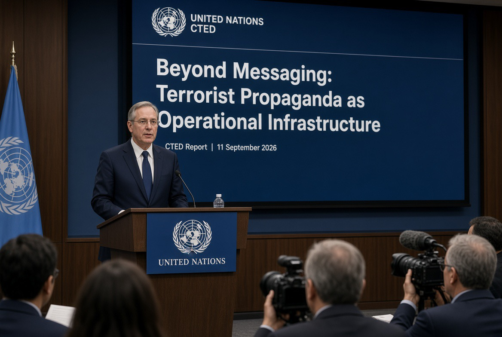

# Propaganda: Ketika Perang Merebut Fakta

*Ilustrasi (pic: Grok AI).*

  
***Persoalan terbesarnya adalah siapa yang mengawasi orang yang mengawasi propaganda?***
  

Propaganda adalah komunikasi yang sengaja dirancang untuk memengaruhi persepsi, sikap, atau perilaku politik.

Ia bisa datang dari negara, militer, partai, perusahaan, media, kelompok bersenjata, aktivis, atau individu.

Sedangkan terrorist propaganda adalah kategori jauh lebih spesifik, yaitu komunikasi yang terkait dengan kelompok/aktor yang melakukan atau mendukung kekerasan teroris dan digunakan untuk tujuan seperti rekrutmen, radikalisasi, penggalangan dana atau fasilitasi operasi.

PBB pada 11 September 2026 mengumumkan laporan baru Counter-Terrorism Committee Executive Directorate (CTED) berjudul “Beyond messaging: terrorist propaganda as operational infrastructure.” 

Laporan itu menyebut propaganda kelompok teroris bukan lagi sekadar alat mencari simpatisan, tetapi sudah menjadi bagian dari infrastruktur operasional untuk rekrutmen, pendanaan, dan bahkan perencanaan operasi. AI, gaming platform, enkripsi, dan konten kekerasan menjadi perhatian utama. 

Laporan CTED justru menekankan perubahan fungsi propaganda tersebut: dari sekadar “messaging” menjadi “operational infrastructure.” 

Jadi kalau ada akun yang mengkritik Amerika, mendukung Palestina, memuji Rusia, mengecam Israel, membela Iran, atau menyerang NATO, itu sendiri belum menjadikannya propaganda teroris.

Kalau kita mencampur semuanya, definisinya menjadi bubur geopolitik. 

## Sejarah menunjukkan Masalahnya Bukan Fiktif

Setelah 9/11, “counter-terrorism” berkembang menjadi rezim keamanan global yang sangat besar.

Masalahnya, siapa yang menentukan siapa teroris? Karena tidak ada definisi universal yang sesederhana bahwa orang jahat sama dengan teroris. Status kelompok dapat berbeda menurut negara. 

Contohnya sangat jelas dalam politik Timur Tengah. Satu kelompok bisa disebut terrorist organization oleh negara A, sementara oleh pihak lain disebut resistance movement, militia, atau political movement.

Bahkan status Hezbollah sendiri sangat kontroversial secara internasional, dengan negara-negara berbeda mengambil posisi berbeda terhadap organisasi atau sayapnya.

Artinya, label “terrorist” bukan cuma kategori keamanan. Ia juga merupakan kategori politik dan hukum yang memiliki konsekuensi besar.

Begitu seseorang/organisasi mendapat label tersebut, konsekuensinya bisa mencakup pembekuan aset, larangan transaksi, penghapusan konten, pembatasan perjalanan, kriminalisasi dukungan tertentu, serta peningkatan pengawasan.

Sehingga siapa yang memegang kekuasaan memberi label menjadi sangat penting.

## Dan Sekarang Masuklah AI

Ini bagian yang paling penting dari laporan PBB 2026, masalah propaganda telah mengalami industrialization.

Dulu kelompok ekstremis perlu studio, editor, penerjemah, distributor, serta jaringan perekrut.

Sekarang tinggal memakai AI generatif, terjemahan otomatis, gambar, video, voice clone, personalisasi, dan distribusi.

Satu pesan dapat diubah menjadi banyak bahasa dan format dengan biaya sangat rendah.

Laporan PBB memperingatkan bahwa teknologi baru memungkinkan kelompok teroris memperluas jangkauan propaganda, rekrutmen, dan penggalangan dana. Ini bukan paranoia.

Bahkan laporan ancaman AI terbaru dari Anthropic juga menemukan aktor berbahaya mencoba menggunakan AI untuk operasi malicious. Jadi PBB punya alasan keamanan yang legitimate.

Masalah sebenarnya bukan hanya propaganda teroris. Masalah yang jauh lebih besar adalah siapa yang berhak mendefinisikan informasi mana yang merupakan ancaman?

Karena dalam perang informasi terdapat tiga kategori yang sering dipaksa masuk ke satu keranjang:

A. Disinformasi

Informasi palsu yang sengaja dibuat untuk menipu.

B. Propaganda

Informasi yang dipilih/dikemas secara persuasif untuk tujuan politik.

C. Terorist propaganda

Propaganda yang menjadi bagian dari ekosistem kekerasan teroris.

Ketiganya tidak identik.

Dan kalau negara menyebut bahwa narasi yang menguntungkan musuh sama dengan propaganda, maka itu belum otomatis berarti narasi tersebut adalah propaganda teroris.

## Risiko Securitization of Speech

Dalam teori keamanan, ada konsep securitization.

Sebuah isu awalnya dianggap masalah politik biasa. Kemudian dikonstruksi sebagai ancaman eksistensial. Begitu sesuatu diberi status “ancaman keamanan”, negara memperoleh legitimasi untuk menggunakan instrumen luar biasa.

Contohnya: kritik terhadap pemerintah, dianggap foreign influence, information warfare, extremist propaganda, terrorist propaganda, akibatnya muncul security threat.

Nah! Tangga inilah yang harus diawasi.

Bukan karena semua peringatan PBB salah, tetapi karena kategori keamanan yang terlalu elastis dapat mengubah dissent menjadi security threat.

## Barat Tidak Punya Monopoli Manipulasi Informasi

Ini penting, kalau kita mau adil secara ilmiah, Rusia, China, Iran, Israel, AS, negara-negara Eropa, kelompok non-negara, semuanya mempunyai sejarah operasi informasi. Yang berbeda adalah kapasitas, tujuan, struktur, teknologi, jangkauan, dan konteks.

Jadi kritik bahwa Barat melakukan propaganda, bisa benar. Tetapi karena Barat melakukan propaganda, semua peringatan PBB tentang propaganda teroris pasti merupakan propaganda Barat tidak mengikuti secara logis.

Itu namanya genetic fallacy, yaitu menolak sebuah klaim hanya karena menganggap sumbernya punya kepentingan tertentu.

Sebaliknya, kita juga jangan melakukan PBB mengatakan demikian, maka otomatis netral dan benar. Itu juga appeal to authority.

## Information Legitimacy

Perang modern bukan cuma: Who controls territory? Tetapi juga: Who controls the interpretation of territory?

Misalnya satu serangan.
Pihak A: “precision strike against terrorists.”
Pihak B: “massacre of civilians.”
Pihak C: “resistance operation.”
Pihak D: “war crime.”
Satu peristiwa, empat narasi.

Dan narasi yang menang dapat menentukan legitimasi politik bahkan sebelum penyelidikan selesai.

Itulah sebabnya perang modern adalah kinetic warfare, information warfare, serta legitimacy warfare.

## Palestina adalah Contoh Paling Brutal dari Problem ini

Ketika seseorang mengatakan: “Saya mendukung Palestina.” itu adalah posisi politik.

Ketika seseorang berkata: “Serangan terhadap warga sipil adalah benar karena mereka musuh.” itu adalah persoalan lain.

Ketika seseorang merekrut orang untuk melakukan serangan terhadap warga sipil, itu lagi-lagi kategori berbeda.

Jangan sampai ketiga hal tersebut digabung menjadi pro-Palestinian berarti terrorist propaganda. Itu akan menjadi category error sekaligus alat represi politik.

Sebaliknya, propaganda ISIS yang benar-benar mendorong rekrutmen dan kekerasan tidak boleh dibela hanya karena: “itu narasi anti-Barat.”

Anti-Barat bukan sinonim dengan terrorist, sementara pro-Barat juga bukan sinonim dengan truth. Kebenaran harus diuji pada klaim dan bukti, bukan pada bendera yang membungkusnya.

## Apakah Barat “Kalah Propaganda”?

Tidak ada bukti yang cukup untuk menyimpulkan bahwa Barat kalah propaganda sehingga meminta PBB menyebut propaganda lawan sebagai propaganda teroris.

Tetapi ada fenomena yang memang nyata, bahwa monopoli narasi Barat jauh lebih lemah daripada 20 tahun lalu, karena sekarang ada TikTok, Telegram, X, YouTube, AI generatif, media Arab, media China, media Rusia, media Global South, citizen journalism, juga OSINT.

Informasi tidak lagi bergerak melalui beberapa gatekeeper saja. Dan akibatnya otoritas epistemik Barat mengalami kompetisi.

Bukan berarti Barat kehilangan kemampuan propaganda. Justru sebaliknya, semua pihak sekarang bisa melakukan industrial-scale narrative production.

## AI Membuat Pertarungan Semakin Brutal

Bayangkan tahun 2003. Sebuah negara harus menguasai CNN, koran, radio, dan kantor berita. Tetapi sekarang, satu orang dengan AI dapat menghasilkan: 50 video, 20 bahasa, 100 meme, bahkan 10 narasi berbeda dalam waktu singkat.

Jadi masalah masa depan bukan: “Siapa punya propaganda paling kuat?” Tetapi:“Siapa yang mampu membuat publik tidak lagi tahu mana fakta, propaganda, satire, manipulasi, dan bukti?”

Dan itu jauh lebih berbahaya.

PBB pada September 2026 memang memperingatkan bahwa propaganda teroris semakin menjadi infrastruktur operasional, termasuk untuk rekrutmen, pendanaan dan perencanaan operasi, dengan AI dan platform digital memperbesar kemampuan tersebut. 

Kekhawatiran yang sah adalah tentang definisi terrorism, extremism, propaganda, foreign influence, dan disinformation dapat dipolitisasi jika negara membuat kategorinya terlalu luas.

Persoalan terbesarnya adalah siapa yang mengawasi orang yang mengawasi propaganda?

Karena kalau sebuah pemerintah diberi kekuasaan untuk menentukan“Ini propaganda.” lalu menilai “Ini ekstremisme.”“Ini terorisme.” tanpa standar hukum yang ketat, bukti, transparansi, mekanisme banding, dan perlindungan kebebasan berekspresi, maka perang melawan propaganda dapat berubah menjadi perang terhadap narasi yang tidak disukai penguasa.

Dan di situlah demokrasi bisa masuk ke ruangan dengan pintu depan terbuka, tetapi kebebasan berbicara diam-diam keluar lewat pintu belakang. 

Jadi melawan propaganda teroris memang harus, tetapi jangan kriminalisasi dissent dengan menyebutnya terorisme.

Itu dua hal yang harus dipisahkan dengan pisau bedah, bukan dicampur dengan blender geopolitik. 

  
**Referensi**

United Nations Security Council Counter-Terrorism Committee Executive Directorate. (2026, September 10). Beyond messaging: Terrorist propaganda as operational infrastructure. 

United Nations. (2026, September 11). Terrorist propaganda is outpacing global efforts to stop it, UN report finds. 

United Nations Security Council Counter-Terrorism Committee. (2016). Security Council requests UN panel to propose global framework on countering terrorist propaganda. 

Associated Press. (2026, September 12). Terrorists turn global innovations into weapons, UN warns. 
