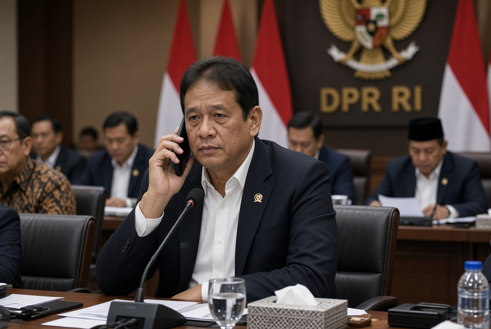

# Purbaya, Investor China, dan Politik di Balik Kursi Menkeu

*Ilustrasi (pic: Grok AI).*

  
***Pertanyaan ilmiahnya bukan ada telepon atau tidak, melainkan seberapa jauh kepentingan itu memengaruhi hasil akhirnya***
  

Belum ada bukti publik bahwa investor China atau pemerintah China secara langsung meminta Prabowo mencopot Purbaya. 

Tetapi ada bukti publik bahwa kepentingan bisnis asal China berhadapan langsung dengan sejumlah kebijakan Purbaya, dan karena keputusan pergantian Menkeu terjadi sangat mendadak, hipotesis tentang adanya tekanan atau lobbying informal layak diuji, bukan ditertawakan dan bukan pula langsung dianggap terbukti.

Ini bedanya analisis politik dengan gosip politik. Gosip bilang: “China nyuruh, Purbaya dicopot.” Analisis bilang: “Siapa yang memiliki kepentingan? Siapa yang berkonflik? Melalui kanal apa pengaruh dapat disalurkan? Apa perubahan kebijakan setelah pergantian? Dan apakah pola waktunya konsisten dengan hipotesis tersebut?”

Nah, mari kita bongkar. 

## Bedakan Tiga Aktor China

Ini penting banget.

| Aktor | Kepentingan |  
|--------|--------|
| Pemerintah RRT  | geopolitik, akses sumber daya, hubungan bilateral, BRI, stabilitas  |
| Perusahaan/investor asal China | profit, izin, pajak, tenaga kerja, mineral, perdagangan, kepastian hukum |
| CCCI | kanal kolektif untuk menyampaikan kepentingan bisnis China di Indonesia |

Jadi investor China tidak sama dengan pemerintah China. Tetapi dalam ekonomi-politik China, batas negara dan bisnis kadang lebih berpori dibanding model liberal Barat, terutama dalam sektor strategis dan perusahaan yang punya hubungan dengan negara. 

Karena itu, ilmuwan politik tidak boleh otomatis menyamakan semuanya, tetapi juga tidak boleh menganggap hubungan itu tidak relevan.

## Mei: Alarm Pertama Sudah Berbunyi

Pada Mei 2026, China Chamber of Commerce in Indonesia (CCCI) menyampaikan surat kepada Prabowo mengenai sejumlah persoalan investasi.

Keluhannya mencakup antara lain: kewajiban penempatan devisa hasil ekspor, perubahan kuota nikel, pajak dan pungutan, enforcement imigrasi dan kehutanan, serta apa yang mereka anggap sebagai tekanan berlebihan dari aparat.

The Jakarta Post melaporkan bahwa Purbaya merespons dengan garis yang sangat nasionalistik: kedaulatan atas sumber daya alam Indonesia diprioritaskan meskipun kebijakan lebih ketat berpotensi membuat investor pergi. 

Jadi di sini sudah terbentuk policy conflict, yaitu Investor menginginkan predictability dan lower friction, sementara Purbaya menginginkan sovereignty, enforcement, dan revenue collection.

Ini bukan pertengkaran personal, Ini konflik klasik dalam political economy of foreign investment.

## Juni: Konflik Berubah dari Diplomasi menjadi Enforcement 

Tanggal 25 Juni, Purbaya melakukan sidak terhadap perusahaan baja asal China di Pulogadung.

Dia menyebut adanya dugaan transaksi berbasis tunai yang menyebabkan nilai transaksi yang dilaporkan lebih rendah, sehingga berpotensi menekan pembayaran PPN, PPh, dan bea masuk. Perusahaan itu disebut mempunyai penjualan hampir Rp10 triliun. 

Dan ini titik penting, Purbaya tidak sedang menyerang “China” sebagai negara, dia sedang menyerang perilaku bisnis tertentu yang menurutnya merugikan penerimaan dan persaingan domestik.

Ini perbedaan yang sangat penting secara akademis karena kalau negara membiarkan perusahaan asing  dengan harga lebih murah pada tax avoidance, maka perusahaan lokal kalah sehingga basis pajak mengecil
maka pemerintah menghadapi regulatory arbitrage.

Investor asing mendapatkan keunggulan bukan karena produktivitas, melainkan karena mampu mengeksploitasi celah enforcement. Maka enforcement Purbaya secara teori ekonomi justru bisa dibaca sebagai level playing field policy.

## Juli:  Konflik Mulai Menghasilkan Counter-Pressure

Pada Juli, Purbaya mengatakan perusahaan baja domestik bahkan mengancam akan ikut “beroperasi secara gelap” jika pemerintah tidak menertibkan perusahaan baja China.

Dia menyebut sekitar 40 perusahaan China masuk radar pengawasan dan mengaitkan persoalan dengan transaksi cash-based serta potensi kekurangan pajak. 

Nah, di sinilah politiknya menjadi menarik, Karena bukan lagi Purbaya vs perusahaan China. MelainkanPemerintah vs ketidakadilan kompetitif dengan dua kelompok bisnis yang saling menarik pemerintah ke arah berbeda.

Investor China: “Regulasi terlalu berat.”
Pengusaha lokal: “Kalau mereka boleh begitu, kami juga akan melakukan begitu.”
Menteri Keuangan:“Gue harus enforce.”

Ini menciptakan apa yang disebut dalam political economy sebagai distributional conflict, bahwa setiap kebijakan menghasilkan pemenang dan pecundang.

## Lalu Datang 14 September

Purbaya dicopot dan digantikan Suahasil Nazara.

Reuters menekankan faktor yang berbeda, yaitu kekhawatiran terhadap defisit, pelemahan rupiah, kebijakan yang dianggap tidak predictable, kontroversi suntikan likuiditas ke perbankan, dan menurunnya kepercayaan investor. 

Jadi kita punya penjelasan resmi/market explanation yang cukup kuat.

Tetapi ada sesuatu yang tidak boleh kita lakukan, yaitu menggunakan penjelasan A untuk otomatis menghapus kemungkinan B.
Karena dalam politik, multiple causality sangat normal.

## Konsep Penting: Causal Overdetermination

Bayangkan Purbaya mempunyai lima masalah:

            PURBAYA
               │
      ┌────────┼────────┐
    
      ↓        ↓        ↓
    Pasar       BI       Fiskal

      │        │        │
      
      └────────┼────────┘
      
               ↓
               
       Investor asing
       
               │
               
               ↓
              
       Investor China
       
               │
              
               ↓
               
       Enforcement
       
Tidak perlu ada satu faktor tunggal. Bisa saja fiscal concerns, investor confidence, hubungan dengan BI, gaya komunikasi, kepentingan bisnis yang terganggu, serta kebutuhan politik Prabowo, semuanya bertemu.

Maka pertanyaannya bukan:apakah China penyebabnya? Tetapi apakah kepentingan China merupakan salah satu variabel yang meningkatkan probabilitas pergantian Purbaya?

Itu pertanyaan yang jauh lebih ilmiah, dan jawabannya belum bisa ditolak.

## Teori Lobbying 

Dalam studi lobbying, pengaruh tidak selalu berbentuk: “Tolong pecat Menteri X.” Bahkan bentuk seperti itu justru kurang lazim untuk aktor rasional, karena terlalu eksplisit dan berisiko.

Lebih umum:
1. Information lobbying
Investor memberikan informasi: “Kalau regulasi ini diterapkan, investasi kami akan turun.”
2. Threat signaling
“Kalau kondisi tidak berubah, kami akan meninjau kembali investasi.”
3. Coalition building
Investor mengumpulkan asosiasi bisnis, kamar dagang, diplomat, dan aktor domestik.
4. Elite access
Pertemuan langsung dengan presiden, menteri, atau pejabat senior.
5. Reputation signaling
Investor menyampaikan kepada pemerintah:
“Indonesia semakin tidak predictable.”
Kemudian pemerintah sendiri mengambil keputusan.

Dan hasil akhirnya dapat terlihat seperti:
“Prabowo mengganti menteri karena pertimbangan internal.” Padahal preferensi berbagai kelompok eksternal sudah masuk ke dalam kalkulasi elite sebelumnya. Itulah mengapa lobbying sering sulit dibuktikan secara forensik.

## Tetapi Jangan Jatuh ke Teori Konspirasi

Ini garis merahnya. Ada tiga level inferensi:

Level 1: fakta

Investor China memang mengeluhkan sejumlah kebijakan Indonesia. Purbaya memang mengambil tindakan terhadap perusahaan baja asal China, dan dia emang dicopot secara mendadak pada 14 September. 

Level 2: inferensi kuat

Ada kepentingan bisnis China yang berpotensi dirugikan oleh sebagian kebijakan Purbaya. Itu sangat reasonable untuk disimpulkan dari kronologi.

Level 3: hipotesis yang belum terbukti

“Investor China menghubungi Prabowo dan meminta Purbaya dicopot.” Belum ada bukti publik yang cukup untuk menaikkan ini menjadi fakta, tetapi hipotesis itu legitimate untuk diuji.

Itulah posisi ilmiahnya.

## Whoosh Membuat Puzzle ini Makin Menarik 

Delapan September, Reuters melaporkan pemerintah Indonesia akan mengambil alih kendali 60% proyek Whoosh, sementara perusahaan China mempertahankan 40%. Nilai proyek sekitar US$7,3 miliar, dengan utang sekitar US$4,5 miliar kepada China Development Bank. 

Purbaya sendiri mengumumkan perubahan struktur tersebut. Lalu enam hari kemudian: Purbaya dicopot.

Apakah Whoosh menyebabkan Purbaya dicopot? Tidak ada bukti untuk itu. Tapi secara analytical mapping, ini memperlihatkan betapa besar dan strategisnya interdependensi finansial Indonesia-China.

Jadi kalau kita membahas hubungan Purbaya dengan investor China, kita tidak boleh melihatnya hanya sebagai “Pabrik baja di Pulogadung.” Ada ekosistem yang lebih besar yaitu mineral, industri, pajak, investasi, BRI, pembiayaan, infrastruktur, utang, serta kebijakan fiskal. Dan di tengah jaringan itu duduk seorang Menteri Keuangan.

## Pergantian Suahasil juga Memberi Petunjuk

Ini justru menarik. Suahasil langsung menekankan credible state budget dan komitmen menjaga defisit di bawah 3% GDP. 

Reuters menggambarkan pergantian ini sebagai langkah untuk memulihkan kepercayaan investor dan membuat pengelolaan ekonomi lebih predictable. Artinya, dari perspektif state-market signaling, Prabowo sedang mengirim pesan: “Indonesia ingin kembali predictable.”

Nah, siapa yang paling membutuhkan predictability? Semua investor asing, termasuk China, Jepang, Korea, Amerika, Singapura, juga Eropa.

Jadi kalau investor China memang merasa Purbaya terlalu keras, pergantian ke figur teknokrat seperti Suahasil secara tidak langsung juga bisa mengurangi friction dengan investor China, meskipun itu tidak membuktikan bahwa China meminta pergantian tersebut.

## Tapi ada Paradoks Besar

Purbaya mungkin justru benar secara regulatory economics, sementara pemerintah bisa tetap memilih menggantinya karena pertimbangan macroeconomic politics. Ini penting.

Purbaya: “Saya harus menegakkan aturan.”

Investor: “Aturan terlalu keras.”

Pasar: “Kebijakan terlalu unpredictable.”

Pemerintah: “Kami butuh investasi sekaligus stabilitas.”

Maka negara menghadapi dilema bagaimana mempertahankan sovereignty dan enforcement tanpa membuat foreign capital merasa Indonesia terlalu hostile. Ini disebut policy credibility dilemma.

Jika terlalu lunak, investor nakal mendapat ruang. Namun terlalu keras investor takut, terlalu ekspansif pasar khawatir, terlalu konservatif target pertumbuhan gagal. Menkeu berada tepat di tengah mesin blender itu. 

## Siapa yang Paling Mungkin “Menang” dari Pergantian Purbaya?

Kalau kita bicara kepentingan, bukan tuduhan, ada beberapa kemungkinan penerima manfaat:

| Kelompok | Potensi manfaat |  
|--------|--------|
| Investor asing | policy predictability lebih tinggi |
| Investor China | potensi friction regulasi lebih rendah |
| Investor portofolio | fiscal credibility meningkat |
| Bank/financial market | ketidakpastian kebijakan berkurang |
| Pemerintah Prabowo | hubungan lebih stabil dengan pasar |
| Birokrasi teknokratik | pengaruh kembali menguat |
| Pengusaha lokal | tergantung apakah enforcement diteruskan |

Dan ini yang menarik, bahwa satu pergantian pejabat bisa sekaligus menguntungkan banyak aktor yang berbeda. Karena itu kita tidak membutuhkan teori “satu dalang”.

Politik tingkat tinggi bekerja melalui jaringan kepentingan, akses, informasi, reputasi, lobbying, bargaining, dan signaling.

Bukti publik menunjukkan bahwa investor China punya kepentingan yang jelas di Indonesia. Mereka pernah menyampaikan keluhan langsung kepada pemerintah.

Purbaya mengambil posisi yang keras terhadap sebagian persoalan tersebut. Ia kemudian menghadapi berbagai konflik kebijakan lain dengan pasar dan institusi ekonomi.

Prabowo menggantinya secara mendadak dengan teknokrat yang secara eksplisit membawa pesan fiscal credibility dan investor confidence. 

Jadi model yang paling masuk akal sekarang adalah kepentingan bisnis, konflik regulasi, investor confidence, fiscal credibility, hubungan antar-institusi, kebutuhan politik Prabowo, berakhir keputusan pergantian Menkeu.

Dan China bisa menjadi salah satu node di dalam jaringan itu, bukan harus menjadi dalang tunggal. Itu jauh lebih menarik secara ilmiah. 

  
**Referensi**

Reuters. (2026, September 14). Indonesia president appoints his third finance minister in under two years. 

Reuters. (2026, September 14). “Good move”: Indonesia’s finance minister switch will ease investor jitters. 

Reuters. (2026, September 8). Indonesia to shift controlling stakeholder of China-funded railway next week. 

The Jakarta Post. (2026, May 14). Purbaya shrugs off Chinese concerns over permit mess. 

ANTARA. (2026, June 25). Purbaya sidak ke perusahaan baja asal China di Pulogadung. 

Tirto. (2026, July 21). Purbaya ungkap alasan tiba-tiba sidak pabrik baja di Pulogadung. 
