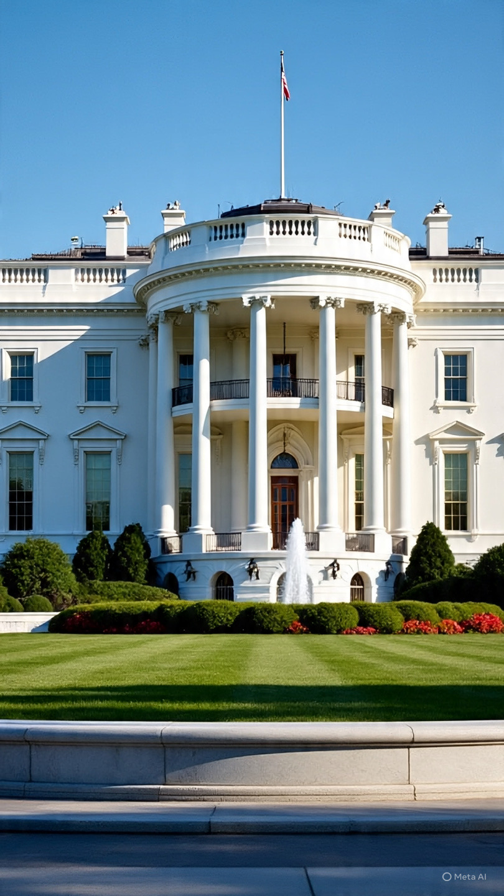

# Radikalisasi Individu dan Krisis Makna Politik: Analisis Psikososial atas Insiden Penembakan Gedung Putih 2026

*Ilustrasi Gedung Putih (pic: Meta AI).*

  
***Gejala dari masyarakat yang semakin terpolarisasi dan kehilangan ruang dialog sehat***
  

Insiden penembakan pada acara White House Correspondents’ Dinner memunculkan pertanyaan penting mengenai radikalisasi individu dalam iklim politik yang sangat terpolarisasi. 

Fakta bahwa tersangka merupakan individu berpendidikan tinggi, pengajar, dan pengembang game menantang stereotip umum tentang pelaku kekerasan politik. 

Tulisan ini menganalisis kemungkinan motif melalui perspektif psikologi politik, alienasi sosial, dan ekstremisasi personal.

## Pendahuluan

Masyarakat sering membayangkan pelaku kekerasan politik sebagai:

tidak terdidik

impulsif

atau “bodoh”

Namun sejarah justru menunjukkan:

banyak pelaku ekstrem memiliki kecerdasan tinggi dan pendidikan baik.

Kasus ini menarik karena tersangka:

guru/pengajar

berlatar teknik & komputer

terhubung dengan dunia intelektual dan kreatif.  

## Relative Deprivation Theory

Menurut Ted Robert Gurr:

kekerasan politik sering muncul ketika individu merasa dunia berjalan tidak adil dan tidak ada saluran efektif untuk mengubahnya.

## Moral Shock

Dalam teori gerakan sosial:

paparan terus-menerus terhadap kekerasan atau ketidakadilan dapat menghasilkan “moral shock” yang memicu tindakan ekstrem.

## Lone Actor Radicalization

Menurut studi terorisme modern:

individu dapat teradikalisasi sendiri melalui konsumsi media, isolasi, dan obsesi politik tanpa organisasi formal.

## Analisis

A. Kenapa orang cerdas bisa melakukan tindakan ekstrem?

Jawabannya:

kecerdasan tidak otomatis menghasilkan kestabilan emosional atau kebijaksanaan politik.

Bahkan kadang:

🧠 orang sangat cerdas:

berpikir terlalu dalam
terlalu terobsesi pada pola
merasa “melihat sesuatu yang orang lain tidak lihat”

⸻

Jika bercampur dengan:

frustrasi politik
kemarahan moral
isolasi sosial

👉 bisa berubah menjadi:

justifikasi tindakan ekstrem

B. Faktor Trump sebagai Simbol Polarisasi

Donald Trump bukan sekadar politisi biasa.

Ia telah menjadi:

bagi pendukung:

simbol kekuatan

anti-establishment

bagi penentang:

simbol:

otoritarianisme

perang

polarisasi

kemunduran demokrasi

👉 dalam kondisi tertentu:

simbol politik bisa berubah menjadi “objek personalisasi kemarahan”

C. Efek Perang & Eskalasi Global

Konteks 2026 penting:

perang Iran-AS

blokade

ancaman menghancurkan Iran

korban sipil tinggi

👉 semua ini menciptakan atmosfer:

apocalyptic political anxiety.

Bagi individu rentan:

dunia mulai terasa:

kacau

tidak terkendali

tanpa jalan keluar damai

D. Mengapa targetnya acara koresponden Gedung Putih?

Acara White House Correspondents’ Dinner adalah:

simbol elite politik

simbol media nasional

pusat kekuasaan simbolik

👉 menyerang lokasi itu berarti:

menyerang “pusat sistem”

E. Apakah ini sekadar kebencian personal?

Kemungkinan besar tidak sesederhana itu.

Kasus seperti ini biasanya campuran:

frustrasi pribadi

ideologi

krisis identitas

obsesi politik

F. Paradoks “Guru dan Pengembang Game”

Profesi intelektual kadang menghasilkan:

⚠️ tekanan eksistensial:

merasa dunia memburuk

merasa tidak berdaya

merasa suara rasional tidak didengar

Dan jika individu:

kesepian

obsesif

terus mengonsumsi narasi ekstrem

👉 realitas bisa berubah menjadi:

“aku harus bertindak sendiri”.

## Diskusi

Kasus ini menunjukkan:

1️⃣ Radikalisasi tidak selalu lahir dari kebodohan

kadang lahir dari:

kemarahan moral

alienasi

obsesi intelektual

2️⃣ Polarisasi politik AS semakin ekstrem

hingga tokoh politik dipandang:

penyelamat mutlak
   
  atau
  
monster eksistensial

3️⃣ Kekerasan politik modern sering bersifat individual

tanpa organisasi besar

Insiden ini bukan hanya soal satu pria bersenjata.

Ia adalah:

gejala dari masyarakat yang semakin terpolarisasi dan kehilangan ruang dialog sehat.

yang paling mengerikan bukan bahwa pelakunya bodoh.

Tapi justru:

bahwa ia tampak seperti orang “normal dan cerdas”.

  
**Referensi**

Gurr, T. R. (1970). Why men rebel. Princeton University Press.

Crenshaw, M. (1981). The causes of terrorism. Comparative Politics, 13(4), 379-399.

White House Correspondents’ Dinner
Coverage and incident reporting:  
