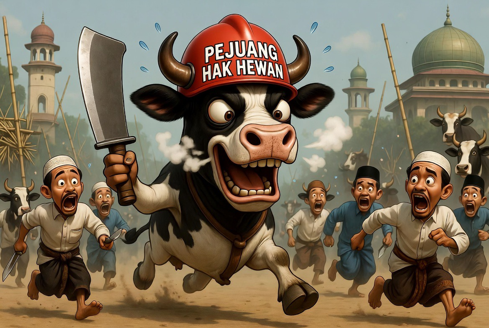

# Rahmatan lil ‘Alamin & Etika Kurban: Kesejahteraan Hewan, Stres Ternak dan Krisis Empati Praktik Idul Adha Modern

*Ilustrasi  (pic: Grok AI).*

  
***Kadang ada pola pikir “ngapain dimanja, toh besok dipotong” padahal dalam Islam hewan kurban bukan benda mati melainkan makhluk hidup yang memiliki rasa sakit dan ketakutan***
  

Perayaan Idul Adha merupakan simbol pengorbanan, ketakwaan, dan kasih sayang dalam Islam.  Namun, meningkatnya kasus ternak mengamuk, stres ekstrem, hingga insiden korban jiwa selama proses distribusi dan penyembelihan menunjukkan adanya problem serius dalam implementasi etika kesejahteraan hewan (animal welfare). 

Tulisan ini membahas hubungan antara stres fisiologis ternak, etika Islam terhadap hewan, dan degradasi makna spiritual kurban dalam praktik modern. 

Analisis ini menunjukkan bahwa pengorbanan dalam Islam bukan sekadar penyembelihan biologis, melainkan juga penghormatan terhadap makhluk hidup yang dikorbankan.

## Mengapa Banyak Sapi Mengamuk Saat Idul Adha?

Fenomena sapi mengamuk bukan sekadar “hewan liar”.

Dalam ilmu perilaku hewan (animal behavior science), ternak dapat mengalami:
stres akut,
kelelahan perjalanan,
dehidrasi,
kepadatan transportasi,
ketakutan akibat lingkungan asing,
rasa sakit fisik akibat perlakuan kasar.

Respons biologisnya nyata, saat stres:
hormon kortisol meningkat,
detak jantung naik,
insting bertahan hidup aktif.

Akibatnya sapi bisa:
memberontak,
menyeruduk,
kabur,
menjadi agresif.

## Kesalahan Mentalitas “Toh Besok Disembelih”

Kadang ada pola pikir “ngapain dimanja, toh besok dipotong” padahal dalam Islam hewan kurban bukan benda mati melainkan makhluk hidup yang memiliki rasa sakit dan ketakutan.

Ironi terbesar, sebagian orang ingin ibadah maksimal kepada Allah tapi mengabaikan penderitaan makhluk Allah yang dijadikan sarana ibadah itu sendiri.

## Islam dan Animal Welfare

Islam jauh lebih maju soal etika hewan dibanding yang sering dipraktikkan.

Nabi Muhammad SAW bersabda:
“Sesungguhnya Allah mewajibkan berbuat ihsan pada segala sesuatu…”
(HR. Muslim)

Termasuk:
saat menyembelih hewan,
tidak menyiksa,
tidak menakut-nakuti,
tidak mengasah pisau di depan hewan,
tidak memperlihatkan hewan lain disembelih.

Bahkan dalam fiqh klasik, memberi makan dan minum hewan adalah bagian dari amanah moral.

## Perspektif Ilmiah: Stres Menurunkan Kualitas Kurban

Dalam ilmu veteriner, stres berat sebelum penyembelihan menurunkan kualitas daging. Karena:
perubahan pH otot,
kerusakan jaringan,
hormon stres meningkat.

Artinya, perlakuan buruk terhadap hewan bukan cuma tidak etis tapi juga buruk secara biologis.

## Makna Filosofis Kurban yang Hilang

Secara spiritual, “pengorbanan bukan cuma motong sapinya, tapi mempersembahkan dalam kondisi bahagia” karena inti kurban sebenarnya bukan darahnya.

Allah SWT berfirman:
“Daging dan darah itu tidak akan sampai kepada Allah, tetapi ketakwaan kalianlah yang sampai kepada-Nya.”
(QS. Al-Hajj: 37)

Sehingga jika:
hewan diperlakukan brutal,
disiksa,
diterlantarkan,
lalu ibadah dilakukan sambil merasa saleh…maka ada kontradiksi moral yang serius.

Kadang manusia menangis saat mendengar ceramah kurban, tapi lupa memberi air pada sapi yang kehausan di bawah terik matahari.

Sebagian orang ingin terlihat “berkorban untuk Allah”, tapi gagal menunjukkan kasih sayang kepada ciptaan Allah yang paling dekat di hadapannya.

## Solusi Praktis & Etis

Sebelum penyembelihan:
cukup makan & minum,
transportasi manusiawi,
hindari pemukulan,
beri waktu istirahat.

Saat penyembelihan:
alat tajam,
minim rasa sakit,
jauhkan dari hewan lain,
penanganan profesional.

Edukasi umat:
kurban tidak sama dengan ritual darah semata,
kurban sama dengan latihan empati & amanah.

Peristiwa sapi mengamuk saat Idul Adha seharusnya tidak hanya dibaca sebagai “insiden hewan liar”, tetapi sebagai cermin hubungan manusia dengan makhluk yang dipercayakan kepadanya. 

Mungkin Allah tidak hanya melihat siapa yang menyembelih paling besar, tapi juga siapa yang paling lembut memperlakukan makhluk-Nya sebelum pengorbanan itu terjadi.

Dalam Islam, rahmat tidak berhenti pada manusia; ia meluas kepada hewan, alam, dan seluruh kehidupan. 

Maka ibadah kurban kehilangan sebagian ruhnya ketika belas kasih digantikan oleh ketergesaan, kekerasan, dan hilangnya empati.

  
**Referensi**

World Organisation for Animal Health. (2023). Animal welfare and slaughter guidelines.

Food and Agriculture Organization. (2021). Guidelines for humane handling, transport and slaughter of livestock.

Grandin, T. (2015). Improving animal welfare: A practical approach. CABI.

Al-Qur’an. (QS. Al-Hajj: 37).

Muhammad. Sahih Muslim (Bab Ihsan dalam penyembelihan).
