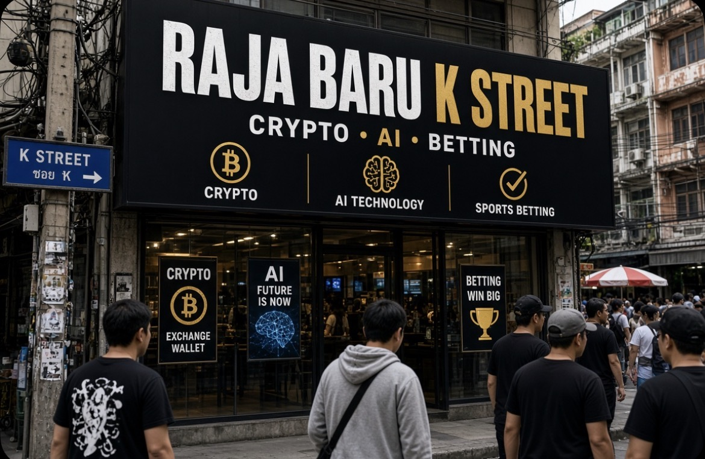

# Raja Baru K Street: Crypto, AI, Betting, & Transformasi Kekuasaan Politik AS pada Pemilu Tengah 2026

*Ilustrasi (pic: Grok AI).*

  
***Apakah ketiga industri tersebut sedang membantu demokrasi atau sedang belajar mengoperasikan tombol-tombolnya?***
  

Yang sedang terjadi bukan sekadar perusahaan teknologi menjadi lebih dermawan kepada politisi. Ini adalah perubahan struktur political economy Amerika.

Industri yang dahulu menunggu regulasi, kini menggunakan uang politik untuk ikut menentukan siapa yang membuat regulasi tersebut. Dan di situlah bagian yang sangat menarik. 

Selama puluhan tahun, peta kekuasaan finansial Washington didominasi oleh minyak dan energi, farmasi, perbankan, Wall Street, serta industri pertahanan.

2026 memperlihatkan konfigurasi baru. Crypto, AI/Big Tech, dan betting platforms masuk ke arena dengan kekuatan finansial yang luar biasa.

Analisis Public Citizen menemukan bahwa crypto, AI, Big Tech, dan online betting secara bersama-sama telah menyumbang sekitar $294 juta, atau 57% dari $517 juta corporate political spending yang telah dilaporkan dalam siklus midterm 2026. 

Angka tersebut bahkan sudah melampaui rekor pengeluaran korporasi langsung pada siklus 2024, yang sekitar $461 juta. 

Jadi ini bukan sekadar “tech ikut pemilu” tetapi tech sedang membeli kursi di meja tempat aturan masa depannya dibuat.

## Crypto: Uang Politik yang Mencari Kepastian Hukum

Crypto mempunyai masalah struktural yaitu ketidakpastian regulasi.

Apakah token tertentu security atau commodity? Siapa regulatornya, SEC atau CFTC? Ketidakpastian seperti itu sangat mahal bagi industri.

Maka strategi rasional crypto adalah ubah lingkungan politik, regulator, hukum, dan kurangi ketidakpastian.

Menurut laporan Public Citizen, crypto sendiri telah menjadi penyumbang korporasi terbesar dalam siklus 2026, dengan sekitar $189 juta pengeluaran politik yang telah teridentifikasi. 

Ini luar biasa karena pada pemilu 2024 crypto menghabiskan sekitar $170 juta. Jadi hanya dua tahun kemudian $170 juta meningkat $189 juta, dan siklusnya belum selesai.

## Fairshake: Mesin Politik Crypto

Salah satu instrumen terpenting adalah jaringan PAC yang berpusat pada Fairshake beserta afiliasinya.

Strateginya menarik. Mereka tidak harus berkata: “Pilih Partai X.” Mereka dapat memilih kandidat berdasarkan satu variabel: Apakah kandidat ini mendukung kebijakan crypto yang kami inginkan?

Itulah sebabnya uang industri dapat melintasi garis partisan. Karena bagi industri, regulasi lebih besar dari ideologi partai.

## AI Masuk ke Arena yang Sama

AI memiliki masalah politik yang berbeda.

Industri AI membutuhkan listrik, data center, chip, akses modal, kebijakan tenaga kerja, kebijakan copyright, aturan keselamatan AI, regulasi antitrust, kebijakan ekspor chip, dan perlindungan terhadap pembatasan negara bagian. Karena itu AI memiliki insentif besar untuk memengaruhi Kongres.

Laporan Public Citizen memperkirakan sektor AI dan Big Tech telah menyumbang sekitar $60 juta, dengan sekitar $50,1 juta mengalir ke PAC Leading the Future. Dan ada sesuatu yang lebih menarik.

## AI Mengalami Paradoks Politik

AI ingin regulasi yang cukup longgar untuk berkembang. Tetapi masyarakat mulai berkata: “Tunggu dulu. Data center kalian menggunakan listrik siapa?”

Inilah salah satu perkembangan politik paling menarik pada 2026. Penolakan terhadap pembangunan hyperscale data centers telah menjadi isu lintas partai di sejumlah wilayah AS. Axios melaporkan bahwa resistensi lokal terhadap data center mulai mengubah kalkulasi kandidat dalam pemilu 2026. 

Jadi AI menghadapi dua front, Washington: “Jangan bunuh inovasi kami.” Sementara Pemilih lokal: “Jangan habiskan listrik dan air kami.”

Ini konflik kepentingan yang sangat nyata.

## Betting Companies: Raja Ketiga yang Sering Dilupakan

Perusahaan taruhan online juga masuk ke arena. Data Public Citizen menunjukkan online betting menyumbang sekitar $45,6 juta, dengan sekitar $43 juta mengalir melalui Win for America PAC. 

Mengapa?

Karena perusahaan betting sedang menghadapi pertanyaan hukum besar: Apakah prediction markets merupakan bentuk perjudian? atau instrumen finansial yang dilindungi sebagai pasar prediksi?

Dan di sinilah dunia betting bertemu dengan AI dan crypto.

Tiga Industri, Satu Strategi

Sekilas, Crypto tidak sama dengan AI , dan juga tidak sama dengan betting. Tetapi secara politik mereka memiliki kesamaan.

| Industri | Musuh utama | Tujuan politik |
|--------|--------|--------|
| Crypto  | ketidakpastian SEC/CFTC  | kepastian regulasi  |
| AI | regulasi + pembatasan infrastruktur  | ruang inovasi  |
| Betting | larangan perjudian/prediction markets | legitimasi hukum |

Jadi uang politik mereka bukan sekadar “beli pengaruh.” Lebih tepatnya membeli kapasitas untuk membentuk lingkungan regulasi.

## Trump CLARITY Act

Pada 19 Agustus 2026, Trump menggelar pertemuan di Gedung Putih bersama pemimpin industri crypto dan pejabat regulator.

Ia mendorong Kongres mengesahkan CLARITY Act, yang dimaksudkan untuk memberikan definisi dan pembagian kewenangan regulasi yang lebih jelas terhadap aset digital. 

Pada 20 Agustus, Reuters melaporkan bahwa dorongan tersebut langsung direspons pasar, Bitcoin naik sekitar 3,4%, menembus $70.000, Ether naik sekitar 3,3%, saham Coinbase, Strategy, Riot, MARA, dan perusahaan crypto lain ikut melonjak. 
Ini contoh textbook mengenai regulatory expectations menjadi repricing financial assets.

## Satu Kalimat Trump Bisa Menggerakkan Bitcoin?

Pasar tidak hanya memperdagangkan aset. Pasar memperdagangkan ekspektasi terhadap masa depan.

Misalnya investor memperkirakan CLARITY gagal, maka regulatory uncertainty tinggi, risiko industri tinggi, valuasi crypto turun.

Tetapi kemudian, Trump mendukung CLARITY, akibatnya probabilitas regulasi yang lebih ramah dianggap meningkat, risk premium turun, ekspektasi cash flow industri naik, sehingga harga aset naik.

Jadi yang dibeli investor bukan sekadar Bitcoin, mereka membeli probabilitas masa depan politik.

## Bom Etika

Di sinilah tulisan ini menjadi jauh lebih menarik daripada sekadar: “Trump pro crypto, Bitcoin naik.”

Trump dan keluarganya sendiri mempunyai kepentingan finansial besar dalam crypto.
Reuters melaporkan bahwa keluarga Trump telah memperoleh sekitar $1,4 miliar dari usaha crypto, sementara Trump sendiri membantah terlibat dalam operasional harian dan mengatakan investasinya dikelola secara independen. 

Akibatnya muncul pertanyaan klasik: Apakah regulator sedang membuat aturan untuk industri, atau seorang presiden sedang mendorong aturan bagi sektor yang juga memberikan keuntungan finansial kepada keluarganya?

Ini bukan pertanyaan teknis. Ini pertanyaan constitutional political economy.

## Mengapa CLARITY Act Tersendat?

Ironinya, uang crypto meningkat, dukungan politik meningkat, tetapi legislasi justru tidak otomatis lolos.

Karena semakin besar kepentingan ekonomi yang dipertaruhkan, maka semakin besar pula pertanyaan etik dan distribusionalnya.

Reuters melaporkan bahwa CLARITY Act masih menghadapi hambatan di Senat, termasuk perdebatan mengenai ketentuan yang dapat membatasi potensi keuntungan politik dari usaha crypto. 

Jadi, Money buys acces, tetapi Money does not guarantee legislation.

## Mengapa Pasar Bisa Naik Walaupun RUU Belum Lolos?

Ini bagian yang sering membingungkan investor, harga tidak selalu mencerminkan “UU sudah berlaku, namun mencerminkan “Probabilitas UU akan berlaku telah berubah.”

Jadi, Expected probability naik ketika expected regulatory risk turun, yang membuat asset valuation naik, bahkan jika Kongres belum melakukan apa-apa.

## Bahaya Demokratis: Regulatory Capture

Sekarang kita masuk ke konsep paling serius yaitu Regulatory Capture.

Terjadi ketika regulator atau pembuat kebijakan akhirnya lebih responsif terhadap kepentingan industri yang mereka awasi daripada kepentingan publik luas.

Dalam kasus ini:

Industri

   ↓
   
Uang politik
  
   ↓
   
PAC / Super PAC
  
   ↓

Kandidat
  
   ↓

Kongres
  
   ↓

Regulasi
  
   ↓

Keuntungan industri

Jika siklus ini terlalu kuat, demokrasi formal tetap berjalan: pemilu tetap ada. Tetapi kapasitas publik untuk menentukan kebijakan dapat terdistorsi.

## Jangan Jatuh ke Kesimpulan Sederhana

Ini penting. Kita tidak bisa mengatakan “Crypto menyuap pemerintah.” Itu terlalu simplistis.

Sebagian besar pengeluaran tersebut terjadi melalui mekanisme politik yang legal seperti PAC dan independent expenditures.

Masalah akademiknya bukan semata legal vs ilegal. Masalahnya adalah apakah sistem legal tersebut menghasilkan distribusi pengaruh politik yang proporsional? Itu pertanyaan yang jauh lebih serius.

## Paradoks Besar Pemilu 2026

Industri yang paling membutuhkan regulasi justru semakin kuat secara politik ketika regulasinya sedang dibentuk.

Crypto membutuhkan hukum, AI membutuhkan aturan, sedangkan Betting membutuhkan legitimasi hukum. Ketiganya kemudian mempunyai insentif untuk memengaruhi siapa yang membuat hukum tersebut. Itulah transformasi besar K Street.

## Counter-Power

Demokrasi Amerika belum otomatis menyerah kepada tiga raja baru ini, sebab muncul kelompok konsumen, serikat pekerja, organisasi lingkungan, kelompok anti-monopoli, aktivis privasi, kandidat populis kanan maupun kiri. Bahkan isu AI data center sekarang mulai menjadi senjata elektoral.

Jadi kita melihat konflik baru antara Tech elite vs. local voters, bukan sekadar Democrat vs. Republican.

## Prediksi Akademik November 2026

Jika tren ini berlanjut, tiga isu kemungkinan semakin menentukan:

1. Crypto regulation

Siapa yang menguasai Kongres akan sangat menentukan masa depan CLARITY Act dan pembagian kewenangan SEC-CFTC.

2. AI infrastructure

Data center, listrik, air, dan harga energi dapat menjadi isu elektoral yang jauh lebih kuat daripada debat abstrak mengenai “AI safety.”

3. Prediction markets

Pertarungan antara regulator, betting companies, dan pasar prediksi dapat menjadi salah satu frontier baru politik digital.

Pemilu tengah AS 2026 sedang memperlihatkan sesuatu yang lebih besar daripada sekadar rekor sumbangan kampanye.

Ini adalah perubahan rezim politik-ekonomi. Jika dulu, oil adalah Washington, kemudian berganti Wall Street adalah Washington, namun sekarang: Crypto, AI, Betting adalah Washington.

Dan ada satu perbedaan penting. Mereka bukan hanya menjual produk kepada konsumen, tetapi juga menjual masa depan teknologi.

Karena itu pertarungannya bukan “Berapa besar uang yang mereka keluarkan? Melainkan “Siapa yang akan memiliki kekuasaan untuk menentukan aturan dunia digital Amerika?”

Dan bagian paling ironisnya, Trump mendorong CLARITY Act. Pasar mendengar tentang “Regulatory certainty.” Bitcoin mendengar lalu grafik naik, Investor mendengar berarti tajir. 

Tetapi Senat mendengar akan berkata “Tunggu dulu, bagaimana dengan konflik kepentingannya?” Dan pemilih lokal di dekat data center mendengar langsung protes “Listrik rumah gue jangan ikut di-AI-kan!” 

Itulah mengapa Pemilu 2026 sangat menarik secara akademik sebab crypto membeli pengaruh untuk mendapatkan kepastian. AI membeli pengaruh untuk mempertahankan ruang inovasi. Betting membeli pengaruh untuk mendapatkan legitimasi. 

Dan pemilih sekarang mulai mempertanyakan apakah ketiga industri tersebut sedang membantu demokrasi… atau sedang belajar mengoperasikan tombol-tombolnya. 

  
**Referensi utama**

Reuters, 20 Agustus 2026, mengenai lonjakan pendanaan crypto, AI, dan betting dalam pemilu 2026. 

Reuters, 20 Agustus 2026, mengenai dorongan Trump terhadap CLARITY Act dan reaksi pasar crypto. 

Reuters, 19 Agustus 2026, mengenai pertemuan Gedung Putih dan konflik kepentingan crypto. 

Public Citizen, 30 Juni 2026, mengenai $294 juta corporate political spending oleh crypto, AI, Big Tech, dan betting. 

Krause, D. (2026). The New Kings of K Street: How Crypto and AI Are Reshaping American Political Influence. SSRN. 
